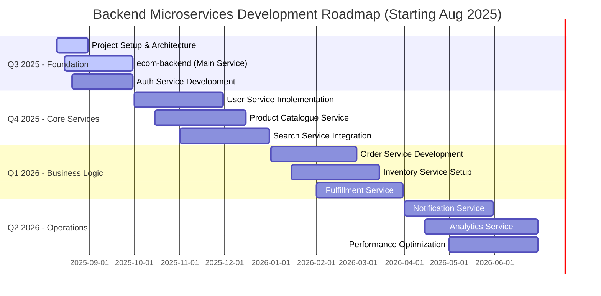

# <div align="center">🚀 **E-Commerce Platform Co** 🛒</div>

<div align="center">
  
[](https://git.io/typing-svg)

</div>

---

## 🎯 **Our Vision**

<div align="center">

```
🌐 Transforming Commerce Through Innovation
💡 Empowering Businesses Worldwide
🚀 Creating Seamless Digital Experiences
```

</div>

---

## ✨ **What Makes Us Special**

<div align="center">

| 🚀 **Performance** | 🔐 **Security** | 🤖 **Intelligence** | 📱 **Experience** |
|:---:|:---:|:---:|:---:|
| Lightning-fast APIs | Enterprise-grade security | AI-powered insights | Mobile-first design |
| 99.9% uptime | Multi-factor authentication | Smart recommendations | Intuitive interfaces |
| Global CDN | PCI DSS compliant | Predictive analytics | Seamless checkout |

</div>

---

## 🏗️ **Our Tech Arsenal**

<div align="center">

### **Backend Powerhouse**


### **Database & Storage**


### **Search & Analytics**


### **Message Queue & Communication**


### **Cloud & Infrastructure (AWS)**


### **DevOps & Deployment**


</div>

---

## 📊 **Project Status (Aug 2025)**

<div align="center">

```
🚀 Project Started: August 10, 2025
📈 Architecture Design Phase
⚡ Setting up Development Environment  
🌍 AWS Infrastructure Planning
💾 Database Schema Design
🔄 CI/CD Pipeline Setup
📊 Microservices Foundation
🛡️ Security Framework Planning
```

</div>

---

## 🚀 **Backend Architecture & Microservices**

<div align="center">

| 🏗️ **Core Services** | 📊 **Data & Analytics** | ⚡ **Infrastructure** |
|:---|:---|:---|
| • **Auth Service** - JWT & authorization/n• **User Service** - Profile management/n• **Product Catalogue** - Product data/n• **Inventory Service** - Stock management | • **Search Service** - Elasticsearch indexing/n• **Analytics Service** - Business metrics/n• **Notification Service** - Multi-channel alerts/n• **Order Service** - Transaction processing | • **Main Service** - API Gateway & routing/n• **Fulfillment Service** - Shipping & logistics/n• **RabbitMQ** - Inter-service communication/n• **Redis** - Caching & sessions |

### **🔥 Microservices Architecture**

```
🏗️ 10 Independent Services
📈 Event-driven communication
⚡ Service mesh with NestJS
🌐 RESTful & GraphQL APIs
💾 Database per service
🔄 Async message processing
```

</div>

---

## 📁 **Featured Repositories**

<div align="center">

| Repository | Stars | Language | Description |
|:---|:---:|:---:|:---|
| 🚀 [**ecom-backend**](https://github.com/ecom-co/backend) |  |  | **Main Service** - API Gateway & service orchestration |
| 👤 [**user-service**](https://github.com/ecom-co/user-service) |  |  | **User Management** - Profiles & account services |
| 🛍️ [**product-catalogue-service**](https://github.com/ecom-co/product-catalogue-service) |  |  | **Product Catalog** - Product data & categories |
| 🔍 [**search-service**](https://github.com/ecom-co/search-service) |  |  | **Search Engine** - Elasticsearch indexing & queries |
| 📦 [**inventory-service**](https://github.com/ecom-co/inventory-service) |  |  | **Inventory Management** - Stock tracking & updates |
| 🛒 [**order-service**](https://github.com/ecom-co/order-service) |  |  | **Order Processing** - Cart & transaction handling |
| 🚚 [**fulfillment-service**](https://github.com/ecom-co/fulfillment-service) |  |  | **Fulfillment** - Shipping & delivery management |
| 🔔 [**notification-service**](https://github.com/ecom-co/notification-service) |  |  | **Notifications** - Email, SMS & push notifications |
| 📊 [**analytics-service**](https://github.com/ecom-co/analytics-service) |  |  | **Analytics** - Business metrics & reporting |
| 🔐 [**auth-service**](https://github.com/ecom-co/auth-service) |  |  | **Authentication** - JWT & authorization service |

</div>

---

## 📦 **NPM Ecosystem**

<div align="center">

| Package | Downloads | Version | Description |
|:---|:---:|:---:|:---|
| [`@ecom-co/eslint`](https://github.com/orgs/ecom-co/packages/npm/package/eslint) |  |  | Shared ESLint configuration for e-commerce projects |
| [`@ecom-co/orm`](https://github.com/orgs/ecom-co/packages/npm/package/orm) |  |  | Shared persistence layer: entities, transformers, repository utils for e-commerce projects |
| [`@ecom-co/redis`](https://github.com/orgs/ecom-co/packages/npm/package/redis) |  |  | NestJS Redis module built on ioredis with multi-client support and optional health indicator |
| [`@ecom-co/elasticsearch`](https://github.com/orgs/ecom-co/packages/npm/package/elasticsearch) |  |  | Elasticsearch utilities and integration for e-commerce projects |
| [`@ecom-co/utils`](https://github.com/orgs/ecom-co/packages/npm/package/utils) |  |  | Common utilities |

</div>

---

## 🗓️ **Roadmap 2024-2025**



<div align="center">

### **🎯 Development Timeline (Starting Aug 10, 2025)**

🚀 **Phase 1: Foundation (Aug-Sep 2025) - In Progress**
- [x] **Project Planning** - Architecture design & tech stack selection
- [ ] **ecom-backend (Main Service)** - NestJS setup & API Gateway structure
- [ ] **Auth Service** - JWT authentication foundation
- [ ] **Development Environment** - Docker, database setup, CI/CD pipeline

💼 **Phase 2: Core Services (Oct-Dec 2025)**
- [ ] **User Service** - User profiles & account management
- [ ] **Product Catalogue Service** - Product data structure & APIs
- [ ] **Search Service** - Elasticsearch integration & indexing

🔧 **Phase 3: Business Logic (Jan-Mar 2026)**
- [ ] **Order Service** - Shopping cart & transaction processing
- [ ] **Inventory Service** - Real-time stock management
- [ ] **Fulfillment Service** - Shipping & delivery workflows

⚡ **Phase 4: Operations (Apr-Jun 2026)**
- [ ] **Notification Service** - Multi-channel messaging system
- [ ] **Analytics Service** - Business intelligence & reporting
- [ ] **System Optimization** - Performance tuning & scaling

</div>

---

## 👨‍💻 **Our Amazing Team**

<div align="center">

| Team Member | Role | GitHub | Expertise |
|:---|:---:|:---:|:---|
| **Tuan Nguyen** | Senior Backend Engineer | [@tuannvnguyen](https://github.com/tuannvnguyen) | Distributed Systems, Backend Developer |
| **Nam Nguyen** | Backend Engineer | [@nam088](https://github.com/nam088) | Backend Developer |

</div>

---

## 🤝 **Join Our Community**

<div>

### **Contributing Guidelines**

```bash
# 1. Fork and clone the repository
git clone https://github.com/ecom-co/[repo-name].git

# 2. Create your feature branch
git checkout -b feature/amazing-feature

# 3. Commit your changes
git commit -m "Add: Amazing feature description"

# 4. Push to the branch
git push origin feature/amazing-feature

# 5. Open a Pull Request 🚀
```

### **Code of Conduct**
We foster an inclusive environment where everyone can contribute. Please read our [Code of Conduct](CODE_OF_CONDUCT.md) before participating.

</div>

---

## 📈 **GitHub Analytics**

<div align="center">

|  |  |
| --- | --- |
|  |  |

</div>

---

## 🌐 **Connect With Us**

<div align="center">

[](https://ecommerce-platform.co)
[](mailto:hello@ecommerce-platform.co)
[](https://twitter.com/ecplatform)
[](https://linkedin.com/company/ecom-co)
[](https://discord.gg/ecom-platform)

</div>

---

<div align="center">

### **Support Our Mission**

⭐ **Star our repositories** if you find them useful!  
🔄 **Share** with your network to help us grow  
💡 **Contribute** your ideas and code  

---

**"Building tomorrow's commerce, today."** 🚀✨

*Made with ❤️ by the E-Commerce Platform Co team*

</div>
