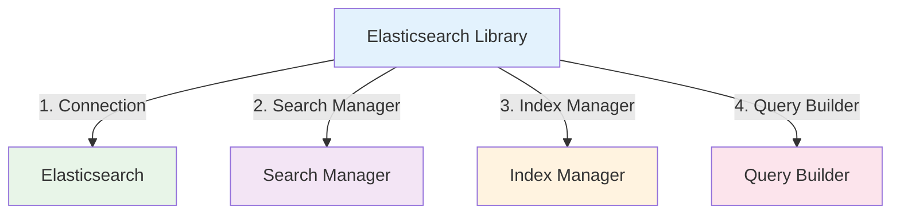

# Elasticsearch Library

:::tip 💡 Khái niệm cơ bản
Elasticsearch Library cung cấp các utilities để implement search và analytics với Elasticsearch.
:::

## Elasticsearch Library là gì?

**Lý thuyết cơ bản:**
Elasticsearch Library là một thư viện được thiết kế đặc biệt để simplify quá trình implement Elasticsearch trong NestJS applications.

**Đặc điểm kỹ thuật:**
- **Search Operations**: Implement search operations
- **Index Management**: Manage Elasticsearch indices
- **Query Builder**: Simplify query building
- **Aggregations**: Support aggregations

## Kiến trúc Elasticsearch Library



## Cách sử dụng

### **1. Installation**

```bash
npm install @ecom-co/elasticsearch
```

### **2. Basic Usage**


---

**Bài tiếp theo:** [Utils Library](/docs/ecom-co/libs/utils/utils-library)
