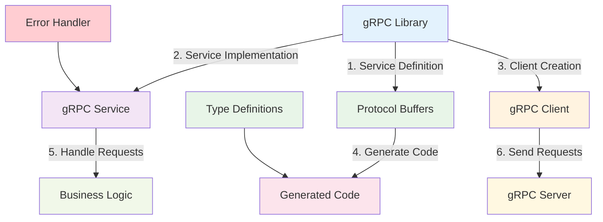

# gRPC Library

:::tip 💡 Khái niệm cơ bản
gRPC Library cung cấp các utilities và helpers để implement gRPC communication trong NestJS applications.
:::

## gRPC Library là gì?

**Lý thuyết cơ bản:**
gRPC Library là một thư viện được thiết kế đặc biệt để simplify quá trình implement gRPC communication trong NestJS applications.

**Đặc điểm kỹ thuật:**
- **gRPC Service Creation**: Tạo gRPC services dễ dàng
- **Client Implementation**: Implement gRPC clients
- **Protocol Buffers**: Hỗ trợ Protocol Buffers
- **Error Handling**: Built-in error handling
- **Type Safety**: Type safety với TypeScript
- **Performance Optimization**: Performance optimization

**Cách hoạt động:**
1. **Service Definition**: Định nghĩa gRPC services
2. **Implementation**: Implement service logic
3. **Client Creation**: Tạo gRPC clients
4. **Communication**: Establish communication
5. **Error Handling**: Handle errors và responses

**Biến đổi trong quá trình xử lý:**
- **Service State**: Defined → Implemented → Running → Communicating → Error Handling
- **Client State**: Created → Connected → Requesting → Receiving → Processing
- **Communication State**: Idle → Establishing → Active → Error → Recovery

**Điểm mạnh:**
- **Easy Implementation**: Dễ dàng implement gRPC
- **Type Safety**: Type safety với TypeScript
- **Performance**: High performance communication
- **Error Handling**: Built-in error handling
- **NestJS Integration**: Tích hợp tốt với NestJS
- **Documentation**: Documentation đầy đủ

**Nhược điểm:**
- **Learning Curve**: Learning curve cho gRPC
- **Complexity**: Complexity của gRPC
- **Debugging**: Khó debug gRPC issues
- **Testing**: Testing complexity

## Kiến trúc gRPC Library



## Cách sử dụng

### **1. Installation**

```bash
npm install @ecom-co/grpc
```

### **2. Basic Usage**


---

**Bài tiếp theo:** [RabbitMQ Library](/docs/ecom-co/libs/rabbitmq/rabbitmq-library)
