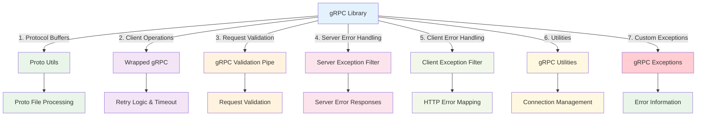

import Tabs from '@theme/Tabs';
import TabItem from '@theme/TabItem';

# gRPC Library

:::tip 💡 Khái niệm cơ bản
gRPC Library cung cấp các utilities và helpers để implement gRPC communication trong NestJS applications.
:::

## gRPC Library là gì?

**Lý thuyết cơ bản:**
gRPC Library là một thư viện được thiết kế đặc biệt để simplify quá trình implement gRPC communication trong NestJS applications, cung cấp comprehensive tools cho cả client và server side.

**Đặc điểm kỹ thuật:**
- **Protocol Buffers Integration**: Hỗ trợ đầy đủ Protocol Buffers với utilities
- **Client-Server Communication**: Wrapper classes cho gRPC operations
- **Validation System**: Built-in validation pipe cho gRPC requests
- **Exception Handling**: Comprehensive exception filters cho client và server
- **Error Management**: Structured error responses và logging
- **Production Ready**: Timeout handling, retry logic, và monitoring

## Kiến trúc gRPC Library



## Cách sử dụng

### **1. Installation**

<Tabs>
  <TabItem value="npm" label="npm">

```bash
npm install @ecom-co/grpc
```

  </TabItem>
  <TabItem value="yarn" label="yarn">

```bash
yarn add @ecom-co/grpc
```

  </TabItem>
  <TabItem value="pnpm" label="pnpm">

```bash
pnpm add @ecom-co/grpc
```

  </TabItem>
</Tabs>

### **2. Basic Usage**

```typescript
// Proto Utils
import { ProtoUtils } from '@ecom-co/grpc';

// Wrapped gRPC Client
import { createWrappedGrpc } from '@ecom-co/grpc';

// Validation Pipe
import { GrpcValidationPipe } from '@ecom-co/grpc';

// Exception Filters
import { GrpcClientFilter, GrpcServerFilter } from '@ecom-co/grpc';
```

## Các thành phần chính

- **[Proto Utils](/docs/ecom-co/libs/grpc/docs/proto-utils)**: Utilities để làm việc với Protocol Buffers, bao gồm proto file parsing, validation, và code generation
- **[Wrapped gRPC](/docs/ecom-co/libs/grpc/docs/wrapped-grpc)**: Wrapper classes cho gRPC operations với retry logic, timeout handling, và error management
- **[gRPC Validation Pipe](/docs/ecom-co/libs/grpc/docs/grpc-validation-pipe)**: Validation pipe cho gRPC requests với custom validation rules và error handling
- **[gRPC Server Exception Filter](/docs/ecom-co/libs/grpc/docs/grpc-server-exception-filter)**: Exception filter cho gRPC server với structured error responses và logging
- **[gRPC Utilities](/docs/ecom-co/libs/grpc/docs/grpc-utilities)**: Các utility functions cho gRPC operations, connection management, và monitoring
- **[gRPC Client Exception Filter](/docs/ecom-co/libs/grpc/docs/grpc-client-exception-filter)**: Exception filter cho gRPC client với HTTP error mapping và production-safe error handling
- **[gRPC Exceptions](/docs/ecom-co/libs/grpc/docs/grpc-exceptions)**: Custom exceptions cho gRPC với detailed error information và status code mapping

## Tính năng nổi bật

- **Retry & Timeout**: Tự động retry với exponential backoff và timeout protection
- **Error Mapping**: Map gRPC errors sang HTTP status codes chuẩn
- **Production Safety**: Sanitized error messages và security headers
- **Monitoring**: Built-in metrics tracking và logging
- **Flexible Configuration**: Environment-specific settings và custom options

---

**Bài tiếp theo:** [RabbitMQ Library](/docs/ecom-co/libs/rabbitmq/rabbitmq-library)
