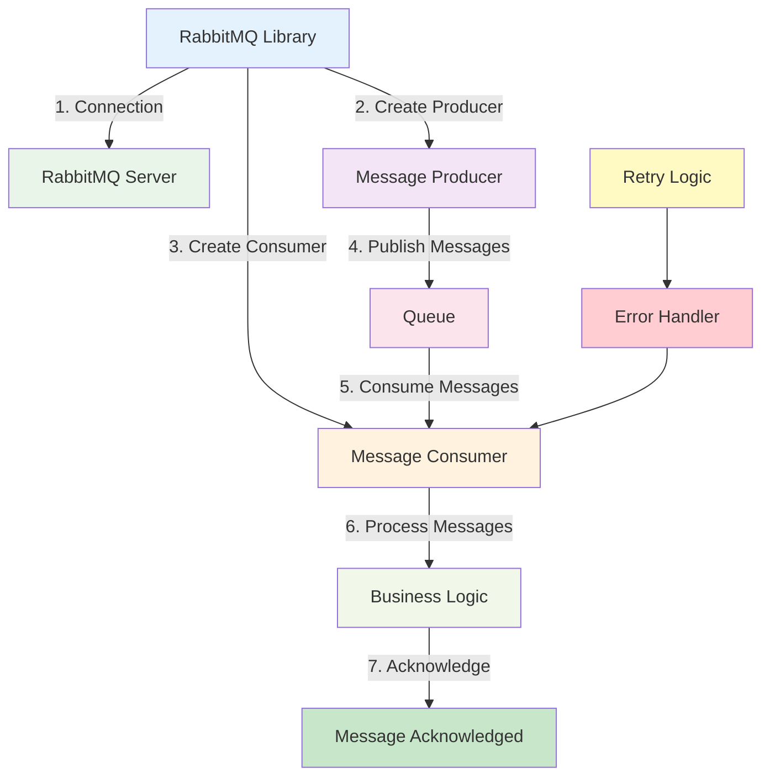

# RabbitMQ Library

:::tip 💡 Khái niệm cơ bản
RabbitMQ Library cung cấp các utilities để implement message queuing với RabbitMQ trong NestJS applications.
:::

## RabbitMQ Library là gì?

**Lý thuyết cơ bản:**
RabbitMQ Library là một thư viện được thiết kế đặc biệt để simplify quá trình implement message queuing với RabbitMQ trong NestJS applications.

**Đặc điểm kỹ thuật:**
- **Message Producers**: Tạo message producers
- **Message Consumers**: Implement message consumers
- **Queue Management**: Quản lý queues
- **Exchange Types**: Hỗ trợ các loại exchanges
- **Error Handling**: Built-in error handling
- **Retry Logic**: Retry logic cho failed messages

## Kiến trúc RabbitMQ Library

## Cách sử dụng

**Bài tiếp theo:** [Redis Library](/docs/ecom-co/libs/redis/redis-library)
