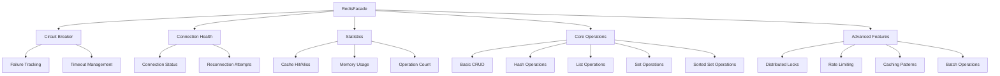

import Tabs from '@theme/Tabs';
import TabItem from '@theme/TabItem';

:::info
RedisFacade là một lớp wrapper cao cấp cho Redis client, cung cấp các tính năng nâng cao như caching patterns, distributed locking, rate limiting, và health monitoring. Nó được thiết kế để đơn giản hóa việc sử dụng Redis trong ứng dụng NestJS.
:::

## Tổng quan

RedisFacade cung cấp một interface đơn giản và mạnh mẽ cho các thao tác Redis phức tạp:

- **Caching Patterns**: Cache-Aside, Write-Through, Write-Behind
- **Distributed Locking**: Với TTL và retry mechanisms
- **Rate Limiting**: Fixed window và sliding window
- **Batch Operations**: Xử lý nhiều operations cùng lúc
- **Health Monitoring**: Circuit breaker và connection health
- **Statistics**: Hit rate, memory usage, performance metrics

## Kiến trúc RedisFacade



## Khởi tạo RedisFacade

### Cách 1: Inject qua DI

```typescript
import { Injectable } from '@nestjs/common';
import { InjectRedisFacade } from '@ecom-co/redis';
import { RedisFacade } from '@ecom-co/redis';

@Injectable()
export class CacheService {
    constructor(
        @InjectRedisFacade() private readonly cache: RedisFacade,
        @InjectRedisFacade('session') private readonly session: RedisFacade,
    ) {}
}
```

### Cách 2: Tạo trực tiếp từ RedisService

```typescript
import { Injectable } from '@nestjs/common';
import { RedisService } from '@ecom-co/redis';

@Injectable()
export class CacheService {
    private readonly cache: RedisFacade;
    private readonly userCache: RedisFacade;

    constructor(private readonly redisService: RedisService) {
        this.cache = this.redisService.use('default', 'app:');
        this.userCache = this.redisService.use('default', 'user:');
    }
}
```

## Caching Patterns

### 1. Cache-Aside Pattern

```typescript
async getUser(id: number) {
  return await this.cache.cacheAside(
    `user:${id}`,
    async () => {
      // Load từ database
      return await this.userRepository.findById(id);
    },
    {
      ttlSeconds: 3600, // 1 giờ
      refreshThreshold: 0.8, // Refresh khi 80% TTL đã qua
    }
  );
}
```

### 2. Write-Through Pattern

```typescript
async updateUser(id: number, data: UserUpdateDto) {
  await this.cache.writeThrough(
    `user:${id}`,
    data,
    async (userData) => {
      // Lưu vào database
      await this.userRepository.update(id, userData);
    },
    { ttlSeconds: 3600 }
  );
}
```

### 3. Write-Behind Pattern

```typescript
async createUser(data: CreateUserDto) {
  await this.cache.writeBehind(
    `user:${data.id}`,
    data,
    async (userData) => {
      // Lưu vào database (async)
      await this.userRepository.create(userData);
    },
    { ttlSeconds: 3600 }
  );
}
```

## Distributed Locking

### Basic Lock

```typescript
async processOrder(orderId: string) {
  const lock = await this.cache.acquireLock(`order:${orderId}`, 30000);

  if (!lock.ok) {
    throw new Error('Không thể acquire lock cho order');
  }

  try {
    // Xử lý order
    await this.processOrderLogic(orderId);
  } finally {
    // Luôn release lock
    await lock.release();
  }
}
```

### Lock với Retry

```typescript
async processOrderWithRetry(orderId: string) {
  const lock = await this.cache.acquireLockWithRetry(
    `order:${orderId}`,
    30000, // TTL
    5,     // Max retries
    100    // Retry delay (ms)
  );

  if (!lock.ok) {
    throw new Error('Không thể acquire lock sau nhiều lần thử');
  }

  try {
    await this.processOrderLogic(orderId);
  } finally {
    await lock.release();
  }
}
```

### Lock với Function Wrapper

```typescript
async processOrder(orderId: string) {
  return await this.cache.withLock(
    `order:${orderId}`,
    30000,
    async () => {
      // Function này chỉ chạy khi có lock
      return await this.processOrderLogic(orderId);
    },
    { maxRetries: 3, retryDelayMs: 100 }
  );
}
```

## Rate Limiting

### Fixed Window Rate Limiting

```typescript
async checkRateLimit(userId: string) {
  const result = await this.cache.rateLimit(
    `user:${userId}`,
    100,    // Max requests
    60000   // Window (1 phút)
  );

  if (!result.allowed) {
    throw new Error(`Rate limit exceeded. Retry after ${result.retryAfter}ms`);
  }

  return result.remaining; // Số requests còn lại
}
```

### Sliding Window Rate Limiting

```typescript
async checkSlidingRateLimit(userId: string) {
  const result = await this.cache.slidingWindowRateLimit(
    `user:${userId}`,
    100,    // Max requests
    60000   // Window (1 phút)
  );

  if (!result.allowed) {
    throw new Error('Rate limit exceeded');
  }

  return result.remaining;
}
```

### Multiple Rate Limits

```typescript
async checkMultipleRateLimits(userId: string, ip: string) {
  const results = await this.cache.rateLimitMultiple([
    { key: `user:${userId}`, limit: 100, windowMs: 60000 },
    { key: `ip:${ip}`, limit: 1000, windowMs: 60000 },
  ]);

  const userLimit = results[0];
  const ipLimit = results[1];

  if (!userLimit.allowed || !ipLimit.allowed) {
    throw new Error('Rate limit exceeded');
  }
}
```

## Batch Operations

### Execute Batch

```typescript
async processBatchOperations() {
  const operations = [
    { operation: 'set', key: 'key1', value: 'value1' },
    { operation: 'get', key: 'key2' },
    { operation: 'incr', key: 'counter', amount: 5 },
    { operation: 'del', key: 'temp:key' },
  ];

  const results = await this.cache.executeBatch(operations);
  return results;
}
```

### Multiple Get/Set

```typescript
// Get nhiều keys
const users = await this.cache.mget<User>(['user:1', 'user:2', 'user:3']);

// Set nhiều key-value pairs
await this.cache.mset([
    { key: 'user:1', value: { id: 1, name: 'John' } },
    { key: 'user:2', value: { id: 2, name: 'Jane' } },
    { key: 'counter', value: 42, options: { ttlSeconds: 3600 } },
]);
```

### Hash Operations

```typescript
// Set multiple hash fields
await this.cache.hmsetObject('user:1', {
    name: 'John Doe',
    email: 'john@example.com',
    age: 30,
});

// Get multiple hash fields
const userData = await this.cache.hmgetObject<{
    name: string;
    email: string;
    age: number;
}>('user:1', ['name', 'email', 'age']);

// Set multiple hashes
await this.cache.hmsetMultiple([
    { key: 'user:1', obj: { name: 'John', score: 100 } },
    { key: 'user:2', obj: { name: 'Jane', score: 95 } },
]);
```

## Health Monitoring

### Basic Health Check

```typescript
async checkHealth() {
  const health = await this.cache.healthCheck();

  if (health.status === 'healthy') {
    console.log(`Redis healthy (${health.latency}ms)`);
  } else {
    console.error('Redis unhealthy:', health.error);
  }

  return health;
}
```

### Deep Health Check

```typescript
async deepHealthCheck() {
  const report = await this.cache.deepHealthCheck();

  console.log('Overall status:', report.status);
  console.log('Circuit breaker:', report.circuitBreakerStatus);
  console.log('Connection health:', report.connectionHealth);

  // Kiểm tra từng test case
  Object.entries(report.checks).forEach(([test, result]) => {
    console.log(`${test}: ${result.ok ? 'PASS' : 'FAIL'}`);
  });

  return report;
}
```

### Circuit Breaker Status

```typescript
async getCircuitBreakerInfo() {
  const status = this.cache.getCircuitBreakerStatus();

  if (status.isOpen) {
    console.warn(`Circuit breaker is OPEN. Next attempt: ${status.nextAttempt}`);
  } else {
    console.log(`Circuit breaker is CLOSED. Failures: ${status.failures}`);
  }

  return status;
}
```

## Statistics và Monitoring

### Cache Statistics

```typescript
async getCacheStats() {
  const stats = await this.cache.getCacheStats();

  console.log(`Hit Rate: ${stats.hitRate}%`);
  console.log(`Miss Rate: ${stats.missRate}%`);
  console.log(`Total Keys: ${stats.totalKeys}`);
  console.log(`Memory Usage: ${stats.memoryUsage}`);
  console.log(`Total Requests: ${stats.totalRequests}`);

  return stats;
}
```

### Local Statistics

```typescript
const localStats = this.cache.getLocalStats();
console.log(`Local Hit Rate: ${localStats.hitRate}%`);
console.log(`Local Error Rate: ${localStats.errorRate}%`);

// Reset stats
this.cache.resetStats();
```

### Key Statistics

```typescript
async getKeyStats() {
  const keyStats = await this.cache.getKeyStats('user:*');

  keyStats.forEach(stat => {
    console.log(`${stat.key}: ${stat.type}, TTL: ${stat.ttl}s`);
  });

  return keyStats;
}
```

## Advanced Features

### Memoization

```typescript
// Tạo memoized function
const memoizedFetchUser = this.cache.memoize(
    async (id: number) => {
        return await this.userRepository.findById(id);
    },
    (id: number) => `user:${id}`,
    3600, // TTL 1 giờ
);

// Sử dụng
const user1 = await memoizedFetchUser(1);
const user2 = await memoizedFetchUser(2);
```

### Pattern Matching

```typescript
// Tìm keys theo pattern
const userKeys = await this.cache.findKeysByPattern('user:*');
const sessionKeys = await this.cache.getKeysByPrefix('session:');

// Group keys theo patterns
const groupedKeys = await this.cache.groupKeysByPattern(['user:*', 'session:*', 'temp:*']);

// Xóa keys theo pattern
const deletedCount = await this.cache.deleteKeysByPattern('temp:*');
```

### Connection Management

```typescript
// Kiểm tra connection health
const connectionHealth = this.cache.getConnectionHealth();
console.log('Connected:', connectionHealth.isConnected);
console.log('Reconnect attempts:', connectionHealth.reconnectAttempts);

// Reset circuit breaker
this.cache.resetCircuitBreaker();

// Dispose resources
this.cache.dispose();
```

## Configuration

### RedisFacadeConfig

| Option                    | Type     | Default | Description                                |
| ------------------------- | -------- | ------- | ------------------------------------------ |
| `bulkOperationChunkSize`  | `number` | `1000`  | Kích thước chunk cho bulk operations       |
| `circuitBreakerThreshold` | `number` | `5`     | Số lần fail trước khi mở circuit breaker   |
| `circuitBreakerTimeout`   | `number` | `60000` | Thời gian timeout cho circuit breaker (ms) |
| `lockDefaultTtl`          | `number` | `30000` | TTL mặc định cho locks (ms)                |
| `maxRetries`              | `number` | `3`     | Số lần retry tối đa                        |
| `retryDelay`              | `number` | `100`   | Delay giữa các lần retry (ms)              |
| `scanCount`               | `number` | `1000`  | Số keys scan mỗi lần                       |
| `statsFlushInterval`      | `number` | `5000`  | Interval flush stats (ms)                  |

### Custom Configuration

```typescript
const customConfig = {
    bulkOperationChunkSize: 500,
    circuitBreakerThreshold: 3,
    lockDefaultTtl: 60000,
    maxRetries: 5,
    retryDelay: 200,
};

const facade = new RedisFacade(redisClient, 'app:', customConfig);
```

## Best Practices

:::tip
**Sử dụng key prefix**: Luôn sử dụng key prefix để tránh conflict giữa các module khác nhau.
:::

:::tip
**Handle errors gracefully**: Luôn wrap Redis operations trong try-catch và có fallback strategy.
:::

:::tip
**Monitor performance**: Sử dụng health checks và statistics để monitor Redis performance.
:::

:::warning
**Circuit Breaker**: Không disable circuit breaker trong production. Nó bảo vệ ứng dụng khỏi Redis failures.
:::

:::warning
**Memory Usage**: Monitor memory usage để tránh Redis memory overflow.
:::

## Error Handling

```typescript
async safeOperation() {
  try {
    return await this.cache.get('key');
  } catch (error) {
    if (error.message.includes('Circuit breaker is open')) {
      // Fallback to database
      return await this.databaseFallback();
    }

    if (error.message.includes('Connection failed')) {
      // Retry logic
      return await this.retryOperation();
    }

    throw error;
  }
}
```

## Performance Tips

1. **Batch Operations**: Sử dụng `mget`, `mset`, `executeBatch` thay vì multiple single operations
2. **Pipeline**: Sử dụng `pipeline()` cho complex operations
3. **Key Design**: Thiết kế keys hợp lý để tối ưu memory usage
4. **TTL Management**: Luôn set TTL cho temporary data
5. **Monitoring**: Sử dụng health checks để detect issues sớm
