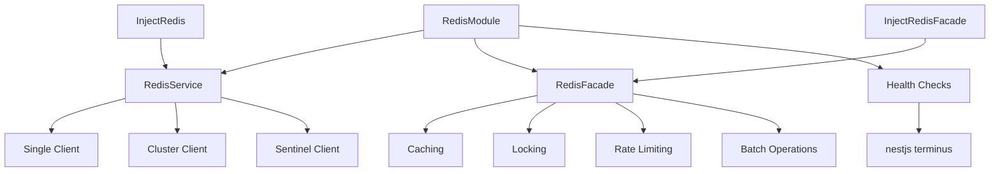

import Tabs from '@theme/Tabs';
import TabItem from '@theme/TabItem';

:::info
Redis Module là một module NestJS được xây dựng trên ioredis, cung cấp hỗ trợ multi-client, health checks, và một facade pattern mạnh mẽ để đơn giản hóa việc sử dụng Redis trong ứng dụng NestJS.
:::

## Tổng quan

Redis Module cung cấp một giải pháp hoàn chỉnh để tích hợp Redis vào ứng dụng NestJS với các tính năng:

- **Multi-Client Support**: Hỗ trợ nhiều kết nối Redis đồng thời (single, cluster, sentinel)
- **Health Checks**: Tích hợp với @nestjs/terminus để kiểm tra sức khỏe Redis
- **Facade Pattern**: RedisFacade cung cấp API cao cấp với các tính năng như caching, locking, rate limiting
- **Circuit Breaker**: Bảo vệ ứng dụng khỏi lỗi Redis
- **TypeScript Support**: Hỗ trợ đầy đủ TypeScript với type safety

## Kiến trúc



## Cài đặt

### 1. Cài đặt package

```bash
npm install @ecom-co/redis
```

### 2. Cài đặt dependencies

```bash
npm install ioredis
npm install @nestjs/terminus # Optional - cho health checks
```

### 3. Import module vào AppModule

```typescript
import { Module } from '@nestjs/common';
import { RedisModule } from '@ecom-co/redis';

@Module({
    imports: [
        RedisModule.forRoot({
            clients: [
                {
                    type: 'single',
                    name: 'default',
                    host: 'localhost',
                    port: 6379,
                },
            ],
        }),
    ],
})
export class AppModule {}
```

## Cấu hình cơ bản

### Single Redis Client

```typescript
RedisModule.forRoot({
    clients: [
        {
            type: 'single',
            name: 'default',
            host: 'localhost',
            port: 6379,
            password: 'your-password',
            db: 0,
        },
    ],
});
```

### Redis Cluster

```typescript
RedisModule.forRoot({
    clients: [
        {
            type: 'cluster',
            name: 'cluster',
            nodes: [
                { host: 'redis-1', port: 6379 },
                { host: 'redis-2', port: 6379 },
                { host: 'redis-3', port: 6379 },
            ],
        },
    ],
});
```

### Redis Sentinel

```typescript
RedisModule.forRoot({
    clients: [
        {
            type: 'sentinel',
            name: 'sentinel',
            sentinels: [
                { host: 'sentinel-1', port: 26379 },
                { host: 'sentinel-2', port: 26379 },
            ],
            sentinelName: 'mymaster',
        },
    ],
});
```

## Sử dụng cơ bản

### Inject Redis Client

```typescript
import { Injectable } from '@nestjs/common';
import { InjectRedis } from '@ecom-co/redis';
import type { Redis } from 'ioredis';

@Injectable()
export class CacheService {
    constructor(
        @InjectRedis() private readonly redis: Redis,
        @InjectRedis('cache') private readonly cacheRedis: Redis,
    ) {}

    async setValue(key: string, value: string): Promise<void> {
        await this.redis.set(key, value);
    }

    async getValue(key: string): Promise<string | null> {
        return await this.redis.get(key);
    }
}
```

### Inject RedisFacade

```typescript
import { Injectable } from '@nestjs/common';
import { InjectRedisFacade } from '@ecom-co/redis';
import { RedisFacade } from '@ecom-co/redis';

@Injectable()
export class UserService {
    constructor(
        @InjectRedisFacade() private readonly cache: RedisFacade,
        @InjectRedisFacade('session') private readonly session: RedisFacade,
    ) {}

    async getUser(id: number) {
        return await this.cache.getOrSet(`user:${id}`, 3600, async () => {
            // Load user from database
            return { id, name: 'John Doe' };
        });
    }
}
```

## Tính năng nâng cao

### Health Checks

```typescript
import { Module } from '@nestjs/common';
import { TerminusModule } from '@nestjs/terminus';
import { RedisModule } from '@ecom-co/redis';
import { checkRedisHealthy } from '@ecom-co/redis';

@Module({
  imports: [
    TerminusModule,
    RedisModule.forRoot({
      clients: [{ type: 'single', host: 'localhost', port: 6379 }],
    }),
  ],
})
export class AppModule {}

// Trong HealthController
@Get('health')
async check() {
  return await this.health.check([
    () => checkRedisHealthy(redisClient, 'redis'),
  ]);
}
```

### Async Configuration

```typescript
RedisModule.forRootAsync({
    imports: [ConfigModule],
    inject: [ConfigService],
    useFactory: (config: ConfigService) => ({
        clients: [
            {
                type: 'single',
                name: 'default',
                host: config.get('REDIS_HOST'),
                port: config.get('REDIS_PORT'),
                password: config.get('REDIS_PASSWORD'),
            },
        ],
    }),
});
```

## Bảng tóm tắt các options

### RedisModuleOptions

| Option    | Type                   | Required | Description                               |
| --------- | ---------------------- | -------- | ----------------------------------------- |
| `clients` | `RedisClientOptions[]` | ✅       | Danh sách các Redis client configurations |
| `logger`  | `LoggerService`        | ❌       | Logger tùy chỉnh cho connection lifecycle |

### SingleClientOptions

| Option             | Type       | Required | Description                             |
| ------------------ | ---------- | -------- | --------------------------------------- |
| `type`             | `'single'` | ✅       | Loại client (phải là 'single')          |
| `name`             | `string`   | ❌       | Tên client cho DI (mặc định: 'default') |
| `host`             | `string`   | ❌       | Host Redis server                       |
| `port`             | `number`   | ❌       | Port Redis server                       |
| `connectionString` | `string`   | ❌       | Connection string hoàn chỉnh            |

### ClusterClientOptions

| Option  | Type                           | Required | Description                     |
| ------- | ------------------------------ | -------- | ------------------------------- |
| `type`  | `'cluster'`                    | ✅       | Loại client (phải là 'cluster') |
| `name`  | `string`                       | ❌       | Tên client cho DI               |
| `nodes` | `Array<ClusterNode \| string>` | ✅       | Danh sách cluster nodes         |

### SentinelClientOptions

| Option         | Type                | Required | Description                      |
| -------------- | ------------------- | -------- | -------------------------------- |
| `type`         | `'sentinel'`        | ✅       | Loại client (phải là 'sentinel') |
| `name`         | `string`            | ❌       | Tên client cho DI                |
| `sentinels`    | `SentinelAddress[]` | ✅       | Danh sách sentinel nodes         |
| `sentinelName` | `string`            | ✅       | Tên master trong sentinel        |

:::tip
Khi sử dụng multiple clients, mỗi client nên có tên riêng để có thể inject riêng biệt. Tên client không phân biệt hoa thường.
:::

:::warning
Đảm bảo Redis server đang chạy trước khi khởi động ứng dụng. Module sẽ tự động xử lý reconnection nếu mất kết nối.
:::
