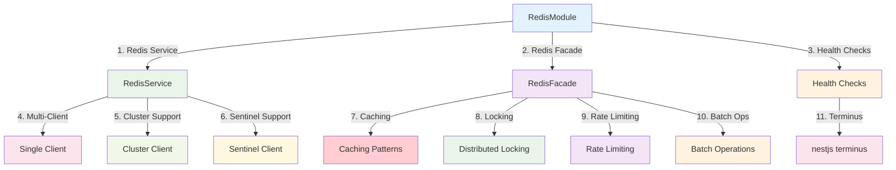

import Tabs from '@theme/Tabs';
import TabItem from '@theme/TabItem';

# Redis Library

:::tip 💡 Khái niệm cơ bản
Redis Library cung cấp các utilities để implement caching, session management, và distributed locking với Redis.
:::

## Redis Library là gì?

**Lý thuyết cơ bản:**
Redis Library là một module NestJS mạnh mẽ được xây dựng trên ioredis, cung cấp hỗ trợ multi-client, health checks, và facade pattern để đơn giản hóa việc sử dụng Redis trong ứng dụng NestJS.

**Đặc điểm kỹ thuật:**
- **Multi-Client Support**: Hỗ trợ nhiều kết nối Redis đồng thời (single, cluster, sentinel)
- **Health Checks**: Tích hợp với @nestjs/terminus để kiểm tra sức khỏe Redis
- **Facade Pattern**: RedisFacade cung cấp API cao cấp với caching, locking, rate limiting
- **Circuit Breaker**: Bảo vệ ứng dụng khỏi lỗi Redis
- **TypeScript Support**: Hỗ trợ đầy đủ TypeScript với type safety

## Kiến trúc Redis Library



## Cách sử dụng

### **1. Installation**

<Tabs>
  <TabItem value="npm" label="npm">

```bash
npm install @ecom-co/redis
```

  </TabItem>
  <TabItem value="yarn" label="yarn">

```bash
yarn add @ecom-co/redis
```

  </TabItem>
  <TabItem value="pnpm" label="pnpm">

```bash
pnpm add @ecom-co/redis
```

  </TabItem>
</Tabs>

### **2. Basic Usage**

```typescript
// Redis Module
import { RedisModule } from '@ecom-co/redis';

// Redis Service
import { RedisService } from '@ecom-co/redis';

// Redis Facade
import { RedisFacade, InjectRedisFacade } from '@ecom-co/redis';
```

## Các thành phần chính

- **[Redis Overview](/docs/ecom-co/libs/redis/docs/redis-overview)**: Tổng quan về Redis Module với multi-client support, health checks, và facade pattern
- **[Redis Installation](/docs/ecom-co/libs/redis/docs/redis-installation)**: Hướng dẫn cài đặt, cấu hình multi-client và health checks
- **[Redis Examples](/docs/ecom-co/libs/redis/docs/redis-examples)**: Các ví dụ sử dụng Redis Module trong thực tế với caching, locking, rate limiting
- **[Redis Facade](/docs/ecom-co/libs/redis/docs/redis-facade)**: Advanced Redis operations với caching patterns, distributed locking, rate limiting, và batch operations
- **[Redis API Reference](/docs/ecom-co/libs/redis/docs/redis-api-reference)**: Tài liệu API đầy đủ cho Redis Module và RedisFacade

---

**Bài tiếp theo:** [TypeORM Library](/docs/ecom-co/libs/typeorm/typeorm-library)
