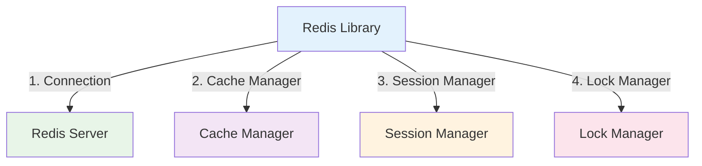

# Redis Library

:::tip 💡 Khái niệm cơ bản
Redis Library cung cấp các utilities để implement caching, session management, và distributed locking với Redis.
:::

## Redis Library là gì?

**Lý thuyết cơ bản:**
Redis Library là một thư viện được thiết kế đặc biệt để simplify quá trình implement Redis trong NestJS applications.

**Đặc điểm kỹ thuật:**
- **Caching**: Implement caching strategies
- **Session Management**: Quản lý user sessions
- **Distributed Locking**: Implement distributed locking
- **Data Structures**: Hỗ trợ Redis data structures

## Kiến trúc Redis Library



## Cách sử dụng

### **1. Installation**

```bash
npm install @ecom-co/redis
```

### **2. Basic Usage**


**Bài tiếp theo:** [TypeORM Library](/docs/ecom-co/libs/typeorm/typeorm-library)
