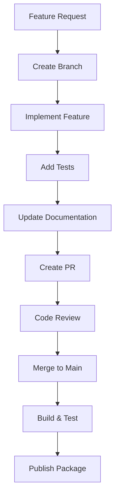

import Tabs from '@theme/Tabs';
import TabItem from '@theme/Tabs';

:::info
Development Guide cung cấp hướng dẫn chi tiết về development workflow, cách thêm entities mới, build library và publish package với proper version management.
:::

## Tổng quan

Development Guide bao gồm:

- **Development Workflow** - Quy trình phát triển và testing
- **Adding New Entities** - Cách thêm entities mới vào library
- **Building Library** - Build process và configuration
- **Publishing Process** - NPM publishing với version management
- **Best Practices** - Coding standards và guidelines

## Development Workflow

### 1. Setup Development Environment

#### Prerequisites

```bash
# Yêu cầu hệ thống
Node.js >= 18.0.0
npm >= 8.0.0
PostgreSQL >= 12.0
TypeScript >= 5.0
```

#### Clone và Install

```bash
# Clone repository
git clone https://github.com/e-commerce-platform-co/lib-orm.git
cd lib-orm

# Install dependencies
npm install

# Setup environment
cp .env.example .env
# Edit .env với database configuration
```

#### Database Setup

```bash
# Tạo database
createdb lib_orm_dev

# Run initial migration
npm run typeorm:run

# Seed development data
npm run seed
```

### 2. Development Cycle

#### Workflow Diagram



#### Daily Development

```bash
# 1. Pull latest changes
git pull origin main

# 2. Create feature branch
git checkout -b feature/add-category-entity

# 3. Make changes
# - Add new entity
# - Update existing code
# - Add tests

# 4. Test changes
npm run build
npm run lint
npm run test

# 5. Commit changes
git add .
git commit -m "feat: add Category entity with relationships"

# 6. Push branch
git push origin feature/add-category-entity

# 7. Create Pull Request
```

## Adding New Entities

### 1. Create Entity Class

#### Basic Entity Structure

```typescript
// src/entities/core/category.entity.ts
import { Entity, Column, OneToMany } from 'typeorm';
import { OrmBaseEntity } from '../base.entity';
import { Product } from './product.entity';

@Entity({ name: 'categories', comment: 'Product categories' })
export class Category extends OrmBaseEntity {
    @Column({
        type: 'varchar',
        length: 100,
        comment: 'Category name',
    })
    name!: string;

    @Column({
        type: 'text',
        nullable: true,
        comment: 'Category description',
    })
    description?: string;

    @Column({
        type: 'varchar',
        length: 50,
        nullable: true,
        comment: 'Category slug for URLs',
    })
    slug?: string;

    @Column({
        type: 'int',
        default: 0,
        comment: 'Display order',
    })
    sortOrder!: number;

    @Column({
        type: 'boolean',
        default: true,
        comment: 'Category visibility',
    })
    isActive!: boolean;

    // Relationships
    @OneToMany(() => Product, (product) => product.category)
    products?: Product[];
}
```

#### Entity với Transformers

```typescript
// src/entities/core/category.entity.ts
import { Entity, Column, OneToMany } from 'typeorm';
import { BooleanTransformer, NumericTransformer } from '../../transformers';
import { OrmBaseEntity } from '../base.entity';

@Entity({ name: 'categories' })
export class Category extends OrmBaseEntity {
    @Column({
        type: 'varchar',
        length: 100,
    })
    name!: string;

    @Column({
        type: 'int',
        transformer: new BooleanTransformer(),
        default: 1,
        comment: 'Category visibility (1=visible, 0=hidden)',
    })
    isVisible!: boolean;

    @Column({
        type: 'decimal',
        precision: 5,
        scale: 2,
        transformer: new NumericTransformer(),
        nullable: true,
        comment: 'Category priority (0.00-100.00)',
    })
    priority?: number | null;
}
```

### 2. Update Core Entities

#### Add to CORE_ENTITIES

```typescript
// src/entities/core/index.ts
export * from './category.entity';

import { User } from './user.entity';
import { Product } from './product.entity';
import { Category } from './category.entity';

export const CORE_ENTITIES: EntityClassOrSchema[] = [
    User,
    Product,
    Category, // Thêm Category entity
];
```

#### Update Main Export

```typescript
// src/entities/index.ts
export * from './core';
export * from './category.entity'; // Export Category entity
```

### 3. Update Related Entities

#### Update Product Entity

```typescript
// src/entities/core/product.entity.ts
import { Entity, Column, ManyToOne } from 'typeorm';
import { OrmBaseEntity } from '../base.entity';
import { User } from './user.entity';
import { Category } from './category.entity'; // Import Category

@Entity({ name: 'products' })
export class Product extends OrmBaseEntity {
    // ... existing fields ...

    @Column({
        name: 'categoryId',
        nullable: true,
        comment: 'Category ID',
    })
    categoryId?: string;

    @ManyToOne(() => Category, (category) => category.products, {
        nullable: true,
    })
    category?: Category; // Add category relationship
}
```

### 4. Create Migration

#### Generate Migration

```bash
# Generate migration từ entity changes
npm run typeorm:generate -- src/migrations/AddCategoryEntity
```

#### Review Generated Migration

```typescript
// src/migrations/1754759300000-AddCategoryEntity.ts
export class AddCategoryEntity1754759300000 implements MigrationInterface {
    public async up(queryRunner: QueryRunner): Promise<void> {
        // Review và edit nếu cần
        await queryRunner.query(`
      CREATE TABLE "categories" (
        "id" uuid NOT NULL DEFAULT uuid_generate_v4(),
        "createdAt" TIMESTAMP WITH TIME ZONE NOT NULL DEFAULT now(),
        "updatedAt" TIMESTAMP WITH TIME ZONE NOT NULL DEFAULT now(),
        "deletedAt" TIMESTAMP WITH TIME ZONE,
        "name" character varying(100) NOT NULL,
        "description" text,
        "slug" character varying(50),
        "sortOrder" integer NOT NULL DEFAULT '0',
        "isActive" integer NOT NULL DEFAULT '1',
        CONSTRAINT "PK_categories" PRIMARY KEY ("id")
      )
    `);

        await queryRunner.query(`
      ALTER TABLE "products" 
      ADD COLUMN "categoryId" uuid
    `);

        await queryRunner.query(`
      ALTER TABLE "products" 
      ADD CONSTRAINT "FK_products_category" 
      FOREIGN KEY ("categoryId") REFERENCES "categories"("id")
    `);
    }

    public async down(queryRunner: QueryRunner): Promise<void> {
        await queryRunner.query(`
      ALTER TABLE "products" 
      DROP CONSTRAINT "FK_products_category"
    `);

        await queryRunner.query(`
      ALTER TABLE "products" 
      DROP COLUMN "categoryId"
    `);

        await queryRunner.query('DROP TABLE "categories"');
    }
}
```

### 5. Update Seeds

#### Add Category Seeds

```typescript
// src/seeds/category.seed.ts
import type { DataSource } from 'typeorm';
import { Category } from '@ecom-co/orm';

export const seedCategories = async (ds: DataSource): Promise<void> => {
    const categoryRepo = ds.getRepository(Category);

    // Check if categories already exist
    const existingCategories = await categoryRepo.count();
    if (existingCategories > 0) {
        console.log('Categories already seeded, skipping...');
        return;
    }

    // Create sample categories
    const categories = [
        {
            name: 'Electronics',
            description: 'Electronic devices and gadgets',
            slug: 'electronics',
            sortOrder: 1,
            isActive: true,
        },
        {
            name: 'Clothing',
            description: 'Apparel and fashion items',
            slug: 'clothing',
            sortOrder: 2,
            isActive: true,
        },
        {
            name: 'Books',
            description: 'Books and publications',
            slug: 'books',
            sortOrder: 3,
            isActive: true,
        },
    ];

    await categoryRepo.save(categories.map((category) => categoryRepo.create(category)));

    console.log(`Seeded ${categories.length} categories`);
};
```

#### Update Main Seed Function

```typescript
// src/seeds/index.ts
import type { DataSource } from 'typeorm';
import { seedUsers } from './user.seed';
import { seedCategories } from './category.seed';
import { seedProducts } from './product.seed';

export const runSeeds = async (ds: DataSource): Promise<void> => {
    console.log('Starting database seeding...');

    try {
        // Seed users first
        await seedUsers(ds);

        // Seed categories (required for products)
        await seedCategories(ds);

        // Seed products (depends on users and categories)
        await seedProducts(ds);

        console.log('Database seeding completed successfully');
    } catch (error) {
        console.error('Seeding failed:', error);
        throw error;
    }
};
```

### 6. Test New Entity

#### Run Migration

```bash
# Apply migration
npm run typeorm:run

# Verify migration
# Check database tables
```

#### Test Seeding

```bash
# Run seeds
npm run seed

# Verify seeded data
# Check database content
```

#### Test in Application

```typescript
// Test Category entity
import { Category } from '@ecom-co/orm';

const category = new Category();
category.name = 'Test Category';
category.description = 'Test description';
category.slug = 'test-category';
category.sortOrder = 1;
category.isActive = true;

// Test relationships
const product = new Product();
product.name = 'Test Product';
product.categoryId = category.id;
```

## Building Library

### 1. Build Configuration

#### TypeScript Configuration

```json
// tsconfig.build.json
{
    "extends": "./tsconfig.json",
    "exclude": ["src/**/*.spec.ts", "src/**/*.test.ts", "src/seeds/**/*", "src/orm/**/*", "src/migrations/**/*"],
    "compilerOptions": {
        "outDir": "./dist",
        "declaration": true,
        "declarationMap": true,
        "sourceMap": true
    }
}
```

#### Package Configuration

```json
// package.json
{
    "main": "dist/index.js",
    "types": "dist/index.d.ts",
    "files": ["dist", "README.md"],
    "scripts": {
        "build": "tsc -p tsconfig.build.json",
        "build:watch": "tsc -p tsconfig.build.json --watch",
        "clean": "rm -rf dist"
    }
}
```

### 2. Build Process

#### Build Commands

```bash
# Clean previous build
npm run clean

# Build library
npm run build

# Build with watch mode (development)
npm run build:watch
```

#### Build Output

```
dist/
├── core/
│   ├── index.d.ts
│   ├── index.d.ts.map
│   ├── index.js
│   ├── utils.d.ts
│   ├── utils.d.ts.map
│   └── utils.js
├── entities/
│   ├── base.entity.d.ts
│   ├── base.entity.d.ts.map
│   ├── base.entity.js
│   ├── core/
│   │   ├── index.d.ts
│   │   ├── index.d.ts.map
│   │   ├── index.js
│   │   ├── category.entity.d.ts
│   │   ├── category.entity.d.ts.map
│   │   ├── category.entity.js
│   │   ├── product.entity.d.ts
│   │   ├── product.entity.d.ts.map
│   │   ├── product.entity.js
│   │   ├── user.entity.d.ts
│   │   ├── user.entity.d.ts.map
│   │   └── user.entity.js
│   ├── index.d.ts
│   ├── index.d.ts.map
│   └── index.js
├── index.d.ts
├── index.d.ts.map
└── index.js
```

### 3. Build Validation

#### Type Checking

```bash
# Check TypeScript compilation
npm run build

# Verify no type errors
# Check generated .d.ts files
```

#### Linting

```bash
# Run ESLint
npm run lint

# Fix auto-fixable issues
npm run lint:fix
```

#### Testing

```bash
# Run tests (if available)
npm test

# Verify build works in test environment
```

## Publishing Process

### 1. Version Management

#### Semantic Versioning

```bash
# Patch version (bug fixes)
npm run release:patch

# Minor version (new features, backward compatible)
npm run release:minor

# Major version (breaking changes)
npm run release:major
```

#### Version Scripts

```json
// package.json
{
    "scripts": {
        "release:patch": "npm version patch && npm publish",
        "release:minor": "npm version minor && npm publish",
        "release:major": "npm version major && npm publish",
        "prepublishOnly": "npm run clean && npm run build"
    }
}
```

### 2. Pre-publish Checklist

#### Code Quality

```bash
# 1. Run linting
npm run lint

# 2. Fix any issues
npm run lint:fix

# 3. Run tests (if available)
npm test

# 4. Check build
npm run build
```

#### Documentation

```bash
# 1. Update README.md
# 2. Update CHANGELOG.md
# 3. Update documentation files
# 4. Review API changes
```

#### Git Status

```bash
# 1. Check git status
git status

# 2. Commit all changes
git add .
git commit -m "chore: prepare for release v1.2.0"

# 3. Push to remote
git push origin main
```

### 3. Publishing Steps

#### Publish Command

```bash
# Publish new version
npm run release:patch
# hoặc
npm run release:minor
# hoặc
npm run release:major
```

#### Publish Process

```bash
# 1. npm version patch/minor/major
#    - Updates package.json version
#    - Creates git tag
#    - Commits version change

# 2. npm run prepublishOnly
#    - Cleans dist folder
#    - Builds library

# 3. npm publish
#    - Publishes to npm registry
#    - Uses .npmignore and files field
```

#### Post-publish

```bash
# 1. Push git tag
git push origin --tags

# 2. Create GitHub release
# 3. Update documentation
# 4. Notify team
```

### 4. Publishing Configuration

#### .npmignore

```gitignore
# .npmignore
src/
tests/
examples/
.github/
.vscode/
*.log
.env*
```

#### Package.json Files Field

```json
// package.json
{
    "files": ["dist", "README.md"]
}
```

#### Publish Config

```json
// package.json
{
    "publishConfig": {
        "registry": "https://npm.pkg.github.com"
    }
}
```

## Best Practices

### Development Best Practices

:::tip
**Branch Naming**: Sử dụng conventional branch names: `feature/`, `bugfix/`, `hotfix/`.
:::

:::tip
**Commit Messages**: Sử dụng conventional commits: `feat:`, `fix:`, `docs:`, `chore:`.
:::

:::tip
**Code Review**: Luôn có code review trước khi merge PR.
:::

:::warning
**Breaking Changes**: Đánh dấu breaking changes rõ ràng và update major version.
:::

:::info
**Testing**: Viết tests cho new features và ensure existing tests pass.
:::

### Entity Best Practices

:::tip
**Extend Base Entity**: Luôn extend `OrmBaseEntity` để có audit trail.
:::

:::tip
**Meaningful Names**: Sử dụng tên rõ ràng cho entities và columns.
:::

:::tip
**Comments**: Thêm comments cho complex fields và relationships.
:::

:::warning
**Validation**: Implement proper validation trong entities.
:::

:::info
**Relationships**: Sử dụng appropriate relationship types và cascade options.
:::

### Publishing Best Practices

:::tip
**Semantic Versioning**: Tuân thủ semantic versioning guidelines.
:::

:::tip
**Changelog**: Maintain CHANGELOG.md với detailed changes.
:::

:::tip
**Pre-publish Testing**: Test build và functionality trước khi publish.
:::

:::warning
**Breaking Changes**: Communicate breaking changes clearly.
:::

:::info
**Release Notes**: Write comprehensive release notes cho major versions.
:::

## Troubleshooting

### Common Issues

#### Build Errors

```bash
# TypeScript compilation errors
npm run build

# Check for:
# - Import/export issues
# - Type mismatches
# - Missing dependencies
```

#### Migration Issues

```bash
# Migration conflicts
npm run typeorm:run

# Check for:
# - Database connection issues
# - Migration file syntax errors
# - Constraint conflicts
```

#### Publishing Issues

```bash
# Authentication errors
npm login

# Registry issues
npm config set registry https://npm.pkg.github.com

# Permission issues
npm whoami
npm access ls-packages
```

### Debug Commands

```bash
# Check TypeScript configuration
npx tsc --showConfig

# Check npm configuration
npm config list

# Check package.json
npm run build --dry-run

# Check dist folder
ls -la dist/
```

## Ví dụ hoàn chỉnh

### Complete Entity Addition Workflow

```bash
# 1. Create feature branch
git checkout -b feature/add-order-entity

# 2. Create Order entity
# src/entities/core/order.entity.ts

# 3. Update CORE_ENTITIES
# src/entities/core/index.ts

# 4. Generate migration
npm run typeorm:generate -- src/migrations/AddOrderEntity

# 5. Review and edit migration
# src/migrations/xxx-AddOrderEntity.ts

# 6. Test migration
npm run typeorm:run

# 7. Add seeds
# src/seeds/order.seed.ts

# 8. Test seeding
npm run seed

# 9. Build and test
npm run build
npm run lint

# 10. Commit changes
git add .
git commit -m "feat: add Order entity with relationships"

# 11. Push and create PR
git push origin feature/add-order-entity
```

### Complete Publishing Workflow

```bash
# 1. Prepare for release
npm run lint
npm run build
npm test

# 2. Update documentation
# README.md, CHANGELOG.md

# 3. Commit changes
git add .
git commit -m "chore: prepare for release v1.3.0"
git push origin main

# 4. Publish
npm run release:minor

# 5. Post-publish
git push origin --tags
# Create GitHub release
```
