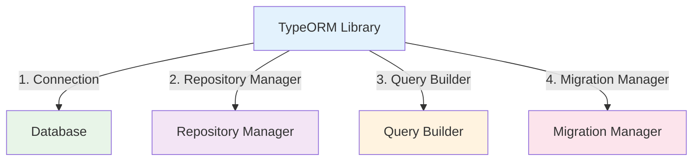

# TypeORM Library

:::tip 💡 Khái niệm cơ bản
TypeORM Library cung cấp các utilities để implement database operations với TypeORM.
:::

## TypeORM Library là gì?

**Lý thuyết cơ bản:**
TypeORM Library là một thư viện được thiết kế đặc biệt để simplify quá trình implement TypeORM trong NestJS applications.

**Đặc điểm kỹ thuật:**
- **Repository Pattern**: Implement repository pattern
- **Query Builder**: Simplify query building
- **Migrations**: Manage database migrations
- **Connection Management**: Manage database connections

## Kiến trúc TypeORM Library



## Cách sử dụng

### **1. Installation**

```bash
npm install @ecom-co/typeorm
```

### **2. Basic Usage**

---

**Bài tiếp theo:** [Elasticsearch Library](/docs/ecom-co/libs/elasticsearch/elasticsearch-library)
