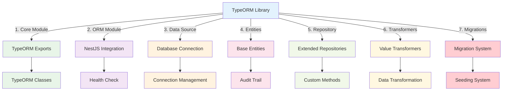

import Tabs from '@theme/Tabs';
import TabItem from '@theme/TabItem';

# TypeORM Library

:::tip 💡 Khái niệm cơ bản
TypeORM Library cung cấp các utilities để implement database operations với TypeORM.
:::

## TypeORM Library là gì?

**Lý thuyết cơ bản:**
TypeORM Library là một thư viện wrapper cho TypeORM được thiết kế đặc biệt cho e-commerce platform, cung cấp các tính năng nâng cao như base entities, extended repositories, transformers và NestJS integration với health check capabilities.

**Đặc điểm kỹ thuật:**
- **Base Entities**: Audit trail và lifecycle management
- **Extended Repositories**: Method tiện ích và custom logic
- **Value Transformers**: Boolean và numeric field transformations
- **NestJS Integration**: Health check capabilities và global module support
- **Migration & Seeding**: Comprehensive database management system
- **Standalone Data Source**: Scripts và CLI tools support

## Kiến trúc TypeORM Library



## Cách sử dụng

### **1. Installation**

<Tabs>
  <TabItem value="npm" label="npm">

```bash
npm install @ecom-co/typeorm
```

  </TabItem>
  <TabItem value="yarn" label="yarn">

```bash
yarn add @ecom-co/typeorm
```

  </TabItem>
  <TabItem value="pnpm" label="pnpm">

```bash
pnpm add @ecom-co/typeorm
```

  </TabItem>
</Tabs>

### **2. Basic Usage**

```typescript
// Core Module
import { TypeORMCoreModule } from '@ecom-co/typeorm';

// ORM Module
import { TypeORMModule } from '@ecom-co/typeorm';

// Data Source
import { createDataSource } from '@ecom-co/typeorm';

// Repository
import { BaseRepository } from '@ecom-co/typeorm';
```

## Các thành phần chính

- **[Lib TypeORM](/docs/ecom-co/libs/typeorm/docs/lib-typeorm)**: Tổng quan và hướng dẫn sử dụng TypeORM Library
- **[Core Module](/docs/ecom-co/libs/typeorm/docs/core-module)**: Module cốt lõi cho TypeORM configuration
- **[ORM Module](/docs/ecom-co/libs/typeorm/docs/orm-module)**: Module chính để setup TypeORM trong NestJS
- **[Data Source](/docs/ecom-co/libs/typeorm/docs/data-source)**: Quản lý database connections và configuration
- **[Entities](/docs/ecom-co/libs/typeorm/docs/entities)**: Định nghĩa và quản lý database entities
- **[Repository](/docs/ecom-co/libs/typeorm/docs/repository)**: Repository pattern implementation với TypeORM
- **[Transformers](/docs/ecom-co/libs/typeorm/docs/transformers)**: Data transformation và serialization
- **[Migrations & Seeding](/docs/ecom-co/libs/typeorm/docs/migrations-seeding)**: Database migrations và data seeding
- **[Development Guide](/docs/ecom-co/libs/typeorm/docs/development-guide)**: Hướng dẫn phát triển với TypeORM Library

---

**Bài tiếp theo:** [Elasticsearch Library](/docs/ecom-co/libs/elasticsearch/elasticsearch-library)
