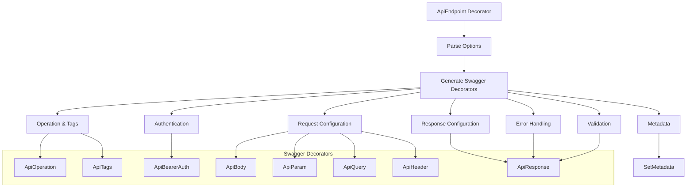
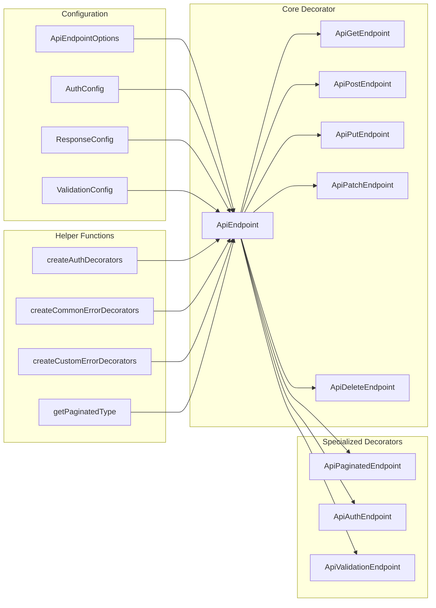

import Tabs from '@theme/Tabs';
import TabItem from '@theme/TabItem';

:::info
ApiEndpoint decorator là hệ thống decorator nâng cao được thiết kế để tự động generate Swagger documentation hoàn chỉnh cho NestJS API endpoints, bao gồm authentication, validation, pagination và error handling.
:::

### Tổng quan

- **Mục tiêu**: Tự động hóa việc tạo Swagger documentation với cấu hình linh hoạt và comprehensive
- **Điểm nổi bật**:
    - **Comprehensive Documentation**: Tự động generate tất cả Swagger decorators
    - **Multiple Authentication Types**: JWT, OAuth2, API Key, Basic Auth, Cookie Auth
    - **Advanced Validation**: Custom validation error examples và groups
    - **Flexible Pagination**: Hỗ trợ cả offset và cursor pagination
    - **Smart Error Handling**: Tự động include common error responses
    - **Shorthand Decorators**: Helper decorators cho common patterns
    - **Type Safety**: Full TypeScript support với generic types

### Cách hoạt động



### Kiến trúc Module



## 1. Core Configuration

### ApiEndpointOptions

| Option                | Type                                                                                                 | Required | Mô tả                                 |
| --------------------- | ---------------------------------------------------------------------------------------------------- | -------- | ------------------------------------- |
| `apiUrl`              | `ApiRoute`                                                                                           | ✅       | API route format (@METHOD /path)      |
| `summary`             | `string`                                                                                             | ✅       | Tóm tắt endpoint                      |
| `description`         | `string`                                                                                             | ❌       | Mô tả chi tiết                        |
| `tags`                | `string \| string[]`                                                                                 | ❌       | Swagger tags                          |
| `deprecated`          | `boolean`                                                                                            | ❌       | Đánh dấu endpoint deprecated          |
| `operationId`         | `string`                                                                                             | ❌       | Unique operation ID                   |
| `externalDocs`        | `{ description: string; url: string }`                                                               | ❌       | External documentation link           |
| `auth`                | `AuthConfig \| AuthConfig[]`                                                                         | ❌       | Authentication configuration          |
| `body`                | `BodyConfig`                                                                                         | ❌       | Request body configuration            |
| `cache`               | `{ description?: string; ttl?: number }`                                                             | ❌       | Caching configuration                 |
| `consumes`            | `string[]`                                                                                           | ❌       | Content types that endpoint consumes  |
| `errors`              | `(CustomErrorConfig \| HttpStatus)[]`                                                                | ❌       | Custom error responses                |
| `headers`             | `HeaderConfig[]`                                                                                     | ❌       | Custom request headers                |
| `includeCommonErrors` | `boolean`                                                                                            | ❌       | Auto-include common error responses   |
| `paginationType`      | `PaginationType`                                                                                     | ❌       | Pagination type (offset/cursor)       |
| `params`              | `ParamConfig[]`                                                                                      | ❌       | Path parameters configuration         |
| `produces`            | `string[]`                                                                                           | ❌       | Content types that endpoint produces  |
| `queries`             | `QueryConfig[]`                                                                                      | ❌       | Query parameters configuration        |
| `rateLimit`           | `{ limit: number; window: string; message?: string }`                                                | ❌       | Rate limiting configuration           |
| `responses`           | `Partial<Record<HttpStatus, ResponseConfig<T>>>`                                                     | ❌       | Response configuration by status code |
| `validation`          | `{ errorExamples?: ValidationErrorExample[]; groups?: string[]; includeValidationErrors?: boolean }` | ❌       | Validation configuration              |

### Authentication Configuration

| Auth Type      | Config Interface   | Mô tả                         |
| -------------- | ------------------ | ----------------------------- |
| **JWT**        | `JwtAuthConfig`    | Bearer token authentication   |
| **OAuth2**     | `OAuth2AuthConfig` | OAuth2 với scopes             |
| **API Key**    | `ApiKeyAuthConfig` | Custom API key authentication |
| **Basic Auth** | `BasicAuthConfig`  | HTTP Basic authentication     |
| **Cookie**     | `CookieAuthConfig` | Cookie-based authentication   |

### Detailed Configuration Interfaces

#### BodyConfig

| Property      | Type                                                                              | Required | Mô tả                           |
| ------------- | --------------------------------------------------------------------------------- | -------- | ------------------------------- |
| `type`        | `Type<unknown>`                                                                   | ❌       | DTO class cho request body      |
| `description` | `string`                                                                          | ❌       | Mô tả request body              |
| `required`    | `boolean`                                                                         | ❌       | Body có bắt buộc không          |
| `examples`    | `Record<string, unknown>`                                                         | ❌       | Example values cho request body |
| `files`       | `{ name: string; description?: string; required?: boolean; isArray?: boolean }[]` | ❌       | File upload configuration       |

#### ParamConfig

| Property      | Type                             | Required | Mô tả                      |
| ------------- | -------------------------------- | -------- | -------------------------- |
| `name`        | `string`                         | ✅       | Tên parameter              |
| `type`        | `'number' \| 'string' \| 'uuid'` | ❌       | Kiểu dữ liệu của parameter |
| `description` | `string`                         | ❌       | Mô tả parameter            |
| `example`     | `number \| string`               | ❌       | Example value              |
| `format`      | `string`                         | ❌       | Format specification       |

#### QueryConfig

| Property      | Type                                           | Required | Mô tả                       |
| ------------- | ---------------------------------------------- | -------- | --------------------------- |
| `name`        | `string`                                       | ✅       | Tên query parameter         |
| `type`        | `'string' \| 'number' \| 'boolean' \| 'array'` | ❌       | Kiểu dữ liệu của parameter  |
| `description` | `string`                                       | ❌       | Mô tả parameter             |
| `required`    | `boolean`                                      | ❌       | Parameter có bắt buộc không |
| `example`     | `unknown`                                      | ❌       | Example value               |
| `enum`        | `unknown[]`                                    | ❌       | Enum values nếu có          |

#### HeaderConfig

| Property      | Type      | Required | Mô tả                    |
| ------------- | --------- | -------- | ------------------------ |
| `name`        | `string`  | ✅       | Tên header               |
| `description` | `string`  | ❌       | Mô tả header             |
| `required`    | `boolean` | ❌       | Header có bắt buộc không |
| `example`     | `string`  | ❌       | Example value            |

#### ResponseConfig

| Property      | Type                      | Mô tả                          |
| ------------- | ------------------------- | ------------------------------ |
| `type`        | `null \| Type<T>`         | Response data type             |
| `description` | `string`                  | Mô tả response                 |
| `isArray`     | `boolean`                 | Response có phải array không   |
| `examples`    | `Record<string, unknown>` | Example response values        |
| `headers`     | `Record<string, unknown>` | Response headers configuration |

#### CustomErrorConfig

| Property      | Type                      | Required | Mô tả                      |
| ------------- | ------------------------- | -------- | -------------------------- |
| `status`      | `HttpStatus`              | ✅       | HTTP status code           |
| `description` | `string`                  | ❌       | Mô tả error                |
| `type`        | `Type<unknown>`           | ❌       | Custom error response type |
| `examples`    | `Record<string, unknown>` | ❌       | Example error responses    |

#### ValidationErrorExample

| Property     | Type     | Required | Mô tả                     |
| ------------ | -------- | -------- | ------------------------- |
| `field`      | `string` | ✅       | Tên field bị lỗi          |
| `constraint` | `string` | ✅       | Tên validation constraint |
| `message`    | `string` | ✅       | Error message             |

### Response Configuration

| Option                | Type                                    | Mô tả                                   |
| --------------------- | --------------------------------------- | --------------------------------------- |
| `responses`           | `Record<HttpStatus, ResponseConfig<T>>` | Response configuration theo status code |
| `paginationType`      | `PaginationType`                        | Loại pagination (offset/cursor)         |
| `includeCommonErrors` | `boolean`                               | Tự động include common error responses  |

## 2. Authentication Types

### 2.1 JWT Authentication

```ts
// Single JWT provider
@ApiEndpoint({
    summary: 'Get user profile',
    auth: { type: AUTH_TYPE.JWT, required: true },
    responses: { [HttpStatus.OK]: { type: UserDto } }
})

// Multiple JWT providers
@ApiEndpoint({
    summary: 'Multi-provider endpoint',
    auth: [
        { type: AUTH_TYPE.JWT, provider: 'access-token', required: true },
        { type: AUTH_TYPE.JWT, provider: 'refresh-token', required: false }
    ],
    responses: { [HttpStatus.OK]: { type: UserDto } }
})
```

### 2.2 OAuth2 Authentication

```ts
@ApiEndpoint({
    summary: 'OAuth2 protected endpoint',
    auth: {
        type: AUTH_TYPE.OAUTH2,
        provider: 'google',
        scopes: ['user:read', 'user:write'],
        required: true
    },
    responses: { [HttpStatus.OK]: { type: UserDto } }
})
```

### 2.3 API Key Authentication

```ts
@ApiEndpoint({
    summary: 'API Key protected endpoint',
    auth: {
        type: AUTH_TYPE.API_KEY,
        provider: 'custom-key',
        required: true
    },
    responses: { [HttpStatus.OK]: { type: UserDto } }
})
```

### 2.4 Cookie Authentication

```ts
@ApiEndpoint({
    summary: 'Cookie authenticated endpoint',
    auth: {
        type: AUTH_TYPE.COOKIE,
        name: 'session-token',
        required: true
    },
    responses: { [HttpStatus.OK]: { type: UserDto } }
})
```

## 3. Request Configuration

### 3.1 Request Body

```ts
@ApiEndpoint({
    summary: 'Create user',
    body: {
        type: CreateUserDto,
        description: 'User creation data',
        required: true,
        examples: {
            'Basic User': {
                name: 'John Doe',
                email: 'john@example.com',
                password: 'secure123'
            },
            'Admin User': {
                name: 'Admin User',
                email: 'admin@example.com',
                password: 'admin123',
                role: 'admin'
            }
        }
    },
    responses: { [HttpStatus.CREATED]: { type: UserDto } }
})
```

### 3.2 File Upload

```ts
@ApiEndpoint({
    summary: 'Upload user avatar',
    body: {
        files: [
            {
                name: 'avatar',
                description: 'User profile picture',
                required: true,
                isArray: false
            }
        ]
    },
    responses: { [HttpStatus.OK]: { type: FileUploadResponseDto } }
})
```

### 3.3 Query Parameters

```ts
@ApiEndpoint({
    summary: 'Search users',
    queries: [
        {
            name: 'q',
            type: 'string',
            description: 'Search query',
            required: false,
            example: 'john'
        },
        {
            name: 'status',
            type: 'string',
            description: 'User status',
            required: false,
            enum: ['active', 'inactive', 'pending'],
            example: 'active'
        },
        {
            name: 'tags',
            type: 'array',
            description: 'User tags',
            required: false,
            example: ['developer', 'admin']
        }
    ],
    responses: { [HttpStatus.OK]: { type: UserDto, isArray: true } }
})
```

### 3.4 Path Parameters

```ts
@ApiEndpoint({
    summary: 'Get user by ID',
    params: [
        {
            name: 'id',
            type: 'uuid',
            description: 'User unique identifier',
            example: '123e4567-e89b-12d3-a456-426614174000'
        }
    ],
    responses: { [HttpStatus.OK]: { type: UserDto } }
})
```

### 3.5 Custom Headers

```ts
@ApiEndpoint({
    summary: 'Custom header endpoint',
    headers: [
        {
            name: 'X-Custom-Header',
            description: 'Custom header for special processing',
            required: true,
            example: 'special-value'
        },
        {
            name: 'X-Request-ID',
            description: 'Request correlation ID',
            required: false,
            example: 'req-12345'
        }
    ],
    responses: { [HttpStatus.OK]: { type: UserDto } }
})
```

## 4. Response Configuration

### 4.1 Basic Responses

```ts
@ApiEndpoint({
    summary: 'Get user list',
    responses: {
        [HttpStatus.OK]: {
            type: UserDto,
            isArray: true,
            description: 'List of users retrieved successfully'
        }
    }
})
```

### 4.2 Multiple Status Responses

```ts
@ApiEndpoint({
    summary: 'Create user with multiple responses',
    responses: {
        [HttpStatus.CREATED]: {
            type: UserDto,
            description: 'User created successfully'
        },
        [HttpStatus.ACCEPTED]: {
            type: UserDto,
            description: 'User creation accepted for processing'
        }
    }
})
```

### 4.3 Paginated Responses

```ts
// Offset pagination
@ApiEndpoint({
    summary: 'Get paginated users',
    paginationType: PAGINATION_TYPE.OFFSET,
    responses: {
        [HttpStatus.OK]: {
            type: UserDto,
            isArray: true,
            description: 'Paginated list of users'
        }
    }
})

// Cursor pagination
@ApiEndpoint({
    summary: 'Get cursor paginated users',
    paginationType: PAGINATION_TYPE.CURSOR,
    responses: {
        [HttpStatus.OK]: {
            type: UserDto,
            isArray: true,
            description: 'Cursor paginated list of users'
        }
    }
})
```

## 5. Error Handling

### 5.1 Common Errors

```ts
@ApiEndpoint({
    summary: 'Endpoint with common errors',
    includeCommonErrors: true, // Tự động include 400, 404, 500, etc.
    responses: { [HttpStatus.OK]: { type: UserDto } }
})
```

### 5.2 Custom Error Responses

```ts
@ApiEndpoint({
    summary: 'Custom error handling',
    errors: [
        HttpStatus.CONFLICT, // Simple status code
        {
            status: HttpStatus.UNPROCESSABLE_ENTITY,
            description: 'Invalid email format',
            type: CustomErrorDto,
            examples: {
                'Invalid Email': {
                    error: 'Validation Error',
                    message: 'Invalid email format provided'
                }
            }
        }
    ],
    responses: { [HttpStatus.OK]: { type: UserDto } }
})
```

### 5.3 Validation Error Examples

```ts
@ApiEndpoint({
    summary: 'Validation error documentation',
    validation: {
        includeValidationErrors: true,
        errorExamples: [
            {
                field: 'email',
                constraint: 'isEmail',
                message: 'email must be an email'
            },
            {
                field: 'password',
                constraint: 'minLength',
                message: 'password must be longer than or equal to 8 characters'
            },
            {
                field: 'age',
                constraint: 'isPositive',
                message: 'age must be a positive number'
            }
        ]
    },
    responses: { [HttpStatus.CREATED]: { type: UserDto } }
})
```

## 6. Shorthand Decorators

### 6.1 HTTP Method Decorators

#### ApiGetEndpoint Options

| Option                | Type                                                  | Required | Mô tả                                |
| --------------------- | ----------------------------------------------------- | -------- | ------------------------------------ |
| `apiUrl`              | `ApiRoute`                                            | ✅       | API route format (@GET /path)        |
| `summary`             | `string`                                              | ✅       | Tóm tắt endpoint                     |
| `response`            | `null \| ResponseConfig<T> \| Type<T>`                | ❌       | Response configuration               |
| `tags`                | `string \| string[]`                                  | ❌       | Swagger tags                         |
| `auth`                | `AuthConfig \| AuthConfig[]`                          | ❌       | Authentication configuration         |
| `params`              | `ParamConfig[]`                                       | ❌       | Path parameters                      |
| `queries`             | `QueryConfig[]`                                       | ❌       | Query parameters                     |
| `headers`             | `HeaderConfig[]`                                      | ❌       | Custom headers                       |
| `errors`              | `(CustomErrorConfig \| HttpStatus)[]`                 | ❌       | Custom error responses               |
| `cache`               | `{ description?: string; ttl?: number }`              | ❌       | Caching configuration                |
| `description`         | `string`                                              | ❌       | Mô tả chi tiết                       |
| `deprecated`          | `boolean`                                             | ❌       | Đánh dấu endpoint deprecated         |
| `operationId`         | `string`                                              | ❌       | Unique operation ID                  |
| `externalDocs`        | `{ description: string; url: string }`                | ❌       | External documentation link          |
| `consumes`            | `string[]`                                            | ❌       | Content types that endpoint consumes |
| `produces`            | `string[]`                                            | ❌       | Content types that endpoint produces |
| `rateLimit`           | `{ limit: number; window: string; message?: string }` | ❌       | Rate limiting configuration          |
| `includeCommonErrors` | `boolean`                                             | ❌       | Auto-include common error responses  |

#### ApiPostEndpoint Options

| Option                | Type                                                              | Required | Mô tả                                |
| --------------------- | ----------------------------------------------------------------- | -------- | ------------------------------------ |
| `apiUrl`              | `ApiRoute`                                                        | ✅       | API route format (@POST /path)       |
| `summary`             | `string`                                                          | ✅       | Tóm tắt endpoint                     |
| `response`            | `null \| ResponseConfig<T> \| Type<T>`                            | ❌       | Response configuration               |
| `body`                | `BodyConfig`                                                      | ❌       | Request body configuration           |
| `tags`                | `string \| string[]`                                              | ❌       | Swagger tags                         |
| `auth`                | `AuthConfig \| AuthConfig[]`                                      | ❌       | Authentication configuration         |
| `params`              | `ParamConfig[]`                                                   | ❌       | Path parameters                      |
| `queries`             | `QueryConfig[]`                                                   | ❌       | Query parameters                     |
| `headers`             | `HeaderConfig[]`                                                  | ❌       | Custom headers                       |
| `errors`              | `(CustomErrorConfig \| HttpStatus)[]`                             | ❌       | Custom error responses               |
| `validation`          | `{ errorExamples?: ValidationErrorExample[]; groups?: string[] }` | ❌       | Validation configuration             |
| `description`         | `string`                                                          | ❌       | Mô tả chi tiết                       |
| `deprecated`          | `boolean`                                                         | ❌       | Đánh dấu endpoint deprecated         |
| `operationId`         | `string`                                                          | ❌       | Unique operation ID                  |
| `externalDocs`        | `{ description: string; url: string }`                            | ❌       | External documentation link          |
| `consumes`            | `string[]`                                                        | ❌       | Content types that endpoint consumes |
| `produces`            | `string[]`                                                        | ❌       | Content types that endpoint produces |
| `rateLimit`           | `{ limit: number; window: string; message?: string }`             | ❌       | Rate limiting configuration          |
| `includeCommonErrors` | `boolean`                                                         | ❌       | Auto-include common error responses  |
| `cache`               | `{ description?: string; ttl?: number }`                          | ❌       | Caching configuration                |

#### ApiPutEndpoint Options

| Option                | Type                                                              | Required | Mô tả                                |
| --------------------- | ----------------------------------------------------------------- | -------- | ------------------------------------ |
| `apiUrl`              | `ApiRoute`                                                        | ✅       | API route format (@PUT /path)        |
| `summary`             | `string`                                                          | ✅       | Tóm tắt endpoint                     |
| `response`            | `null \| ResponseConfig<T> \| Type<T>`                            | ❌       | Response configuration               |
| `body`                | `BodyConfig`                                                      | ❌       | Request body configuration           |
| `tags`                | `string \| string[]`                                              | ❌       | Swagger tags                         |
| `auth`                | `AuthConfig \| AuthConfig[]`                                      | ❌       | Authentication configuration         |
| `params`              | `ParamConfig[]`                                                   | ❌       | Path parameters                      |
| `queries`             | `QueryConfig[]`                                                   | ❌       | Query parameters                     |
| `headers`             | `HeaderConfig[]`                                                  | ❌       | Custom headers                       |
| `errors`              | `(CustomErrorConfig \| HttpStatus)[]`                             | ❌       | Custom error responses               |
| `validation`          | `{ errorExamples?: ValidationErrorExample[]; groups?: string[] }` | ❌       | Validation configuration             |
| `description`         | `string`                                                          | ❌       | Mô tả chi tiết                       |
| `deprecated`          | `boolean`                                                         | ❌       | Đánh dấu endpoint deprecated         |
| `operationId`         | `string`                                                          | ❌       | Unique operation ID                  |
| `externalDocs`        | `{ description: string; url: string }`                            | ❌       | External documentation link          |
| `consumes`            | `string[]`                                                        | ❌       | Content types that endpoint consumes |
| `produces`            | `string[]`                                                        | ❌       | Content types that endpoint produces |
| `rateLimit`           | `{ limit: number; window: string; message?: string }`             | ❌       | Rate limiting configuration          |
| `includeCommonErrors` | `boolean`                                                         | ❌       | Auto-include common error responses  |
| `cache`               | `{ description?: string; ttl?: number }`                          | ❌       | Caching configuration                |

#### ApiPatchEndpoint Options

| Option                | Type                                                              | Required | Mô tả                                |
| --------------------- | ----------------------------------------------------------------- | -------- | ------------------------------------ |
| `apiUrl`              | `ApiRoute`                                                        | ✅       | API route format (@PATCH /path)      |
| `summary`             | `string`                                                          | ✅       | Tóm tắt endpoint                     |
| `response`            | `null \| ResponseConfig<T> \| Type<T>`                            | ❌       | Response configuration               |
| `body`                | `BodyConfig`                                                      | ❌       | Request body configuration           |
| `tags`                | `string \| string[]`                                              | ❌       | Swagger tags                         |
| `auth`                | `AuthConfig \| AuthConfig[]`                                      | ❌       | Authentication configuration         |
| `params`              | `ParamConfig[]`                                                   | ❌       | Path parameters                      |
| `queries`             | `QueryConfig[]`                                                   | ❌       | Query parameters                     |
| `headers`             | `HeaderConfig[]`                                                  | ❌       | Custom headers                       |
| `errors`              | `(CustomErrorConfig \| HttpStatus)[]`                             | ❌       | Custom error responses               |
| `validation`          | `{ errorExamples?: ValidationErrorExample[]; groups?: string[] }` | ❌       | Validation configuration             |
| `description`         | `string`                                                          | ❌       | Mô tả chi tiết                       |
| `deprecated`          | `boolean`                                                         | ❌       | Đánh dấu endpoint deprecated         |
| `operationId`         | `string`                                                          | ❌       | Unique operation ID                  |
| `externalDocs`        | `{ description: string; url: string }`                            | ❌       | External documentation link          |
| `consumes`            | `string[]`                                                        | ❌       | Content types that endpoint consumes |
| `produces`            | `string[]`                                                        | ❌       | Content types that endpoint produces |
| `rateLimit`           | `{ limit: number; window: string; message?: string }`             | ❌       | Rate limiting configuration          |
| `includeCommonErrors` | `boolean`                                                         | ❌       | Auto-include common error responses  |
| `cache`               | `{ description?: string; ttl?: number }`                          | ❌       | Caching configuration                |

#### ApiDeleteEndpoint Options

| Option                | Type                                                  | Required | Mô tả                                |
| --------------------- | ----------------------------------------------------- | -------- | ------------------------------------ |
| `apiUrl`              | `ApiRoute`                                            | ✅       | API route format (@DELETE /path)     |
| `summary`             | `string`                                              | ✅       | Tóm tắt endpoint                     |
| `tags`                | `string \| string[]`                                  | ❌       | Swagger tags                         |
| `auth`                | `AuthConfig \| AuthConfig[]`                          | ❌       | Authentication configuration         |
| `params`              | `ParamConfig[]`                                       | ❌       | Path parameters                      |
| `queries`             | `QueryConfig[]`                                       | ❌       | Query parameters                     |
| `headers`             | `HeaderConfig[]`                                      | ❌       | Custom headers                       |
| `errors`              | `(CustomErrorConfig \| HttpStatus)[]`                 | ❌       | Custom error responses               |
| `description`         | `string`                                              | ❌       | Mô tả chi tiết                       |
| `deprecated`          | `boolean`                                             | ❌       | Đánh dấu endpoint deprecated         |
| `operationId`         | `string`                                              | ❌       | Unique operation ID                  |
| `externalDocs`        | `{ description: string; url: string }`                | ❌       | External documentation link          |
| `consumes`            | `string[]`                                            | ❌       | Content types that endpoint consumes |
| `produces`            | `string[]`                                            | ❌       | Content types that endpoint produces |
| `rateLimit`           | `{ limit: number; window: string; message?: string }` | ❌       | Rate limiting configuration          |
| `includeCommonErrors` | `boolean`                                             | ❌       | Auto-include common error responses  |
| `cache`               | `{ description?: string; ttl?: number }`              | ❌       | Caching configuration                |

### 6.2 Specialized Decorators Options

#### ApiPaginatedEndpoint Options

| Option                | Type                                                  | Required | Mô tả                                 |
| --------------------- | ----------------------------------------------------- | -------- | ------------------------------------- |
| `apiUrl`              | `ApiRoute`                                            | ✅       | API route format (@METHOD /path)      |
| `summary`             | `string`                                              | ✅       | Tóm tắt endpoint                      |
| `paginationType`      | `PaginationType`                                      | ✅       | Pagination type (OFFSET/CURSOR)       |
| `responses`           | `Partial<Record<HttpStatus, ResponseConfig<T>>>`      | ❌       | Response configuration by status code |
| `tags`                | `string \| string[]`                                  | ❌       | Swagger tags                          |
| `auth`                | `AuthConfig \| AuthConfig[]`                          | ❌       | Authentication configuration          |
| `params`              | `ParamConfig[]`                                       | ❌       | Path parameters                       |
| `queries`             | `QueryConfig[]`                                       | ❌       | Query parameters                      |
| `headers`             | `HeaderConfig[]`                                      | ❌       | Custom headers                        |
| `errors`              | `(CustomErrorConfig \| HttpStatus)[]`                 | ❌       | Custom error responses                |
| `includeCommonErrors` | `boolean`                                             | ❌       | Auto-include common error responses   |
| `description`         | `string`                                              | ❌       | Mô tả chi tiết                        |
| `deprecated`          | `boolean`                                             | ❌       | Đánh dấu endpoint deprecated          |
| `operationId`         | `string`                                              | ❌       | Unique operation ID                   |
| `externalDocs`        | `{ description: string; url: string }`                | ❌       | External documentation link           |
| `consumes`            | `string[]`                                            | ❌       | Content types that endpoint consumes  |
| `produces`            | `string[]`                                            | ❌       | Content types that endpoint produces  |
| `rateLimit`           | `{ limit: number; window: string; message?: string }` | ❌       | Rate limiting configuration           |
| `cache`               | `{ description?: string; ttl?: number }`              | ❌       | Caching configuration                 |

#### ApiAuthEndpoint Options

| Option                | Type                                                  | Required | Mô tả                                 |
| --------------------- | ----------------------------------------------------- | -------- | ------------------------------------- |
| `apiUrl`              | `ApiRoute`                                            | ✅       | API route format (@METHOD /path)      |
| `summary`             | `string`                                              | ✅       | Tóm tắt endpoint                      |
| `auth`                | `AuthConfig \| AuthConfig[]`                          | ✅       | Authentication configuration          |
| `responses`           | `Partial<Record<HttpStatus, ResponseConfig<T>>>`      | ❌       | Response configuration by status code |
| `tags`                | `string \| string[]`                                  | ❌       | Swagger tags                          |
| `params`              | `ParamConfig[]`                                       | ❌       | Path parameters                       |
| `queries`             | `QueryConfig[]`                                       | ❌       | Query parameters                      |
| `headers`             | `HeaderConfig[]`                                      | ❌       | Custom headers                        |
| `errors`              | `(CustomErrorConfig \| HttpStatus)[]`                 | ❌       | Custom error responses                |
| `body`                | `BodyConfig`                                          | ❌       | Request body configuration            |
| `includeCommonErrors` | `boolean`                                             | ❌       | Auto-include common error responses   |
| `description`         | `string`                                              | ❌       | Mô tả chi tiết                        |
| `deprecated`          | `boolean`                                             | ❌       | Đánh dấu endpoint deprecated          |
| `operationId`         | `string`                                              | ❌       | Unique operation ID                   |
| `externalDocs`        | `{ description: string; url: string }`                | ❌       | External documentation link           |
| `consumes`            | `string[]`                                            | ❌       | Content types that endpoint consumes  |
| `produces`            | `string[]`                                            | ❌       | Content types that endpoint produces  |
| `rateLimit`           | `{ limit: number; window: string; message?: string }` | ❌       | Rate limiting configuration           |
| `cache`               | `{ description?: string; ttl?: number }`              | ❌       | Caching configuration                 |

#### ApiValidationEndpoint Options

| Option                | Type                                                              | Required | Mô tả                                 |
| --------------------- | ----------------------------------------------------------------- | -------- | ------------------------------------- |
| `apiUrl`              | `ApiRoute`                                                        | ✅       | API route format (@METHOD /path)      |
| `summary`             | `string`                                                          | ✅       | Tóm tắt endpoint                      |
| `responses`           | `Partial<Record<HttpStatus, ResponseConfig<T>>>`                  | ❌       | Response configuration by status code |
| `validation`          | `{ errorExamples?: ValidationErrorExample[]; groups?: string[] }` | ❌       | Validation configuration              |
| `tags`                | `string \| string[]`                                              | ❌       | Swagger tags                          |
| `auth`                | `AuthConfig \| AuthConfig[]`                                      | ❌       | Authentication configuration          |
| `params`              | `ParamConfig[]`                                                   | ❌       | Path parameters                       |
| `queries`             | `QueryConfig[]`                                                   | ❌       | Query parameters                      |
| `headers`             | `HeaderConfig[]`                                                  | ❌       | Custom headers                        |
| `errors`              | `(CustomErrorConfig \| HttpStatus)[]`                             | ❌       | Custom error responses                |
| `body`                | `BodyConfig`                                                      | ❌       | Request body configuration            |
| `includeCommonErrors` | `boolean`                                                         | ❌       | Auto-include common error responses   |
| `description`         | `string`                                                          | ❌       | Mô tả chi tiết                        |
| `deprecated`          | `boolean`                                                         | ❌       | Đánh dấu endpoint deprecated          |
| `operationId`         | `string`                                                          | ❌       | Unique operation ID                   |
| `externalDocs`        | `{ description: string; url: string }`                            | ❌       | External documentation link           |
| `consumes`            | `string[]`                                                        | ❌       | Content types that endpoint consumes  |
| `produces`            | `string[]`                                                        | ❌       | Content types that endpoint produces  |
| `rateLimit`           | `{ limit: number; window: string; message?: string }`             | ❌       | Rate limiting configuration           |
| `cache`               | `{ description?: string; ttl?: number }`                          | ❌       | Caching configuration                 |

<Tabs>
  <TabItem value="get" label="GET Endpoint">

```ts
@ApiGetEndpoint({
    apiUrl: '@GET /api/v1/users/:id',
    summary: 'Get user by ID',
    response: UserDto,
    params: [{ name: 'id', type: 'uuid' }]
})
async getUser(@Param('id') id: string) {
    return this.userService.findById(id);
}
```

  </TabItem>
  <TabItem value="post" label="POST Endpoint">

```ts
@ApiPostEndpoint({
    apiUrl: '@POST /api/v1/users',
    summary: 'Create new user',
    response: UserDto,
    body: { type: CreateUserDto }
})
async createUser(@Body() dto: CreateUserDto) {
    return this.userService.create(dto);
}
```

  </TabItem>
  <TabItem value="put" label="PUT Endpoint">

```ts
@ApiPutEndpoint({
    apiUrl: '@PUT /api/v1/users/:id',
    summary: 'Update user completely',
    response: UserDto,
    body: { type: UpdateUserDto },
    params: [{ name: 'id', type: 'uuid' }]
})
async updateUser(@Param('id') id: string, @Body() dto: UpdateUserDto) {
    return this.userService.update(id, dto);
}
```

  </TabItem>
  <TabItem value="patch" label="PATCH Endpoint">

```ts
@ApiPatchEndpoint({
    apiUrl: '@PATCH /api/v1/users/:id',
    summary: 'Partially update user',
    response: UserDto,
    body: { type: PartialUpdateUserDto },
    params: [{ name: 'id', type: 'uuid' }]
})
async patchUser(@Param('id') id: string, @Body() dto: PartialUpdateUserDto) {
    return this.userService.patch(id, dto);
}
```

  </TabItem>
  <TabItem value="delete" label="DELETE Endpoint">

```ts
@ApiDeleteEndpoint({
    apiUrl: '@DELETE /api/v1/users/:id',
    summary: 'Delete user',
    params: [{ name: 'id', type: 'uuid' }]
})
async deleteUser(@Param('id') id: string) {
    await this.userService.delete(id);
    return { message: 'User deleted successfully' };
}
```

  </TabItem>
</Tabs>

### 6.2 Specialized Decorators

#### Paginated Endpoint

```ts
@ApiPaginatedEndpoint({
    apiUrl: '@GET /api/v1/users',
    summary: 'Get paginated users',
    paginationType: PAGINATION_TYPE.OFFSET,
    responses: { [HttpStatus.OK]: { type: UserDto, isArray: true } }
})
async getUsers(@Query() pagination: PaginationDto) {
    return this.userService.findAllPaginated(pagination);
}
```

#### Authenticated Endpoint

```ts
@ApiAuthEndpoint({
    apiUrl: '@GET /api/v1/users/profile',
    summary: 'Get current user profile',
    auth: { type: AUTH_TYPE.JWT, required: true },
    responses: { [HttpStatus.OK]: { type: UserDto } }
})
async getCurrentUser(@Request() req) {
    return this.userService.findById(req.user.id);
}
```

#### Validation Endpoint

```ts
@ApiValidationEndpoint({
    apiUrl: '@POST /api/v1/users',
    summary: 'Create user with validation',
    responses: { [HttpStatus.CREATED]: { type: UserDto } },
    body: { type: CreateUserDto },
    validation: {
        errorExamples: [
            { field: 'email', constraint: 'isEmail', message: 'email must be an email' },
            { field: 'password', constraint: 'minLength', message: 'password must be longer than or equal to 8 characters' }
        ]
    }
})
async createUser(@Body() dto: CreateUserDto) {
    return this.userService.create(dto);
}
```

## 7. Advanced Features

### 7.1 Rate Limiting

```ts
@ApiEndpoint({
    summary: 'Rate limited endpoint',
    rateLimit: {
        limit: 100,
        window: '1m',
        message: 'Rate limit exceeded. Please try again later.'
    },
    responses: { [HttpStatus.OK]: { type: UserDto } }
})
```

### 7.2 Caching

```ts
@ApiEndpoint({
    summary: 'Cached endpoint',
    cache: {
        description: 'Cache for 5 minutes',
        ttl: 300
    },
    responses: { [HttpStatus.OK]: { type: UserDto } }
})
```

### 7.3 Content Type Configuration

```ts
@ApiEndpoint({
    summary: 'Multi-format endpoint',
    consumes: ['application/json', 'application/xml'],
    produces: ['application/json', 'application/xml'],
    responses: { [HttpStatus.OK]: { type: UserDto } }
})
```

### 7.4 External Documentation

```ts
@ApiEndpoint({
    summary: 'External docs endpoint',
    externalDocs: {
        description: 'More information about this endpoint',
        url: 'https://docs.example.com/api/users'
    },
    responses: { [HttpStatus.OK]: { type: UserDto } }
})
```

## 8. Usage Examples

### 8.1 Complete User CRUD

```ts
@Controller('users')
export class UsersController {
    constructor(private readonly userService: UserService) {}

    @Get()
    @ApiGetEndpoint({
        apiUrl: '@GET /api/v1/users',
        summary: 'Get all users',
        tags: ['Users'],
        response: UserDto,
        isArray: true,
        queries: [
            { name: 'status', type: 'string', enum: ['active', 'inactive'] },
            { name: 'role', type: 'string', enum: ['user', 'admin'] },
        ],
    })
    async getAllUsers(@Query() query: GetUsersQueryDto) {
        return this.userService.findAll(query);
    }

    @Get(':id')
    @ApiGetEndpoint({
        apiUrl: '@GET /api/v1/users/:id',
        summary: 'Get user by ID',
        tags: ['Users'],
        response: UserDto,
        params: [{ name: 'id', type: 'uuid' }],
    })
    async getUserById(@Param('id') id: string) {
        return this.userService.findById(id);
    }

    @Post()
    @ApiPostEndpoint({
        apiUrl: '@POST /api/v1/users',
        summary: 'Create new user',
        tags: ['Users'],
        response: UserDto,
        body: { type: CreateUserDto },
        validation: {
            errorExamples: [
                { field: 'email', constraint: 'isEmail', message: 'email must be an email' },
                {
                    field: 'password',
                    constraint: 'minLength',
                    message: 'password must be longer than or equal to 8 characters',
                },
            ],
        },
    })
    async createUser(@Body() dto: CreateUserDto) {
        return this.userService.create(dto);
    }

    @Put(':id')
    @ApiPutEndpoint({
        apiUrl: '@PUT /api/v1/users/:id',
        summary: 'Update user completely',
        tags: ['Users'],
        response: UserDto,
        body: { type: UpdateUserDto },
        params: [{ name: 'id', type: 'uuid' }],
        auth: { type: AUTH_TYPE.JWT, required: true },
    })
    async updateUser(@Param('id') id: string, @Body() dto: UpdateUserDto) {
        return this.userService.update(id, dto);
    }

    @Delete(':id')
    @ApiDeleteEndpoint({
        apiUrl: '@DELETE /api/v1/users/:id',
        summary: 'Delete user',
        tags: ['Users'],
        params: [{ name: 'id', type: 'uuid' }],
        auth: { type: AUTH_TYPE.JWT, required: true },
    })
    async deleteUser(@Param('id') id: string) {
        await this.userService.delete(id);
        return { message: 'User deleted successfully' };
    }
}
```

### 8.2 Authentication Examples

```ts
@Controller('auth')
export class AuthController {
    @Post('login')
    @ApiPostEndpoint({
        apiUrl: '@POST /api/v1/auth/login',
        summary: 'User login',
        tags: ['Authentication'],
        response: LoginResponseDto,
        body: { type: LoginDto },
        errors: [HttpStatus.UNAUTHORIZED, HttpStatus.TOO_MANY_REQUESTS],
    })
    async login(@Body() dto: LoginDto) {
        return this.authService.login(dto);
    }

    @Post('refresh')
    @ApiPostEndpoint({
        apiUrl: '@POST /api/v1/auth/refresh',
        summary: 'Refresh access token',
        tags: ['Authentication'],
        response: RefreshResponseDto,
        auth: { type: AUTH_TYPE.COOKIE, name: 'refresh_token' },
    })
    async refreshToken(@Request() req) {
        return this.authService.refreshToken(req.cookies.refresh_token);
    }

    @Get('profile')
    @ApiAuthEndpoint({
        apiUrl: '@GET /api/v1/auth/profile',
        summary: 'Get current user profile',
        tags: ['Authentication'],
        response: UserDto,
        auth: { type: AUTH_TYPE.JWT, required: true },
    })
    async getProfile(@Request() req) {
        return this.userService.findById(req.user.id);
    }
}
```

## 9. Best Practices

### 9.1 API URL Format

- **Luôn sử dụng format chuẩn**: `@METHOD /path/to/endpoint`
- **Ví dụ**: `@GET /api/v1/users/:id`, `@POST /api/v1/auth/login`
- **Lợi ích**: Dễ dàng trace và maintain code

### 9.2 Error Documentation

- **Sử dụng `includeCommonErrors: true`** cho endpoints cơ bản
- **Custom error examples** cho validation errors cụ thể
- **Consistent error format** với ErrorResponseDto

### 9.3 Authentication

- **Chọn auth type phù hợp** với security requirements
- **Multiple auth providers** khi cần flexibility
- **Required vs optional** authentication rõ ràng

### 9.4 Response Types

- **Sử dụng generic types** cho type safety
- **Pagination types** phù hợp với use case
- **Array responses** với `isArray: true`

## 10. Troubleshooting

### Common Issues

**Issue 1: Swagger không hiển thị authentication**

```bash
# Error: Authentication không được apply trong Swagger UI
```

**Solution**: Kiểm tra AUTH_TYPE constants và auth configuration:

```ts
// Đảm bảo AUTH_TYPE được import đúng
import { AUTH_TYPE } from '@ecom-co/utils';

@ApiEndpoint({
    auth: { type: AUTH_TYPE.JWT, required: true }
})
```

**Issue 2: Validation errors không được document**

```bash
# Error: Validation error examples không hiển thị trong Swagger
```

**Solution**: Sử dụng `ApiValidationEndpoint` hoặc set `includeValidationErrors: true`:

```ts
@ApiValidationEndpoint({
    validation: {
        errorExamples: [
            { field: 'email', constraint: 'isEmail', message: 'email must be an email' }
        ]
    }
})
```

**Issue 3: Pagination types không hoạt động**

```bash
# Error: Pagination response types không đúng
```

**Solution**: Đảm bảo paginationType được set đúng:

```ts
@ApiEndpoint({
    paginationType: PAGINATION_TYPE.OFFSET, // hoặc CURSOR
    responses: { [HttpStatus.OK]: { type: UserDto, isArray: true } }
})
```

**Issue 4: Custom error responses không hiển thị**

```bash
# Error: Custom errors không được include trong Swagger
```

**Solution**: Kiểm tra errors array configuration:

```ts
@ApiEndpoint({
    errors: [
        HttpStatus.CONFLICT,
        { status: HttpStatus.UNPROCESSABLE_ENTITY, description: 'Custom error' }
    ]
})
```

:::tip
Luôn sử dụng `apiUrl` field để trace API endpoints trong code. Điều này giúp maintainability và debugging.
:::

:::warning
Không mix giữa manual Swagger decorators và ApiEndpoint decorator trên cùng một method để tránh conflicts.
:::

:::danger
ApiEndpoint decorator rất powerful nhưng cũng complex. Hãy test kỹ lưỡng trước khi deploy production.
:::

## 11. Integration Examples

### 11.1 với Validation Pipe

```ts
// main.ts
app.useGlobalPipes(new ValidationPipe({
    transform: true,
    whitelist: true,
    forbidNonWhitelisted: true
}));

// Controller
@Post()
@ApiValidationEndpoint({
    validation: {
        errorExamples: [
            { field: 'email', constraint: 'isEmail', message: 'email must be an email' }
        ]
    }
})
async createUser(@Body() dto: CreateUserDto) {
    return this.userService.create(dto);
}
```

### 11.2 với Guards

```ts
@Get('protected')
@UseGuards(JwtAuthGuard)
@ApiAuthEndpoint({
    auth: { type: AUTH_TYPE.JWT, required: true },
    response: UserDto
})
async getProtectedData() {
    return this.service.getData();
}
```

### 11.3 với Interceptors

```ts
@Get('cached')
@UseInterceptors(CacheInterceptor)
@ApiEndpoint({
    cache: { ttl: 300 },
    response: UserDto
})
async getCachedData() {
    return this.service.getData();
}
```
