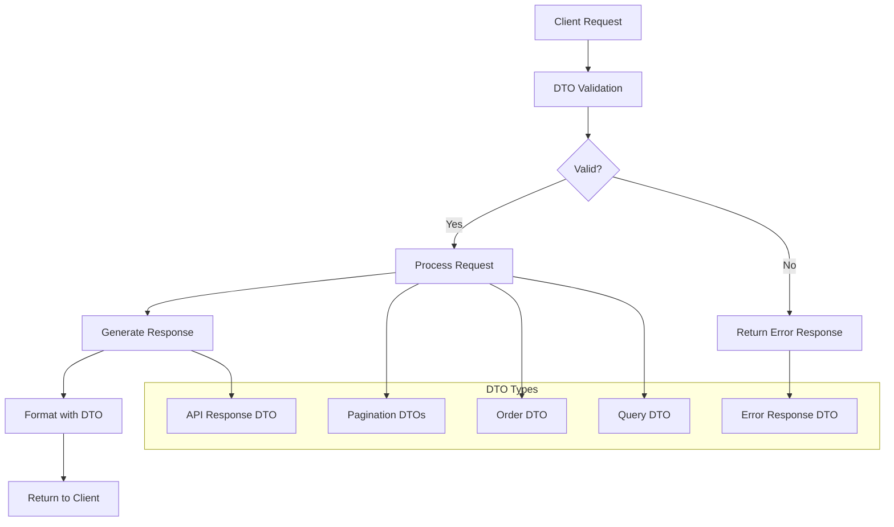
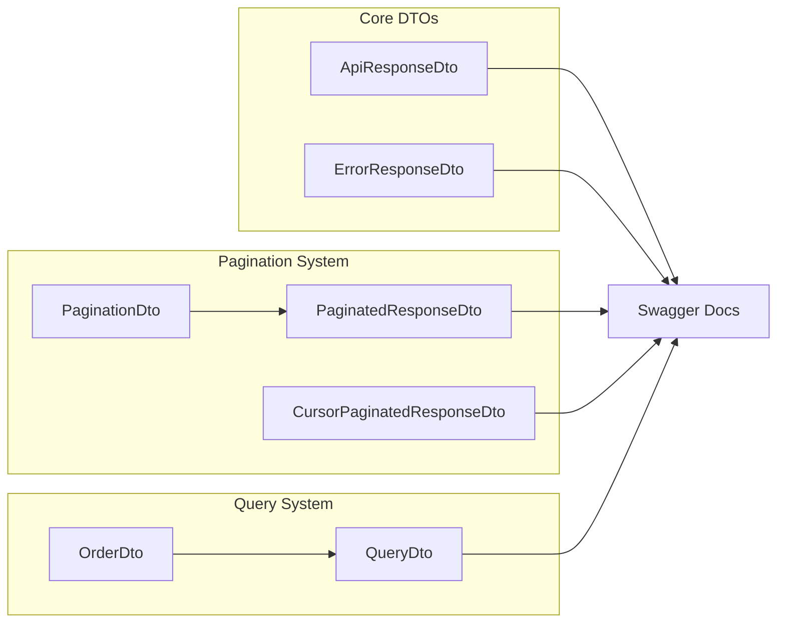

import Tabs from '@theme/Tabs';
import TabItem from '@theme/TabItem';

:::info
Module DTO cung cấp bộ sưu tập đầy đủ các Data Transfer Objects được thiết kế để chuẩn hóa API responses, xử lý lỗi, phân trang và querying trong NestJS applications.
:::

### Tổng quan

- **Mục tiêu**: Chuẩn hóa cấu trúc dữ liệu cho API responses và requests
- **Điểm nổi bật**:
    - **Standardized API Responses**: Cấu trúc response nhất quán cho tất cả endpoints
    - **Comprehensive Error Handling**: Error response format chuẩn với detailed information
    - **Flexible Pagination**: Hỗ trợ cả offset-based và cursor-based pagination
    - **Advanced Querying**: JsonLogic filtering, ordering và field selection
    - **Swagger Integration**: Tự động generate API documentation
    - **Type Safety**: Full TypeScript support với generic types

### Cách hoạt động



### Kiến trúc Module



## 1. API Response DTO

### Mục đích

Định nghĩa cấu trúc chuẩn cho tất cả API responses, đảm bảo tính nhất quán và dễ dàng integrate với Swagger.

### Cấu trúc

| Property     | Type        | Mô tả                          |
| ------------ | ----------- | ------------------------------ |
| `data`       | `T \| null` | Dữ liệu response (có thể null) |
| `message`    | `string`    | Thông báo mô tả kết quả        |
| `statusCode` | `number`    | HTTP status code               |

### Usage Examples

<Tabs>
  <TabItem value="basic" label="Basic Usage">

```ts
import { ApiResponseDto } from '@ecom-co/utils';

// Tạo response DTO cho User
const UserResponseDto = ApiResponseDto(UserDto);

// Sử dụng trong controller
@Get()
@ApiResponse({ type: UserResponseDto })
async getUsers(): Promise<IApiResponse<User[]>> {
    const users = await this.userService.findAll();
    return {
        data: users,
        message: 'Users retrieved successfully',
        statusCode: 200
    };
}
```

  </TabItem>
  <TabItem value="null-data" label="Null Data Response">

```ts
// Response không có data (ví dụ: delete operation)
const DeleteResponseDto = ApiResponseDto(null);

@Delete(':id')
@ApiResponse({ type: DeleteResponseDto })
async deleteUser(): Promise<IApiResponse<null>> {
    await this.userService.delete(id);
    return {
        data: null,
        message: 'User deleted successfully',
        statusCode: 200
    };
}
```

  </TabItem>
</Tabs>

### Factory Function

```ts
// ApiResponseDto<T>(dataType: Type<T> | null)
const UserResponseDto = ApiResponseDto(UserDto);
const DeleteResponseDto = ApiResponseDto(null);
```

:::tip
Sử dụng `ApiResponseDto(null)` cho các operations không trả về data như DELETE, hoặc khi response chỉ cần message và statusCode.
:::

## 2. Error Response DTO

### Mục đích

Chuẩn hóa format cho error responses, cung cấp thông tin chi tiết về lỗi để debugging và user experience tốt hơn.

### Cấu trúc

| Property      | Type                                     | Required | Mô tả                                |
| ------------- | ---------------------------------------- | -------- | ------------------------------------ |
| `error`       | `string`                                 | ✅       | Tên ngắn gọn của lỗi                 |
| `message`     | `string`                                 | ✅       | Mô tả chi tiết về lỗi                |
| `statusCode`  | `number`                                 | ✅       | HTTP status code                     |
| `path`        | `string`                                 | ✅       | Đường dẫn request gây lỗi            |
| `requestId`   | `string`                                 | ✅       | ID duy nhất cho request tracking     |
| `timestamp`   | `string`                                 | ✅       | Thời điểm xảy ra lỗi                 |
| `details`     | `Record<string, unknown>`                | ❌       | Chi tiết lỗi (chỉ trong development) |
| `errors`      | `string[]`                               | ❌       | Array các validation errors          |
| `fieldErrors` | `Record<string, Record<string, string>>` | ❌       | Validation errors theo field         |
| `method`      | `string`                                 | ❌       | HTTP method (chỉ trong development)  |
| `stack`       | `string`                                 | ❌       | Stack trace (chỉ trong development)  |
| `userAgent`   | `string`                                 | ❌       | User agent (chỉ trong development)   |

### Usage Example

```ts
import { ErrorResponseDto } from '@ecom-co/utils';

// Trong exception filter
@Catch(HttpException)
export class HttpExceptionFilter implements ExceptionFilter {
    catch(exception: HttpException, host: ArgumentsHost) {
        const ctx = host.switchToHttp();
        const response = ctx.getResponse<Response>();
        const request = ctx.getRequest<Request>();

        const errorResponse = new ErrorResponseDto();
        errorResponse.error = exception.getStatusText();
        errorResponse.message = exception.message;
        errorResponse.statusCode = exception.getStatus();
        errorResponse.path = request.url;
        errorResponse.requestId = request.headers['x-request-id'] || uuid();
        errorResponse.timestamp = new Date().toISOString();

        response.status(exception.getStatus()).json(errorResponse);
    }
}
```

:::warning
Các properties như `details`, `stack`, `method`, `userAgent` chỉ nên hiển thị trong development environment để tránh leak sensitive information.
:::

## 3. Pagination System

### 3.1 Pagination DTO

#### Mục đích

Định nghĩa tham số phân trang chuẩn với limit, page và search functionality.

#### Cấu trúc

| Property | Type     | Default | Mô tả                     |
| -------- | -------- | ------- | ------------------------- |
| `limit`  | `number` | `10`    | Số items per page (1-100) |
| `page`   | `number` | `1`     | Số trang (1-based)        |
| `q`      | `string` | -       | Search query string       |

#### Validation Rules

```ts
@ClampNumber({ min: 1, max: 100 })  // limit: 1-100
@Min(1)                              // page: >= 1
@IsInt()                             // limit, page: integers only
@IsOptional()                        // Tất cả đều optional
```

### 3.2 Paginated Response DTO

#### Mục đích

Cung cấp response format chuẩn cho paginated data với metadata đầy đủ.

#### Cấu trúc Paging

| Property          | Type      | Mô tả                         |
| ----------------- | --------- | ----------------------------- |
| `page`            | `number`  | Trang hiện tại                |
| `limit`           | `number`  | Số items per page             |
| `total`           | `number`  | Tổng số items                 |
| `totalPages`      | `number`  | Tổng số trang                 |
| `currentPageSize` | `number`  | Số items trong trang hiện tại |
| `hasNextPage`     | `boolean` | Có trang tiếp theo không      |
| `hasPreviousPage` | `boolean` | Có trang trước không          |
| `startItem`       | `number`  | Item đầu tiên trong trang     |
| `endItem`         | `number`  | Item cuối cùng trong trang    |
| `offset`          | `number`  | Số items bỏ qua               |

#### Usage Examples

<Tabs>
  <TabItem value="basic" label="Basic Pagination">

```ts
import { ApiPaginatedResponseDto, ApiPaginatedResponseData } from '@ecom-co/utils';

// Tạo DTO cho Swagger
const UsersPaginatedResponseDto = ApiPaginatedResponseDto(UserDto);

// Trong service
const users = await this.userService.findAll(page, limit);
const total = await this.userService.count();

const response = new ApiPaginatedResponseData({
    data: users,
    paging: new Paging({ page, limit, total }),
    message: 'Users retrieved successfully',
});
```

  </TabItem>
  <TabItem value="auto" label="Auto Calculation">

```ts
// Tự động tính toán pagination
const response = ApiPaginatedResponseData.createWithAutoPaging({
    data: users,
    page: 1,
    limit: 10,
    total: 95,
    message: 'Users retrieved successfully',
});
```

  </TabItem>
</Tabs>

### 3.3 Cursor Pagination

#### Mục đích

Cung cấp cursor-based pagination cho performance tốt hơn với large datasets.

#### Cấu trúc CursorPaging

| Property          | Type      | Mô tả                         |
| ----------------- | --------- | ----------------------------- |
| `nextCursor`      | `string`  | Cursor cho trang tiếp theo    |
| `hasNextPage`     | `boolean` | Có trang tiếp theo không      |
| `previousCursor`  | `string`  | Cursor cho trang trước        |
| `hasPreviousPage` | `boolean` | Có trang trước không          |
| `firstCursor`     | `string`  | Cursor cho trang đầu tiên     |
| `lastCursor`      | `string`  | Cursor cho trang cuối cùng    |
| `currentPageSize` | `number`  | Số items trong trang hiện tại |

#### Usage Example

```ts
import { ApiCursorPaginatedResponseDto, ApiCursorPaginatedResponseData } from '@ecom-co/utils';

// Tạo DTO cho Swagger
const UsersCursorPaginatedResponseDto = ApiCursorPaginatedResponseDto(UserDto);

// Trong service
const response = ApiCursorPaginatedResponseData.createWithAutoCursors({
    data: users,
    limit: 10,
    nextCursor: 'eyJpZCI6MjB9',
    total: 95,
    message: 'Users retrieved successfully',
});
```

:::tip
Cursor pagination phù hợp cho real-time data và large datasets, trong khi offset pagination phù hợp cho small datasets và khi cần biết tổng số items.
:::

## 4. Order DTO

### Mục đích

Định nghĩa cấu trúc cho việc sắp xếp/sorting data với field và direction.

### Cấu trúc

| Property    | Type      | Mô tả                          |
| ----------- | --------- | ------------------------------ |
| `field`     | `string`  | Tên field để sort              |
| `direction` | `1 \| -1` | Hướng sort: 1 (ASC), -1 (DESC) |

### Validation Rules

```ts
@IsIn([1, -1])      // direction: chỉ cho phép 1 hoặc -1
@IsNumber()          // direction: phải là number
@IsString()          // field: phải là string
@Type(() => Number)  // Transform direction thành number
```

### Usage Example

```ts
import { OrderDto } from '@ecom-co/utils';

// Trong query
const orderDto = new OrderDto();
orderDto.field = 'createdAt';
orderDto.direction = -1; // DESC

// Hoặc từ request
@Query() query: { order?: OrderDto[] }
// GET /users?order[0][field]=createdAt&order[0][direction]=-1
```

## 5. Query DTO

### Mục đích

Cung cấp base class cho advanced querying với filtering, ordering và field selection.

### Cấu trúc Base

| Property | Type         | Mô tả                                      |
| -------- | ------------ | ------------------------------------------ |
| `order`  | `OrderDto[]` | Array các field để sort                    |
| `select` | `string[]`   | Array các field cần include trong response |

### JsonLogic Filtering

```ts
// Ví dụ filter phức tạp
const filter = {
    and: [
        { '==': [{ var: 'status' }, 'active'] },
        { '>': [{ var: 'age' }, 18] },
        { in: [{ var: 'role' }, ['user', 'admin']] },
    ],
};
```

### Factory Function

```ts
import { createCustomQueryDto } from '@ecom-co/utils';

// Tạo custom query DTO với filter example
const UserQueryDto = createCustomQueryDto({
    and: [
        { '==': [{ var: 'status' }, 'active'] },
        { '>': [{ var: 'age' }, 18] }
    ]
});

// Sử dụng trong controller
@Get()
async getUsers(@Query() query: UserQueryDto) {
    // query.filter sẽ có type safety
    return this.userService.findWithFilter(query);
}
```

### Usage Examples

<Tabs>
  <TabItem value="basic" label="Basic Query">

```ts
// GET /users?select[]=id&select[]=name&order[0][field]=createdAt&order[0][direction]=-1
{
    select: ['id', 'name'],
    order: [
        { field: 'createdAt', direction: -1 }
    ]
}
```

  </TabItem>
  <TabItem value="filter" label="With Filtering">

```ts
// GET /users?filter[and][0][==][0][var]=status&filter[and][0][==][1]=active
{
    select: ['id', 'name', 'email'],
    order: [{ field: 'name', direction: 1 }],
    filter: {
        and: [
            { '==': [{ var: 'status' }, 'active'] }
        ]
    }
}
```

  </TabItem>
</Tabs>

## Integration với Other Modules

### Swagger Integration

```ts
// Tự động generate Swagger documentation
@ApiResponse({ type: UserResponseDto })
@ApiResponse({ type: ErrorResponseDto, status: 400 })
async getUsers() {
    // Implementation
}
```

### Validation Integration

```ts
// Tự động validate với class-validator
@Post()
async createUser(@Body() @Validate() userDto: CreateUserDto) {
    // userDto đã được validate
}
```

### Exception Filter Integration

```ts
// Tự động format error responses
@UseFilters(HttpExceptionFilter)
export class UsersController {
    // Controller methods
}
```

## Best Practices

- **Consistent Response Format**: Luôn sử dụng `ApiResponseDto` để đảm bảo format nhất quán
- **Proper Error Handling**: Sử dụng `ErrorResponseDto` cho tất cả error responses
- **Pagination Strategy**: Chọn pagination strategy phù hợp (offset vs cursor)
- **Filter Validation**: Validate JsonLogic filters trước khi sử dụng
- **Field Selection**: Sử dụng `select` để optimize response size
- **Type Safety**: Luôn sử dụng generic types cho type safety

## Troubleshooting

### Common Issues

**Issue 1: Swagger không hiển thị generic types**

```bash
# Error: Generic types không được resolve trong Swagger
```

**Solution**: Sử dụng factory functions như `ApiResponseDto(UserDto)` thay vì generic interfaces.

**Issue 2: Validation không hoạt động**

```bash
# Error: Validation decorators không validate
```

**Solution**: Đảm bảo đã enable validation pipe trong main.ts:

```ts
app.useGlobalPipes(
    new ValidationPipe({
        transform: true,
        whitelist: true,
    }),
);
```

**Issue 3: Cursor pagination không hoạt động**

```bash
# Error: Cursor không được generate đúng
```

**Solution**: Sử dụng `createWithAutoCursors` method và đảm bảo data có field unique để tạo cursor.

:::tip
Luôn sử dụng TypeScript strict mode để catch type errors sớm và đảm bảo type safety.
:::

:::warning
JsonLogic filters có thể complex, hãy validate input kỹ lưỡng để tránh security issues.
:::

:::danger
Không bao giờ expose sensitive information trong error responses ở production environment.
:::
