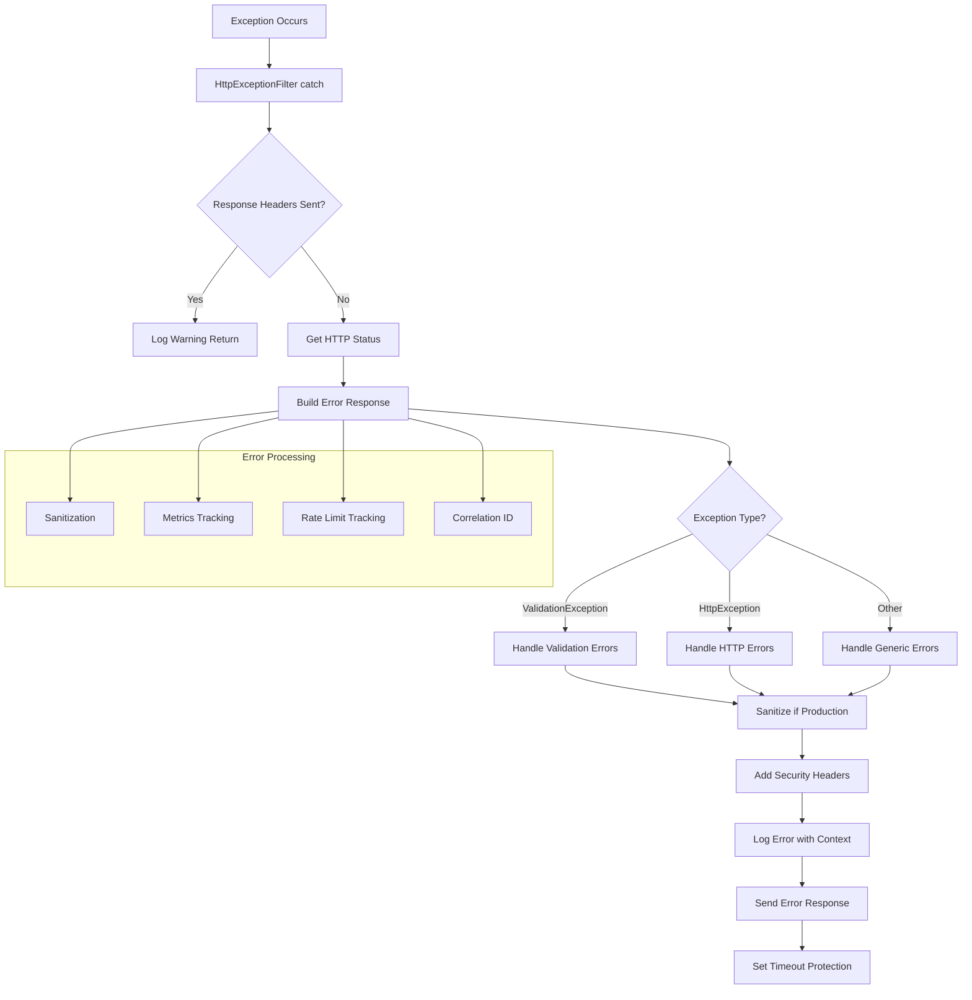
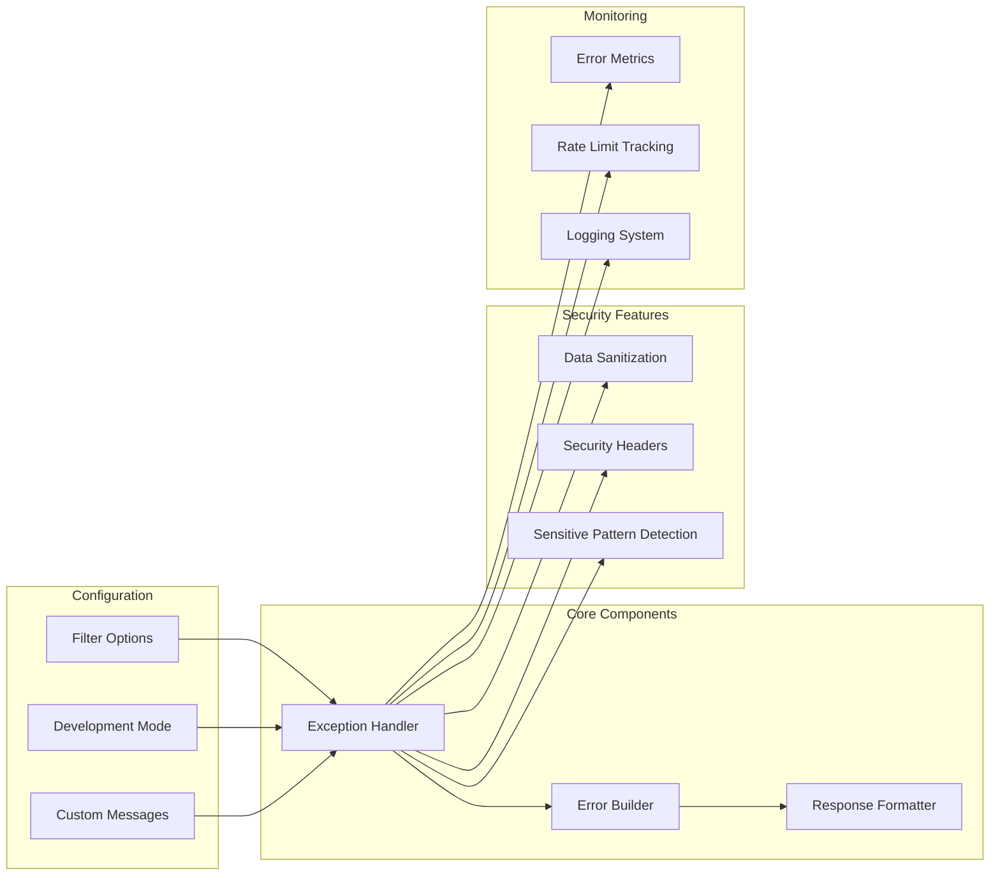

import Tabs from '@theme/Tabs';
import TabItem from '@theme/TabItem';

:::info
HttpExceptionFilter là global exception filter được thiết kế để xử lý tất cả exceptions trong NestJS application, cung cấp error handling chuẩn hóa với các tính năng bảo mật và monitoring nâng cao.
:::

### Tổng quan

- **Mục tiêu**: Chuẩn hóa error handling và cung cấp security features cho toàn bộ application
- **Điểm nổi bật**:
    - **Comprehensive Error Handling**: Xử lý tất cả loại exceptions (HTTP, Validation, Custom)
    - **Security Features**: Sanitization, security headers, sensitive data protection
    - **Monitoring & Metrics**: Error tracking, rate limit monitoring, correlation IDs
    - **Development Support**: Detailed error information trong development mode
    - **Production Safety**: Sanitized error messages để tránh information leakage
    - **Performance**: Timeout protection và fallback error handling

### Cách hoạt động



### Kiến trúc Module



## 1. Configuration Options

### HttpExceptionFilterOptions

| Option                    | Type                     | Default | Mô tả                                    |
| ------------------------- | ------------------------ | ------- | ---------------------------------------- |
| `isDevelopment`           | `boolean`                | `false` | Bật development mode cho detailed errors |
| `enableSanitization`      | `boolean`                | `true`  | Bật data sanitization                    |
| `enableMetrics`           | `boolean`                | `false` | Bật error metrics tracking               |
| `enableRateLimitTracking` | `boolean`                | `false` | Bật rate limit monitoring                |
| `customErrorMessages`     | `Record<number, string>` | `{}`    | Custom error messages theo status code   |

### Constructor Parameters

| Parameter          | Type                         | Required | Mô tả                                |
| ------------------ | ---------------------------- | -------- | ------------------------------------ |
| `reflector`        | `Reflector`                  | ✅       | NestJS reflector cho metadata access |
| `options`          | `HttpExceptionFilterOptions` | ❌       | Configuration options                |
| `errorMetrics`     | `ErrorMetrics`               | ❌       | Error metrics tracker                |
| `rateLimitTracker` | `RateLimitTracker`           | ❌       | Rate limit tracker                   |

## 2. Core Features

### 2.1 Exception Type Handling

#### ValidationException

```ts
// Tự động xử lý validation errors
if (exception instanceof ValidationException) {
    const validationMessages = exception.getValidationMessages();
    const fieldErrors = exception.getFieldErrors();

    // Format validation errors theo ErrorResponseDto
    return {
        error: 'Validation failed',
        errors: validationMessages,
        fieldErrors,
        message: 'Validation failed',
        // ... other properties
    };
}
```

#### HttpException

```ts
// Xử lý NestJS HTTP exceptions
if (exception instanceof HttpException) {
    const status = exception.getStatus();
    const response = exception.getResponse();

    // Format theo exception response
    return {
        error: response.error || 'HTTP Error',
        message: response.message || exception.message,
        statusCode: status,
    };
}
```

#### Custom Error Types

```ts
// Mapping custom error names với HTTP status codes
switch (exception.name) {
    case 'ConflictError':
        return HttpStatus.CONFLICT;
    case 'ForbiddenError':
        return HttpStatus.FORBIDDEN;
    case 'JsonWebTokenError':
        return HttpStatus.UNAUTHORIZED;
    case 'NotFoundError':
        return HttpStatus.NOT_FOUND;
    case 'PayloadTooLargeError':
        return HttpStatus.PAYLOAD_TOO_LARGE;
    case 'TimeoutError':
        return HttpStatus.REQUEST_TIMEOUT;
    case 'TokenExpiredError':
        return HttpStatus.UNAUTHORIZED;
    case 'TooManyRequestsError':
        return HttpStatus.TOO_MANY_REQUESTS;
    case 'UnauthorizedError':
        return HttpStatus.UNAUTHORIZED;
    case 'ValidationError':
        return HttpStatus.BAD_REQUEST;
    default:
        return HttpStatus.INTERNAL_SERVER_ERROR;
}
```

### 2.2 Data Sanitization

#### Sensitive Patterns

```ts
private readonly sensitivePatterns = [
    /password[s]?[:\s=]+[^\s]+/gi,        // Passwords
    /token[s]?[:\s=]+[^\s]+/gi,            // Tokens
    /key[s]?[:\s=]+[^\s]+/gi,              // API keys
    /secret[s]?[:\s=]+[^\s]+/gi,           // Secrets
    /api[_-]?key[s]?[:\s=]+[^\s]+/gi,     // API keys
    /authorization[:\s=]+[^\s]+/gi,        // Authorization headers
    /bearer\s+[^\s]+/gi,                   // Bearer tokens
    /\b\d{4}[\s-]?\d{4}[\s-]?\d{4}[\s-]?\d{4}\b/g, // Credit cards
    /\b\d{3}-\d{2}-\d{4}\b/g,              // SSN
];
```

#### Sanitization Process

```ts
private sanitizeString(input: string): string {
    let sanitized = input;

    this.sensitivePatterns.forEach((pattern) => {
        sanitized = sanitized.replace(pattern, '[REDACTED]');
    });

    return sanitized;
}
```

:::warning
Sanitization chỉ hoạt động trong production mode. Development mode sẽ hiển thị full error details để debugging.
:::

### 2.3 Security Headers

```ts
private setSecurityHeaders(response: Response): void {
    // Prevent information leakage
    response.removeHeader('X-Powered-By');
    response.setHeader('X-Content-Type-Options', 'nosniff');
    response.setHeader('X-Frame-Options', 'DENY');
    response.setHeader('Cache-Control', 'no-cache, no-store, must-revalidate');
    response.setHeader('Pragma', 'no-cache');
    response.setHeader('Expires', '0');
}
```

### 2.4 Correlation ID Management

```ts
private getOrCreateCorrelationId(request: Request, response: Response): string {
    // Check existing correlation IDs
    const existingId =
        request.headers['x-correlation-id'] ||
        request.headers['x-request-id'] ||
        request.headers['x-trace-id'];

    const correlationId = existingId || uuidv4();

    // Set response headers
    response.setHeader('x-correlation-id', correlationId);
    response.setHeader('x-request-id', correlationId);

    return correlationId;
}
```

## 3. Usage Examples

### 3.1 Basic Setup

<Tabs>
  <TabItem value="basic" label="Basic Configuration">

```ts
import { HttpExceptionFilter } from '@ecom-co/utils';

// Trong main.ts
app.useGlobalFilters(
    new HttpExceptionFilter(app.get(Reflector), { isDevelopment: process.env.NODE_ENV === 'development' }),
);
```

  </TabItem>
  <TabItem value="advanced" label="Advanced Configuration">

```ts
// Với custom options và external services
const filter = new HttpExceptionFilter(
    app.get(Reflector),
    {
        isDevelopment: process.env.NODE_ENV === 'development',
        enableSanitization: true,
        enableMetrics: true,
        enableRateLimitTracking: true,
        customErrorMessages: {
            404: 'Resource not found',
            500: 'Internal server error occurred',
        },
    },
    errorMetricsService, // ErrorMetrics implementation
    rateLimitService, // RateLimitTracker implementation
);

app.useGlobalFilters(filter);
```

  </TabItem>
  <TabItem value="controller" label="Controller Level">

```ts
// Áp dụng cho specific controller
@Controller('users')
@UseFilters(HttpExceptionFilter)
export class UsersController {
    @Get()
    async getUsers() {
        // Controller methods
    }
}
```

  </TabItem>
</Tabs>

### 3.2 Custom Error Messages

```ts
// Định nghĩa custom error messages
const customMessages = {
    400: 'Dữ liệu đầu vào không hợp lệ',
    401: 'Bạn cần đăng nhập để truy cập tài nguyên này',
    403: 'Bạn không có quyền truy cập tài nguyên này',
    404: 'Không tìm thấy tài nguyên yêu cầu',
    500: 'Đã xảy ra lỗi hệ thống, vui lòng thử lại sau',
};

const filter = new HttpExceptionFilter(reflector, {
    isDevelopment: false,
    customErrorMessages: customMessages,
});
```

### 3.3 Integration với Error Metrics

```ts
// Implement ErrorMetrics interface
class ErrorMetricsService implements ErrorMetrics {
    increment(status: number, path: string, method: string) {
        // Increment error count in monitoring system
        // Example: Prometheus, DataDog, etc.
        this.metrics.increment('http_errors_total', {
            status: status.toString(),
            path,
            method,
        });
    }
}

// Sử dụng với filter
const filter = new HttpExceptionFilter(reflector, { enableMetrics: true }, new ErrorMetricsService());
```

## 4. Error Response Format

### Standard Error Response

```json
{
    "error": "Bad Request",
    "message": "Validation failed",
    "statusCode": 400,
    "path": "/api/users",
    "requestId": "a1b2c3d4-e5f6-7890-1234-567890abcdef",
    "timestamp": "2024-01-15T10:30:00.000Z",
    "errors": ["Email is required", "Password must be at least 8 characters"],
    "fieldErrors": {
        "email": {
            "isNotEmpty": "email should not be empty"
        },
        "password": {
            "minLength": "password must be longer than or equal to 8 characters"
        }
    }
}
```

### Development Mode Response

```json
{
    "error": "Internal Server Error",
    "message": "Database connection failed",
    "statusCode": 500,
    "path": "/api/users",
    "requestId": "a1b2c3d4-e5f6-7890-1234-567890abcdef",
    "timestamp": "2024-01-15T10:30:00.000Z",
    "details": {
        "code": "ECONNREFUSED",
        "errno": -61
    },
    "method": "GET",
    "userAgent": "Mozilla/5.0...",
    "stack": "Error: connect ECONNREFUSED 127.0.0.1:5432..."
}
```

## 5. Advanced Features

### 5.1 Rate Limit Tracking

```ts
// Implement RateLimitTracker interface
class RateLimitTrackerService implements RateLimitTracker {
    track(ip: string, path: string) {
        // Track rate limit violations
        // Example: Redis, in-memory counter, etc.
        const key = `rate_limit:${ip}:${path}`;
        const count = this.redis.incr(key);

        if (count === 1) {
            this.redis.expire(key, 60); // 1 minute window
        }

        if (count > 100) {
            // 100 requests per minute
            this.alertService.notify(`Rate limit exceeded for ${ip} on ${path}`);
        }
    }
}
```

### 5.2 Error Logging

```ts
// Structured logging với context
private logError(exception: unknown, status: number, request: Request, correlationId: string, clientIp: string): void {
    const logContext = {
        status,
        clientIp,
        method: request.method,
        timestamp: new Date().toISOString(),
        url: request.url,
        userAgent: request.headers['user-agent'],
        correlationId,
    };

    if (status >= 400 && status < 500) {
        // Client errors - log as warning
        this.logger.warn(`Client Error: ${status} ${request.method} ${request.url}`, logContext);
    } else {
        // Server errors - log as error with stack trace
        this.logger.error(`Server Error: ${status} ${request.method} ${request.url}`, exception.stack, logContext);
    }
}
```

### 5.3 Timeout Protection

```ts
private sendErrorResponse(response: Response, status: number, errorPayload: ErrorResponseDto): void {
    // Set timeout để tránh hanging responses
    const timeout = setTimeout(() => {
        if (!response.headersSent) {
            this.logger.error('Error response timed out');
            response.end();
        }
    }, 5000); // 5 seconds timeout

    try {
        response.status(status).json(errorPayload);
        clearTimeout(timeout);
    } catch (error) {
        clearTimeout(timeout);
        this.logger.error('Failed to send error response', error);
    }
}
```

## 6. Best Practices

### 6.1 Security Considerations

- **Always enable sanitization** trong production environment
- **Use custom error messages** để tránh information leakage
- **Implement rate limiting** để prevent abuse
- **Set security headers** để enhance security posture
- **Log errors appropriately** với proper log levels

### 6.2 Performance Optimization

- **Use correlation IDs** để track requests across services
- **Implement metrics collection** để monitor error rates
- **Set reasonable timeouts** để prevent hanging responses
- **Use structured logging** để improve debugging efficiency

### 6.3 Development vs Production

- **Development mode**: Full error details, stack traces, sensitive data
- **Production mode**: Sanitized messages, no sensitive data, minimal information
- **Custom error messages**: Provide user-friendly messages trong production
- **Metrics collection**: Enable trong production để monitor application health

## 7. Troubleshooting

### Common Issues

**Issue 1: Filter không catch được exceptions**

```bash
# Error: Exceptions không được handle bởi filter
```

**Solution**: Đảm bảo filter được register đúng cách:

```ts
// Trong main.ts
app.useGlobalFilters(new HttpExceptionFilter(reflector, options));

// Hoặc trong module
@Module({
    providers: [
        {
            provide: APP_FILTER,
            useClass: HttpExceptionFilter,
        }
    ]
})
```

**Issue 2: Sanitization không hoạt động**

```bash
# Error: Sensitive data vẫn hiển thị trong production
```

**Solution**: Kiểm tra configuration:

```ts
const filter = new HttpExceptionFilter(reflector, {
    isDevelopment: false, // Must be false
    enableSanitization: true, // Must be true
});
```

**Issue 3: Custom error messages không được apply**

```bash
# Error: Default error messages vẫn hiển thị
```

**Solution**: Đảm bảo custom messages được định nghĩa đúng:

```ts
const customMessages = {
    400: 'Custom bad request message',
    404: 'Custom not found message',
    // Must use numeric keys
};
```

**Issue 4: Metrics không được track**

```bash
# Error: Error metrics không được increment
```

**Solution**: Kiểm tra ErrorMetrics implementation và enable flag:

```ts
const filter = new HttpExceptionFilter(
    reflector,
    { enableMetrics: true }, // Must be true
    errorMetricsService, // Must implement ErrorMetrics interface
);
```

:::tip
Luôn test exception filter trong cả development và production mode để đảm bảo behavior đúng.
:::

:::warning
Không bao giờ disable sanitization trong production environment để tránh sensitive data leakage.
:::

:::danger
Exception filter là critical security component. Hãy review code kỹ lưỡng trước khi deploy production.
:::

## 8. Integration Examples

### 8.1 với Validation Pipe

```ts
// main.ts
app.useGlobalPipes(
    new ValidationPipe({
        transform: true,
        whitelist: true,
        forbidNonWhitelisted: true,
        exceptionFactory: (errors) => {
            return new ValidationException(errors);
        },
    }),
);

app.useGlobalFilters(
    new HttpExceptionFilter(reflector, {
        isDevelopment: process.env.NODE_ENV === 'development',
    }),
);
```

### 8.2 với Logger Service

```ts
// Custom logger integration
class CustomLogger extends Logger {
    error(message: string, trace?: string, context?: string) {
        // Custom error logging logic
        super.error(message, trace, context);

        // Additional logging to external service
        this.externalLogger.log('ERROR', message, { trace, context });
    }
}

// Sử dụng với filter
const filter = new HttpExceptionFilter(reflector, options, errorMetrics, rateLimitTracker);
filter['logger'] = new CustomLogger(HttpExceptionFilter.name);
```

### 8.3 với Monitoring Systems

```ts
// Prometheus metrics integration
class PrometheusErrorMetrics implements ErrorMetrics {
    private errorCounter = new Counter({
        name: 'http_errors_total',
        help: 'Total number of HTTP errors',
        labelNames: ['status', 'path', 'method'],
    });

    increment(status: number, path: string, method: string) {
        this.errorCounter.inc({ status: status.toString(), path, method });
    }
}

// Sử dụng với filter
const filter = new HttpExceptionFilter(reflector, { enableMetrics: true }, new PrometheusErrorMetrics());
```
