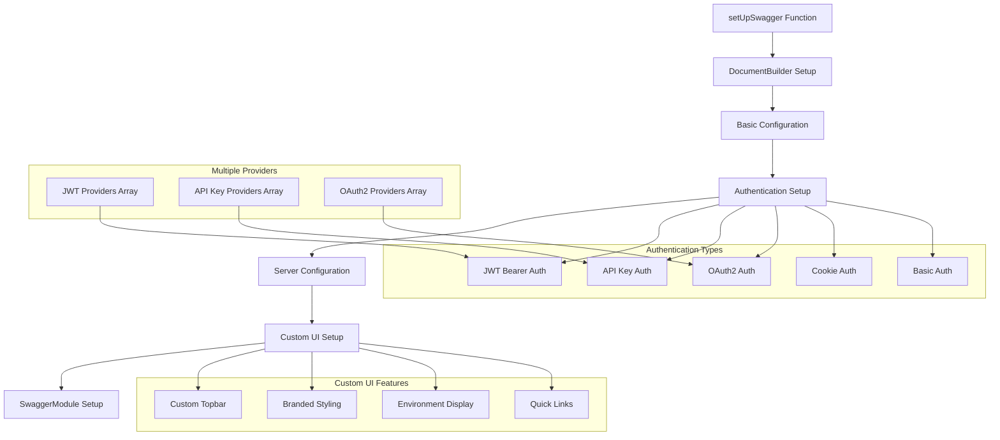
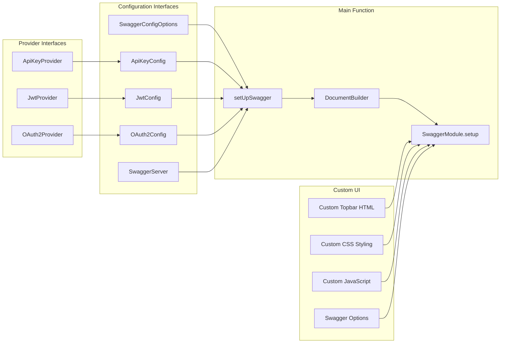

import Tabs from '@theme/Tabs';
import TabItem from '@theme/TabItem';

:::info
Swagger Config module cung cấp hệ thống configuration hoàn chỉnh để setup Swagger documentation cho NestJS applications, bao gồm multiple authentication providers, custom UI, và server configuration.
:::

### Tổng quan

- **Mục tiêu**: Tự động hóa việc setup Swagger documentation với configuration linh hoạt và comprehensive
- **Điểm nổi bật**:
    - **Multiple Authentication Providers**: JWT, OAuth2, API Key với multiple providers
    - **Custom UI**: Branded topbar với custom styling và navigation
    - **Server Configuration**: Hỗ trợ multiple servers/hosts
    - **Flexible Configuration**: Backward compatibility với single provider setup
    - **Enhanced UX**: Custom CSS, fonts, và interactive elements
    - **Production Ready**: Environment-aware configuration

### Cách hoạt động



### Kiến trúc Module



## 1. Core Configuration

### SwaggerConfigOptions

| Option        | Type               | Required | Mô tả                                |
| ------------- | ------------------ | -------- | ------------------------------------ |
| `title`       | `string`           | ✅       | API title                            |
| `description` | `string`           | ✅       | API description                      |
| `version`     | `string`           | ✅       | API version                          |
| `nodeEnv`     | `string`           | ✅       | Node environment                     |
| `port`        | `number \| string` | ✅       | Application port                     |
| `apiKey`      | `ApiKeyConfig`     | ❌       | API key authentication configuration |
| `jwt`         | `JwtConfig`        | ❌       | JWT authentication configuration     |
| `oauth2`      | `OAuth2Config`     | ❌       | OAuth2 authentication configuration  |
| `servers`     | `SwaggerServer[]`  | ❌       | Available servers configuration      |

## 2. Authentication Configuration

### 2.1 API Key Authentication

#### ApiKeyConfig Interface

| Property      | Type                              | Mô tả                                    |
| ------------- | --------------------------------- | ---------------------------------------- |
| `keyName`     | `string`                          | Fallback key name cho single provider    |
| `in`          | `'cookie' \| 'header' \| 'query'` | Fallback location cho single provider    |
| `description` | `string`                          | Fallback description cho single provider |
| `providers`   | `ApiKeyProvider[]`                | Array các API key providers              |

#### ApiKeyProvider Interface

| Property      | Type                              | Required | Mô tả                |
| ------------- | --------------------------------- | -------- | -------------------- |
| `name`        | `string`                          | ✅       | Tên provider         |
| `keyName`     | `string`                          | ✅       | Tên key parameter    |
| `in`          | `'cookie' \| 'header' \| 'query'` | ✅       | Location của API key |
| `description` | `string`                          | ❌       | Mô tả provider       |

#### Usage Examples

<Tabs>
  <TabItem value="single" label="Single Provider">

```ts
const swaggerConfig: SwaggerConfigOptions = {
    title: 'My API',
    description: 'API documentation',
    version: '1.0.0',
    nodeEnv: 'development',
    port: 3000,
    apiKey: {
        keyName: 'X-API-Key',
        in: 'header',
        description: 'API Key for authentication',
    },
};
```

  </TabItem>
  <TabItem value="multiple" label="Multiple Providers">

```ts
const swaggerConfig: SwaggerConfigOptions = {
    title: 'My API',
    description: 'API documentation',
    version: '1.0.0',
    nodeEnv: 'development',
    port: 3000,
    apiKey: {
        providers: [
            {
                name: 'primary-key',
                keyName: 'X-API-Key',
                in: 'header',
                description: 'Primary API key for main services',
            },
            {
                name: 'secondary-key',
                keyName: 'X-Secondary-Key',
                in: 'query',
                description: 'Secondary API key for limited access',
            },
        ],
    },
};
```

  </TabItem>
</Tabs>

### 2.2 JWT Authentication

#### JwtConfig Interface

| Property       | Type            | Mô tả                                      |
| -------------- | --------------- | ------------------------------------------ |
| `bearerFormat` | `string`        | Fallback bearer format cho single provider |
| `description`  | `string`        | Fallback description cho single provider   |
| `providers`    | `JwtProvider[]` | Array các JWT providers                    |

#### JwtProvider Interface

| Property       | Type     | Required | Mô tả               |
| -------------- | -------- | -------- | ------------------- |
| `name`         | `string` | ✅       | Tên provider        |
| `bearerFormat` | `string` | ❌       | Bearer token format |
| `description`  | `string` | ❌       | Mô tả provider      |

#### Usage Examples

<Tabs>
  <TabItem value="single" label="Single Provider">

```ts
const swaggerConfig: SwaggerConfigOptions = {
    title: 'My API',
    description: 'API documentation',
    version: '1.0.0',
    nodeEnv: 'development',
    port: 3000,
    jwt: {
        bearerFormat: 'JWT',
        description: 'JWT access token',
    },
};
```

  </TabItem>
  <TabItem value="multiple" label="Multiple Providers">

```ts
const swaggerConfig: SwaggerConfigOptions = {
    title: 'My API',
    description: 'API documentation',
    version: '1.0.0',
    nodeEnv: 'development',
    port: 3000,
    jwt: {
        providers: [
            {
                name: 'access-token',
                bearerFormat: 'JWT',
                description: 'JWT access token for API access',
            },
            {
                name: 'refresh-token',
                bearerFormat: 'JWT',
                description: 'JWT refresh token for token renewal',
            },
        ],
    },
};
```

  </TabItem>
</Tabs>

### 2.3 OAuth2 Authentication

#### OAuth2Config Interface

| Property           | Type                     | Mô tả                      |
| ------------------ | ------------------------ | -------------------------- |
| `authorizationUrl` | `string`                 | Fallback authorization URL |
| `tokenUrl`         | `string`                 | Fallback token URL         |
| `scopes`           | `Record<string, string>` | Fallback scopes            |
| `description`      | `string`                 | Fallback description       |
| `providers`        | `OAuth2Provider[]`       | Array các OAuth2 providers |

#### OAuth2Provider Interface

| Property           | Type                     | Required | Mô tả                    |
| ------------------ | ------------------------ | -------- | ------------------------ |
| `name`             | `string`                 | ✅       | Tên provider             |
| `authorizationUrl` | `string`                 | ✅       | OAuth2 authorization URL |
| `tokenUrl`         | `string`                 | ✅       | OAuth2 token URL         |
| `scopes`           | `Record<string, string>` | ✅       | Available OAuth2 scopes  |
| `description`      | `string`                 | ❌       | Mô tả provider           |

#### Usage Examples

<Tabs>
  <TabItem value="single" label="Single Provider">

```ts
const swaggerConfig: SwaggerConfigOptions = {
    title: 'My API',
    description: 'API documentation',
    version: '1.0.0',
    nodeEnv: 'development',
    port: 3000,
    oauth2: {
        authorizationUrl: 'https://example.com/oauth/authorize',
        tokenUrl: 'https://example.com/oauth/token',
        scopes: {
            read: 'Read access',
            write: 'Write access',
            'user:read': 'Read user data',
            'user:write': 'Write user data',
        },
    },
};
```

  </TabItem>
  <TabItem value="multiple" label="Multiple Providers">

```ts
const swaggerConfig: SwaggerConfigOptions = {
    title: 'My API',
    description: 'API documentation',
    version: '1.0.0',
    nodeEnv: 'development',
    port: 3000,
    oauth2: {
        providers: [
            {
                name: 'google',
                authorizationUrl: 'https://accounts.google.com/oauth/authorize',
                tokenUrl: 'https://oauth2.googleapis.com/token',
                scopes: {
                    'https://www.googleapis.com/auth/userinfo.profile': 'View profile',
                    'https://www.googleapis.com/auth/userinfo.email': 'View email',
                },
            },
            {
                name: 'github',
                authorizationUrl: 'https://github.com/login/oauth/authorize',
                tokenUrl: 'https://github.com/login/oauth/access_token',
                scopes: {
                    'read:user': 'Read user data',
                    'user:email': 'Access user email',
                },
            },
        ],
    },
};
```

  </TabItem>
</Tabs>

## 3. Server Configuration

### SwaggerServer Interface

| Property      | Type     | Required | Mô tả        |
| ------------- | -------- | -------- | ------------ |
| `url`         | `string` | ✅       | Server URL   |
| `description` | `string` | ❌       | Mô tả server |

### Usage Examples

```ts
const swaggerConfig: SwaggerConfigOptions = {
    title: 'My API',
    description: 'API documentation',
    version: '1.0.0',
    nodeEnv: 'development',
    port: 3000,
    servers: [
        {
            url: 'http://localhost:3000',
            description: 'Local Development',
        },
        {
            url: 'https://staging-api.example.com',
            description: 'Staging Environment',
        },
        {
            url: 'https://api.example.com',
            description: 'Production Environment',
        },
    ],
};
```

## 4. Custom UI Features

### 4.1 Custom Topbar

```ts
const topbarHtml = `
  <div id="ecom-topbar" role="banner">
    <div class="ecom-topbar-inner">
      <div class="left">
        <span class="logo" aria-hidden="true">
          <svg width="20" height="20" viewBox="0 0 24 24" fill="none" stroke="#60a5fa" stroke-width="2" stroke-linecap="round" stroke-linejoin="round">
            <circle cx="9" cy="21" r="1"></circle>
            <circle cx="20" cy="21" r="1"></circle>
            <path d="M1 1h4l2.68 12.39a2 2 0 0 0 2 1.61h9.72a2 2 0 0 0 2-1.61L23 6H6"></path>
          </svg>
        </span>
        <span class="title">${title}</span>
        <span class="env">(${nodeEnv})</span>
      </div>
      <div class="right">
        <a class="link" href="/docs-json" target="_blank" rel="noreferrer">OpenAPI JSON</a>
        <a class="link" href="/docs-yaml" target="_blank" rel="noreferrer">OpenAPI YAML</a>
        <a class="link" href="/api" target="_blank" rel="noreferrer">API Prefix</a>
      </div>
    </div>
  </div>`;
```

### 4.2 Custom CSS Styling

```ts
const customCss = `
  .swagger-ui .topbar { display: none; }
  #ecom-topbar, #ecom-topbar * { 
    font-family: 'Inter', ui-sans-serif, system-ui, -apple-system, Segoe UI, Roboto, Helvetica, Arial; 
  }
  #ecom-topbar { 
    position: sticky; 
    top: 0; 
    z-index: 100; 
    color: #e5e7eb; 
    background: linear-gradient(90deg, #0b1220 0%, #111827 100%); 
    backdrop-filter: saturate(160%) blur(8px); 
    border-bottom: 1px solid rgba(255,255,255,.08); 
  }
  #ecom-topbar .ecom-topbar-inner { 
    max-width: 1200px; 
    margin: 0 auto; 
    padding: 12px 18px; 
    display: flex; 
    align-items: center; 
    justify-content: space-between; 
  }
  #ecom-topbar .left { 
    display:flex; 
    align-items:center; 
    gap:10px; 
  }
  #ecom-topbar .logo { 
    display:inline-flex; 
    width:20px; 
    height:20px; 
  }
  #ecom-topbar .title { 
    font-weight: 700; 
    letter-spacing: .3px; 
    color:#fff; 
  }
  #ecom-topbar .env { 
    color:#9ca3af; 
    font-size: 12px; 
    margin-left: 4px; 
  }
  #ecom-topbar .right { 
    display:flex; 
    align-items:center; 
    gap:16px; 
  }
  #ecom-topbar .right .link { 
    color: #60a5fa; 
    text-decoration: none; 
    font-weight:600; 
  }
  #ecom-topbar .right .link:hover { 
    color:#93c5fd; 
    text-decoration: underline; 
  }
`;
```

### 4.3 Swagger Options

```ts
const swaggerOptions = {
    displayRequestDuration: true, // Hiển thị request duration
    docExpansion: 'list', // Expand documentation sections
    filter: true, // Enable search filter
    operationsSorter: 'alpha', // Sort operations alphabetically
    persistAuthorization: true, // Persist authorization across sessions
    tagsSorter: 'alpha', // Sort tags alphabetically
};
```

## 5. Complete Setup Example

### 5.1 Main Application Setup

```ts
// main.ts
import { NestFactory } from '@nestjs/core';
import { AppModule } from './app.module';
import { setUpSwagger } from '@ecom-co/utils';

async function bootstrap() {
    const app = await NestFactory.create(AppModule);

    // Setup Swagger documentation
    setUpSwagger(app, {
        title: 'Ecom API',
        description: 'Comprehensive e-commerce API with authentication, user management, and product catalog',
        version: '1.0.0',
        nodeEnv: process.env.NODE_ENV || 'development',
        port: process.env.PORT || 3000,
        apiKey: {
            providers: [
                {
                    name: 'internal-api',
                    keyName: 'X-Internal-Key',
                    in: 'header',
                    description: 'Internal API key for service-to-service communication',
                },
                {
                    name: 'partner-api',
                    keyName: 'X-Partner-Key',
                    in: 'header',
                    description: 'Partner API key for third-party integrations',
                },
            ],
        },
        jwt: {
            providers: [
                {
                    name: 'access-token',
                    bearerFormat: 'JWT',
                    description: 'JWT access token for authenticated API access',
                },
                {
                    name: 'refresh-token',
                    bearerFormat: 'JWT',
                    description: 'JWT refresh token for token renewal',
                },
            ],
        },
        oauth2: {
            providers: [
                {
                    name: 'google',
                    authorizationUrl: 'https://accounts.google.com/oauth/authorize',
                    tokenUrl: 'https://oauth2.googleapis.com/token',
                    scopes: {
                        'https://www.googleapis.com/auth/userinfo.profile': 'View profile information',
                        'https://www.googleapis.com/auth/userinfo.email': 'View email address',
                    },
                },
                {
                    name: 'facebook',
                    authorizationUrl: 'https://www.facebook.com/v12.0/dialog/oauth',
                    tokenUrl: 'https://graph.facebook.com/v12.0/oauth/access_token',
                    scopes: {
                        email: 'Access email address',
                        public_profile: 'Access public profile information',
                    },
                },
            ],
        },
        servers: [
            {
                url: 'http://localhost:3000',
                description: 'Local Development Server',
            },
            {
                url: 'https://staging-api.ecom.com',
                description: 'Staging Environment',
            },
            {
                url: 'https://api.ecom.com',
                description: 'Production Environment',
            },
        ],
    });

    await app.listen(process.env.PORT || 3000);
}

bootstrap();
```

### 5.2 Environment-Specific Configuration

```ts
// config/swagger.config.ts
export const getSwaggerConfig = (): SwaggerConfigOptions => {
    const isProduction = process.env.NODE_ENV === 'production';
    const isStaging = process.env.NODE_ENV === 'staging';

    const baseConfig = {
        title: 'Ecom API',
        description: 'Comprehensive e-commerce API',
        version: process.env.API_VERSION || '1.0.0',
        nodeEnv: process.env.NODE_ENV || 'development',
        port: process.env.PORT || 3000,
    };

    if (isProduction) {
        return {
            ...baseConfig,
            servers: [
                {
                    url: 'https://api.ecom.com',
                    description: 'Production Environment',
                },
            ],
            // Minimal auth config for production
            jwt: {
                providers: [
                    {
                        name: 'access-token',
                        bearerFormat: 'JWT',
                        description: 'JWT access token',
                    },
                ],
            },
        };
    }

    if (isStaging) {
        return {
            ...baseConfig,
            servers: [
                {
                    url: 'https://staging-api.ecom.com',
                    description: 'Staging Environment',
                },
            ],
            // Full auth config for staging
            apiKey: {
                providers: [
                    {
                        name: 'staging-key',
                        keyName: 'X-Staging-Key',
                        in: 'header',
                        description: 'Staging API key',
                    },
                ],
            },
            jwt: {
                providers: [
                    {
                        name: 'access-token',
                        bearerFormat: 'JWT',
                        description: 'JWT access token',
                    },
                    {
                        name: 'refresh-token',
                        bearerFormat: 'JWT',
                        description: 'JWT refresh token',
                    },
                ],
            },
        };
    }

    // Development config
    return {
        ...baseConfig,
        servers: [
            {
                url: 'http://localhost:3000',
                description: 'Local Development Server',
            },
        ],
        // Full auth config for development
        apiKey: {
            providers: [
                {
                    name: 'dev-key',
                    keyName: 'X-Dev-Key',
                    in: 'header',
                    description: 'Development API key',
                },
            ],
        },
        jwt: {
            providers: [
                {
                    name: 'access-token',
                    bearerFormat: 'JWT',
                    description: 'JWT access token',
                },
                {
                    name: 'refresh-token',
                    bearerFormat: 'JWT',
                    description: 'JWT refresh token',
                },
            ],
        },
        oauth2: {
            providers: [
                {
                    name: 'google',
                    authorizationUrl: 'https://accounts.google.com/oauth/authorize',
                    tokenUrl: 'https://oauth2.googleapis.com/token',
                    scopes: {
                        'https://www.googleapis.com/auth/userinfo.profile': 'View profile',
                        'https://www.googleapis.com/auth/userinfo.email': 'View email',
                    },
                },
            ],
        },
    };
};
```

## 6. Best Practices

### 6.1 Authentication Configuration

- **Use multiple providers** khi cần support nhiều authentication methods
- **Environment-specific configs** để optimize cho từng môi trường
- **Descriptive names** cho providers để dễ dàng identify
- **Consistent scopes** cho OAuth2 providers

### 6.2 Server Configuration

- **Environment-aware servers** để developers biết đang test ở đâu
- **Descriptive server names** để dễ dàng identify environment
- **Local development server** luôn có sẵn cho development

### 6.3 Custom UI

- **Branded topbar** để maintain brand identity
- **Environment indicator** để developers biết đang ở môi trường nào
- **Quick access links** cho OpenAPI specs và API prefix
- **Responsive design** cho mobile devices

## 7. Troubleshooting

### Common Issues

**Issue 1: Authentication không hiển thị trong Swagger UI**

```bash
# Error: Authentication schemes không được apply
```

**Solution**: Kiểm tra configuration và đảm bảo providers được định nghĩa đúng:

```ts
// Đảm bảo providers array được định nghĩa
jwt: {
    providers: [
        {
            name: 'access-token', // Tên phải unique
            bearerFormat: 'JWT',
            description: 'JWT access token',
        },
    ];
}
```

**Issue 2: Custom UI không được apply**

```bash
# Error: Custom topbar không hiển thị
```

**Solution**: Kiểm tra custom options và CSS:

```ts
const customOptions: SwaggerCustomOptions = {
    customCss: customCss,
    customJsStr: customJsStr,
    customSiteTitle: `${title} Docs`,
};
```

**Issue 3: Multiple servers không hoạt động**

```bash
# Error: Chỉ local server được hiển thị
```

**Solution**: Đảm bảo servers array được định nghĩa đúng:

```ts
servers: [
    {
        url: 'http://localhost:3000',
        description: 'Local Development',
    },
    {
        url: 'https://staging-api.example.com',
        description: 'Staging Environment',
    },
];
```

:::tip
Luôn sử dụng environment variables để configure servers và authentication providers cho các môi trường khác nhau.
:::

:::warning
Không expose sensitive information như OAuth2 URLs hoặc scopes trong production environment nếu không cần thiết.
:::

:::danger
Custom UI có thể conflict với Swagger UI updates. Hãy test kỹ lưỡng sau mỗi lần update Swagger dependencies.
:::

## 8. Integration Examples

### 8.1 với Configuration Module

```ts
// config/swagger.config.ts
import { ConfigService } from '@nestjs/config';

export const getSwaggerConfig = (configService: ConfigService): SwaggerConfigOptions => {
    return {
        title: configService.get('API_TITLE'),
        description: configService.get('API_DESCRIPTION'),
        version: configService.get('API_VERSION'),
        nodeEnv: configService.get('NODE_ENV'),
        port: configService.get('PORT'),
        jwt: {
            providers: [
                {
                    name: 'access-token',
                    bearerFormat: 'JWT',
                    description: 'JWT access token',
                },
            ],
        },
    };
};

// main.ts
const configService = app.get(ConfigService);
const swaggerConfig = getSwaggerConfig(configService);
setUpSwagger(app, swaggerConfig);
```

### 8.2 với Environment Variables

```ts
// .env
API_TITLE=Ecom API
API_DESCRIPTION=Comprehensive e-commerce API
API_VERSION=1.0.0
NODE_ENV=development
PORT=3000

# JWT Configuration
JWT_ACCESS_TOKEN_NAME=access-token
JWT_REFRESH_TOKEN_NAME=refresh-token

# OAuth2 Configuration
GOOGLE_AUTH_URL=https://accounts.google.com/oauth/authorize
GOOGLE_TOKEN_URL=https://oauth2.googleapis.com/token

# Server Configuration
STAGING_API_URL=https://staging-api.ecom.com
PRODUCTION_API_URL=https://api.ecom.com
```

### 8.3 với Dynamic Configuration

```ts
// config/swagger.config.ts
export const createSwaggerConfig = (env: string): SwaggerConfigOptions => {
    const baseConfig = {
        title: 'Ecom API',
        description: 'Comprehensive e-commerce API',
        version: '1.0.0',
        nodeEnv: env,
        port: 3000,
    };

    switch (env) {
        case 'production':
            return {
                ...baseConfig,
                servers: [{ url: 'https://api.ecom.com', description: 'Production' }],
            };
        case 'staging':
            return {
                ...baseConfig,
                servers: [{ url: 'https://staging-api.ecom.com', description: 'Staging' }],
            };
        default:
            return {
                ...baseConfig,
                servers: [{ url: 'http://localhost:3000', description: 'Local Development' }],
            };
    }
};
```
