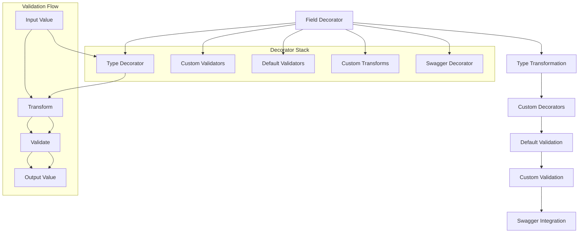
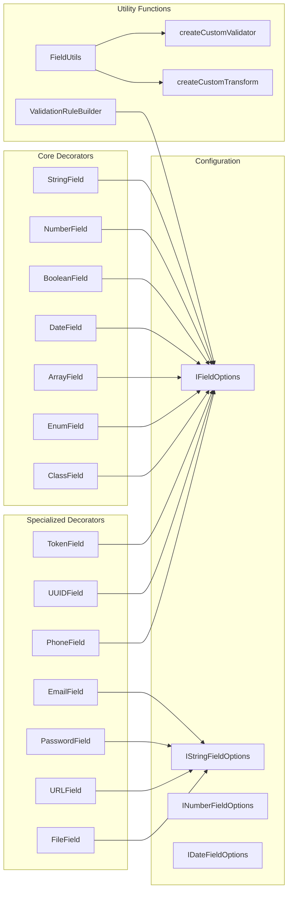

import Tabs from '@theme/Tabs';
import TabItem from '@theme/TabItem';

:::info
Validate Decorator module cung cấp hệ thống validation decorators mạnh mẽ và linh hoạt, tích hợp hoàn hảo với class-validator, class-transformer, và Swagger để tạo ra validation system toàn diện cho DTOs.
:::

### Tổng quan

- **Mục tiêu**: Cung cấp hệ thống validation decorators comprehensive với khả năng customize cao và tích hợp Swagger
- **Điểm nổi bật**:
    - **Enhanced Field Decorators**: String, Number, Boolean, Date, Array, Enum với validation nâng cao
    - **Custom Validators & Transforms**: Tạo custom validation rules và transformation logic
    - **Flexible Configuration**: Messages object, conditional validation, và skip default validation
    - **Swagger Integration**: Tự động generate API documentation với validation rules
    - **Transformation Support**: Trim, toLowerCase, toUpperCase, và custom transforms
    - **Advanced Features**: Conditional fields, flexible field factory, và validation rule builder

### Cách hoạt động



### Kiến trúc Module



## 1. Core Field Decorators

### 1.1 StringField

#### IStringFieldOptions Interface

| Property                | Type                                                                                                                | Default | Mô tả                            |
| ----------------------- | ------------------------------------------------------------------------------------------------------------------- | ------- | -------------------------------- |
| `minLength`             | `number`                                                                                                            | `1`     | Độ dài tối thiểu                 |
| `maxLength`             | `number`                                                                                                            | -       | Độ dài tối đa                    |
| `pattern`               | `RegExp`                                                                                                            | -       | Regex pattern validation         |
| `format`                | `'alphanumeric' \| 'base64' \| 'email' \| 'hexColor' \| 'ip' \| 'json' \| 'password' \| 'phone' \| 'url' \| 'uuid'` | -       | Format validation                |
| `trim`                  | `boolean`                                                                                                           | `true`  | Tự động trim whitespace          |
| `toLowerCase`           | `boolean`                                                                                                           | `false` | Chuyển thành lowercase           |
| `toUpperCase`           | `boolean`                                                                                                           | `false` | Chuyển thành uppercase           |
| `skipLengthValidation`  | `boolean`                                                                                                           | `false` | Bỏ qua length validation         |
| `messages`              | `StringFieldMessages`                                                                                               | -       | Custom error messages            |
| `customValidators`      | `PropertyDecorator[]`                                                                                               | -       | Custom validation decorators     |
| `customTransforms`      | `PropertyDecorator[]`                                                                                               | -       | Custom transformation decorators |
| `skipDefaultValidation` | `boolean`                                                                                                           | `false` | Bỏ qua default validation        |

#### StringFieldMessages Interface

| Property     | Type     | Mô tả                             |
| ------------ | -------- | --------------------------------- |
| `required`   | `string` | Message khi field bị thiếu        |
| `invalid`    | `string` | Message khi value không hợp lệ    |
| `minLength`  | `string` | Message khi độ dài quá ngắn       |
| `maxLength`  | `string` | Message khi độ dài quá dài        |
| `pattern`    | `string` | Message khi không match pattern   |
| `email`      | `string` | Message khi email không hợp lệ    |
| `url`        | `string` | Message khi URL không hợp lệ      |
| `uuid`       | `string` | Message khi UUID không hợp lệ     |
| `phone`      | `string` | Message khi phone không hợp lệ    |
| `format`     | `string` | Message khi format không hợp lệ   |
| `isPassword` | `string` | Message khi password không hợp lệ |

#### Usage Examples

<Tabs>
  <TabItem value="basic" label="Basic Usage">

```ts
export class UserDto {
    @StringField({
        minLength: 2,
        maxLength: 50,
        trim: true,
        messages: {
            required: 'Tên là bắt buộc',
            minLength: 'Tên phải có ít nhất {minLength} ký tự',
            maxLength: 'Tên không được vượt quá {maxLength} ký tự',
        },
    })
    name: string;
}
```

  </TabItem>
  <TabItem value="format" label="Format Validation">

```ts
export class ContactDto {
    @StringField({
        format: 'email',
        toLowerCase: true,
        trim: true,
        messages: {
            required: 'Email là bắt buộc',
            email: 'Email không đúng định dạng',
        },
    })
    email: string;

    @StringField({
        format: 'phone',
        pattern: /^(0|\+84)[3-9]\d{8}$/,
        messages: {
            required: 'Số điện thoại là bắt buộc',
            phone: 'Số điện thoại không đúng định dạng Việt Nam',
        },
    })
    phone: string;
}
```

  </TabItem>
  <TabItem value="custom" label="Custom Validation">

```ts
export class CustomDto {
    @StringField({
        minLength: 8,
        pattern: /^(?=.*[a-z])(?=.*[A-Z])(?=.*\d)/,
        customValidators: [
            FieldUtils.createCustomValidator(
                'isStrongPassword',
                (value: string) => {
                    return /^(?=.*[a-z])(?=.*[A-Z])(?=.*\d)(?=.*[@$!%*?&])[A-Za-z\d@$!%*?&]/.test(value);
                },
                'Mật khẩu phải chứa ít nhất 1 chữ hoa, 1 chữ thường, 1 số và 1 ký tự đặc biệt',
            ),
        ],
        messages: {
            required: 'Mật khẩu là bắt buộc',
            pattern: 'Mật khẩu phải chứa ít nhất 1 chữ hoa, 1 chữ thường và 1 số',
        },
    })
    password: string;
}
```

  </TabItem>
</Tabs>

### 1.2 NumberField

#### INumberFieldOptions Interface

| Property        | Type                  | Default | Mô tả                     |
| --------------- | --------------------- | ------- | ------------------------- |
| `min`           | `number`              | -       | Giá trị tối thiểu         |
| `max`           | `number`              | -       | Giá trị tối đa            |
| `int`           | `boolean`             | `false` | Bắt buộc là số nguyên     |
| `isPositive`    | `boolean`             | `false` | Bắt buộc là số dương      |
| `allowInfinity` | `boolean`             | `false` | Cho phép giá trị infinity |
| `allowNaN`      | `boolean`             | `false` | Cho phép giá trị NaN      |
| `messages`      | `NumberFieldMessages` | -       | Custom error messages     |

#### NumberFieldMessages Interface

| Property   | Type     | Mô tả                            |
| ---------- | -------- | -------------------------------- |
| `required` | `string` | Message khi field bị thiếu       |
| `invalid`  | `string` | Message khi value không phải số  |
| `min`      | `string` | Message khi giá trị quá nhỏ      |
| `max`      | `string` | Message khi giá trị quá lớn      |
| `int`      | `string` | Message khi không phải số nguyên |
| `positive` | `string` | Message khi không phải số dương  |

#### Usage Examples

<Tabs>
  <TabItem value="basic" label="Basic Usage">

```ts
export class ProductDto {
    @NumberField({
        min: 0,
        max: 1000000,
        int: true,
        messages: {
            required: 'Giá sản phẩm là bắt buộc',
            min: 'Giá không được âm',
            max: 'Giá không được vượt quá 1,000,000',
            int: 'Giá phải là số nguyên',
        },
    })
    price: number;
}
```

  </TabItem>
  <TabItem value="advanced" label="Advanced Usage">

```ts
export class AdvancedDto {
    @NumberField({
        min: 0,
        max: 100,
        isPositive: true,
        customValidators: [
            FieldUtils.createCustomValidator(
                'isPercentage',
                (value: number) => value >= 0 && value <= 100,
                'Giá trị phải từ 0 đến 100',
            ),
        ],
        customTransforms: [FieldUtils.createCustomTransform((value: number) => Math.round(value))],
        messages: {
            required: 'Phần trăm là bắt buộc',
            positive: 'Phần trăm phải là số dương',
        },
    })
    percentage: number;
}
```

  </TabItem>
</Tabs>

### 1.3 BooleanField

#### IBooleanFieldOptions Interface

| Property           | Type                   | Default | Mô tả                            |
| ------------------ | ---------------------- | ------- | -------------------------------- |
| `messages`         | `BooleanFieldMessages` | -       | Custom error messages            |
| `customValidators` | `PropertyDecorator[]`  | -       | Custom validation decorators     |
| `customTransforms` | `PropertyDecorator[]`  | -       | Custom transformation decorators |

#### Usage Examples

```ts
export class SettingsDto {
    @BooleanField({
        messages: {
            required: 'Trạng thái là bắt buộc',
        },
    })
    isActive: boolean;

    @BooleanFieldOptional({
        messages: {
            invalid: 'Giá trị phải là true hoặc false',
        },
    })
    notifications?: boolean;
}
```

### 1.4 DateField

#### IDateFieldOptions Interface

| Property   | Type                | Default | Mô tả                 |
| ---------- | ------------------- | ------- | --------------------- |
| `minDate`  | `Date`              | -       | Ngày tối thiểu        |
| `maxDate`  | `Date`              | -       | Ngày tối đa           |
| `messages` | `DateFieldMessages` | -       | Custom error messages |

#### DateFieldMessages Interface

| Property   | Type     | Mô tả                             |
| ---------- | -------- | --------------------------------- |
| `required` | `string` | Message khi field bị thiếu        |
| `invalid`  | `string` | Message khi value không phải Date |
| `minDate`  | `string` | Message khi ngày quá sớm          |
| `maxDate`  | `string` | Message khi ngày quá muộn         |

#### Usage Examples

```ts
export class EventDto {
    @DateField({
        minDate: new Date(),
        messages: {
            required: 'Ngày sự kiện là bắt buộc',
            minDate: 'Ngày sự kiện phải từ hôm nay trở đi',
        },
    })
    eventDate: Date;

    @DateFieldOptional({
        maxDate: new Date('2025-12-31'),
        messages: {
            maxDate: 'Ngày không được vượt quá năm 2025',
        },
    })
    endDate?: Date;
}
```

### 1.5 ArrayField

#### IArrayFieldOptions Interface

| Property      | Type                 | Default | Mô tả                         |
| ------------- | -------------------- | ------- | ----------------------------- |
| `minSize`     | `number`             | -       | Số lượng item tối thiểu       |
| `maxSize`     | `number`             | -       | Số lượng item tối đa          |
| `uniqueItems` | `boolean`            | `false` | Bắt buộc các item phải unique |
| `messages`    | `ArrayFieldMessages` | -       | Custom error messages         |

#### ArrayFieldMessages Interface

| Property      | Type     | Mô tả                              |
| ------------- | -------- | ---------------------------------- |
| `required`    | `string` | Message khi field bị thiếu         |
| `invalid`     | `string` | Message khi value không phải array |
| `minSize`     | `string` | Message khi số item quá ít         |
| `maxSize`     | `string` | Message khi số item quá nhiều      |
| `uniqueItems` | `string` | Message khi có item trùng lặp      |

#### Usage Examples

```ts
export class OrderDto {
    @ArrayField(() => ProductDto, {
        minSize: 1,
        maxSize: 10,
        uniqueItems: true,
        messages: {
            required: 'Danh sách sản phẩm là bắt buộc',
            minSize: 'Phải có ít nhất 1 sản phẩm',
            maxSize: 'Không được quá 10 sản phẩm',
            uniqueItems: 'Không được có sản phẩm trùng lặp',
        },
    })
    products: ProductDto[];
}
```

### 1.6 EnumField

#### IEnumFieldOptions Interface

| Property   | Type                | Default | Mô tả                              |
| ---------- | ------------------- | ------- | ---------------------------------- |
| `enumName` | `string`            | -       | Tên enum cho Swagger documentation |
| `messages` | `EnumFieldMessages` | -       | Custom error messages              |

#### Usage Examples

```ts
export enum UserRole {
    ADMIN = 'admin',
    USER = 'user',
    MODERATOR = 'moderator',
}

export class UserDto {
    @EnumField(() => UserRole, {
        enumName: 'UserRole',
        messages: {
            required: 'Vai trò là bắt buộc',
        },
    })
    role: UserRole;
}
```

### 1.7 ClassField

#### IClassFieldOptions Interface

| Property   | Type                 | Default | Mô tả                           |
| ---------- | -------------------- | ------- | ------------------------------- |
| `messages` | `ClassFieldMessages` | -       | Custom error messages           |
| `each`     | `boolean`            | `false` | Validate từng item nếu là array |

#### Usage Examples

```ts
export class AddressDto {
    @StringField({ required: true })
    street: string;

    @StringField({ required: true })
    city: string;
}

export class UserDto {
    @ClassField(() => AddressDto, {
        messages: {
            required: 'Địa chỉ là bắt buộc',
        },
    })
    address: AddressDto;

    @ClassField(() => AddressDto, {
        each: true,
        messages: {
            required: 'Danh sách địa chỉ là bắt buộc',
        },
    })
    addresses: AddressDto[];
}
```

## 2. Specialized Field Decorators

### 2.1 EmailField

```ts
export class ContactDto {
    @EmailField({
        toLowerCase: true,
        trim: true,
        messages: {
            required: 'Email là bắt buộc',
        },
    })
    email: string;
}
```

### 2.2 PasswordField

```ts
export class UserDto {
    @PasswordField(/^(?=.*[a-z])(?=.*[A-Z])(?=.*\d)/, {
        minLength: 8,
        messages: {
            required: 'Mật khẩu là bắt buộc',
            minLength: 'Mật khẩu phải có ít nhất 8 ký tự',
        },
    })
    password: string;
}
```

### 2.3 TokenField

```ts
export class AuthDto {
    @TokenField({
        messages: {
            required: 'Access token là bắt buộc',
        },
    })
    accessToken: string;
}
```

### 2.4 UUIDField

```ts
export class EntityDto {
    @UUIDField({
        messages: {
            required: 'ID là bắt buộc',
        },
    })
    id: string;
}
```

### 2.5 URLField

```ts
export class LinkDto {
    @URLField({
        messages: {
            required: 'URL là bắt buộc',
        },
    })
    url: string;
}
```

### 2.6 PhoneField

```ts
export class ContactDto {
    @PhoneField('VN', {
        messages: {
            required: 'Số điện thoại là bắt buộc',
        },
    })
    phone: string;
}
```

### 2.7 FileField

#### IFileFieldOptions Interface

| Property    | Type       | Default | Mô tả                          |
| ----------- | ---------- | ------- | ------------------------------ |
| `maxSize`   | `number`   | -       | Kích thước file tối đa (bytes) |
| `maxFiles`  | `number`   | -       | Số lượng file tối đa           |
| `mimeTypes` | `string[]` | -       | Các loại MIME được phép        |

#### Usage Examples

```ts
export class UploadDto {
    @FileField({
        maxSize: 5 * 1024 * 1024, // 5MB
        mimeTypes: ['image/jpeg', 'image/png', 'image/gif'],
        messages: {
            required: 'File là bắt buộc',
        },
    })
    avatar: Express.Multer.File;
}
```

### 2.8 GeoField

#### IGeoFieldOptions Interface

| Property    | Type      | Default | Mô tả                            |
| ----------- | --------- | ------- | -------------------------------- |
| `latitude`  | `boolean` | `false` | Validate latitude (-90 to 90)    |
| `longitude` | `boolean` | `false` | Validate longitude (-180 to 180) |

#### Usage Examples

```ts
export class LocationDto {
    @GeoField({
        latitude: true,
        messages: {
            required: 'Vĩ độ là bắt buộc',
        },
    })
    latitude: number;

    @GeoField({
        longitude: true,
        messages: {
            required: 'Kinh độ là bắt buộc',
        },
    })
    longitude: number;
}
```

### 2.9 CreditCardField

```ts
export class PaymentDto {
    @CreditCardField({
        messages: {
            required: 'Số thẻ tín dụng là bắt buộc',
        },
    })
    cardNumber: string;
}
```

### 2.10 CurrencyField

```ts
export class TransactionDto {
    @CurrencyField({
        min: 0,
        messages: {
            required: 'Số tiền là bắt buộc',
            min: 'Số tiền không được âm',
        },
    })
    amount: number;
}
```

## 3. Utility Functions

### 3.1 FieldUtils

#### createCustomValidator

```ts
const isVietnamesePhoneNumber = FieldUtils.createCustomValidator(
    'isVietnamesePhone',
    (value: string) => /^(0|\+84)[3-9]\d{8}$/.test(value),
    'Số điện thoại không đúng định dạng Việt Nam',
);

export class ContactDto {
    @StringField({
        customValidators: [isVietnamesePhoneNumber],
    })
    phone: string;
}
```

#### createCustomTransform

```ts
const trimAndLowercase = FieldUtils.createCustomTransform((value: string) => value.trim().toLowerCase());

export class UserDto {
    @StringField({
        customTransforms: [trimAndLowercase],
    })
    username: string;
}
```

#### createFlexibleField

```ts
const VietnameseNameField = FieldUtils.createFlexibleField(
    () => String,
    [
        IsString({ message: 'Tên phải là chuỗi ký tự' }),
        Matches(/^[a-zA-ZÀ-ỹ\s]+$/, { message: 'Tên chỉ được chứa chữ cái tiếng Việt' }),
    ],
    { trim: true },
);

export class PersonDto {
    @VietnameseNameField({
        messages: {
            required: 'Họ tên là bắt buộc',
        },
    })
    fullName: string;
}
```

### 3.2 ValidationRuleBuilder

```ts
export class ProductDto {
    @(FieldUtils.ValidationRuleBuilder.create()
        .addValidator(IsString())
        .addValidator(MinLength(3))
        .addTransform(Transform(({ value }) => value?.trim().toLowerCase()))
        .setMessage('required', 'Tên sản phẩm không được để trống')
        .setMessage('minLength', 'Tên sản phẩm phải có ít nhất 3 ký tự')
        .setOption('required', true)
        .apply())
    name: string;
}
```

### 3.3 ConditionalField

```ts
export class UserRegistrationDto {
    @EnumField(() => UserType)
    userType: UserType;

    @ConditionalField(
        (obj: UserRegistrationDto) => obj.userType === UserType.BUSINESS,
        StringField({
            messages: {
                required: 'Mã số thuế là bắt buộc đối với doanh nghiệp',
            },
            pattern: /^\d{10}(-\d{3})?$/,
        }),
    )
    taxCode?: string;

    @ConditionalField(
        (obj: UserRegistrationDto) => obj.userType === UserType.INDIVIDUAL,
        StringField({
            messages: {
                required: 'CMND/CCCD là bắt buộc đối với cá nhân',
            },
            pattern: /^\d{9}|\d{12}$/,
        }),
    )
    idNumber?: string;
}
```

## 4. Advanced Features

### 4.1 Skip Default Validation

```ts
export class CustomDto {
    @StringField({
        skipDefaultValidation: true,
        customValidators: [IsString({ message: 'Phải là chuỗi' }), MinLength(5, { message: 'Tối thiểu 5 ký tự' })],
    })
    customField: string;
}
```

### 4.2 Custom Messages với Placeholders

```ts
export class AdvancedDto {
    @NumberField({
        min: 10000,
        max: 50000000,
        messages: {
            required: 'Số tiền đặt hàng là bắt buộc',
            min: 'Số tiền phải từ {min} VNĐ',
            max: 'Số tiền không được vượt quá {max} VNĐ',
        },
    })
    amount: number;
}
```

### 4.3 Multi-language Support

```ts
const createMessages = (lang: 'vi' | 'en') => {
    const messages = {
        vi: {
            required: 'Trường này là bắt buộc',
            invalid: 'Giá trị không hợp lệ',
            minLength: 'Phải có ít nhất {minLength} ký tự',
        },
        en: {
            required: 'This field is required',
            invalid: 'Invalid value',
            minLength: 'Must be at least {minLength} characters',
        },
    };
    return messages[lang];
};

export class MultiLangDto {
    @StringField({
        messages: createMessages('vi'),
        minLength: 3,
    })
    name: string;
}
```

## 5. Best Practices

### 5.1 Message Organization

- **Sử dụng messages object** thay vì message string để có thể customize từng loại lỗi
- **Tạo message constants** để tái sử dụng và maintain consistency
- **Sử dụng placeholders** để tạo dynamic messages

### 5.2 Validation Strategy

- **Tận dụng ValidationRuleBuilder** cho các validation phức tạp
- **Tạo custom validators** cho business rules cụ thể
- **Sử dụng skipDefaultValidation** khi cần control hoàn toàn validation logic

### 5.3 Performance Optimization

- **Tạo flexible field factories** cho các pattern validation thường dùng
- **Sử dụng conditional validation** thay vì validate tất cả fields
- **Cache custom validators** để tránh tạo lại

### 5.4 Swagger Integration

- **Sử dụng enumName** để hiển thị tên enum trong Swagger
- **Customize API property options** để enhance documentation
- **Sử dụng examples** để provide sample data

## 6. Migration Guide

### Từ version cũ:

```ts
@StringField({ message: 'Tên không hợp lệ' })
name: string;
```

### Sang version mới:

```ts
@StringField({
    messages: {
        required: 'Tên là bắt buộc',
        invalid: 'Tên không hợp lệ',
        minLength: 'Tên quá ngắn'
    }
})
name: string;
```

## 7. Troubleshooting

### Common Issues

**Issue 1: Custom validator không hoạt động**

```bash
# Error: Custom validator không được apply
```

**Solution**: Đảm bảo custom validator được thêm vào `customValidators` array:

```ts
@StringField({
    customValidators: [
        FieldUtils.createCustomValidator(
            'isCustom',
            (value: string) => value.length > 0,
            'Value cannot be empty'
        )
    ]
})
customField: string;
```

**Issue 2: Transformation không được apply**

```bash
# Error: Transform decorator không hoạt động
```

**Solution**: Kiểm tra `customTransforms` array và `transform` function:

```ts
@StringField({
    customTransforms: [
        Transform(({ value }) => value.trim())
    ],
    // Hoặc sử dụng transform function
    transform: (value: string) => value.trim()
})
field: string;
```

**Issue 3: Swagger documentation không hiển thị đúng**

```bash
# Error: API property options không được apply
```

**Solution**: Đảm bảo `swagger` option không bị set thành `false`:

```ts
@StringField({
    swagger: true, // Mặc định là true
    description: 'User name',
    example: 'John Doe'
})
name: string;
```

:::tip
Luôn sử dụng `messages` object thay vì `message` string để có thể customize từng loại validation error một cách linh hoạt.
:::

:::warning
Khi sử dụng `skipDefaultValidation: true`, bạn phải tự handle tất cả validation logic. Hãy đảm bảo coverage đầy đủ.
:::

:::danger
Custom validators có thể ảnh hưởng đến performance nếu logic phức tạp. Hãy optimize và cache khi cần thiết.
:::

## 8. Integration Examples

### 8.1 với Swagger

```ts
export class ApiDto {
    @StringField({
        description: 'User full name',
        example: 'John Doe',
        minLength: 2,
        maxLength: 100,
    })
    name: string;

    @NumberField({
        description: 'User age',
        example: 25,
        min: 0,
        max: 150,
    })
    age: number;
}
```

### 8.2 với Class Transformer

```ts
export class TransformDto {
    @StringField({
        customTransforms: [Transform(({ value }) => value?.toLowerCase()), Transform(({ value }) => value?.trim())],
    })
    normalizedField: string;
}
```

### 8.3 với Validation Groups

```ts
export class GroupedDto {
    @StringField({
        groups: ['create', 'update'],
        messages: {
            required: 'Tên là bắt buộc',
        },
    })
    name: string;

    @StringField({
        groups: ['create'],
        messages: {
            required: 'Mật khẩu chỉ bắt buộc khi tạo mới',
        },
    })
    password: string;
}
```

## 9. Performance Considerations

### 9.1 Decorator Caching

```ts
// Cache custom validators để tránh tạo lại
const cachedValidators = {
    isVietnamesePhone: FieldUtils.createCustomValidator(
        'isVietnamesePhone',
        (value: string) => /^(0|\+84)[3-9]\d{8}$/.test(value),
        'Số điện thoại không đúng định dạng Việt Nam',
    ),
};

export class ContactDto {
    @StringField({
        customValidators: [cachedValidators.isVietnamesePhone],
    })
    phone: string;
}
```

### 9.2 Conditional Validation Optimization

```ts
export class OptimizedDto {
    @BooleanField()
    hasAddress: boolean;

    // Chỉ validate khi cần thiết
    @ConditionalField(
        (obj: OptimizedDto) => obj.hasAddress,
        StringField({
            messages: { required: 'Địa chỉ là bắt buộc' },
        }),
    )
    address?: string;
}
```

## 10. Testing

### 10.1 Unit Testing

```ts
describe('StringField Validation', () => {
    it('should validate required field', () => {
        const dto = new TestDto();
        const errors = validate(dto);

        expect(errors).toHaveLength(1);
        expect(errors[0].constraints?.required).toBe('Tên là bắt buộc');
    });

    it('should validate minLength', () => {
        const dto = new TestDto();
        dto.name = 'a';
        const errors = validate(dto);

        expect(errors).toHaveLength(1);
        expect(errors[0].constraints?.minLength).toBe('Tên phải có ít nhất 2 ký tự');
    });
});
```

### 10.2 Integration Testing

```ts
describe('Validate Decorator Integration', () => {
    it('should work with Swagger', () => {
        const metadata = Reflect.getMetadata('swagger/apiProperties', TestDto.prototype);

        expect(metadata.name).toBeDefined();
        expect(metadata.name.type).toBe('string');
        expect(metadata.name.description).toBe('User name');
    });
});
```

---

**Validate Decorator module** cung cấp một hệ thống validation toàn diện và mạnh mẽ, giúp developers tạo ra DTOs với validation rules phức tạp một cách dễ dàng và maintainable. Với khả năng customize cao, tích hợp Swagger hoàn hảo, và performance optimization, đây là tool không thể thiếu cho bất kỳ NestJS application nào cần robust validation system! 🚀
