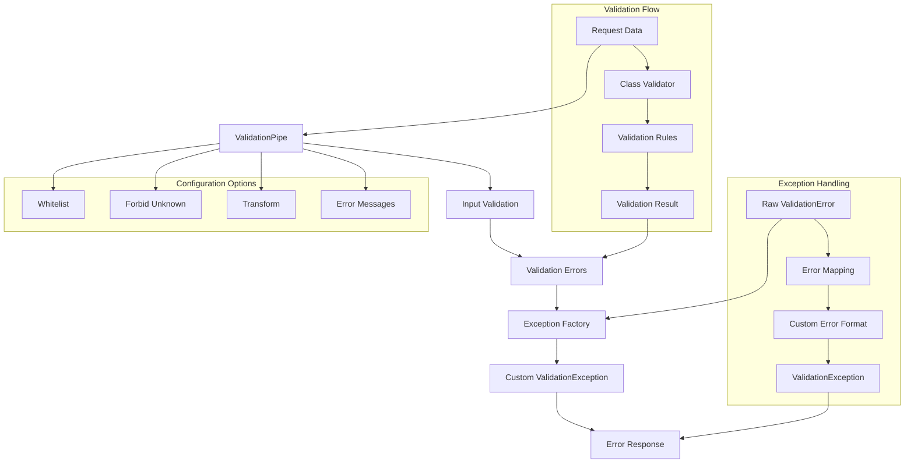
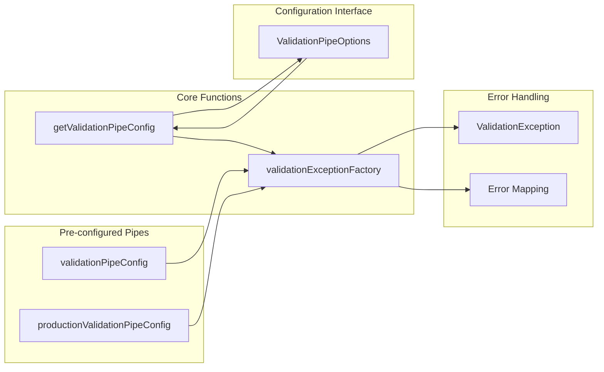

import Tabs from '@theme/Tabs';
import TabItem from '@theme/TabItem';

:::info
Validation Config module cung cấp hệ thống configuration hoàn chỉnh để setup ValidationPipe trong NestJS applications, bao gồm custom exception factory, environment-specific configurations, và flexible validation options.
:::

### Tổng quan

- **Mục tiêu**: Cung cấp centralized validation configuration với custom exception handling và environment-specific settings
- **Điểm nổi bật**:
    - **Custom Exception Factory**: Transform validation errors thành custom ValidationException
    - **Environment-Specific Configs**: Development và production configurations
    - **Flexible Options**: Customizable validation pipe options
    - **Security Features**: Whitelist validation và unknown value prevention
    - **Error Sanitization**: Sanitized error messages cho production
    - **Integration Ready**: Tích hợp hoàn hảo với class-validator và NestJS

### Cách hoạt động



### Kiến trúc Module



## 1. Core Configuration

### 1.1 validationExceptionFactory

#### Function Signature

```ts
export const validationExceptionFactory = (errors: ValidationError[]) => ValidationException;
```

#### Parameters

| Parameter | Type                | Mô tả                                          |
| --------- | ------------------- | ---------------------------------------------- |
| `errors`  | `ValidationError[]` | Array các validation errors từ class-validator |

#### Return Value

| Return Type           | Mô tả                                            |
| --------------------- | ------------------------------------------------ |
| `ValidationException` | Custom validation exception với formatted errors |

#### Error Transformation

```ts
const customErrors = map(errors, (error) => ({
    constraints: error.constraints ? { ...error.constraints } : {},
    property: String(error.property),
    value: error.value as unknown,
}));
```

#### Usage Examples

<Tabs>
  <TabItem value="basic" label="Basic Usage">

```ts
// Sử dụng trực tiếp
const errors = [
    {
        property: 'email',
        constraints: { isEmail: 'Email không hợp lệ' },
        value: 'invalid-email',
    },
];

const exception = validationExceptionFactory(errors);
throw exception;
```

  </TabItem>
  <TabItem value="custom" label="Custom Implementation">

```ts
// Tạo custom exception factory
const customExceptionFactory = (errors: ValidationError[]) => {
    const formattedErrors = errors.map((error) => ({
        field: error.property,
        message: Object.values(error.constraints || {})[0],
        value: error.value,
    }));

    return new ValidationException(formattedErrors);
};

// Sử dụng trong validation pipe
const customPipe = new ValidationPipe({
    exceptionFactory: customExceptionFactory,
});
```

  </TabItem>
</Tabs>

### 1.2 ValidationPipeOptions Interface

#### Interface Definition

```ts
export interface ValidationPipeOptions {
    /** Custom exception factory function */
    customExceptionFactory?: (errors: ValidationError[]) => unknown;
    /** Whether to disable error messages */
    disableErrorMessages?: boolean;
    /** Whether to forbid non-whitelisted properties */
    forbidNonWhitelisted?: boolean;
    /** Whether to forbid unknown values */
    forbidUnknownValues?: boolean;
    /** Whether to enable automatic transformation */
    transform?: boolean;
    /** Whether to enable property whitelisting */
    whitelist?: boolean;
}
```

#### Property Details

| Property                 | Type                                     | Default | Mô tả                                   |
| ------------------------ | ---------------------------------------- | ------- | --------------------------------------- |
| `customExceptionFactory` | `(errors: ValidationError[]) => unknown` | -       | Custom exception factory function       |
| `disableErrorMessages`   | `boolean`                                | `false` | Tắt error messages                      |
| `forbidNonWhitelisted`   | `boolean`                                | `true`  | Cấm properties không có trong whitelist |
| `forbidUnknownValues`    | `boolean`                                | `true`  | Cấm unknown values                      |
| `transform`              | `boolean`                                | `true`  | Bật automatic transformation            |
| `whitelist`              | `boolean`                                | `true`  | Bật property whitelisting               |

## 2. Pre-configured Validation Pipes

### 2.1 validationPipeConfig (Development)

#### Configuration Details

```ts
export const validationPipeConfig = new ValidationPipe({
    disableErrorMessages: false, // Hiển thị error messages
    exceptionFactory: validationExceptionFactory, // Custom exception factory
    forbidNonWhitelisted: true, // Cấm non-whitelisted properties
    forbidUnknownValues: true, // Cấm unknown values
    transform: true, // Bật transformation
    validationError: {
        target: false, // Không hiển thị target object
        value: false, // Không hiển thị invalid values
    },
    whitelist: true, // Bật whitelist validation
});
```

#### Use Cases

- **Development Environment**: Đầy đủ error messages và validation
- **Testing**: Comprehensive validation cho unit tests
- **Debugging**: Detailed error information

#### Security Features

- **Whitelist Validation**: Chỉ cho phép properties được định nghĩa trong DTO
- **Unknown Value Prevention**: Ngăn chặn injection attacks
- **Property Sanitization**: Loại bỏ unexpected properties

### 2.2 productionValidationPipeConfig (Production)

#### Configuration Details

```ts
export const productionValidationPipeConfig = new ValidationPipe({
    disableErrorMessages: false, // Vẫn hiển thị error messages
    exceptionFactory: validationExceptionFactory, // Custom exception factory
    forbidNonWhitelisted: true, // Cấm non-whitelisted properties
    forbidUnknownValues: true, // Cấm unknown values
    transform: true, // Bật transformation
    validationError: {
        target: false, // Không hiển thị target object
        value: false, // Không hiển thị invalid values
    },
    whitelist: true, // Bật whitelist validation
});
```

#### Production Optimizations

- **Error Sanitization**: Loại bỏ sensitive information
- **Performance**: Optimized validation rules
- **Security**: Strict validation policies

## 3. Dynamic Configuration

### 3.1 getValidationPipeConfig Function

#### Function Signature

```ts
export const getValidationPipeConfig = (options: ValidationPipeOptions = {}): ValidationPipe
```

#### Parameters

| Parameter | Type                    | Default | Mô tả                                |
| --------- | ----------------------- | ------- | ------------------------------------ |
| `options` | `ValidationPipeOptions` | `{}`    | Custom validation pipe configuration |

#### Return Value

| Return Type      | Mô tả                               |
| ---------------- | ----------------------------------- |
| `ValidationPipe` | Configured validation pipe instance |

#### Default Values

```ts
const {
    customExceptionFactory,
    disableErrorMessages = false,
    forbidNonWhitelisted = true,
    forbidUnknownValues = true,
    transform = true,
    whitelist = true,
} = options;
```

#### Usage Examples

<Tabs>
  <TabItem value="basic" label="Basic Usage">

```ts
// Sử dụng với default options
const validationPipe = getValidationPipeConfig();

// Sử dụng trong main.ts
app.useGlobalPipes(validationPipe);
```

  </TabItem>
  <TabItem value="custom" label="Custom Options">

```ts
// Custom configuration
const customValidationPipe = getValidationPipeConfig({
    disableErrorMessages: true, // Tắt error messages
    transform: false, // Tắt transformation
    whitelist: false, // Tắt whitelist validation
    customExceptionFactory: (errors) => {
        // Custom error handling logic
        return new CustomValidationException(errors);
    },
});

app.useGlobalPipes(customValidationPipe);
```

  </TabItem>
  <TabItem value="environment" label="Environment-Specific">

```ts
// Environment-based configuration
const getEnvironmentValidationPipe = () => {
    if (process.env.NODE_ENV === 'production') {
        return getValidationPipeConfig({
            disableErrorMessages: true, // Tắt error messages trong production
            forbidNonWhitelisted: true, // Strict validation
            forbidUnknownValues: true, // Cấm unknown values
        });
    }

    // Development configuration
    return getValidationPipeConfig({
        disableErrorMessages: false, // Hiển thị error messages
        transform: true, // Bật transformation
        whitelist: true, // Bật whitelist validation
    });
};

const validationPipe = getEnvironmentValidationPipe();
app.useGlobalPipes(validationPipe);
```

  </TabItem>
</Tabs>

## 4. Integration Examples

### 4.1 Main Application Setup

```ts
// main.ts
import { NestFactory } from '@nestjs/core';
import { AppModule } from './app.module';
import { getValidationPipeConfig } from '@ecom-co/utils';

async function bootstrap() {
    const app = await NestFactory.create(AppModule);

    // Setup validation pipe
    const validationPipe = getValidationPipeConfig({
        disableErrorMessages: process.env.NODE_ENV === 'production',
        transform: true,
        whitelist: true,
        forbidNonWhitelisted: true,
        forbidUnknownValues: true,
    });

    app.useGlobalPipes(validationPipe);

    await app.listen(3000);
}

bootstrap();
```

### 4.2 Module-Level Configuration

```ts
// app.module.ts
import { Module } from '@nestjs/common';
import { APP_PIPE } from '@nestjs/core';
import { getValidationPipeConfig } from '@ecom-co/utils';

@Module({
    providers: [
        {
            provide: APP_PIPE,
            useFactory: () =>
                getValidationPipeConfig({
                    transform: true,
                    whitelist: true,
                }),
        },
    ],
})
export class AppModule {}
```

### 4.3 Controller-Level Configuration

```ts
// user.controller.ts
import { Controller, Post, Body, UsePipes } from '@nestjs/common';
import { ValidationPipe } from '@nestjs/common';
import { getValidationPipeConfig } from '@ecom-co/utils';
import { CreateUserDto } from './dto/create-user.dto';

@Controller('users')
export class UserController {
    @Post()
    @UsePipes(
        getValidationPipeConfig({
            transform: true,
            whitelist: true,
            forbidNonWhitelisted: true,
        }),
    )
    async createUser(@Body() createUserDto: CreateUserDto) {
        // Validation pipe sẽ validate và transform data
        return this.userService.create(createUserDto);
    }
}
```

### 4.4 Method-Level Configuration

```ts
// product.controller.ts
import { Controller, Post, Body, UsePipes } from '@nestjs/common';
import { getValidationPipeConfig } from '@ecom-co/utils';
import { CreateProductDto } from './dto/create-product.dto';

@Controller('products')
export class ProductController {
    @Post()
    @UsePipes(
        getValidationPipeConfig({
            transform: true,
            whitelist: true,
            forbidNonWhitelisted: true,
            customExceptionFactory: (errors) => {
                // Custom error handling cho product creation
                return new ProductValidationException(errors);
            },
        }),
    )
    async createProduct(@Body() createProductDto: CreateProductDto) {
        return this.productService.create(createProductDto);
    }
}
```

## 5. Error Handling

### 5.1 ValidationException Structure

```ts
// Error response structure
{
    "statusCode": 400,
    "message": "Validation failed",
    "errors": [
        {
            "constraints": {
                "isEmail": "Email không hợp lệ"
            },
            "property": "email",
            "value": "invalid-email"
        },
        {
            "constraints": {
                "minLength": "Tên phải có ít nhất 2 ký tự"
            },
            "property": "name",
            "value": "a"
        }
    ]
}
```

### 5.2 Custom Error Handling

```ts
// Custom exception factory với detailed logging
const detailedExceptionFactory = (errors: ValidationError[]) => {
    // Log validation errors cho debugging
    console.log('Validation Errors:', JSON.stringify(errors, null, 2));

    // Transform errors thành user-friendly format
    const userErrors = errors.map((error) => ({
        field: error.property,
        message: Object.values(error.constraints || {})[0],
        code: `VALIDATION_${error.property.toUpperCase()}_FAILED`,
    }));

    return new ValidationException(userErrors);
};

// Sử dụng trong validation pipe
const detailedValidationPipe = getValidationPipeConfig({
    customExceptionFactory: detailedExceptionFactory,
});
```

### 5.3 Error Response Customization

```ts
// Custom error response format
const customExceptionFactory = (errors: ValidationError[]) => {
    const formattedErrors = errors.map((error) => ({
        field: error.property,
        message: Object.values(error.constraints || {})[0],
        suggestion: getFieldSuggestion(error.property), // Custom suggestion logic
        timestamp: new Date().toISOString(),
    }));

    const exception = new ValidationException(formattedErrors);

    // Add custom metadata
    exception.setErrorCode('VALIDATION_FAILED');
    exception.setRequestId(generateRequestId());

    return exception;
};
```

## 6. Best Practices

### 6.1 Security Configuration

- **Luôn bật `whitelist: true`** để ngăn chặn unexpected properties
- **Sử dụng `forbidNonWhitelisted: true`** để reject requests với unknown properties
- **Bật `forbidUnknownValues: true`** để ngăn chặn injection attacks
- **Tắt `disableErrorMessages: true`** trong production để ẩn sensitive information

### 6.2 Performance Optimization

- **Sử dụng `transform: true`** để tự động transform data types
- **Cache validation pipe instances** để tránh tạo lại
- **Sử dụng environment-specific configurations** để optimize cho từng môi trường

### 6.3 Error Handling

- **Custom exception factory** để format errors theo business requirements
- **Consistent error response format** across all endpoints
- **Proper error logging** cho debugging và monitoring
- **User-friendly error messages** cho end users

### 6.4 Configuration Management

- **Environment-based configuration** để optimize cho từng môi trường
- **Centralized validation configuration** để maintain consistency
- **Flexible options** để customize theo từng use case
- **Documentation** cho tất cả configuration options

## 7. Troubleshooting

### Common Issues

**Issue 1: Validation pipe không hoạt động**

```bash
# Error: Validation không được apply
```

**Solution**: Đảm bảo validation pipe được register đúng cách:

```ts
// Trong main.ts
app.useGlobalPipes(getValidationPipeConfig());

// Hoặc trong module
{
    provide: APP_PIPE,
    useFactory: () => getValidationPipeConfig()
}
```

**Issue 2: Custom exception factory không được gọi**

```bash
# Error: Exception factory không hoạt động
```

**Solution**: Kiểm tra exception factory configuration:

```ts
const validationPipe = getValidationPipeConfig({
    customExceptionFactory: (errors) => {
        console.log('Custom factory called with:', errors);
        return new ValidationException(errors);
    },
});
```

**Issue 3: Whitelist validation không hoạt động**

```bash
# Error: Unknown properties vẫn được accept
```

**Solution**: Đảm bảo whitelist options được set đúng:

```ts
const validationPipe = getValidationPipeConfig({
    whitelist: true, // Bật whitelist
    forbidNonWhitelisted: true, // Cấm non-whitelisted
    forbidUnknownValues: true, // Cấm unknown values
});
```

**Issue 4: Transformation không hoạt động**

```bash
# Error: Data types không được transform
```

**Solution**: Kiểm tra transform option:

```ts
const validationPipe = getValidationPipeConfig({
    transform: true, // Bật transformation
    whitelist: true, // Bật whitelist (required for transform)
});
```

:::tip
Luôn sử dụng `whitelist: true` và `forbidNonWhitelisted: true` để đảm bảo security và data integrity.
:::

:::warning
Trong production environment, hãy cân nhắc tắt `disableErrorMessages: true` để ẩn sensitive information khỏi error responses.
:::

:::danger
Không bao giờ set `whitelist: false` trong production environment vì điều này có thể dẫn đến security vulnerabilities.
:::

## 8. Advanced Configuration

### 8.1 Conditional Validation

```ts
// Conditional validation pipe configuration
const getConditionalValidationPipe = (userRole: string) => {
    const baseConfig = {
        transform: true,
        whitelist: true,
    };

    if (userRole === 'admin') {
        return getValidationPipeConfig({
            ...baseConfig,
            forbidNonWhitelisted: false, // Admin có thể có flexible validation
            customExceptionFactory: (errors) => {
                // Admin-specific error handling
                return new AdminValidationException(errors);
            },
        });
    }

    // Regular user validation
    return getValidationPipeConfig({
        ...baseConfig,
        forbidNonWhitelisted: true, // Strict validation cho regular users
        customExceptionFactory: (errors) => {
            // User-specific error handling
            return new UserValidationException(errors);
        },
    });
};
```

### 8.2 Multi-tenant Validation

```ts
// Multi-tenant validation configuration
const getTenantValidationPipe = (tenantId: string) => {
    const tenantConfigs = {
        'tenant-a': {
            disableErrorMessages: false,
            transform: true,
            whitelist: true,
        },
        'tenant-b': {
            disableErrorMessages: true, // Strict error handling
            transform: false, // No transformation
            whitelist: true,
        },
    };

    const config = tenantConfigs[tenantId] || tenantConfigs['tenant-a'];

    return getValidationPipeConfig({
        ...config,
        customExceptionFactory: (errors) => {
            return new TenantValidationException(errors, tenantId);
        },
    });
};
```

### 8.3 Dynamic Validation Rules

```ts
// Dynamic validation pipe với runtime configuration
const createDynamicValidationPipe = (rules: ValidationRules) => {
    const config: ValidationPipeOptions = {
        transform: rules.allowTransformation,
        whitelist: rules.strictMode,
        forbidNonWhitelisted: rules.strictMode,
        forbidUnknownValues: rules.strictMode,
    };

    if (rules.customErrorHandling) {
        config.customExceptionFactory = (errors) => {
            return new DynamicValidationException(errors, rules);
        };
    }

    return getValidationPipeConfig(config);
};

// Sử dụng
const validationPipe = createDynamicValidationPipe({
    allowTransformation: true,
    strictMode: true,
    customErrorHandling: true,
});
```

## 9. Testing

### 9.1 Unit Testing

```ts
describe('Validation Config', () => {
    it('should create validation pipe with default options', () => {
        const pipe = getValidationPipeConfig();

        expect(pipe).toBeInstanceOf(ValidationPipe);
        expect(pipe.options.whitelist).toBe(true);
        expect(pipe.options.forbidNonWhitelisted).toBe(true);
    });

    it('should create validation pipe with custom options', () => {
        const pipe = getValidationPipeConfig({
            disableErrorMessages: true,
            transform: false,
        });

        expect(pipe.options.disableErrorMessages).toBe(true);
        expect(pipe.options.transform).toBe(false);
    });
});
```

### 9.2 Integration Testing

```ts
describe('Validation Pipe Integration', () => {
    it('should validate DTO correctly', async () => {
        const app = await NestFactory.create(AppModule);
        const validationPipe = getValidationPipeConfig();
        app.useGlobalPipes(validationPipe);

        const response = await request(app.getHttpServer()).post('/users').send({ invalidField: 'value' }).expect(400);

        expect(response.body.errors).toBeDefined();
        expect(response.body.errors[0].property).toBe('invalidField');
    });
});
```

---

**Validation Config module** cung cấp một hệ thống configuration mạnh mẽ và linh hoạt cho ValidationPipe trong NestJS applications. Với custom exception factory, environment-specific configurations, và flexible options, đây là tool không thể thiếu để đảm bảo data validation, security, và error handling consistency! 🚀

Documentation này sẽ giúp developers hiểu rõ và sử dụng Validation Config module một cách hiệu quả, với đầy đủ examples, best practices và troubleshooting guides!
