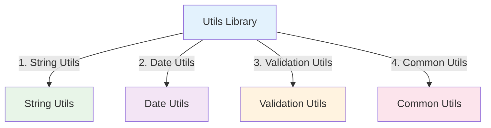

# Utils Library

:::tip 💡 Khái niệm cơ bản
Utils Library cung cấp các utility functions và helpers cho common operations.
:::

## Utils Library là gì?

**Lý thuyết cơ bản:**
Utils Library là một thư viện được thiết kế đặc biệt để cung cấp các utility functions và helpers cho common operations trong NestJS applications.

**Đặc điểm kỹ thuật:**
- **Common Functions**: Common utility functions
- **String Utils**: String manipulation utilities
- **Date Utils**: Date manipulation utilities
- **Validation Utils**: Validation utilities

## Kiến trúc Utils Library



## Cách sử dụng

### **1. Installation**

```bash
npm install @ecom-co/utils
```

---

**Bài tiếp theo:** [Overview](/docs/ecom-co/ecom-co-overview)
