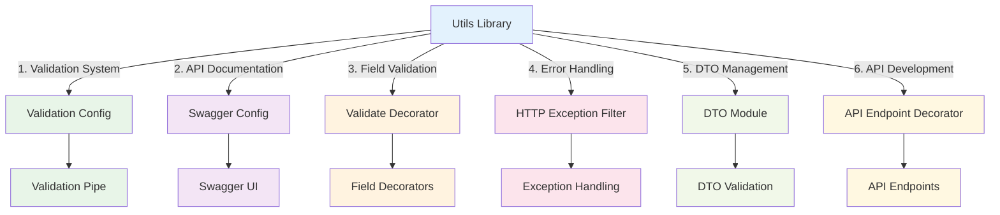

import Tabs from '@theme/Tabs';
import TabItem from '@theme/TabItem';

# Utils Library

:::tip 💡 Khái niệm cơ bản
Utils Library cung cấp các utility functions và helpers cho common operations.
:::

## Utils Library là gì?

**Lý thuyết cơ bản:**
Utils Library là một thư viện được thiết kế đặc biệt để cung cấp các utility functions và helpers cho NestJS applications, tập trung vào validation, documentation, error handling, và API development.

**Đặc điểm kỹ thuật:**
- **Validation System**: Comprehensive validation với class-validator integration
- **API Documentation**: Swagger setup với multiple authentication providers
- **Error Handling**: Custom exception filters và error management
- **DTO Management**: Module quản lý DTOs và validation rules
- **API Development**: Decorators để tạo API endpoints nhanh chóng

## Kiến trúc Utils Library



## Cách sử dụng

### **1. Installation**

<Tabs>
  <TabItem value="npm" label="npm">

```bash
npm install @ecom-co/utils
```

  </TabItem>
  <TabItem value="yarn" label="yarn">

```bash
yarn add @ecom-co/utils
```

  </TabItem>
  <TabItem value="pnpm" label="pnpm">

```bash
pnpm add @ecom-co/utils
```

  </TabItem>
</Tabs>

### **2. Basic Usage**

```typescript
// Validation Config
import { validationPipeConfig } from '@ecom-co/utils';

// Swagger Config
import { setUpSwagger } from '@ecom-co/utils';

// Validate Decorator
import { StringField, NumberField } from '@ecom-co/utils';

// HTTP Exception Filter
import { HttpExceptionFilter } from '@ecom-co/utils';
```

## Các thành phần chính

- **[Validation Config](/docs/ecom-co/libs/utils/docs/validation-config)**: Cấu hình ValidationPipe với custom exception factory, environment-specific configs, và flexible validation options
- **[Swagger Config](/docs/ecom-co/libs/utils/docs/swagger-config)**: Setup Swagger documentation với multiple authentication providers (JWT, OAuth2, API Key), custom UI, và server configuration
- **[Validate Decorator](/docs/ecom-co/libs/utils/docs/validate-decorator)**: Enhanced field validation decorators (String, Number, Boolean, Date, Array, Enum) với custom validators, transformation, và Swagger integration
- **[HTTP Exception Filter](/docs/ecom-co/libs/utils/docs/http-exception-filter)**: Custom exception filter với data sanitization, security headers, metrics tracking, và production-safe error handling
- **[DTO Module](/docs/ecom-co/libs/utils/docs/dto-module)**: Module quản lý DTOs với validation rules, transformation, và error handling
- **[API Endpoint Decorator](/docs/ecom-co/libs/utils/docs/api-endpoint-decorator)**: Decorators để tạo API endpoints nhanh chóng với validation, transformation, và documentation

---

**Bài tiếp theo:** [Overview](/docs/ecom-co/ecom-co-overview)
