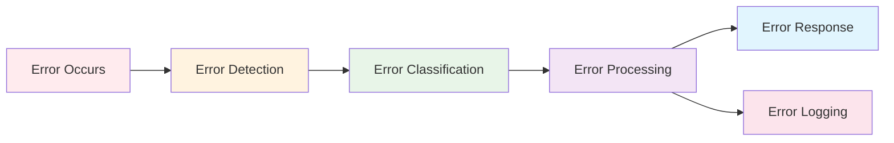
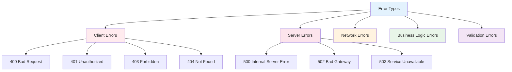

# Error Handling

Error Handling trong NestJS là quá trình xử lý và quản lý các lỗi xảy ra trong ứng dụng một cách có hệ thống. Nó đảm bảo rằng client nhận được thông tin lỗi hữu ích và server có thể log và monitor lỗi hiệu quả.



:::tip 💡 Khái niệm cơ bản
Error Handling giống như "hệ thống báo động" - phát hiện, phân loại và xử lý lỗi một cách thông minh để đảm bảo ứng dụng hoạt động ổn định.
:::

## Error Handling là gì?

Error Handling trong NestJS:
- **Error Detection** - Phát hiện lỗi khi chúng xảy ra
- **Error Classification** - Phân loại lỗi theo mức độ nghiêm trọng
- **Error Processing** - Xử lý lỗi theo logic nghiệp vụ
- **Error Response** - Trả về thông tin lỗi hữu ích cho client
- **Error Logging** - Ghi log lỗi để debug và monitoring
- **Error Recovery** - Khôi phục ứng dụng sau khi có lỗi

## Các loại Errors



### 1. Client Errors (4xx)
Lỗi do client gây ra

### 2. Server Errors (5xx)
Lỗi do server gây ra

### 3. Network Errors
Lỗi kết nối mạng

### 4. Business Logic Errors
Lỗi logic nghiệp vụ

### 5. Validation Errors
Lỗi validate dữ liệu

## Built-in Error Handling

### 1. HTTP Exceptions

```typescript title="Built-in HTTP Exceptions"
import { 
  BadRequestException,
  UnauthorizedException,
  ForbiddenException,
  NotFoundException,
  ConflictException,
  InternalServerErrorException,
  HttpStatus,
} from '@nestjs/common';

@Controller('users')
export class UserController {
  @Get(':id')
  findOne(@Param('id') id: string): User {
    // Validation error
    if (!id || id.length < 3) {
      throw new BadRequestException({
        message: 'ID is required and must be at least 3 characters',
        error: 'VALIDATION_ERROR',
        statusCode: HttpStatus.BAD_REQUEST,
      });
    }

    // Authentication error
    if (!this.authService.isAuthenticated()) {
      throw new UnauthorizedException('Authentication required');
    }

    // Authorization error
    if (!this.authService.hasRole('admin')) {
      throw new ForbiddenException('Admin access required');
    }

    // Resource not found error
    const user = this.userService.findOne(id);
    if (!user) {
      throw new NotFoundException({
        message: `User with ID ${id} not found`,
        error: 'USER_NOT_FOUND',
        statusCode: HttpStatus.NOT_FOUND,
      });
    }

    return user;
  }

  @Post()
  create(@Body() createUserDto: CreateUserDto): User {
    try {
      // Check for conflicts
      const existingUser = this.userService.findByEmail(createUserDto.email);
      if (existingUser) {
        throw new ConflictException({
          message: 'User with this email already exists',
          error: 'DUPLICATE_EMAIL',
          statusCode: HttpStatus.CONFLICT,
        });
      }

      return this.userService.create(createUserDto);
    } catch (error) {
      if (error instanceof ConflictException) {
        throw error;
      }
      
      // Log unexpected errors
      this.logger.error('Failed to create user', {
        error: error.message,
        stack: error.stack,
        dto: createUserDto,
      });
      
      throw new InternalServerErrorException('Failed to create user');
    }
  }
}
```

### 2. Custom Exceptions

```typescript title="Custom Exceptions"
// exceptions/business.exception.ts
export class BusinessException extends HttpException {
  constructor(
    message: string,
    errorCode: string,
    statusCode: number = HttpStatus.BAD_REQUEST,
  ) {
    super(
      {
        message,
        error: errorCode,
        statusCode,
        timestamp: new Date().toISOString(),
      },
      statusCode,
    );
  }
}

// exceptions/user-not-found.exception.ts
export class UserNotFoundException extends BusinessException {
  constructor(userId: string) {
    super(
      `User with ID ${userId} not found`,
      'USER_NOT_FOUND',
      HttpStatus.NOT_FOUND,
    );
  }
}

// exceptions/insufficient-balance.exception.ts
export class InsufficientBalanceException extends BusinessException {
  constructor(required: number, available: number) {
    super(
      `Insufficient balance. Required: ${required}, Available: ${available}`,
      'INSUFFICIENT_BALANCE',
      HttpStatus.BAD_REQUEST,
    );
  }
}

// Sử dụng
@Controller('users')
export class UserController {
  @Get(':id')
  findOne(@Param('id') id: string): User {
    const user = this.userService.findOne(id);
    if (!user) {
      throw new UserNotFoundException(id);
    }
    return user;
  }

  @Post('transfer')
  transfer(@Body() transferDto: TransferDto): TransferResult {
    const { fromUserId, toUserId, amount } = transferDto;
    
    const fromUser = this.userService.findOne(fromUserId);
    if (!fromUser) {
      throw new UserNotFoundException(fromUserId);
    }
    
    if (fromUser.balance < amount) {
      throw new InsufficientBalanceException(amount, fromUser.balance);
    }
    
    return this.transferService.transfer(fromUserId, toUserId, amount);
  }
}
```

## Error Handling Strategies

### 1. Try-Catch Blocks

```typescript title="Try-Catch Error Handling"
@Controller('users')
export class UserController {
  @Post()
  async create(@Body() createUserDto: CreateUserDto): Promise<User> {
    try {
      // Validate input
      await this.validateUserDto(createUserDto);
      
      // Check business rules
      await this.checkBusinessRules(createUserDto);
      
      // Create user
      const user = await this.userService.create(createUserDto);
      
      // Send welcome email
      await this.emailService.sendWelcomeEmail(user.email);
      
      return user;
    } catch (error) {
      // Log error with context
      this.logger.error('Failed to create user', {
        error: error.message,
        stack: error.stack,
        dto: createUserDto,
        userId: error.userId,
      });

      // Re-throw if it's a known exception
      if (error instanceof HttpException) {
        throw error;
      }

      // Handle unexpected errors
      if (error.code === 'ER_DUP_ENTRY') {
        throw new ConflictException('User with this email already exists');
      }

      if (error.code === 'ER_NO_REFERENCED_ROW') {
        throw new BadRequestException('Referenced entity does not exist');
      }

      // Generic error for unknown cases
      throw new InternalServerErrorException('Failed to create user');
    }
  }

  private async validateUserDto(dto: CreateUserDto): Promise<void> {
    if (!dto.email || !this.isValidEmail(dto.email)) {
      throw new BadRequestException('Valid email is required');
    }

    if (!dto.password || dto.password.length < 8) {
      throw new BadRequestException('Password must be at least 8 characters');
    }
  }

  private async checkBusinessRules(dto: CreateUserDto): Promise<void> {
    // Check if email domain is allowed
    const domain = dto.email.split('@')[1];
    if (!this.allowedDomains.includes(domain)) {
      throw new ForbiddenException('Email domain not allowed');
    }

    // Check if user is not banned
    if (await this.userService.isBanned(dto.email)) {
      throw new ForbiddenException('User is banned');
    }
  }
}
```

### 2. Error Interceptors

```typescript title="Error Handling Interceptor"
@Injectable()
export class ErrorHandlingInterceptor implements NestInterceptor {
  constructor(private readonly logger: Logger) {}

  intercept(context: ExecutionContext, next: CallHandler): Observable<any> {
    return next.handle().pipe(
      catchError(error => {
        const request = context.switchToHttp().getRequest();
        
        // Log error with request context
        this.logger.error('Request failed', {
          error: error.message,
          stack: error.stack,
          url: request.url,
          method: request.method,
          userId: request.user?.id,
          timestamp: new Date().toISOString(),
        });

        // Re-throw the error
        return throwError(() => error);
      }),
    );
  }
}

// Sử dụng
@Controller('users')
@UseInterceptors(ErrorHandlingInterceptor)
export class UserController {
  // Controller methods
}
```

### 3. Global Exception Filters

```typescript title="Global Exception Filter"
@Catch()
export class GlobalExceptionFilter implements ExceptionFilter {
  constructor(
    private readonly logger: Logger,
    private readonly configService: ConfigService,
  ) {}

  catch(exception: unknown, host: ArgumentsHost) {
    const ctx = host.switchToHttp();
    const response = ctx.getResponse<Response>();
    const request = ctx.getRequest<Request>();

    let status = HttpStatus.INTERNAL_SERVER_ERROR;
    let message = 'Internal server error';
    let errorCode = 'INTERNAL_ERROR';

    if (exception instanceof HttpException) {
      status = exception.getStatus();
      const exceptionResponse = exception.getResponse();
      
      if (typeof exceptionResponse === 'object') {
        message = exceptionResponse['message'] || exception.message;
        errorCode = exceptionResponse['error'] || 'HTTP_ERROR';
      } else {
        message = exception.message;
        errorCode = 'HTTP_ERROR';
      }
    } else if (exception instanceof Error) {
      message = exception.message;
      errorCode = 'UNKNOWN_ERROR';
    }

    // Log error
    this.logger.error('Global exception caught', {
      error: exception instanceof Error ? exception.message : 'Unknown error',
      stack: exception instanceof Error ? exception.stack : undefined,
      url: request.url,
      method: request.method,
      userId: request.user?.id,
      status,
      errorCode,
      timestamp: new Date().toISOString(),
    });

    // Format response
    const errorResponse = {
      success: false,
      statusCode: status,
      message,
      error: errorCode,
      path: request.url,
      timestamp: new Date().toISOString(),
    };

    // Add debug info in development
    if (this.configService.get('NODE_ENV') === 'development') {
      errorResponse['debug'] = {
        stack: exception instanceof Error ? exception.stack : undefined,
        details: exception,
      };
    }

    response.status(status).json(errorResponse);
  }
}
```

## Error Logging và Monitoring

### 1. Structured Logging

```typescript title="Structured Error Logging"
@Injectable()
export class ErrorLoggingService {
  constructor(
    private readonly logger: Logger,
    private readonly metricsService: MetricsService,
  ) {}

  logError(error: Error, context: ErrorContext): void {
    // Log error with structured data
    this.logger.error('Application error occurred', {
      error: {
        name: error.name,
        message: error.message,
        stack: error.stack,
        code: error['code'],
      },
      context: {
        url: context.url,
        method: context.method,
        userId: context.userId,
        requestId: context.requestId,
        timestamp: new Date().toISOString(),
      },
      metadata: {
        environment: process.env.NODE_ENV,
        version: process.env.APP_VERSION,
        service: 'user-service',
      },
    });

    // Increment error metrics
    this.metricsService.incrementErrorCount({
      errorType: error.name,
      endpoint: context.url,
      method: context.method,
    });
  }
}

interface ErrorContext {
  url: string;
  method: string;
  userId?: string;
  requestId?: string;
}
```

### 2. Error Monitoring

```typescript title="Error Monitoring Service"
@Injectable()
export class ErrorMonitoringService {
  constructor(
    private readonly configService: ConfigService,
    private readonly httpService: HttpService,
  ) {}

  async reportError(error: Error, context: ErrorContext): Promise<void> {
    try {
      // Send error to external monitoring service
      await this.httpService.post(
        this.configService.get('ERROR_MONITORING_URL'),
        {
          error: {
            name: error.name,
            message: error.message,
            stack: error.stack,
          },
          context,
          timestamp: new Date().toISOString(),
          environment: process.env.NODE_ENV,
        },
        {
          headers: {
            'Authorization': `Bearer ${this.configService.get('ERROR_MONITORING_API_KEY')}`,
          },
        },
      ).toPromise();
    } catch (reportError) {
      // Log monitoring service error
      console.error('Failed to report error to monitoring service:', reportError);
    }
  }
}
```

## Error Recovery Strategies

### 1. Retry Logic

```typescript title="Retry Logic for Errors"
@Injectable()
export class RetryService {
  async executeWithRetry<T>(
    operation: () => Promise<T>,
    maxRetries: number = 3,
    delay: number = 1000,
  ): Promise<T> {
    let lastError: Error;

    for (let attempt = 1; attempt <= maxRetries; attempt++) {
      try {
        return await operation();
      } catch (error) {
        lastError = error;

        // Don't retry for certain error types
        if (this.shouldNotRetry(error)) {
          throw error;
        }

        // Log retry attempt
        console.log(`Attempt ${attempt} failed, retrying in ${delay}ms...`);

        if (attempt < maxRetries) {
          await this.sleep(delay);
          delay *= 2; // Exponential backoff
        }
      }
    }

    throw lastError;
  }

  private shouldNotRetry(error: any): boolean {
    // Don't retry for client errors (4xx)
    if (error.status >= 400 && error.status < 500) {
      return true;
    }

    // Don't retry for certain error types
    const nonRetryableErrors = [
      'ValidationError',
      'AuthenticationError',
      'AuthorizationError',
    ];

    return nonRetryableErrors.includes(error.name);
  }

  private sleep(ms: number): Promise<void> {
    return new Promise(resolve => setTimeout(resolve, ms));
  }
}

// Sử dụng
@Controller('users')
export class UserController {
  constructor(private readonly retryService: RetryService) {}

  @Post('external-api-call')
  async callExternalApi(@Body() data: any): Promise<any> {
    return this.retryService.executeWithRetry(
      () => this.externalApiService.call(data),
      3,    // max retries
      1000, // initial delay
    );
  }
}
```

### 2. Circuit Breaker Pattern

```typescript title="Circuit Breaker Implementation"
@Injectable()
export class CircuitBreakerService {
  private state: 'CLOSED' | 'OPEN' | 'HALF_OPEN' = 'CLOSED';
  private failureCount = 0;
  private lastFailureTime = 0;
  private readonly threshold = 5;
  private readonly timeout = 60000; // 1 minute

  async execute<T>(operation: () => Promise<T>): Promise<T> {
    if (this.state === 'OPEN') {
      if (Date.now() - this.lastFailureTime > this.timeout) {
        this.state = 'HALF_OPEN';
      } else {
        throw new ServiceUnavailableException('Service temporarily unavailable');
      }
    }

    try {
      const result = await operation();
      this.onSuccess();
      return result;
    } catch (error) {
      this.onFailure();
      throw error;
    }
  }

  private onSuccess(): void {
    this.failureCount = 0;
    this.state = 'CLOSED';
  }

  private onFailure(): void {
    this.failureCount++;
    this.lastFailureTime = Date.now();

    if (this.failureCount >= this.threshold) {
      this.state = 'OPEN';
    }
  }

  getStatus(): any {
    return {
      state: this.state,
      failureCount: this.failureCount,
      lastFailureTime: this.lastFailureTime,
      threshold: this.threshold,
      timeout: this.timeout,
    };
  }
}
```

## Best Practices

### 1. Error Classification
```typescript title="Error Classification Best Practice"
// ✅ Tốt - Phân loại lỗi rõ ràng
try {
  const user = await this.userService.findOne(id);
  if (!user) {
    throw new NotFoundException('User not found');  // Client error
  }
  return user;
} catch (error) {
  if (error instanceof NotFoundException) {
    throw error;  // Re-throw client errors
  }
  
  // Log and re-throw server errors
  this.logger.error('Database error', error);
  throw new InternalServerErrorException('Failed to retrieve user');
}

// ❌ Không tốt - Không phân loại lỗi
try {
  const user = await this.userService.findOne(id);
  return user;
} catch (error) {
  throw new InternalServerErrorException();  // 500 cho mọi lỗi
}
```

### 2. Error Messages
```typescript title="Error Messages Best Practice"
// ✅ Tốt - Error messages rõ ràng và hữu ích
throw new BadRequestException({
  message: 'Email is required and must be a valid format',
  error: 'VALIDATION_ERROR',
  details: {
    field: 'email',
    value: email,
    constraint: 'valid email format',
  },
});

// ❌ Không tốt - Error messages mơ hồ
throw new BadRequestException('Invalid input');
```

### 3. Error Logging
```typescript title="Error Logging Best Practice"
// ✅ Tốt - Log đầy đủ thông tin
this.logger.error('User creation failed', {
  error: error.message,
  stack: error.stack,
  userId: request.body?.id,
  email: request.body?.email,
  timestamp: new Date().toISOString(),
  requestId: request.headers['x-request-id'],
  userAgent: request.headers['user-agent'],
});

// ❌ Không tốt - Log thiếu thông tin
console.error('Error occurred');
```

---

:::tip 💡 Lời khuyên tổng kết
- Phân loại lỗi rõ ràng (client vs server)
- Sử dụng try-catch blocks một cách hợp lý
- Log đầy đủ thông tin để debug
- Implement retry logic cho transient errors
- Sử dụng circuit breaker cho external services
- Monitor và alert cho critical errors
- Test error handling scenarios
- Cung cấp error messages hữu ích cho client
:::

**Bài tiếp theo:** [Advanced Topics](/docs/advanced/overview)
