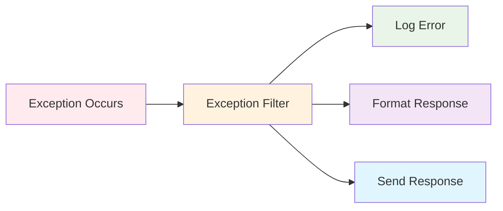
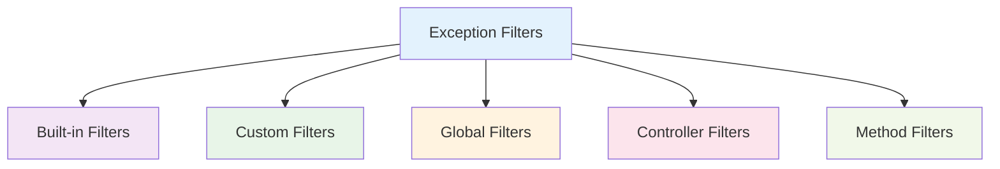

# Exception Filters

Exception Filters trong NestJS là các classes xử lý exceptions và errors một cách nhất quán. Chúng cho phép bạn kiểm soát hoàn toàn response format và logging khi có lỗi xảy ra.



:::tip 💡 Khái niệm cơ bản
Exception Filters giống như "bộ lọc lỗi" - bắt và xử lý tất cả exceptions trước khi trả về client, đảm bảo response format nhất quán.
:::

## Exception Filters là gì?

Exception Filters trong NestJS:
- **Error Handling** - Xử lý tất cả exceptions một cách nhất quán
- **Response Formatting** - Định dạng error response theo chuẩn
- **Logging** - Ghi log errors để debug và monitoring
- **Custom Logic** - Xử lý logic tùy chỉnh cho từng loại lỗi
- **Global Control** - Kiểm soát error handling toàn cục

## Các loại Exception Filters



### 1. Built-in Filters
Filters có sẵn trong NestJS

### 2. Custom Filters
Filters tùy chỉnh theo logic nghiệp vụ

### 3. Global Filters
Filters áp dụng cho toàn bộ ứng dụng

### 4. Controller Filters
Filters áp dụng cho controller cụ thể

### 5. Method Filters
Filters áp dụng cho method cụ thể

## Tạo Exception Filter cơ bản

```typescript title="Basic Exception Filter"
import { ExceptionFilter, Catch, ArgumentsHost, HttpException } from '@nestjs/common';
import { Request, Response } from 'express';

@Catch(HttpException)
export class HttpExceptionFilter implements ExceptionFilter {
  catch(exception: HttpException, host: ArgumentsHost) {
    const ctx = host.switchToHttp();
    const response = ctx.getResponse<Response>();
    const request = ctx.getRequest<Request>();
    const status = exception.getStatus();

    response.status(status).json({
      statusCode: status,
      timestamp: new Date().toISOString(),
      path: request.url,
      message: exception.message,
    });
  }
}
```

## Sử dụng Exception Filters

### Global Filters
```typescript title="Global Exception Filter Usage"
// main.ts
app.useGlobalFilters(new HttpExceptionFilter());
```

### Controller Level
```typescript title="Controller Level Exception Filter"
@UseFilters(HttpExceptionFilter)
@Controller('users')
export class UserController {
  @Get()
  findAll() {
    throw new NotFoundException('Users not found');
  }
}
```

### Method Level
```typescript title="Method Level Exception Filter"
@Controller('users')
export class UserController {
  @Get()
  @UseFilters(HttpExceptionFilter)
  findAll() {
    throw new NotFoundException('Users not found');
  }
}
```

## Built-in Exceptions

### HTTP Exceptions
```typescript title="HTTP Exceptions Examples"
import { 
  BadRequestException,
  UnauthorizedException,
  ForbiddenException,
  NotFoundException,
  ConflictException,
  InternalServerErrorException,
} from '@nestjs/common';

// Sử dụng
@Get(':id')
findOne(@Param('id') id: string) {
  if (!id) {
    throw new BadRequestException('ID is required');
  }
  
  const user = this.userService.findOne(id);
  if (!user) {
    throw new NotFoundException(`User with ID ${id} not found`);
  }
  
  return user;
}
```

## Custom Exception Filters

### HTTP Exception Filter
```typescript title="Custom HTTP Exception Filter"
@Catch(HttpException)
export class HttpExceptionFilter implements ExceptionFilter {
  catch(exception: HttpException, host: ArgumentsHost) {
    const ctx = host.switchToHttp();
    const response = ctx.getResponse<Response>();
    const request = ctx.getRequest<Request>();
    const status = exception.getStatus();

    // Log error
    console.error(`HTTP Exception: ${exception.message}`, {
      path: request.url,
      method: request.method,
      status,
      timestamp: new Date().toISOString(),
    });

    // Format response
    response.status(status).json({
      success: false,
      statusCode: status,
      message: exception.message,
      path: request.url,
      timestamp: new Date().toISOString(),
    });
  }
}
```

### All Exceptions Filter
```typescript title="All Exceptions Filter"
@Catch()
export class AllExceptionsFilter implements ExceptionFilter {
  catch(exception: unknown, host: ArgumentsHost) {
    const ctx = host.switchToHttp();
    const response = ctx.getResponse<Response>();
    const request = ctx.getRequest<Request>();

    let status = HttpStatus.INTERNAL_SERVER_ERROR;
    let message = 'Internal server error';

    if (exception instanceof HttpException) {
      status = exception.getStatus();
      message = exception.message;
    }

    // Log error
    console.error('Unhandled Exception:', {
      message: exception instanceof Error ? exception.message : 'Unknown error',
      path: request.url,
      method: request.method,
      timestamp: new Date().toISOString(),
    });

    // Format response
    response.status(status).json({
      success: false,
      statusCode: status,
      message,
      path: request.url,
      timestamp: new Date().toISOString(),
    });
  }
}
```

## Best Practices

### 1. Filter Hierarchy
```typescript title="Filter Hierarchy Best Practice"
// ✅ Tốt - Sử dụng nhiều filters theo thứ tự
@UseFilters(
  LoggingExceptionFilter,    // Log trước
  ValidationExceptionFilter, // Validate sau
  HttpExceptionFilter        // Format cuối
)
@Controller('users')
export class UserController {}
```

### 2. Error Messages
```typescript title="Error Messages Best Practice"
// ✅ Tốt - Error messages rõ ràng và hữu ích
throw new BadRequestException('Email is required and must be valid format');

// ❌ Không tốt - Error messages mơ hồ
throw new BadRequestException('Invalid input');
```

### 3. Logging Strategy
```typescript title="Logging Strategy Best Practice"
// ✅ Tốt - Log đầy đủ thông tin
console.error('User creation failed', {
  error: exception.message,
  userId: request.body?.id,
  email: request.body?.email,
  timestamp: new Date().toISOString(),
});
```

## Testing Exception Filters

### Unit Testing
```typescript title="Exception Filter Unit Testing"
describe('HttpExceptionFilter', () => {
  let filter: HttpExceptionFilter;
  let mockResponse: Partial<Response>;
  let mockRequest: Partial<Request>;

  beforeEach(() => {
    filter = new HttpExceptionFilter();
    mockResponse = {
      status: jest.fn().mockReturnThis(),
      json: jest.fn(),
    };
    mockRequest = {
      url: '/users',
      method: 'GET',
    };
  });

  it('should format HTTP exception response', () => {
    const exception = new NotFoundException('User not found');
    const host = {
      switchToHttp: () => ({
        getResponse: () => mockResponse,
        getRequest: () => mockRequest,
      }),
    } as ArgumentsHost;

    filter.catch(exception, host);

    expect(mockResponse.status).toHaveBeenCalledWith(404);
    expect(mockResponse.json).toHaveBeenCalledWith({
      statusCode: 404,
      message: 'User not found',
      timestamp: expect.any(String),
      path: '/users',
    });
  });
});
```

---

:::tip 💡 Lời khuyên tổng kết
- Sử dụng Exception Filters để xử lý lỗi một cách nhất quán
- Tạo custom filters cho logic nghiệp vụ cụ thể
- Log đầy đủ thông tin để debug và monitoring
- Sử dụng structured logging cho dễ đọc
- Test Exception Filters một cách comprehensive
- Sử dụng filter hierarchy hợp lý
:::

**Bài tiếp theo:** [Status Codes](/docs/http-exception/status-codes)
