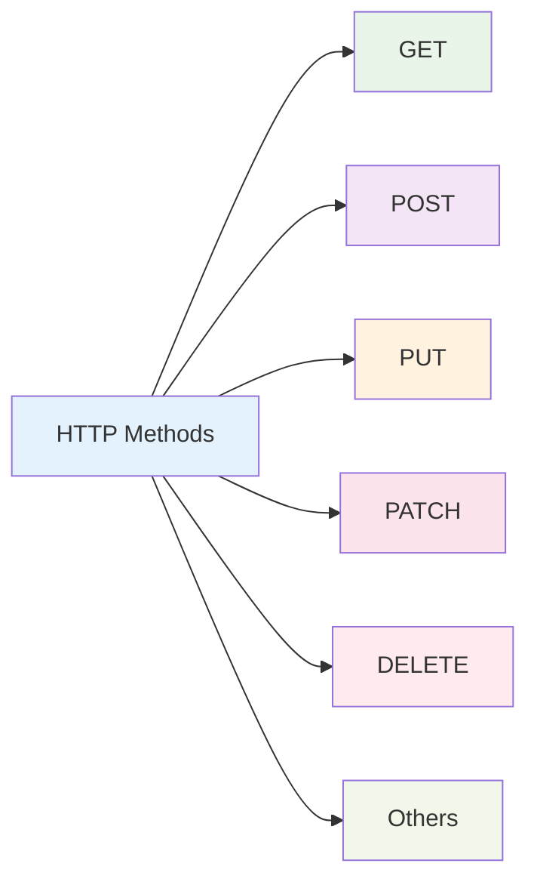

# HTTP Methods

HTTP Methods trong NestJS là các decorators được sử dụng để định nghĩa các endpoints khác nhau trong API. Mỗi method có mục đích và đặc điểm riêng biệt.



:::tip 💡 Khái niệm cơ bản
HTTP Methods giống như các "lệnh" khác nhau để thực hiện các hành động khác nhau trên resource. Mỗi method có ý nghĩa và cách sử dụng riêng.
:::

## HTTP Methods là gì?

HTTP Methods trong NestJS:
- **Resource Operations** - Thao tác với resources (CRUD)
- **Semantic Meaning** - Mỗi method có ý nghĩa rõ ràng
- **RESTful API** - Tuân thủ REST principles
- **Idempotent** - Một số methods có tính idempotent
- **Safe** - Một số methods an toàn (không thay đổi server state)

## Bảng tổng hợp tất cả HTTP Methods

| Method | Decorator | Mục đích | Idempotent | Safe | Body | Response |
|--------|-----------|----------|------------|------|------|----------|
| **GET** | `@Get()` | Lấy dữ liệu | ✅ | ✅ | ❌ | Data |
| **POST** | `@Post()` | Tạo mới | ❌ | ❌ | ✅ | Created data |
| **PUT** | `@Put()` | Thay thế hoàn toàn | ✅ | ❌ | ✅ | Updated data |
| **PATCH** | `@Patch()` | Cập nhật một phần | ❌ | ❌ | ✅ | Updated data |
| **DELETE** | `@Delete()` | Xóa dữ liệu | ✅ | ❌ | ❌ | Success message |
| **HEAD** | `@Head()` | Lấy headers | ✅ | ✅ | ❌ | Headers only |
| **OPTIONS** | `@Options()` | Lấy options | ✅ | ✅ | ❌ | Available methods |
| **ALL** | `@All()` | Tất cả methods | ❌ | ❌ | ✅ | Depends on method |

## Chi tiết từng HTTP Method

### 1. GET Method

**Mục đích:** Lấy dữ liệu từ server

**Đặc điểm:**
- **Safe**: Không thay đổi server state
- **Idempotent**: Có thể gọi nhiều lần với cùng kết quả
- **Cacheable**: Có thể cache response
- **No Body**: Không gửi request body

**Sử dụng:**
```typescript title="GET Method Examples"
@Controller('users')
export class UserController {
  // Lấy tất cả users
  @Get()
  findAll(): User[] {
    return this.userService.findAll();
  }

  // Lấy user theo ID
  @Get(':id')
  findOne(@Param('id') id: string): User {
    return this.userService.findOne(id);
  }

  // Lấy users với query parameters
  @Get('search')
  search(@Query('name') name: string): User[] {
    return this.userService.searchByName(name);
  }
}
```

### 2. POST Method

**Mục đích:** Tạo mới resource

**Đặc điểm:**
- **Not Safe**: Có thể thay đổi server state
- **Not Idempotent**: Mỗi lần gọi có thể tạo resource mới
- **Not Cacheable**: Không thể cache response
- **Has Body**: Cần request body

**Sử dụng:**
```typescript title="POST Method Examples"
@Controller('users')
export class UserController {
  // Tạo user mới
  @Post()
  @HttpCode(201)
  create(@Body() createUserDto: CreateUserDto): User {
    return this.userService.create(createUserDto);
  }

  // Tạo nhiều users
  @Post('bulk')
  createMany(@Body() createUsersDto: CreateUserDto[]): User[] {
    return this.userService.createMany(createUsersDto);
  }

  // Login user
  @Post('login')
  login(@Body() loginDto: LoginDto): { token: string } {
    return this.authService.login(loginDto);
  }
}
```

### 3. PUT Method

**Mục đích:** Thay thế hoàn toàn resource

**Đặc điểm:**
- **Not Safe**: Có thể thay đổi server state
- **Idempotent**: Có thể gọi nhiều lần với cùng kết quả
- **Not Cacheable**: Không thể cache response
- **Has Body**: Cần request body

**Sử dụng:**
```typescript title="PUT Method Examples"
@Controller('users')
export class UserController {
  // Thay thế hoàn toàn user
  @Put(':id')
  update(@Param('id') id: string, @Body() updateUserDto: UpdateUserDto): User {
    return this.userService.replace(id, updateUserDto);
  }

  // Upsert user (tạo mới nếu không tồn tại)
  @Put(':id')
  upsert(@Param('id') id: string, @Body() userDto: CreateUserDto): User {
    return this.userService.upsert(id, userDto);
  }
}
```

### 4. PATCH Method

**Mục đích:** Cập nhật một phần resource

**Đặc điểm:**
- **Not Safe**: Có thể thay đổi server state
- **Not Idempotent**: Có thể có kết quả khác nhau mỗi lần gọi
- **Not Cacheable**: Không thể cache response
- **Has Body**: Cần request body

**Sử dụng:**
```typescript title="PATCH Method Examples"
@Controller('users')
export class UserController {
  // Cập nhật một phần user
  @Patch(':id')
  update(@Param('id') id: string, @Body() updateUserDto: UpdateUserDto): User {
    return this.userService.update(id, updateUserDto);
  }

  // Cập nhật status
  @Patch(':id/status')
  updateStatus(@Param('id') id: string, @Body('status') status: string): User {
    return this.userService.updateStatus(id, status);
  }
}
```

### 5. DELETE Method

**Mục đích:** Xóa resource

**Đặc điểm:**
- **Not Safe**: Có thể thay đổi server state
- **Idempotent**: Có thể gọi nhiều lần với cùng kết quả
- **Not Cacheable**: Không thể cache response
- **No Body**: Không cần request body

**Sử dụng:**
```typescript title="DELETE Method Examples"
@Controller('users')
export class UserController {
  // Xóa user
  @Delete(':id')
  @HttpCode(204)
  remove(@Param('id') id: string): void {
    this.userService.remove(id);
  }

  // Xóa nhiều users
  @Delete('bulk')
  @HttpCode(204)
  removeMany(@Body('ids') ids: string[]): void {
    this.userService.removeMany(ids);
  }

  // Soft delete
  @Delete(':id/soft')
  softDelete(@Param('id') id: string): User {
    return this.userService.softDelete(id);
  }
}
```

### 6. HEAD Method

**Mục đích:** Lấy headers của response (không có body)

**Đặc điểm:**
- **Safe**: Không thay đổi server state
- **Idempotent**: Có thể gọi nhiều lần với cùng kết quả
- **Cacheable**: Có thể cache response
- **No Body**: Không gửi request body

**Sử dụng:**
```typescript title="HEAD Method Examples"
@Controller('users')
export class UserController {
  // Kiểm tra user có tồn tại không
  @Head(':id')
  exists(@Param('id') id: string): void {
    const user = this.userService.findOne(id);
    if (!user) {
      throw new NotFoundException();
    }
  }

  // Kiểm tra file size
  @Head('file/:id')
  getFileInfo(@Param('id') id: string): void {
    const file = this.fileService.getFile(id);
    // Response chỉ có headers, không có body
  }
}
```

### 7. OPTIONS Method

**Mục đích:** Lấy thông tin về available methods

**Đặc điểm:**
- **Safe**: Không thay đổi server state
- **Idempotent**: Có thể gọi nhiều lần với cùng kết quả
- **Cacheable**: Có thể cache response
- **No Body**: Không gửi request body

**Sử dụng:**
```typescript title="OPTIONS Method Examples"
@Controller('users')
export class UserController {
  // Lấy available methods cho resource
  @Options()
  getOptions(): void {
    // Response headers sẽ chứa Allow: GET, POST, PUT, DELETE
  }

  // CORS preflight request
  @Options('*')
  handleCors(): void {
    // Xử lý CORS preflight request
  }
}
```

### 8. ALL Method

**Mục đích:** Xử lý tất cả HTTP methods

**Đặc điểm:**
- **Flexible**: Xử lý bất kỳ HTTP method nào
- **Custom Logic**: Có thể xử lý logic khác nhau cho từng method
- **Not Safe**: Có thể thay đổi server state
- **Not Idempotent**: Tùy thuộc vào method được gọi

**Sử dụng:**
```typescript title="ALL Method Examples"
@Controller('webhook')
export class WebhookController {
  // Xử lý tất cả methods từ webhook
  @All()
  handleWebhook(@Req() req: Request): any {
    switch (req.method) {
      case 'GET':
        return this.handleGet(req);
      case 'POST':
        return this.handlePost(req);
      case 'PUT':
        return this.handlePut(req);
      default:
        throw new MethodNotAllowedException();
    }
  }

  private handleGet(req: Request) {
    return { message: 'GET request received' };
  }

  private handlePost(req: Request) {
    return { message: 'POST request received', data: req.body };
  }

  private handlePut(req: Request) {
    return { message: 'PUT request received', data: req.body };
  }
}
```

## HTTP Status Codes

### Common Status Codes cho mỗi Method

| Method | Success Codes | Error Codes |
|--------|---------------|--------------|
| **GET** | 200 (OK), 206 (Partial Content) | 404 (Not Found), 400 (Bad Request) |
| **POST** | 201 (Created), 200 (OK) | 400 (Bad Request), 409 (Conflict) |
| **PUT** | 200 (OK), 201 (Created) | 400 (Bad Request), 404 (Not Found) |
| **PATCH** | 200 (OK) | 400 (Bad Request), 404 (Not Found) |
| **DELETE** | 204 (No Content), 200 (OK) | 404 (Not Found), 400 (Bad Request) |

## Best Practices

### 1. Method Selection
```typescript title="Method Selection Best Practice"
// ✅ Tốt - Sử dụng đúng method cho đúng mục đích
@Get()           // Lấy dữ liệu
@Post()          // Tạo mới
@Put()           // Thay thế hoàn toàn
@Patch()         // Cập nhật một phần
@Delete()        // Xóa

// ❌ Không tốt - Sử dụng sai method
@Post('users/:id')  // Nên dùng PUT hoặc PATCH
@Get('users', { method: 'POST' })  // Không cần thiết
```

### 2. Status Codes
```typescript title="Status Codes Best Practice"
// ✅ Tốt - Sử dụng status codes phù hợp
@Post()
@HttpCode(201)
create(@Body() dto: CreateDto) {
  return this.service.create(dto);
}

@Delete(':id')
@HttpCode(204)
remove(@Param('id') id: string) {
  this.service.remove(id);
}
```

### 3. Route Naming
```typescript title="Route Naming Best Practice"
// ✅ Tốt - Route names rõ ràng và RESTful
@Get('users')           // Lấy tất cả users
@Get('users/:id')       // Lấy user theo ID
@Post('users')          // Tạo user mới
@Put('users/:id')       // Thay thế user
@Patch('users/:id')     // Cập nhật user
@Delete('users/:id')    // Xóa user

// ❌ Không tốt - Route names không rõ ràng
@Get('getUsers')
@Post('addUser')
@Get('user/:id')
```

---

:::tip 💡 Lời khuyên tổng kết
- Sử dụng đúng HTTP method cho đúng mục đích
- Tuân thủ REST principles
- Sử dụng status codes phù hợp
- Đặt tên routes rõ ràng và nhất quán
- Hiểu rõ đặc điểm của từng method
- Sử dụng @HttpCode() để đặt status code cụ thể
:::

**Bài tiếp theo:** [Exception Filters](/docs/http-exception/exception-filters)
