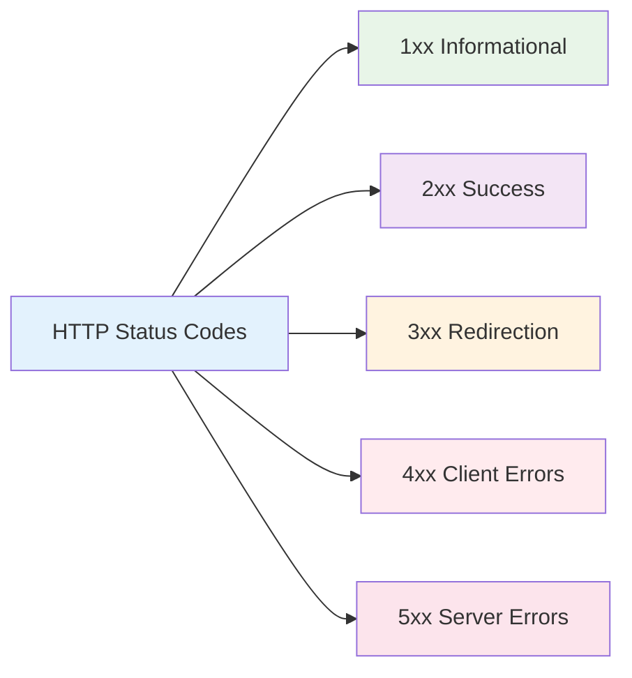

# Status Codes

HTTP Status Codes trong NestJS là các mã số được sử dụng để chỉ ra kết quả của HTTP request. Chúng giúp client hiểu được response từ server và xử lý phù hợp.



:::tip 💡 Khái niệm cơ bản
HTTP Status Codes giống như "mã báo hiệu" - cho biết request có thành công hay không và cần xử lý như thế nào.
:::

## Status Codes là gì?

HTTP Status Codes trong NestJS:
- **Response Indication** - Chỉ ra kết quả của request
- **Client Guidance** - Hướng dẫn client xử lý response
- **Error Handling** - Xử lý lỗi một cách nhất quán
- **API Documentation** - Tài liệu API rõ ràng
- **Debugging** - Hỗ trợ debug và troubleshooting

## Bảng tổng hợp tất cả Status Codes

### 1xx Informational Responses

| Code | Name | Mô tả | Sử dụng |
|------|------|-------|---------|
| **100** | Continue | Request tiếp tục | Large file uploads |
| **101** | Switching Protocols | Chuyển đổi protocol | WebSocket upgrade |
| **102** | Processing | Request đang xử lý | Long-running operations |
| **103** | Early Hints | Gợi ý sớm | Resource hints |

### 2xx Success Responses

| Code | Name | Mô tả | Sử dụng |
|------|------|-------|---------|
| **200** | OK | Request thành công | GET, PUT, PATCH |
| **201** | Created | Resource được tạo | POST |
| **202** | Accepted | Request được chấp nhận | Async operations |
| **203** | Non-Authoritative Information | Thông tin không chính thức | Proxy responses |
| **204** | No Content | Không có content | DELETE, PUT, PATCH |
| **205** | Reset Content | Reset content | Form resets |
| **206** | Partial Content | Content một phần | Range requests |
| **207** | Multi-Status | Nhiều status | Bulk operations |
| **208** | Already Reported | Đã được báo cáo | DAV responses |
| **226** | IM Used | IM được sử dụng | Delta encoding |

### 3xx Redirection Responses

| Code | Name | Mô tả | Sử dụng |
|------|------|-------|---------|
| **300** | Multiple Choices | Nhiều lựa chọn | Content negotiation |
| **301** | Moved Permanently | Di chuyển vĩnh viễn | URL redirects |
| **302** | Found | Tìm thấy | Temporary redirects |
| **303** | See Other | Xem khác | POST redirects |
| **304** | Not Modified | Không thay đổi | Caching |
| **305** | Use Proxy | Sử dụng proxy | Proxy access |
| **306** | Unused | Không sử dụng | Reserved |
| **307** | Temporary Redirect | Redirect tạm thời | Method preservation |
| **308** | Permanent Redirect | Redirect vĩnh viễn | Method preservation |

### 4xx Client Error Responses

| Code | Name | Mô tả | Sử dụng |
|------|------|-------|---------|
| **400** | Bad Request | Request không hợp lệ | Validation errors |
| **401** | Unauthorized | Chưa xác thực | Authentication required |
| **402** | Payment Required | Yêu cầu thanh toán | Payment systems |
| **403** | Forbidden | Bị cấm | Authorization failed |
| **404** | Not Found | Không tìm thấy | Resource missing |
| **405** | Method Not Allowed | Method không được phép | HTTP method restriction |
| **406** | Not Acceptable | Không chấp nhận | Content negotiation |
| **407** | Proxy Authentication Required | Yêu cầu xác thực proxy | Proxy auth |
| **408** | Request Timeout | Request timeout | Timeout handling |
| **409** | Conflict | Xung đột | Resource conflicts |
| **410** | Gone | Đã biến mất | Resource removed |
| **411** | Length Required | Yêu cầu độ dài | Content-Length header |
| **412** | Precondition Failed | Điều kiện tiên quyết thất bại | Precondition check |
| **413** | Payload Too Large | Payload quá lớn | File size limits |
| **414** | URI Too Long | URI quá dài | URL length limits |
| **415** | Unsupported Media Type | Loại media không hỗ trợ | Content type |
| **416** | Range Not Satisfiable | Range không thỏa mãn | Range requests |
| **417** | Expectation Failed | Kỳ vọng thất bại | Expect header |
| **418** | I'm a teapot | Tôi là ấm trà | April Fools |
| **422** | Unprocessable Entity | Entity không thể xử lý | Validation errors |
| **423** | Locked | Bị khóa | Resource locking |
| **424** | Failed Dependency | Phụ thuộc thất bại | WebDAV |
| **425** | Too Early | Quá sớm | Replay protection |
| **426** | Upgrade Required | Yêu cầu nâng cấp | Protocol upgrade |
| **428** | Precondition Required | Yêu cầu điều kiện tiên quyết | Conditional requests |
| **429** | Too Many Requests | Quá nhiều requests | Rate limiting |
| **431** | Request Header Fields Too Large | Header fields quá lớn | Header size limits |
| **451** | Unavailable For Legal Reasons | Không có sẵn vì lý do pháp lý | Legal restrictions |

### 5xx Server Error Responses

| Code | Name | Mô tả | Sử dụng |
|------|------|-------|---------|
| **500** | Internal Server Error | Lỗi server nội bộ | Server errors |
| **501** | Not Implemented | Không được implement | Feature not available |
| **502** | Bad Gateway | Gateway xấu | Proxy errors |
| **503** | Service Unavailable | Service không có sẵn | Maintenance mode |
| **504** | Gateway Timeout | Gateway timeout | Proxy timeout |
| **505** | HTTP Version Not Supported | HTTP version không hỗ trợ | Protocol version |
| **506** | Variant Also Negotiates | Variant cũng thương lượng | Content negotiation |
| **507** | Insufficient Storage | Lưu trữ không đủ | WebDAV |
| **508** | Loop Detected | Phát hiện vòng lặp | WebDAV |
| **510** | Not Extended | Không mở rộng | Extension required |
| **511** | Network Authentication Required | Yêu cầu xác thực mạng | Network access |

## Sử dụng Status Codes trong NestJS

### 1. Sử dụng @HttpCode() Decorator

```typescript title="HttpCode Decorator Usage"
@Controller('users')
export class UserController {
  // Tạo user mới - 201 Created
  @Post()
  @HttpCode(201)
  create(@Body() createUserDto: CreateUserDto): User {
    return this.userService.create(createUserDto);
  }

  // Xóa user - 204 No Content
  @Delete(':id')
  @HttpCode(204)
  remove(@Param('id') id: string): void {
    this.userService.remove(id);
  }

  // Cập nhật user - 200 OK (mặc định)
  @Put(':id')
  update(@Param('id') id: string, @Body() updateUserDto: UpdateUserDto): User {
    return this.userService.update(id, updateUserDto);
  }
}
```

### 2. Sử dụng Built-in Exceptions

```typescript title="Built-in Exceptions Usage"
import { 
  BadRequestException,
  UnauthorizedException,
  ForbiddenException,
  NotFoundException,
  ConflictException,
  InternalServerErrorException,
  HttpStatus,
} from '@nestjs/common';

@Controller('users')
export class UserController {
  @Get(':id')
  findOne(@Param('id') id: string): User {
    // Validation
    if (!id || id.length < 3) {
      throw new BadRequestException('ID must be at least 3 characters');
    }

    // Authentication check
    if (!this.authService.isAuthenticated()) {
      throw new UnauthorizedException('Authentication required');
    }

    // Authorization check
    if (!this.authService.hasRole('admin')) {
      throw new ForbiddenException('Admin access required');
    }

    // Resource lookup
    const user = this.userService.findOne(id);
    if (!user) {
      throw new NotFoundException(`User with ID ${id} not found`);
    }

    return user;
  }

  @Post()
  create(@Body() createUserDto: CreateUserDto): User {
    try {
      // Check if user already exists
      const existingUser = this.userService.findByEmail(createUserDto.email);
      if (existingUser) {
        throw new ConflictException('User with this email already exists');
      }

      return this.userService.create(createUserDto);
    } catch (error) {
      if (error instanceof ConflictException) {
        throw error;
      }
      // Log unexpected errors
      console.error('Unexpected error:', error);
      throw new InternalServerErrorException('Failed to create user');
    }
  }
}
```

### 3. Custom Status Code Responses

```typescript title="Custom Status Code Responses"
@Controller('files')
export class FileController {
  @Post('upload')
  async uploadFile(@UploadedFile() file: Express.Multer.File) {
    try {
      const result = await this.fileService.upload(file);
      
      if (result.status === 'processing') {
        // File đang được xử lý - 202 Accepted
        return {
          statusCode: 202,
          message: 'File is being processed',
          taskId: result.taskId,
        };
      }
      
      // File đã upload thành công - 201 Created
      return {
        statusCode: 201,
        message: 'File uploaded successfully',
        fileId: result.fileId,
      };
    } catch (error) {
      throw new InternalServerErrorException('Failed to upload file');
    }
  }

  @Get('download/:id')
  async downloadFile(@Param('id') id: string, @Res() res: Response) {
    try {
      const file = await this.fileService.findById(id);
      
      if (!file) {
        throw new NotFoundException('File not found');
      }

      // Set appropriate headers
      res.setHeader('Content-Type', file.mimeType);
      res.setHeader('Content-Disposition', `attachment; filename="${file.name}"`);
      
      // Send file with 200 OK
      res.status(200).send(file.buffer);
    } catch (error) {
      if (error instanceof NotFoundException) {
        throw error;
      }
      throw new InternalServerErrorException('Failed to download file');
    }
  }
}
```

## Status Code Best Practices

### 1. Chọn Status Code phù hợp

```typescript title="Status Code Selection Best Practice"
// ✅ Tốt - Sử dụng status codes phù hợp
@Post()
@HttpCode(201)  // Created - Resource được tạo mới
create(@Body() dto: CreateDto) {
  return this.service.create(dto);
}

@Delete(':id')
@HttpCode(204)  // No Content - Xóa thành công, không có content
remove(@Param('id') id: string) {
  this.service.remove(id);
}

@Put(':id')
@HttpCode(200)  // OK - Cập nhật thành công
update(@Param('id') id: string, @Body() dto: UpdateDto) {
  return this.service.update(id, dto);
}

// ❌ Không tốt - Sử dụng status codes không phù hợp
@Post()
@HttpCode(200)  // Nên dùng 201 cho tạo mới
create(@Body() dto: CreateDto) {
  return this.service.create(dto);
}
```

### 2. Error Status Codes

```typescript title="Error Status Codes Best Practice"
// ✅ Tốt - Sử dụng error status codes phù hợp
@Get(':id')
findOne(@Param('id') id: string) {
  if (!id) {
    throw new BadRequestException('ID is required');  // 400
  }
  
  const user = this.service.findOne(id);
  if (!user) {
    throw new NotFoundException('User not found');    // 404
  }
  
  if (!this.authService.canAccess(user)) {
    throw new ForbiddenException('Access denied');    // 403
  }
  
  return user;  // 200
}

// ❌ Không tốt - Luôn trả về 500 cho mọi lỗi
@Get(':id')
findOne(@Param('id') id: string) {
  try {
    const user = this.service.findOne(id);
    return user;
  } catch (error) {
    throw new InternalServerErrorException();  // 500 cho mọi lỗi
  }
}
```

### 3. Response Format nhất quán

```typescript title="Consistent Response Format Best Practice"
// ✅ Tốt - Response format nhất quán
@Get()
findAll() {
  const users = this.service.findAll();
  return {
    success: true,
    data: users,
    count: users.length,
    timestamp: new Date().toISOString(),
  };
}

@Post()
@HttpCode(201)
create(@Body() dto: CreateDto) {
  const user = this.service.create(dto);
  return {
    success: true,
    data: user,
    message: 'User created successfully',
    timestamp: new Date().toISOString(),
  };
}

// Error responses cũng nhất quán
@Get(':id')
findOne(@Param('id') id: string) {
  const user = this.service.findOne(id);
  if (!user) {
    throw new NotFoundException({
      success: false,
      error: {
        code: 'USER_NOT_FOUND',
        message: 'User not found',
        details: `No user found with ID: ${id}`,
      },
      timestamp: new Date().toISOString(),
    });
  }
  
  return {
    success: true,
    data: user,
    timestamp: new Date().toISOString(),
  };
}
```

## Testing Status Codes

### 1. Unit Testing

```typescript title="Status Code Unit Testing"
describe('UserController', () => {
  let controller: UserController;
  let service: UserService;

  beforeEach(async () => {
    const module = await Test.createTestingModule({
      controllers: [UserController],
      providers: [
        {
          provide: UserService,
          useValue: {
            create: jest.fn(),
            findOne: jest.fn(),
            remove: jest.fn(),
          },
        },
      ],
    }).compile();

    controller = module.get<UserController>(UserController);
    service = module.get<UserService>(UserService);
  });

  it('should return 201 when creating user', async () => {
    const createUserDto = { name: 'John', email: 'john@example.com' };
    const expectedUser = { id: '1', ...createUserDto };
    
    jest.spyOn(service, 'create').mockResolvedValue(expectedUser);
    
    const result = await controller.create(createUserDto);
    
    expect(result).toEqual(expectedUser);
  });

  it('should return 404 when user not found', async () => {
    jest.spyOn(service, 'findOne').mockResolvedValue(null);
    
    await expect(controller.findOne('999')).rejects.toThrow(NotFoundException);
  });
});
```

### 2. Integration Testing

```typescript title="Status Code Integration Testing"
describe('UserController Integration', () => {
  let app: INestApplication;

  beforeEach(async () => {
    const moduleFixture = await Test.createTestingModule({
      imports: [AppModule],
    }).compile();

    app = moduleFixture.createNestApplication();
    await app.init();
  });

  afterEach(async () => {
    await app.close();
  });

  it('should return 201 for POST /users', async () => {
    const response = await request(app.getHttpServer())
      .post('/users')
      .send({ name: 'John', email: 'john@example.com' })
      .expect(201);
    
    expect(response.body.success).toBe(true);
    expect(response.body.data.name).toBe('John');
  });

  it('should return 404 for GET /users/999', async () => {
    const response = await request(app.getHttpServer())
      .get('/users/999')
      .expect(404);
    
    expect(response.body.success).toBe(false);
    expect(response.body.error.message).toBe('User not found');
  });
});
```

---

:::tip 💡 Lời khuyên tổng kết
- Sử dụng status codes phù hợp với từng operation
- Tuân thủ HTTP standards và REST principles
- Response format nhất quán cho success và error
- Sử dụng @HttpCode() decorator khi cần thiết
- Test status codes trong unit và integration tests
- Log đầy đủ thông tin cho debugging
:::

**Bài tiếp theo:** [Error Handling](/docs/http-exception/error-handling)
