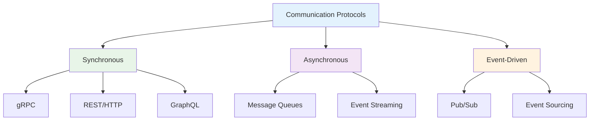
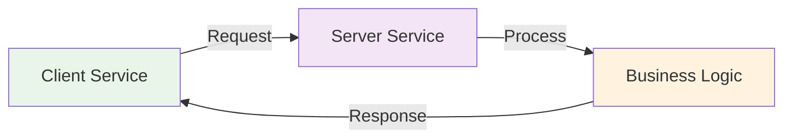
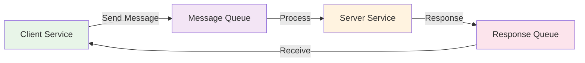
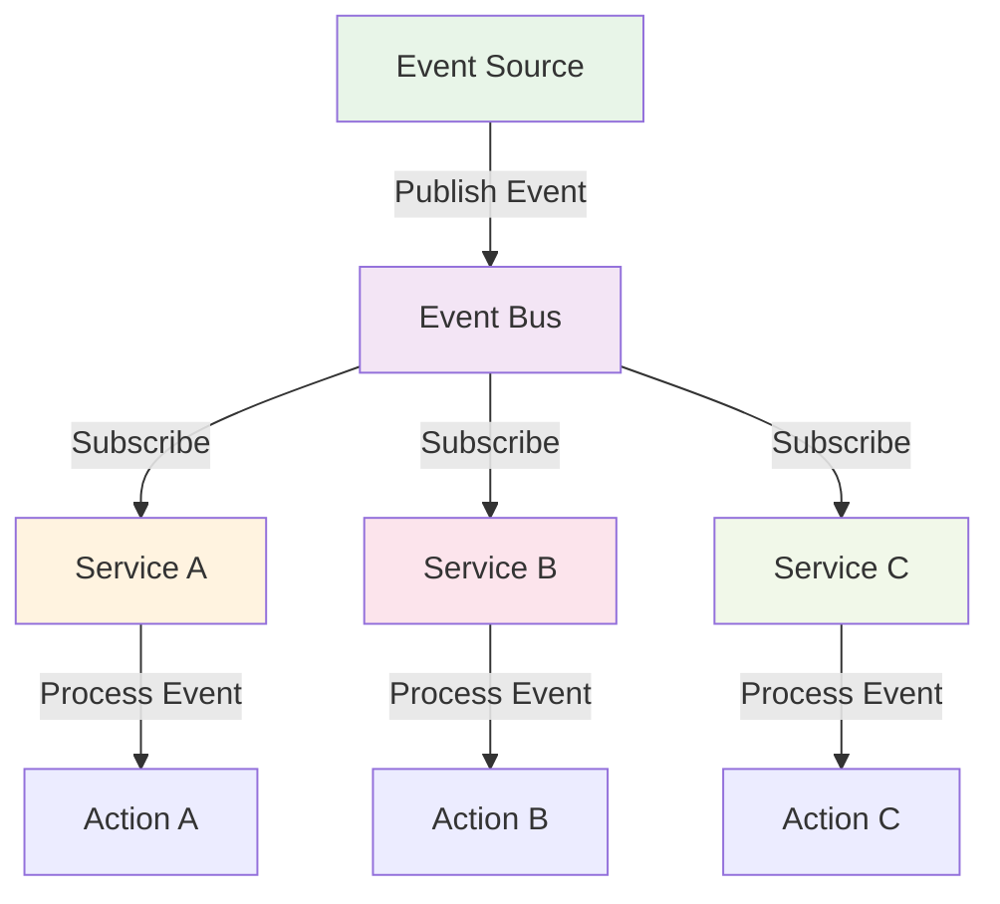
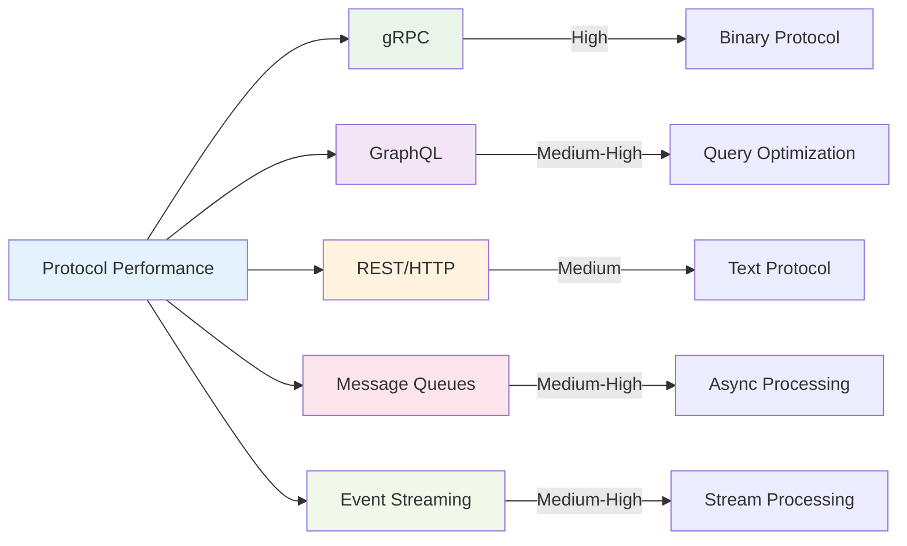

# Communication Overview

Communication Protocols trong Microservices là các phương thức và giao thức mà các services sử dụng để giao tiếp với nhau. Việc chọn đúng protocol cho từng use case là rất quan trọng để đảm bảo hiệu suất và độ tin cậy của hệ thống.

:::tip 💡 Khái niệm cơ bản
Communication Protocols giống như "ngôn ngữ giao tiếp" giữa các services - mỗi protocol có ưu điểm riêng và phù hợp với từng tình huống cụ thể.
:::

## Communication Protocols là gì?

Communication Protocols trong Microservices:
- **Service Interaction** - Cách các services giao tiếp với nhau
- **Data Exchange** - Trao đổi dữ liệu giữa services
- **Protocol Selection** - Chọn protocol phù hợp cho từng use case
- **Performance Optimization** - Tối ưu hiệu suất giao tiếp
- **Reliability** - Đảm bảo độ tin cậy của communication

## Phân loại Communication Protocols

### 1. **Synchronous Communication**

**Đặc điểm:**
- **Blocking** - Client chờ response từ server
- **Real-time** - Response ngay lập tức
- **Simple** - Dễ implement và debug
- **Tight coupling** - Services phụ thuộc lẫn nhau

**Use cases:**
- User authentication
- Data validation
- Critical business operations
- Operations cần response ngay

### 2. **Asynchronous Communication**

**Đặc điểm:**
- **Non-blocking** - Client không chờ response
- **Decoupled** - Services ít phụ thuộc lẫn nhau
- **Scalable** - Có thể xử lý nhiều messages
- **Reliable** - Messages được lưu trữ và retry

**Use cases:**
- Email notifications
- Log processing
- Data synchronization
- Background tasks

### 3. **Event-Driven Communication**

**Đặc điểm:**
- **Loose coupling** - Services không biết nhau
- **Scalable** - Dễ dàng thêm/bớt services
- **Reactive** - Services phản ứng với events
- **Audit trail** - Lưu trữ lịch sử events

**Use cases:**
- User registration flow
- Order processing
- Inventory updates
- Analytics tracking

## So sánh các Protocol

### Bảng so sánh chi tiết

| Protocol | Type | Performance | Reliability | Complexity | Use Case |
|----------|------|-------------|-------------|------------|----------|
| **gRPC** | Synchronous | ⭐⭐⭐⭐⭐ | ⭐⭐⭐⭐ | ⭐⭐⭐ | High-performance APIs |
| **REST/HTTP** | Synchronous | ⭐⭐⭐ | ⭐⭐⭐⭐ | ⭐⭐ | General-purpose APIs |
| **GraphQL** | Synchronous | ⭐⭐⭐⭐ | ⭐⭐⭐⭐ | ⭐⭐⭐⭐ | Flexible data queries |
| **Message Queues** | Asynchronous | ⭐⭐⭐⭐ | ⭐⭐⭐⭐⭐ | ⭐⭐⭐ | Reliable messaging |
| **Event Streaming** | Event-driven | ⭐⭐⭐⭐ | ⭐⭐⭐⭐⭐ | ⭐⭐⭐⭐ | Real-time events |
| **WebSockets** | Bidirectional | ⭐⭐⭐⭐ | ⭐⭐⭐ | ⭐⭐⭐ | Real-time communication |

### Performance Comparison

## Protocol Selection Guidelines

### 1. **Khi nào dùng Synchronous?**

**Lý thuyết:**
Synchronous communication là khi client gửi request và chờ response trước khi tiếp tục. Đây là pattern đơn giản nhất và dễ hiểu nhất.

**Đặc điểm kỹ thuật:**
- **Blocking Nature**: Client bị block cho đến khi nhận được response
- **Request-Response Cycle**: Mỗi request tạo ra một response tương ứng
- **State Management**: Client phải quản lý state của request
- **Error Handling**: Errors được xử lý ngay lập tức

**Cách xử lý:**
1. Client gửi request đến server
2. Server xử lý request (có thể mất thời gian)
3. Server trả về response
4. Client nhận response và tiếp tục

**Biến đổi trong quá trình xử lý:**
- **Request State**: Pending → Processing → Completed/Failed
- **Client State**: Waiting → Processing → Ready
- **Server State**: Idle → Busy → Idle

**Use cases cho Synchronous:**
- **Authentication & Authorization** - Cần xác thực ngay
- **Data Validation** - Validate trước khi xử lý
- **Critical Operations** - Operations không thể fail
- **Real-time Requirements** - Cần response ngay lập tức

**Ưu điểm:**
- Đơn giản, dễ implement và debug
- Response ngay lập tức
- Error handling trực tiếp
- State management rõ ràng

**Nhược điểm:**
- Client bị block
- Không scalable cho high-load
- Network timeout issues
- Tight coupling giữa client và server

### 2. **Khi nào dùng Asynchronous?**

**Lý thuyết:**
Asynchronous communication là khi client gửi request và không chờ response, tiếp tục xử lý các tác vụ khác. Server sẽ xử lý request và có thể gửi response sau hoặc không gửi response.

**Đặc điểm kỹ thuật:**
- **Non-blocking Nature**: Client không bị block, có thể tiếp tục xử lý
- **Fire-and-Forget**: Client gửi request và quên đi
- **Callback/Promise Pattern**: Sử dụng callback hoặc promise để xử lý response
- **Event-driven**: Dựa trên events và message queues

**Cách xử lý:**
1. Client gửi request đến server
2. Client tiếp tục xử lý các tác vụ khác (không chờ)
3. Server xử lý request trong background
4. Server có thể gửi response sau hoặc không gửi

**Biến đổi trong quá trình xử lý:**
- **Request State**: Sent → Queued → Processing → Completed
- **Client State**: Ready → Ready (không bị block)
- **Server State**: Idle → Busy → Idle
- **Message Queue**: Empty → Has Messages → Processing → Empty

**Use cases cho Asynchronous:**
- **Notifications** - Email, SMS, Push notifications
- **Logging & Analytics** - Data processing, reporting
- **Data Synchronization** - Sync data giữa services
- **Background Tasks** - Heavy processing tasks

**Ưu điểm:**
- Client không bị block
- High scalability và throughput
- Better resource utilization
- Loose coupling giữa client và server

**Nhược điểm:**
- Phức tạp hơn để implement
- Khó debug và monitor
- Không có response ngay lập tức
- Cần xử lý failures và retries

### 3. **Khi nào dùng Event-Driven?**

**Lý thuyết:**
Event-driven communication là khi services giao tiếp thông qua events. Services không gọi trực tiếp nhau mà publish events và subscribe vào events mà họ quan tâm. Đây là pattern có độ coupling thấp nhất.

**Đặc điểm kỹ thuật:**
- **Publisher-Subscriber Pattern**: Services publish events, services khác subscribe
- **Loose Coupling**: Services không biết nhau trực tiếp
- **Event Bus**: Central event broker quản lý events
- **Reactive Programming**: Services phản ứng với events

**Cách xử lý:**
1. Service A thực hiện một action
2. Service A publish event về action đó
3. Event bus nhận event và phân phối
4. Services khác (B, C, D) nhận event và xử lý
5. Services B, C, D có thể publish events khác

**Biến đổi trong quá trình xử lý:**
- **Event State**: Created → Published → Distributed → Processed
- **Service State**: Active → Processing Event → Active
- **Event Bus State**: Idle → Routing Events → Idle
- **System State**: Stable → Event Cascade → Stable

**Use cases cho Event-Driven:**
- **User Registration Flow** - Multiple services react to user creation
- **Order Processing** - Inventory, payment, shipping services
- **Data Changes** - Services need to react to data updates
- **System Events** - Maintenance, monitoring, alerts

**Ưu điểm:**
- Loose coupling giữa services
- High scalability và flexibility
- Dễ dàng thêm/bớt services
- Reactive và responsive system

**Nhược điểm:**
- Phức tạp để implement và debug
- Khó track flow của events
- Event ordering issues
- Performance overhead cho event routing

## Best Practices

### 1. **Protocol Selection - Lý thuyết và Nguyên tắc**

**Nguyên tắc cơ bản:**
- **Synchronous**: Khi cần response ngay lập tức và operation là critical
- **Asynchronous**: Khi không cần response ngay và operation có thể fail
- **Event-driven**: Khi cần loose coupling và multiple services phản ứng

**Quy tắc lựa chọn:**
1. **Performance Critical**: Chọn Synchronous
2. **Scalability Required**: Chọn Asynchronous hoặc Event-driven
3. **Loose Coupling**: Chọn Event-driven
4. **Simple Operations**: Chọn Synchronous
5. **Complex Workflows**: Chọn Event-driven

**Trade-offs cần cân nhắc:**
- **Latency vs Throughput**: Synchronous có latency thấp, Asynchronous có throughput cao
- **Complexity vs Simplicity**: Synchronous đơn giản, Event-driven phức tạp
- **Coupling vs Flexibility**: Synchronous tight coupling, Event-driven loose coupling

### 2. **Error Handling - Lý thuyết và Chiến lược**

**Nguyên lý xử lý lỗi:**
- **Fail Fast**: Synchronous nên fail ngay lập tức
- **Retry Logic**: Asynchronous nên có retry mechanism
- **Circuit Breaker**: Bảo vệ system khỏi cascading failures
- **Dead Letter Queue**: Xử lý messages không thể xử lý

**Chiến lược xử lý lỗi theo protocol:**

**Synchronous:**
- **Immediate Failure**: Trả về error ngay lập tức
- **Timeout Handling**: Xử lý network timeouts
- **Fallback Strategy**: Có plan B khi service unavailable

**Asynchronous:**
- **Retry Mechanism**: Thử lại khi fail
- **Exponential Backoff**: Tăng thời gian chờ giữa các lần retry
- **Dead Letter Queue**: Lưu messages fail để xử lý sau

**Event-driven:**
- **Event Replay**: Có thể replay events khi fail
- **Event Ordering**: Đảm bảo thứ tự events
- **Event Persistence**: Lưu events để recovery

### 3. **Performance Optimization - Lý thuyết và Chiến lược**

**Nguyên lý tối ưu performance:**
- **Connection Pooling**: Tái sử dụng connections
- **Batch Processing**: Xử lý nhiều items cùng lúc
- **Caching**: Lưu trữ data thường dùng
- **Load Balancing**: Phân phối tải giữa các instances

**Chiến lược tối ưu theo protocol:**

**Synchronous:**
- **Connection Reuse**: Giữ connections mở
- **Request Batching**: Gộp nhiều requests
- **Response Caching**: Cache responses

**Asynchronous:**
- **Message Batching**: Gộp nhiều messages
- **Consumer Scaling**: Scale consumers
- **Queue Optimization**: Tối ưu queue size

**Event-driven:**
- **Event Batching**: Gộp nhiều events
- **Parallel Processing**: Xử lý events song song
- **Event Filtering**: Lọc events không cần thiết

## Monitoring và Observability - Lý thuyết và Thực hành

### 1. **Communication Metrics - Đo lường và Phân tích**

**Lý thuyết về metrics:**
- **Latency**: Thời gian từ request đến response
- **Throughput**: Số lượng operations per second
- **Error Rate**: Tỷ lệ operations thất bại
- **Availability**: Thời gian service hoạt động

**Cách đo lường:**
- **Request/Response Times**: Sử dụng timing middleware
- **Throughput**: Đếm số requests/messages per time unit
- **Error Rates**: Log và phân tích errors
- **Queue Depths**: Monitor message queue sizes

**Biến đổi trong quá trình monitoring:**
- **Performance Trend**: Tăng/giảm theo thời gian
- **Anomaly Detection**: Phát hiện bất thường
- **Capacity Planning**: Dựa trên metrics để plan

### 2. **Distributed Tracing - Theo dõi Request Flow**

**Lý thuyết về tracing:**
- **Request Correlation**: Liên kết requests qua services
- **Span Management**: Quản lý các bước xử lý
- **Context Propagation**: Truyền context qua services

**Cách implement:**
- **Trace ID**: Unique identifier cho mỗi request
- **Span Creation**: Tạo span cho mỗi operation
- **Context Injection**: Inject trace context vào headers

### 3. **Health Checks - Kiểm tra Sức khỏe System**

**Lý thuyết về health checks:**
- **Liveness Probe**: Kiểm tra service có chạy không
- **Readiness Probe**: Kiểm tra service có sẵn sàng không
- **Startup Probe**: Kiểm tra service có khởi động thành công không

**Cách implement:**
- **Endpoint-based**: Health check endpoint
- **Dependency-based**: Kiểm tra dependencies
- **Custom Logic**: Logic kiểm tra tùy chỉnh

---

:::tip 💡 Lời khuyên tổng kết - Lý thuyết và Thực hành

**Nguyên tắc cơ bản:**
- **Protocol Selection**: Dựa trên requirements, không dựa trên preferences
- **Performance vs Complexity**: Trade-off giữa performance và complexity
- **Coupling vs Scalability**: Trade-off giữa coupling và scalability

**Quy tắc thực hành:**
1. **Synchronous**: Khi cần response ngay và operation đơn giản
2. **Asynchronous**: Khi không cần response ngay và cần scalability
3. **Event-driven**: Khi cần loose coupling và complex workflows

**Lý do tại sao:**
- **Synchronous**: Đơn giản, dễ debug, phù hợp cho simple operations
- **Asynchronous**: Scalable, non-blocking, phù hợp cho background tasks
- **Event-driven**: Loose coupling, flexible, phù hợp cho complex systems

**Cách xử lý biến đổi:**
- **State Management**: Mỗi protocol có cách quản lý state khác nhau
- **Error Handling**: Mỗi protocol có strategy xử lý lỗi riêng
- **Performance Optimization**: Mỗi protocol có technique tối ưu riêng
:::

**Bài tiếp theo:** [gRPC Protocol](/docs/microservices/communication/grpc-protocol)
