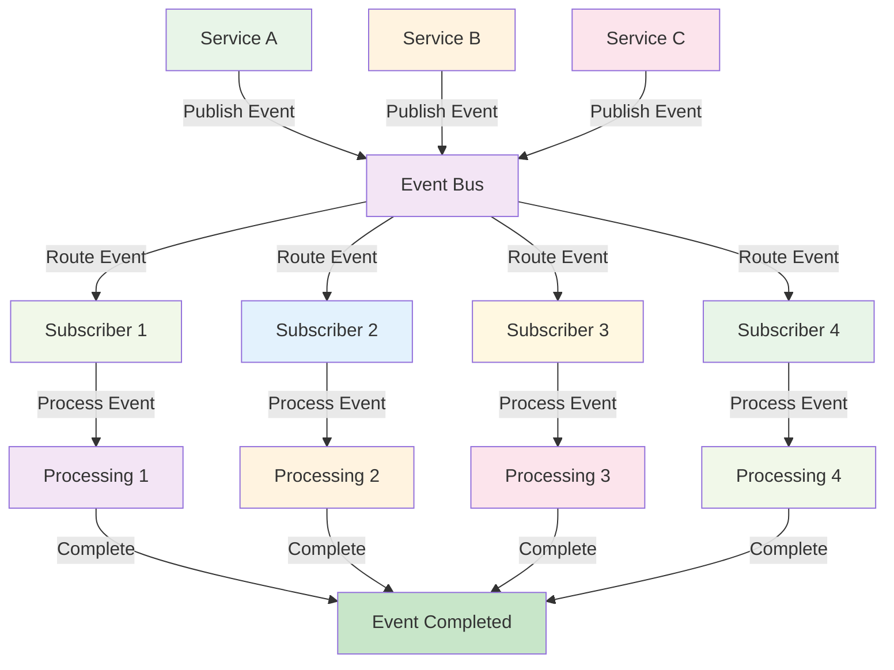
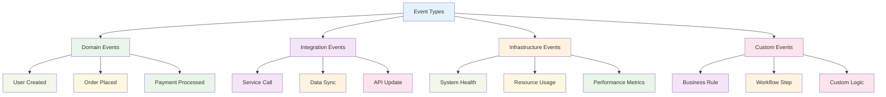
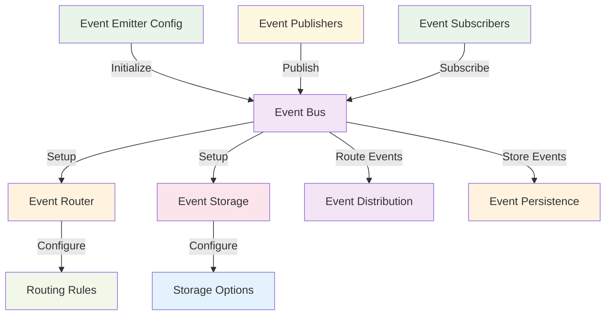
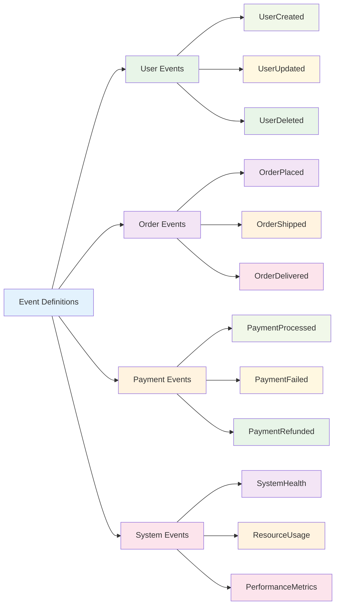
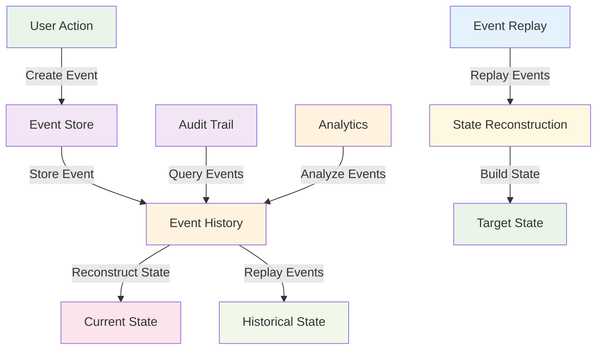
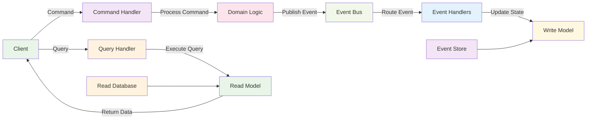

# Event-Driven Communication

:::tip 💡 Khái niệm cơ bản
Event-Driven Communication giống như "hệ thống thông báo" - services publish events và services khác subscribe để phản ứng, tạo ra hệ thống loose coupling và reactive.
:::

## Event-Driven Communication là gì?

**Lý thuyết cơ bản:**
Event-Driven Communication là một architectural pattern nơi services giao tiếp thông qua events. Services không gọi trực tiếp nhau mà publish events và subscribe vào events mà họ quan tâm. Đây là pattern có độ coupling thấp nhất và high scalability.

**Đặc điểm kỹ thuật:**
- **Event Publishing**: Services publish events về actions
- **Event Subscription**: Services subscribe vào events quan tâm
- **Loose Coupling**: Services không biết nhau trực tiếp
- **Asynchronous**: Events được xử lý asynchronously
- **Event Bus**: Central event broker quản lý events
- **Reactive Programming**: Services phản ứng với events

**Cách hoạt động:**
1. **Event Creation**: Service tạo event về một action
2. **Event Publishing**: Service publish event đến event bus
3. **Event Distribution**: Event bus distribute event đến subscribers
4. **Event Handling**: Subscribers xử lý events
5. **Event Processing**: Business logic được thực hiện

**Biến đổi trong quá trình xử lý:**
- **Event State**: Created → Published → Distributed → Processed → Completed
- **Service State**: Active → Publishing → Active → Subscribing → Processing → Active
- **System State**: Stable → Event Cascade → Processing → Stable

**Điểm mạnh (Strengths):**
- **Loose Coupling**: Services không biết nhau trực tiếp
- **High Scalability**: Dễ dàng scale services
- **Flexibility**: Dễ dàng thêm/bớt services
- **Reactive**: Services phản ứng với events
- **Event Sourcing**: Support event sourcing pattern
- **CQRS Support**: Support Command Query Responsibility Segregation
- **Audit Trail**: Complete audit trail của events
- **Asynchronous**: Asynchronous processing

**Điểm yếu (Weaknesses):**
- **Complexity**: Architecture phức tạp
- **Event Ordering**: Khó đảm bảo thứ tự events
- **Debugging**: Khó debug event flow
- **Performance Overhead**: Event routing overhead
- **Event Versioning**: Complex event versioning
- **Data Consistency**: Khó đảm bảo data consistency
- **Testing Complexity**: Complex testing scenarios
- **Monitoring Difficulty**: Khó monitor event flow

## Khi nào nên dùng và khi nào không nên dùng Event-Driven Communication

### **Khi nào NÊN dùng Event-Driven Communication:**

**1. Complex Workflows:**
- **Multi-step Processes**: Complex business workflows
- **Saga Pattern**: Distributed transaction management
- **Workflow Orchestration**: Business process orchestration
- **Event Chaining**: Events trigger other events

**2. Loose Coupling Requirements:**
- **Microservices Architecture**: Loose coupling giữa services
- **Independent Services**: Services cần độc lập
- **Service Evolution**: Services evolve independently
- **Technology Diversity**: Different technologies

**3. Reactive Systems:**
- **Real-time Systems**: Real-time event processing
- **IoT Applications**: Device event processing
- **Streaming Applications**: Data streaming
- **Event Processing**: Complex event processing

**4. Audit & Compliance:**
- **Audit Requirements**: Complete audit trail
- **Compliance Needs**: Regulatory compliance
- **Data Lineage**: Track data lineage
- **Historical Analysis**: Historical data analysis

### **Khi nào KHÔNG NÊN dùng Event-Driven Communication:**

**1. Simple CRUD Operations:**
- **Basic APIs**: Simple CRUD operations
- **Direct Communication**: Services cần gọi trực tiếp
- **Simple Workflows**: Basic business processes
- **Low Complexity**: Không cần complex event handling

**2. Synchronous Requirements:**
- **Immediate Response**: Cần response ngay lập tức
- **Synchronous Operations**: Operations cần synchronous
- **Real-time Validation**: Real-time validation
- **Immediate Consistency**: Cần consistency ngay lập tức

**3. Performance Critical:**
- **Low Latency**: Cần latency thấp
- **High Throughput**: High throughput requirements
- **Resource Constraints**: Limited resources
- **Simple Communication**: Simple communication needs

**4. Data Consistency Requirements:**
- **ACID Transactions**: Cần ACID compliance
- **Immediate Consistency**: Cần consistency ngay lập tức
- **Data Integrity**: Critical data integrity
- **Synchronous Validation**: Cần validate ngay lập tức

## Cách áp dụng Event-Driven Communication hiệu quả

### **1. Chiến lược áp dụng (Adoption Strategy):**

**Phase 1: Assessment & Planning**
- **Event Analysis**: Analyze business events
- **Event Design**: Design event structure
- **Event Flow**: Plan event flow
- **Technology Selection**: Choose event bus technology

**Phase 2: Implementation**
- **Event Bus Setup**: Setup event bus infrastructure
- **Event Publishers**: Implement event publishers
- **Event Handlers**: Implement event handlers
- **Event Routing**: Implement event routing

**Phase 3: Testing & Deployment**
- **Event Testing**: Test event flow
- **Integration Testing**: Test end-to-end scenarios
- **Performance Testing**: Load testing và optimization
- **Gradual Rollout**: Deploy từng bước

### **2. Best Practices khi áp dụng:**

**Event Design:**
- **Event Naming**: Consistent event naming convention
- **Event Versioning**: Implement event versioning
- **Event Schema**: Define event schema
- **Event Validation**: Validate event data

**Event Handling:**
- **Idempotency**: Ensure idempotent operations
- **Error Handling**: Proper error handling
- **Event Ordering**: Handle event ordering
- **Dead Letter Queues**: Implement dead letter queues

**Performance Optimization:**
- **Event Batching**: Batch events when possible
- **Event Filtering**: Filter events at source
- **Event Routing**: Optimize event routing
- **Event Storage**: Optimize event storage

### **3. Common Pitfalls và cách tránh:**

**Design Issues:**
- **❌ Complex Events**: Events quá phức tạp
- **❌ No Versioning**: Không có event versioning
- **❌ Poor Naming**: Event naming không nhất quán
- **❌ No Schema**: Không có event schema

**Performance Issues:**
- **❌ No Batching**: Không batch events
- **❌ No Filtering**: Không filter events
- **❌ Poor Routing**: Event routing không tối ưu
- **❌ No Monitoring**: Không monitor event flow

**✅ Cách tránh:**
- **Design First**: Thiết kế event structure trước
- **Plan for Scale**: Plan scaling từ đầu
- **Monitor Everything**: Monitor tất cả aspects
- **Test Thoroughly**: Test đầy đủ các scenarios

## Kiến trúc Event-Driven Communication

### **1. Event Flow - Lý thuyết và Quy trình**

**Lý thuyết về Event Flow:**
Event flow mô tả cách events di chuyển từ publishers đến subscribers thông qua event bus. Flow này đảm bảo loose coupling và reliable event delivery.

**Đặc điểm kỹ thuật:**
- **Unidirectional Flow**: Events flow từ publishers đến subscribers
- **Event Bus**: Central event routing và management
- **Event Distribution**: Distribute events đến subscribers
- **Event Processing**: Process events asynchronously

**Cách hoạt động:**
1. **Event Creation**: Publisher tạo event
2. **Event Publishing**: Publisher publish event đến event bus
3. **Event Routing**: Event bus route event đến subscribers
4. **Event Processing**: Subscribers process events
5. **Event Completion**: Event processing completed

**Biến đổi trong quá trình xử lý:**
- **Event State**: Created → Published → Routed → Processing → Completed
- **Event Bus State**: Idle → Routing → Distributing → Idle
- **Processing State**: Pending → Active → Completed → Failed

**Ưu điểm:**
- **Loose Coupling**: Publishers và subscribers không biết nhau
- **Scalability**: Dễ dàng scale services
- **Flexibility**: Flexible event handling
- **Reliability**: Reliable event delivery

**Nhược điểm:**
- **Complexity**: Event flow phức tạp
- **Event Ordering**: Khó đảm bảo event ordering
- **Debugging**: Khó debug event flow
- **Performance**: Event routing overhead

### **2. **Event Flow**

### **3. Event Types - Lý thuyết và Thực hành**

**Lý thuyết về Event Types:**
Event types định nghĩa các loại events khác nhau trong system. Mỗi event type có structure và purpose riêng biệt.

**Đặc điểm kỹ thuật:**
- **Domain Events**: Business domain events
- **Integration Events**: System integration events
- **Infrastructure Events**: Infrastructure events
- **Custom Events**: Custom business events

**Cách hoạt động:**
1. **Event Classification**: Classify events theo type
2. **Event Structure**: Define event structure
3. **Event Validation**: Validate event data
4. **Event Routing**: Route events theo type

**Biến đổi trong quá trình xử lý:**
- **Event State**: Classified → Structured → Validated → Routed → Processed
- **Type State**: Identified → Defined → Validated → Active
- **Routing State**: Pending → Routing → Routed → Completed

**Ưu điểm:**
- **Event Organization**: Organize events theo type
- **Type Safety**: Type-safe event handling
- **Event Validation**: Validate events theo type
- **Event Routing**: Route events theo type

**Nhược điểm:**
- **Type Complexity**: Event type complexity
- **Type Management**: Manage event types
- **Type Evolution**: Handle type evolution

### **4. **Event Types**

## NestJS Implementation

**Lý thuyết về Event-Driven Communication trong NestJS:**
NestJS cung cấp built-in support cho event-driven communication thông qua `@nestjs/event-emitter` package. Nó cho phép bạn publish và subscribe events một cách dễ dàng.

**Đặc điểm kỹ thuật:**
- **Event Emitter**: Built-in event emitter
- **Event Decorators**: Sử dụng `@OnEvent()` decorator
- **Event Publishing**: Publish events với `EventEmitter2`
- **Event Handling**: Handle events với event handlers

**Cách hoạt động:**
1. **Event Emitter Setup**: Setup event emitter
2. **Event Publishing**: Publish events
3. **Event Subscription**: Subscribe vào events
4. **Event Handling**: Handle events

**Biến đổi trong quá trình xử lý:**
- **Emitter State**: Uninitialized → Initialized → Active → Publishing
- **Event State**: Created → Published → Distributed → Handled
- **Handler State**: Unregistered → Registered → Active → Processing

**Ưu điểm:**
- **Native Integration**: Tích hợp tốt với NestJS
- **Event Decorators**: Sử dụng decorators
- **Type Safety**: TypeScript support
- **Easy Testing**: Dễ dàng test

**Nhược điểm:**
- **Learning Curve**: Cần hiểu event concepts
- **Event Complexity**: Event handling complexity
- **State Management**: Event state management

### **1. Event Emitter Setup - Lý thuyết và Thực hành**

**Lý thuyết về Event Emitter Setup:**
Event Emitter Setup trong NestJS liên quan đến việc cấu hình event emitter và thiết lập event infrastructure. Nó cho phép services publish và subscribe events.

**Đặc điểm kỹ thuật:**
- **Event Emitter Configuration**: Configure event emitter
- **Event Bus Setup**: Setup event bus
- **Event Routing**: Configure event routing
- **Event Storage**: Configure event storage

**Cách hoạt động:**
1. **Configuration**: Configure event emitter
2. **Event Bus Setup**: Setup event bus
3. **Event Routing**: Configure routing
4. **Event Storage**: Configure storage

**Biến đổi trong quá trình xử lý:**
- **Configuration State**: Unconfigured → Configured → Active
- **Event Bus State**: Uninitialized → Initialized → Active
- **Routing State**: Unconfigured → Configured → Active

**Ưu điểm:**
- **Flexible Configuration**: Flexible configuration options
- **Event Routing**: Configurable event routing
- **Event Storage**: Configurable event storage
- **Performance Tuning**: Performance tuning options

**Nhược điểm:**
- **Configuration Complexity**: Configuration complexity
- **Setup Overhead**: Setup overhead
- **Configuration Management**: Manage configurations

### **2. **Event Emitter Setup**

### **3. Event Definitions - Lý thuyết và Thực hành**

**Lý thuyết về Event Definitions:**
Event Definitions định nghĩa cấu trúc và properties của events. Chúng đảm bảo type safety và consistency trong event handling.

**Đặc điểm kỹ thuật:**
- **Event Structure**: Define event structure
- **Event Properties**: Define event properties
- **Event Validation**: Validate event data
- **Event Versioning**: Handle event versioning

**Cách hoạt động:**
1. **Event Design**: Design event structure
2. **Property Definition**: Define event properties
3. **Validation Rules**: Define validation rules
4. **Version Management**: Manage event versions

**Biến đổi trong quá trình xử lý:**
- **Event State**: Designed → Defined → Validated → Versioned
- **Property State**: Identified → Defined → Validated → Active
- **Version State**: Created → Versioned → Active → Deprecated

**Ưu điểm:**
- **Type Safety**: Type-safe event handling
- **Event Validation**: Validate event data
- **Event Consistency**: Consistent event structure
- **Event Evolution**: Handle event evolution

**Nhược điểm:**
- **Definition Complexity**: Event definition complexity
- **Version Management**: Version management complexity
- **Validation Overhead**: Validation overhead

### **4. **Event Definitions**

## Event-Driven Patterns

### **1. Event Sourcing - Lý thuyết và Thực hành**

**Lý thuyết về Event Sourcing:**
Event Sourcing là một pattern lưu trữ tất cả changes như events thay vì chỉ lưu current state. Pattern này cho phép reconstruct state và provide audit trail.

**Đặc điểm kỹ thuật:**
- **Event Store**: Store tất cả events
- **State Reconstruction**: Reconstruct state từ events
- **Audit Trail**: Complete audit trail
- **Event Replay**: Replay events

**Cách hoạt động:**
1. **Event Creation**: Create events cho mọi change
2. **Event Storage**: Store events trong event store
3. **State Reconstruction**: Reconstruct state từ events
4. **Event Replay**: Replay events khi cần

**Biến đổi trong quá trình xử lý:**
- **Event State**: Created → Stored → Reconstructed → Replayed
- **State State**: Current → Reconstructed → Historical
- **Store State**: Empty → Storing → Stored → Replaying

**Ưu điểm:**
- **Complete History**: Complete change history
- **Audit Trail**: Complete audit trail
- **State Reconstruction**: Reconstruct any state
- **Event Replay**: Replay events

**Nhược điểm:**
- **Storage Requirements**: High storage requirements
- **Complexity**: Implementation complexity
- **Performance Impact**: Performance impact
- **Query Complexity**: Complex queries

### **5. **Event Sourcing Pattern**

### **2. CQRS - Lý thuyết và Thực hành**

**Lý thuyết về CQRS:**
CQRS (Command Query Responsibility Segregation) là một pattern tách biệt read và write operations. Commands modify state, queries read state.

**Đặc điểm kỹ thuật:**
- **Command Side**: Handle write operations
- **Query Side**: Handle read operations
- **Event Sourcing**: Often used với event sourcing
- **Separate Models**: Separate read và write models

**Cách hoạt động:**
1. **Command Handling**: Handle write commands
2. **Event Publishing**: Publish events về changes
3. **State Update**: Update write model
4. **Query Handling**: Handle read queries

**Biến đổi trong quá trình xử lý:**
- **Command State**: Received → Validated → Processed → Completed
- **Event State**: Created → Published → Distributed → Processed
- **Query State**: Received → Routed → Executed → Returned

**Ưu điểm:**
- **Separation of Concerns**: Separate read và write
- **Optimization**: Optimize read và write separately
- **Scalability**: Scale read và write independently
- **Flexibility**: Flexible read và write models

**Nhược điểm:**
- **Complexity**: Implementation complexity
- **Consistency**: Eventual consistency
- **Data Synchronization**: Data synchronization complexity
- **Learning Curve**: Steep learning curve

### **6. **CQRS Pattern**

## Best Practices

### **1. Event Design - Lý thuyết và Nguyên tắc**

**Nguyên tắc cơ bản:**
- **Event Naming**: Consistent event naming convention
- **Event Versioning**: Implement event versioning
- **Event Schema**: Define event schema
- **Event Validation**: Validate event data

**Quy tắc lựa chọn:**
1. **Event Granularity**: Choose appropriate event granularity
2. **Event Structure**: Design consistent event structure
3. **Event Evolution**: Plan for event evolution
4. **Event Documentation**: Document events properly

**Trade-offs cần cân nhắc:**
- **Granularity vs Performance**: Balance granularity và performance
- **Structure vs Flexibility**: Balance structure và flexibility
- **Versioning vs Simplicity**: Balance versioning và simplicity

### **2. Event Handling - Lý thuyết và Chiến lược**

**Nguyên lý xử lý Events:**
- **Idempotency**: Ensure idempotent operations
- **Error Handling**: Handle errors gracefully
- **Event Ordering**: Handle event ordering
- **Dead Letter Queues**: Implement dead letter queues

**Chiến lược xử lý Events:**
- **Event Processing**: Process events efficiently
- **Error Recovery**: Recover from errors
- **Event Monitoring**: Monitor event processing
- **Performance Optimization**: Optimize performance

**Best Practices:**
- **Ensure Idempotency**: Ensure idempotent operations
- **Handle Errors**: Handle errors gracefully
- **Monitor Events**: Monitor event processing
- **Optimize Performance**: Optimize performance

### **3. Performance Optimization - Lý thuyết và Chiến lược**

**Nguyên lý tối ưu Performance:**
- **Event Batching**: Batch events when possible
- **Event Filtering**: Filter events at source
- **Event Routing**: Optimize event routing
- **Event Storage**: Optimize event storage

**Chiến lược tối ưu Performance:**
- **Batching Strategy**: Plan batching strategy
- **Filtering Strategy**: Plan filtering strategy
- **Routing Strategy**: Plan routing strategy
- **Storage Strategy**: Plan storage strategy

**Best Practices:**
- **Batch Events**: Batch events when possible
- **Filter Events**: Filter events at source
- **Optimize Routing**: Optimize event routing
- **Optimize Storage**: Optimize event storage

## So sánh với các Protocol khác

### **1. Event-Driven vs Message Queues:**

**Communication Pattern:**
- **Event-Driven**: Event publishing và subscription
- **Message Queues**: Message queuing và processing
- **Kết quả**: Event-Driven là pattern, Message Queues là implementation

**Use Cases:**
- **Event-Driven**: Event processing, reactive systems
- **Message Queues**: Task distribution, load balancing
- **Kết quả**: Tương tự nhau, khác implementation

**Architecture:**
- **Event-Driven**: Event-driven architecture
- **Message Queues**: Message queuing architecture
- **Kết quả**: Event-Driven là architectural pattern

### **2. Event-Driven vs REST:**

**Communication Pattern:**
- **Event-Driven**: Asynchronous, event-based
- **REST**: Synchronous, request-response
- **Kết quả**: Event-Driven cho async, REST cho sync

**Use Cases:**
- **Event-Driven**: Event processing, reactive systems
- **REST**: API calls, simple operations
- **Kết quả**: Khác nhau, không thay thế được nhau

**Performance:**
- **Event-Driven**: High throughput, async
- **REST**: Lower latency, sync
- **Kết quả**: Event-Driven cho throughput, REST cho latency

### **3. Event-Driven vs gRPC:**

**Communication Pattern:**
- **Event-Driven**: Event-based, asynchronous
- **gRPC**: RPC-based, synchronous
- **Kết quả**: Event-Driven cho events, gRPC cho RPC calls

**Use Cases:**
- **Event-Driven**: Event processing, reactive systems
- **gRPC**: Service-to-service communication
- **Kết quả**: Khác nhau, không thay thế được nhau

**Performance:**
- **Event-Driven**: High throughput, async
- **gRPC**: High performance, sync
- **Kết quả**: Event-Driven cho throughput, gRPC cho performance

---

:::tip 💡 Lời khuyên tổng kết - Lý thuyết và Thực hành

**Nguyên tắc cơ bản:**
- **Protocol Selection**: Event-Driven Communication phù hợp cho complex workflows và loose coupling
- **Performance vs Complexity**: Event-Driven có high scalability nhưng complexity cao
- **Coupling vs Flexibility**: Event-Driven loose coupling, high flexibility

**Quy tắc thực hành:**
1. **Event-Driven**: Cho complex workflows, loose coupling, reactive systems
2. **REST**: Cho simple APIs, CRUD operations
3. **gRPC**: Cho high-performance, service-to-service communication

**Lý do tại sao:**
- **Event-Driven**: Loose coupling, high scalability, reactive
- **REST**: Simple, universal, stateless
- **gRPC**: High performance, strong typing, streaming

**Cách xử lý biến đổi:**
- **State Management**: Event-Driven event-based state, REST stateless, gRPC stateful
- **Error Handling**: Event-Driven event replay, REST status codes, gRPC error codes
- **Performance Optimization**: Event-Driven batching, REST caching, gRPC connection pooling
:::

**Bài tiếp theo:** [Service Discovery](/docs/microservices/service-discovery)
