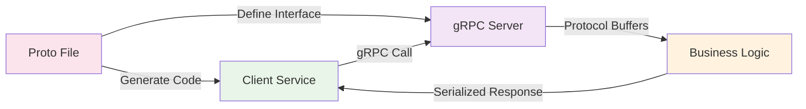
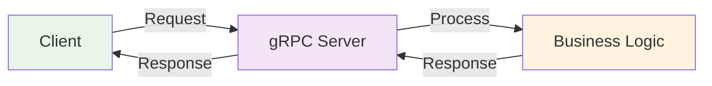
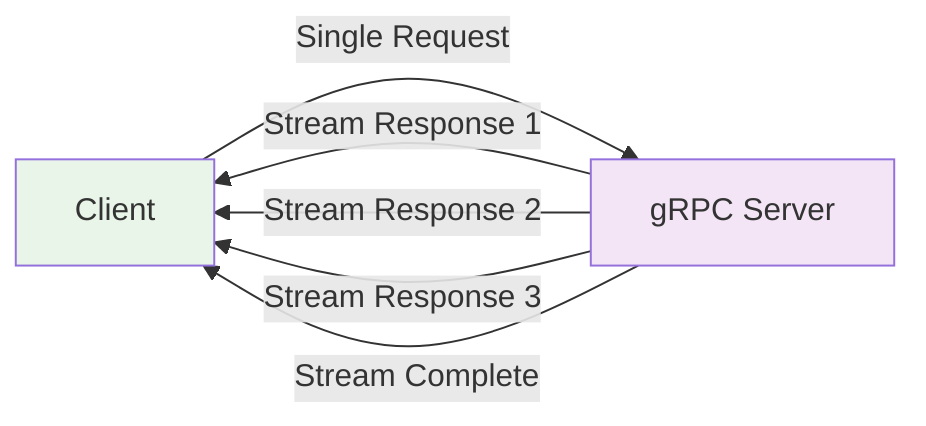
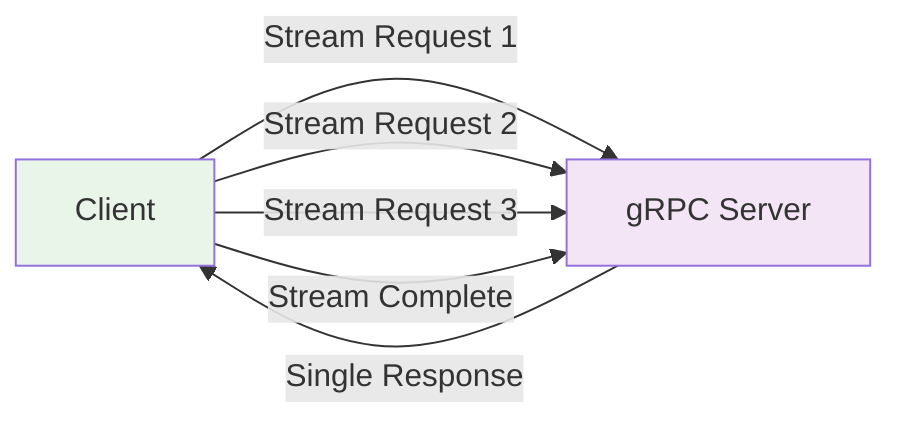
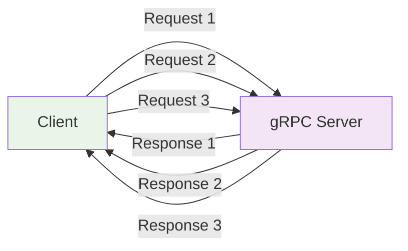

# gRPC Protocol

gRPC (Google Remote Procedure Call) là một framework RPC hiện đại, hiệu suất cao sử dụng Protocol Buffers để serialize data. Nó được thiết kế để hoạt động hiệu quả trong microservices architecture.



:::tip 💡 Khái niệm cơ bản
gRPC giống như "điện thoại trực tiếp" giữa các services - gọi trực tiếp và nhận response ngay lập tức với hiệu suất cao.
:::

## gRPC là gì?

**Lý thuyết cơ bản:**
gRPC là một framework RPC (Remote Procedure Call) hiện đại, sử dụng HTTP/2 làm transport layer và Protocol Buffers làm interface definition language. gRPC được thiết kế để cung cấp hiệu suất cao, cross-platform và hỗ trợ nhiều ngôn ngữ lập trình.

**Đặc điểm kỹ thuật:**
- **HTTP/2 Transport**: Sử dụng HTTP/2 với multiplexing và server push
- **Protocol Buffers**: Schema-first approach với binary serialization
- **Strong Typing**: Type safety across different languages
- **Bidirectional Streaming**: Hỗ trợ streaming data

**Cách hoạt động:**
1. **Service Definition**: Định nghĩa service interface bằng .proto file
2. **Code Generation**: Tự động generate client/server code
3. **Binary Communication**: Giao tiếp bằng binary protocol
4. **HTTP/2 Features**: Tận dụng HTTP/2 multiplexing

**Biến đổi trong quá trình xử lý:**
- **Request State**: Serialized → Transmitted → Deserialized → Processed
- **Connection State**: Idle → Active → Streaming → Idle
- **Data Format**: Text → Binary → Structured Data

**Điểm mạnh (Strengths):**
- **High Performance**: Binary protocol, HTTP/2 multiplexing, connection pooling
- **Type Safety**: Generated code với strong typing, compile-time error checking
- **Efficient**: Compression tự động, connection reuse, low memory overhead
- **Cross-Platform**: Hỗ trợ nhiều ngôn ngữ (Java, C++, Python, Go, Node.js)
- **Streaming Support**: Bidirectional streaming, real-time communication
- **Schema Evolution**: Backward compatibility, version management
- **Load Balancing**: Built-in load balancing và health checking

**Điểm yếu (Weaknesses):**
- **Complexity**: Phức tạp hơn REST, cần hiểu RPC concepts
- **Debugging**: Khó debug binary protocol, cần special tools
- **Browser Support**: Hạn chế trong browsers, chủ yếu cho server-to-server
- **Learning Curve**: Cần học Protocol Buffers, gRPC concepts
- **Tooling**: Ít tools hỗ trợ so với REST, debugging khó khăn
- **Human Readability**: Binary format không đọc được, khó troubleshoot
- **Network Issues**: Khó handle network problems, firewall issues
- **File Upload Limitations**: Không phù hợp cho file upload lớn, memory issues
- **Message Size Constraints**: Có giới hạn về kích thước message
- **Streaming Complexity**: Bidirectional streaming phức tạp để implement
- **Stateful Connections**: HTTP/2 connections có thể gây memory leaks
- **Load Balancing Challenges**: Khó implement load balancing cho gRPC
- **Service Discovery**: Cần special service discovery mechanisms
- **Security Complexity**: TLS, authentication phức tạp hơn REST
- **Testing Difficulties**: Unit testing và integration testing phức tạp

## Khi nào nên dùng và khi nào không nên dùng gRPC

### **Khi nào NÊN dùng gRPC:**

**1. High-Performance Requirements:**
- **Microservices Communication**: Service-to-service communication cần performance cao
- **Real-time Applications**: Chat apps, live streaming, gaming
- **High-throughput Systems**: Data processing, analytics, ETL pipelines
- **Low-latency Requirements**: Financial trading, real-time monitoring

**2. Strong Type Safety:**
- **Enterprise Applications**: Cần contract enforcement
- **API Versioning**: Cần backward compatibility
- **Multi-language Teams**: Teams sử dụng nhiều ngôn ngữ khác nhau
- **Contract-first Development**: API design trước, implementation sau

**3. Streaming Requirements:**
- **Bidirectional Communication**: Chat, notifications, real-time updates
- **Small Data Streaming**: Sensor data, real-time metrics, status updates
- **Event-driven Systems**: Real-time event processing
- **IoT Applications**: Device communication, sensor data
- **Real-time Analytics**: Live dashboards, monitoring data

**4. Server-to-Server Communication:**
- **Internal APIs**: Không cần browser access
- **Backend Services**: Database services, cache services
- **Infrastructure Services**: Monitoring, logging, configuration
- **Cloud-native Applications**: Kubernetes, Docker environments

### **Khi nào KHÔNG NÊN dùng gRPC:**

**1. Browser-based Applications:**
- **Web Frontends**: Browsers không hỗ trợ gRPC trực tiếp
- **Public APIs**: APIs cần browser access
- **Mobile Web Apps**: Progressive web applications
- **Third-party Integrations**: External services cần REST

**2. Simple CRUD Operations:**
- **Basic APIs**: CRUD operations đơn giản
- **Admin Panels**: Simple data management
- **Reporting Tools**: Basic data retrieval
- **Simple Integrations**: Third-party service connections

**3. Human-readable Requirements:**
- **Debugging Needs**: Cần đọc được request/response
- **API Documentation**: Cần human-readable format
- **Testing Tools**: Manual testing và debugging
- **Support Teams**: Technical support cần đọc logs

**4. File Upload & Large Data:**
- **File Upload Services**: Upload files lớn, images, videos
- **Document Processing**: PDF processing, document uploads
- **Media Streaming**: Video streaming, audio streaming
- **Data Import/Export**: Bulk data operations, CSV processing

**5. Load Balancing & Service Discovery:**
- **Simple Load Balancers**: Load balancers không hỗ trợ HTTP/2
- **Basic Service Discovery**: Không có service discovery infrastructure
- **Stateless Requirements**: Cần stateless communication
- **Horizontal Scaling**: Khó scale horizontally

**6. Security & Compliance:**
- **Strict Security Requirements**: Cần special security configurations
- **Compliance Needs**: Regulatory compliance requirements
- **Audit Logging**: Cần detailed audit trails
- **Access Control**: Complex authentication/authorization

**7. Testing & Development:**
- **Rapid Prototyping**: Cần quick API development
- **Manual Testing**: Cần manual API testing
- **Debugging Requirements**: Cần easy debugging
- **Team Skills**: Team không có gRPC experience

**8. Legacy System Integration:**
- **Old Systems**: Systems không hỗ trợ HTTP/2
- **Firewall Restrictions**: Corporate firewalls block gRPC
- **Proxy Issues**: Reverse proxies không hỗ trợ gRPC
- **Load Balancer Limitations**: Load balancers không hỗ trợ HTTP/2

### **Giải thích chi tiết về vấn đề File Upload:**

**Tại sao gRPC không phù hợp cho file upload:**

**1. Memory Constraints:**
- **gRPC**: Load toàn bộ file vào memory trước khi xử lý
- **Vấn đề**: Files lớn có thể gây out-of-memory errors
- **Giải pháp**: Cần implement chunked streaming phức tạp

**2. Message Size Limits:**
- **gRPC**: Có giới hạn về kích thước message (thường 4MB-100MB)
- **REST**: Không có giới hạn cứng, có thể handle files lớn
- **Kết quả**: gRPC bị giới hạn bởi message size

**3. Streaming Complexity:**
- **gRPC**: Bidirectional streaming phức tạp để implement
- **File Upload**: Cần chunked upload với progress tracking
- **Kết quả**: Code phức tạp, khó maintain

**4. Performance Issues:**
- **Small Files**: gRPC tốt hơn REST
- **Large Files**: REST tốt hơn gRPC
- **Lý do**: gRPC overhead cho files lớn

**5. Alternative Solutions:**
- **REST + Multipart**: Đơn giản, hiệu quả cho file upload
- **Message Queues**: Cho background file processing
- **Direct File Storage**: Upload trực tiếp đến cloud storage

### **Các vấn đề kỹ thuật khác:**

**1. Connection Management:**
- **HTTP/2 Connections**: Có thể gây memory leaks nếu không quản lý tốt
- **Connection Pooling**: Cần implement connection pooling đúng cách
- **Keep-alive Issues**: HTTP/2 keep-alive có thể gây vấn đề

**2. Load Balancing Challenges:**
- **L7 Load Balancing**: Cần load balancer hỗ trợ HTTP/2
- **Sticky Sessions**: Khó implement sticky sessions
- **Health Checking**: Health check phức tạp hơn HTTP/1.1

**3. Service Discovery Issues:**
- **Dynamic Registration**: Cần special service registry
- **Health Monitoring**: Health check phức tạp
- **Load Distribution**: Khó distribute load evenly

**4. Security & Compliance:**
- **TLS Configuration**: Cần cấu hình TLS đúng cách
- **Certificate Management**: Certificate rotation phức tạp
- **Audit Logging**: Khó log binary requests
- **Access Control**: JWT, OAuth integration phức tạp

**5. Testing & Debugging:**
- **Unit Testing**: Mock gRPC services phức tạp
- **Integration Testing**: End-to-end testing khó khăn
- **Performance Testing**: Load testing tools ít hỗ trợ gRPC
- **Debugging Tools**: Ít tools debug gRPC communication

## Kiến trúc gRPC

### 1. **gRPC Flow - Lý thuyết và Quy trình**

**Lý thuyết về gRPC Flow:**
gRPC sử dụng client-server architecture với code generation từ Protocol Buffer definitions. Client và server giao tiếp thông qua HTTP/2 với binary protocol.

**Cách hoạt động:**
1. **Proto Definition**: Định nghĩa service interface
2. **Code Generation**: Tự động tạo client stub và server skeleton
3. **Client Call**: Client gọi method thông qua stub
4. **HTTP/2 Transport**: Request được gửi qua HTTP/2
5. **Server Processing**: Server xử lý request và trả về response
6. **Response Return**: Response được trả về client

**Biến đổi trong quá trình xử lý:**
- **Code State**: Proto → Generated Code → Compiled → Running
- **Request State**: Method Call → Serialization → Transmission → Processing → Response
- **Connection State**: Established → Active → Idle

**Ưu điểm của kiến trúc:**
- **Separation of Concerns**: Interface definition tách biệt implementation
- **Type Safety**: Generated code đảm bảo type safety
- **Performance**: Binary protocol và HTTP/2 multiplexing
- **Scalability**: Connection pooling và load balancing

**Nhược điểm:**
- **Complexity**: Cần hiểu Protocol Buffers và gRPC concepts
- **Debugging**: Khó debug binary communication
- **Tooling**: Ít tools hỗ trợ so với REST

### 2. **Protocol Buffers - Lý thuyết và Cấu trúc**

**Lý thuyết về Protocol Buffers:**
Protocol Buffers (protobuf) là một data serialization format được thiết kế bởi Google. Nó sử dụng schema-first approach, nơi bạn định nghĩa cấu trúc data trước, sau đó generate code cho nhiều ngôn ngữ lập trình.

**Đặc điểm kỹ thuật:**
- **Schema Definition**: Định nghĩa cấu trúc data bằng .proto file
- **Binary Format**: Serialize data thành binary format
- **Backward Compatibility**: Hỗ trợ thay đổi schema mà không break existing code
- **Language Agnostic**: Hỗ trợ nhiều ngôn ngữ lập trình

**Cách hoạt động:**
1. **Schema Definition**: Viết .proto file định nghĩa service và messages
2. **Code Generation**: Sử dụng protoc compiler để generate code
3. **Serialization**: Convert data objects thành binary format
4. **Transmission**: Gửi binary data qua network
5. **Deserialization**: Convert binary data thành objects

**Biến đổi trong quá trình xử lý:**
- **Data State**: Structured Object → Serialized Binary → Transmitted → Deserialized → Structured Object
- **Schema State**: Proto Definition → Generated Code → Runtime Usage
- **Performance**: Text-based → Binary → Optimized

**Ưu điểm:**
- **Efficiency**: Binary format nhỏ hơn JSON/XML
- **Type Safety**: Strong typing với generated code
- **Performance**: Serialization/deserialization nhanh
- **Schema Evolution**: Hỗ trợ thay đổi schema

**Nhược điểm:**
- **Human Readability**: Binary format không đọc được
- **Schema Dependency**: Cần .proto file để deserialize
- **Learning Curve**: Cần học protobuf syntax
- **Tooling**: Ít tools hỗ trợ so với JSON

## Cách áp dụng gRPC hiệu quả

### **1. Chiến lược áp dụng (Adoption Strategy):**

**Phase 1: Assessment & Planning**
- **Evaluate Current Needs**: Xác định performance bottlenecks
- **Team Skills Assessment**: Đánh giá team có đủ skills không
- **Infrastructure Review**: Kiểm tra HTTP/2 support
- **Pilot Project**: Chọn 1 service để test

**Phase 2: Infrastructure Setup**
- **Load Balancer Configuration**: Cấu hình HTTP/2 support
- **Monitoring Setup**: gRPC metrics và tracing
- **Security Configuration**: TLS, authentication
- **Development Environment**: Local development setup

**Phase 3: Gradual Migration**
- **Start with Internal Services**: Services không cần external access
- **Parallel Implementation**: Chạy song song với REST
- **Performance Testing**: So sánh performance
- **Team Training**: Training về gRPC concepts

### **2. Best Practices khi áp dụng:**

**Design Principles:**
- **Contract-first Approach**: Định nghĩa proto trước
- **Service Granularity**: Services vừa đủ, không quá nhỏ
- **Error Handling**: Standardized error codes và messages
- **Versioning Strategy**: Semantic versioning cho APIs

**Performance Optimization:**
- **Connection Pooling**: Reuse connections
- **Streaming for Large Data**: Sử dụng streaming cho data lớn
- **Batch Operations**: Gộp nhiều operations
- **Caching Strategy**: Implement proper caching

**Monitoring & Observability:**
- **gRPC Metrics**: Request/response times, error rates
- **Distributed Tracing**: Track requests across services
- **Health Checks**: Service health monitoring
- **Logging Strategy**: Structured logging cho debugging

### **3. Common Pitfalls và cách tránh:**

**Technical Issues:**
- **❌ Không test performance**: Test performance trước khi migrate
- **❌ Ignore error handling**: Implement proper error handling
- **❌ Skip monitoring**: Setup monitoring từ đầu
- **❌ Forget versioning**: Plan versioning strategy

**Organizational Issues:**
- **❌ No team training**: Train team về gRPC
- **❌ Rush migration**: Migrate từng bước, không vội
- **❌ Ignore documentation**: Document APIs và processes
- **❌ Skip testing**: Comprehensive testing strategy

**✅ Cách tránh:**
- **Start Small**: Bắt đầu với 1 service
- **Measure Everything**: Monitor performance và errors
- **Train Team**: Invest vào team training
- **Document Everything**: Maintain good documentation

## gRPC trong NestJS

**Lý thuyết về gRPC trong NestJS:**
NestJS cung cấp built-in support cho gRPC thông qua `@nestjs/microservices` package. Nó cho phép bạn tạo gRPC servers và clients một cách dễ dàng với decorators và dependency injection.

**Đặc điểm kỹ thuật:**
- **Microservice Transport**: Hỗ trợ gRPC transport
- **Decorator-based**: Sử dụng `@GrpcMethod` và `@GrpcStreamMethod`
- **Dependency Injection**: Tích hợp với NestJS DI container
- **Observable Support**: Hỗ trợ RxJS Observables cho streaming

**Cách hoạt động:**
1. **Transport Configuration**: Cấu hình gRPC transport trong main.ts
2. **Service Registration**: Đăng ký services với gRPC methods
3. **Method Implementation**: Implement các gRPC methods
4. **Client Communication**: Clients gọi methods thông qua gRPC

**Biến đổi trong quá trình xử lý:**
- **Service State**: Unregistered → Registered → Active → Handling Requests
- **Request State**: gRPC Call → Method Resolution → Service Execution → Response
- **Transport State**: Disconnected → Connected → Streaming → Idle

**Ưu điểm:**
- **Native Integration**: Tích hợp tốt với NestJS ecosystem
- **Type Safety**: Generated types từ protobuf
- **Streaming Support**: Hỗ trợ đầy đủ gRPC streaming
- **Performance**: High-performance gRPC communication

**Nhược điểm:**
- **Complexity**: Cần hiểu cả NestJS và gRPC
- **Debugging**: Khó debug gRPC communication
- **Learning Curve**: Cần học protobuf và gRPC concepts

### 1. **Cài đặt Dependencies**

### 2. **Cấu hình gRPC Server - Lý thuyết và Thực hành**

**Lý thuyết về cấu hình gRPC Server:**
Cấu hình gRPC server trong NestJS liên quan đến việc thiết lập transport layer, định nghĩa proto file path, và cấu hình các options cho gRPC communication.

**Đặc điểm kỹ thuật:**
- **Transport Type**: Chỉ định gRPC transport
- **Proto Path**: Đường dẫn đến .proto file
- **Package Name**: Tên package trong proto definition
- **Server URL**: Địa chỉ và port của server
- **Loader Options**: Cấu hình protobuf loader

**Cách hoạt động:**
1. **Transport Selection**: Chọn gRPC transport
2. **Proto Loading**: Load proto file từ filesystem
3. **Service Registration**: Đăng ký services từ proto
4. **Server Binding**: Bind server vào specified port
5. **Request Handling**: Xử lý incoming gRPC requests

**Biến đổi trong quá trình xử lý:**
- **Server State**: Uninitialized → Configured → Bound → Listening → Handling Requests
- **Proto State**: File → Loaded → Parsed → Services Registered
- **Network State**: Closed → Open → Accepting Connections

**Ưu điểm:**
- **Flexible Configuration**: Nhiều options cấu hình
- **Proto Integration**: Tích hợp tốt với protobuf
- **Performance Tuning**: Có thể tune performance options
- **Development Support**: Hỗ trợ development và production

**Nhược điểm:**
- **Configuration Complexity**: Nhiều options cần cấu hình
- **Proto Dependency**: Phụ thuộc vào proto file
- **Error Handling**: Cần xử lý configuration errors

### 3. **Service Implementation - Lý thuyết và Thực hành**

**Lý thuyết về Service Implementation:**
Service implementation trong gRPC sử dụng decorators để map các gRPC methods với service methods. Mỗi gRPC method được implement như một service method với proper error handling và response formatting.

**Đặc điểm kỹ thuật:**
- **Decorator-based**: Sử dụng `@GrpcMethod` để map gRPC methods
- **Streaming Support**: Hỗ trợ server streaming với `@GrpcStreamMethod`
- **Observable Pattern**: Sử dụng RxJS Observables cho streaming
- **Error Handling**: Proper error handling và propagation
- **Type Safety**: Generated types từ protobuf

**Cách hoạt động:**
1. **Method Registration**: Decorator đăng ký method với gRPC service
2. **Request Processing**: Nhận và validate incoming requests
3. **Business Logic**: Thực hiện business logic
4. **Response Generation**: Tạo và format response
5. **Streaming**: Xử lý streaming data nếu cần

**Biến đổi trong quá trình xử lý:**
- **Method State**: Unregistered → Registered → Active → Processing → Completed
- **Request State**: Received → Validated → Processed → Response Generated
- **Data State**: Raw Request → Validated Data → Business Result → Formatted Response

**Ưu điểm:**
- **Clean Architecture**: Separation of concerns rõ ràng
- **Type Safety**: Generated types đảm bảo type safety
- **Streaming Support**: Hỗ trợ đầy đủ gRPC streaming patterns
- **Error Handling**: Proper error handling và propagation

**Nhược điểm:**
- **Complexity**: Cần hiểu RxJS Observables
- **Debugging**: Khó debug streaming operations
- **Memory Management**: Cần quản lý memory cho streaming
- **Error Propagation**: Complex error handling trong streams

### 4. **gRPC Client**

```typescript title="gRPC Client Configuration"
// user-client.service.ts
import { Injectable, OnModuleInit } from '@nestjs/common';
import { ClientGrpc, Client, Transport } from '@nestjs/microservices';
import { join } from 'path';

interface UserService {
  getUser(data: { user_id: string }): Promise<any>;
  getUsers(data: { page: number; limit: number; search?: string }): Observable<any>;
  createUsers(requests: Observable<any>): Promise<any>;
  chat(messages: Observable<any>): Observable<any>;
}

@Injectable()
export class UserClientService implements OnModuleInit {
  @Client({
    transport: Transport.GRPC,
    options: {
      package: 'user',
      protoPath: join(__dirname, 'proto/user.proto'),
      url: 'localhost:5000',
      loader: {
        keepCase: true,
        longs: String,
        enums: String,
        defaults: true,
        oneofs: true,
      },
    },
  })
  private client: ClientGrpc;

  private userService: UserService;

  onModuleInit() {
    this.userService = this.client.getService<UserService>('UserService');
  }

  async getUser(userId: string): Promise<any> {
    return this.userService.getUser({ user_id: userId });
  }

  getUsers(page: number, limit: number, search?: string): Observable<any> {
    return this.userService.getUsers({ page, limit, search });
  }

  async createUsers(users: Array<{ name: string; email: string; password: string }>): Promise<any> {
    const requests = new Observable(subscriber => {
      users.forEach(user => subscriber.next(user));
      subscriber.complete();
    });
    
    return this.userService.createUsers(requests);
  }

  chat(message: string): Observable<any> {
    const messages = new Observable(subscriber => {
      subscriber.next({ user_id: 'client', message, timestamp: new Date() });
      subscriber.complete();
    });
    
    return this.userService.chat(messages);
  }
}
```

## gRPC Communication Patterns

### 1. **Unary RPC (Request-Response)**



```typescript title="Unary RPC Example"
// Server
@GrpcMethod('UserService', 'GetUser')
async getUser(data: { user_id: string }): Promise<any> {
  const user = await this.userRepository.findOne(data.user_id);
  return this.mapToGrpcResponse(user);
}

// Client
const user = await this.userClient.getUser('user123');
console.log('User:', user);
```

### 2. **Server Streaming RPC**



```typescript title="Server Streaming Example"
// Server
@GrpcMethod('UserService', 'GetUsers')
getUsers(data: { page: number; limit: number }): Observable<any> {
  return new Observable(subscriber => {
    this.userRepository.findAll(data.page, data.limit).then(users => {
      users.forEach(user => subscriber.next(this.mapToGrpcResponse(user)));
      subscriber.complete();
    });
  });
}

// Client
this.userClient.getUsers(1, 10).subscribe({
  next: (user) => console.log('Received user:', user),
  complete: () => console.log('Stream completed'),
  error: (error) => console.error('Stream error:', error),
});
```

### 3. **Client Streaming RPC**



```typescript title="Client Streaming Example"
// Server
@GrpcMethod('UserService', 'CreateUsers')
async createUsers(requests: Observable<any>): Promise<any> {
  const userIds: string[] = [];
  
  return new Promise((resolve, reject) => {
    requests.subscribe({
      next: async (request) => {
        const user = await this.userRepository.create(request);
        userIds.push(user.id);
      },
      complete: () => resolve({ user_ids: userIds, total_created: userIds.length }),
      error: reject,
    });
  });
}

// Client
const users = [
  { name: 'John', email: 'john@example.com', password: 'password123' },
  { name: 'Jane', email: 'jane@example.com', password: 'password456' },
];

const requests = new Observable(subscriber => {
  users.forEach(user => subscriber.next(user));
  subscriber.complete();
});

const result = await this.userClient.createUsers(requests);
console.log('Created users:', result);
```

### 4. **Bidirectional Streaming RPC**



```typescript title="Bidirectional Streaming Example"
// Server
@GrpcStreamMethod('UserService', 'Chat')
chat(messages: Observable<any>): Observable<any> {
  return messages.pipe(
    map(message => ({
      user_id: 'server',
      message: `Echo: ${message.message}`,
      timestamp: new Date(),
    }))
  );
}

// Client
const messages = new Observable(subscriber => {
  subscriber.next({ user_id: 'client', message: 'Hello!', timestamp: new Date() });
  subscriber.next({ user_id: 'client', message: 'How are you?', timestamp: new Date() });
  setTimeout(() => subscriber.complete(), 1000);
});

this.userClient.chat(messages).subscribe({
  next: (response) => console.log('Server response:', response),
  complete: () => console.log('Chat completed'),
});
```

## So sánh với các Protocol khác

### **1. gRPC vs REST:**

**Performance:**
- **gRPC**: Binary protocol, HTTP/2, multiplexing, compression
- **REST**: Text-based, HTTP/1.1, no multiplexing, no compression
- **Kết quả**: gRPC nhanh hơn 2-10x tùy use case

**Type Safety:**
- **gRPC**: Strong typing, generated code, compile-time validation
- **REST**: No built-in typing, runtime validation, manual parsing
- **Kết quả**: gRPC ít bugs hơn, development nhanh hơn

**Streaming:**
- **gRPC**: Bidirectional streaming, real-time communication
- **REST**: Request-response only, no streaming
- **Kết quả**: gRPC phù hợp cho real-time apps

**Browser Support:**
- **gRPC**: Limited browser support, mainly server-to-server
- **REST**: Full browser support, universal compatibility
- **Kết quả**: REST tốt hơn cho public APIs

### **2. gRPC vs GraphQL:**

**Data Fetching:**
- **gRPC**: Fixed contracts, efficient binary transfer
- **GraphQL**: Flexible queries, over-fetching prevention
- **Kết quả**: gRPC tốt cho fixed APIs, GraphQL tốt cho flexible queries

**Performance:**
- **gRPC**: Binary protocol, HTTP/2, high performance
- **GraphQL**: Text-based, HTTP/1.1, query complexity issues
- **Kết quả**: gRPC performance tốt hơn cho simple operations

**Learning Curve:**
- **gRPC**: RPC concepts, Protocol Buffers
- **GraphQL**: Query language, schema design
- **Kết quả**: Cả hai đều có learning curve cao

### **3. gRPC vs Message Queues:**

**Communication Pattern:**
- **gRPC**: Synchronous, request-response, real-time
- **Message Queues**: Asynchronous, fire-and-forget, eventual consistency
- **Kết quả**: gRPC cho real-time, MQ cho async processing

**Use Cases:**
- **gRPC**: Service-to-service calls, real-time communication
- **Message Queues**: Background jobs, event processing, decoupling
- **Kết quả**: Khác nhau, không thay thế được nhau

## gRPC Best Practices

### 1. **Error Handling**

```typescript title="gRPC Error Handling Best Practice"
// ✅ Tốt - Xử lý lỗi với gRPC status codes
@GrpcMethod('UserService', 'GetUser')
async getUser(data: { user_id: string }): Promise<any> {
  try {
    const user = await this.userRepository.findOne(data.user_id);
    
    if (!user) {
      throw new RpcException({
        code: 5, // NOT_FOUND
        message: 'User not found',
        details: `No user found with ID: ${data.user_id}`,
      });
    }
    
    return this.mapToGrpcResponse(user);
  } catch (error) {
    if (error instanceof RpcException) {
      throw error;
    }
    
    this.logger.error('Failed to get user', error);
    throw new RpcException({
      code: 13, // INTERNAL
      message: 'Internal server error',
    });
  }
}

// Client error handling
try {
  const user = await this.userClient.getUser('invalid-id');
} catch (error) {
  if (error.code === 5) { // NOT_FOUND
    console.log('User not found');
  } else if (error.code === 13) { // INTERNAL
    console.log('Server error');
  }
}
```

### 2. **Performance Optimization**

```typescript title="gRPC Performance Optimization"
// ✅ Tốt - Tối ưu performance cho gRPC
@Injectable()
export class OptimizedUserService {
  constructor(
    private readonly userRepository: UserRepository,
    private readonly cacheService: CacheService,
  ) {}

  @GrpcMethod('UserService', 'GetUser')
  async getUser(data: { user_id: string }): Promise<any> {
    // Check cache first
    const cachedUser = await this.cacheService.get(`user:${data.user_id}`);
    if (cachedUser) {
      return cachedUser;
    }

    // Get from database
    const user = await this.userRepository.findOne(data.user_id);
    if (!user) {
      throw new RpcException({ code: 5, message: 'User not found' });
    }

    // Cache the result
    const grpcResponse = this.mapToGrpcResponse(user);
    await this.cacheService.set(`user:${data.user_id}`, grpcResponse, 300); // 5 minutes

    return grpcResponse;
  }

  @GrpcMethod('UserService', 'GetUsers')
  getUsers(data: { page: number; limit: number }): Observable<any> {
    return new Observable(subscriber => {
      // Use pagination and streaming
      this.userRepository
        .findAllPaginated(data.page, data.limit)
        .then(users => {
          users.forEach(user => {
            const response = this.mapToGrpcResponse(user);
            subscriber.next(response);
          });
          subscriber.complete();
        })
        .catch(error => subscriber.error(error));
    });
  }
}
```

### 3. **Connection Management**

```typescript title="gRPC Connection Management"
// ✅ Tốt - Quản lý connection hiệu quả
@Injectable()
export class UserClientService implements OnModuleInit, OnModuleDestroy {
  private client: ClientGrpc;
  private userService: UserService;

  constructor() {
    this.client = ClientProxyFactory.create({
      transport: Transport.GRPC,
      options: {
        package: 'user',
        protoPath: join(__dirname, 'proto/user.proto'),
        url: 'localhost:5000',
        loader: {
          keepCase: true,
          longs: String,
          enums: String,
          defaults: true,
          oneofs: true,
        },
        // Connection options
        maxReceiveMessageLength: 1024 * 1024 * 10, // 10MB
        maxSendMessageLength: 1024 * 1024 * 10,    // 10MB
        keepalive: {
          keepaliveTimeMs: 120000, // 2 minutes
          keepaliveTimeoutMs: 20000, // 20 seconds
          keepalivePermitWithoutCalls: true,
          http2MaxPingsWithoutData: 0,
          http2MinTimeBetweenPingsMs: 120000, // 2 minutes
          http2MinPingIntervalWithoutDataMs: 300000, // 5 minutes
        },
      },
    });
  }

  onModuleInit() {
    this.userService = this.client.getService<UserService>('UserService');
  }

  onModuleDestroy() {
    this.client.close();
  }
}
```

## gRPC vs REST Comparison

### Bảng so sánh chi tiết

| Tiêu chí | gRPC | REST/HTTP |
|----------|------|------------|
| **Protocol** | HTTP/2 | HTTP/1.1 |
| **Data Format** | Protocol Buffers (Binary) | JSON/XML (Text) |
| **Performance** | ⭐⭐⭐⭐⭐ | ⭐⭐⭐ |
| **Type Safety** | ⭐⭐⭐⭐⭐ | ⭐⭐ |
| **Streaming** | ⭐⭐⭐⭐⭐ | ⭐⭐ |
| **Browser Support** | ⭐⭐ | ⭐⭐⭐⭐⭐ |
| **Learning Curve** | ⭐⭐⭐ | ⭐⭐ |
| **Tooling** | ⭐⭐⭐⭐ | ⭐⭐⭐⭐⭐ |
| **Caching** | ⭐⭐ | ⭐⭐⭐⭐⭐ |
| **Debugging** | ⭐⭐⭐ | ⭐⭐⭐⭐⭐ |

### Use Case Recommendations

```typescript title="Protocol Selection Guidelines"
class ProtocolSelection {
  // ✅ Dùng gRPC cho:
  // - High-performance APIs
  // - Service-to-service communication
  // - Real-time streaming
  // - Strong typing requirements
  // - Internal microservices
  
  // ✅ Dùng REST cho:
  // - Public APIs
  // - Browser clients
  // - Simple CRUD operations
  // - Third-party integrations
  // - Caching requirements
}
```

---

:::tip 💡 Lời khuyên tổng kết
- Sử dụng gRPC cho high-performance, service-to-service communication
- Protocol Buffers cung cấp type safety và hiệu suất cao
- Implement proper error handling với gRPC status codes
- Optimize performance với connection pooling và caching
- Chọn protocol phù hợp với use case cụ thể
- Monitor và optimize gRPC performance metrics
:::

**Bài tiếp theo:** [REST Protocol](/docs/microservices/communication/rest-protocol)
