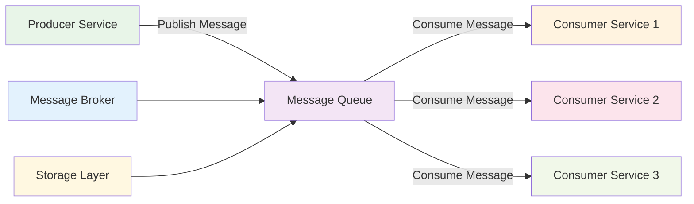
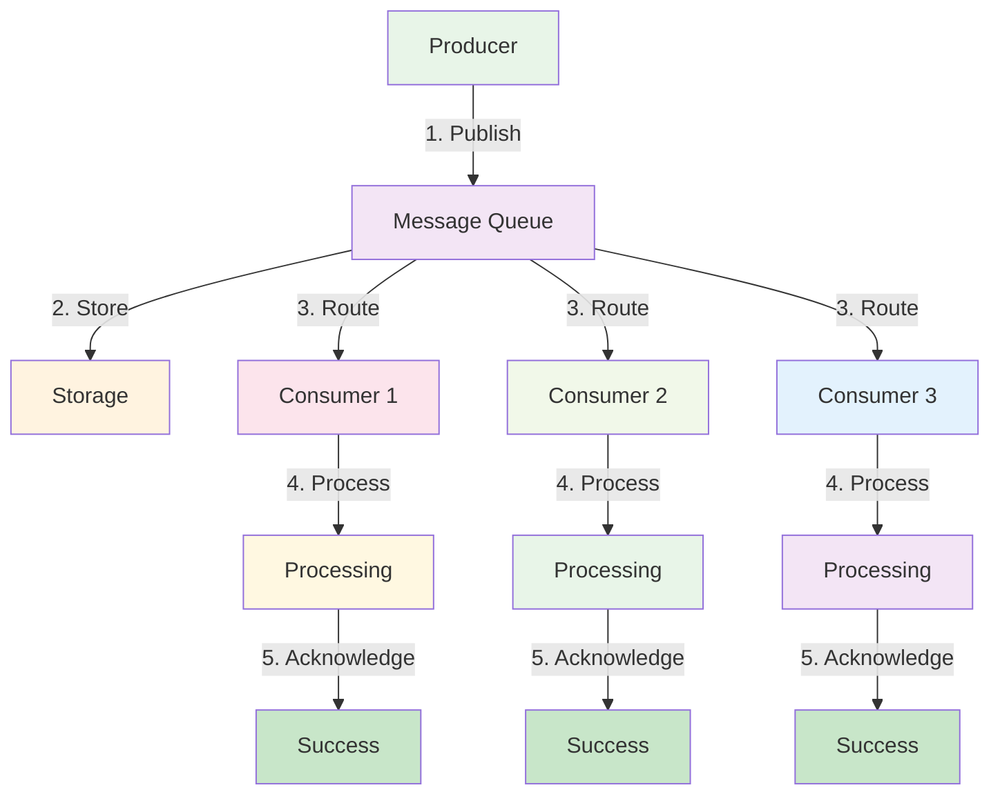
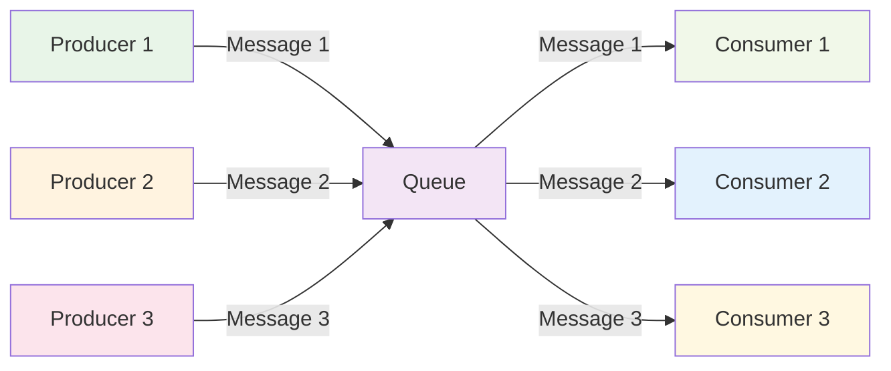
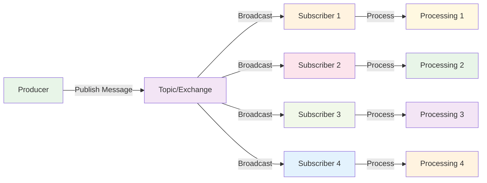
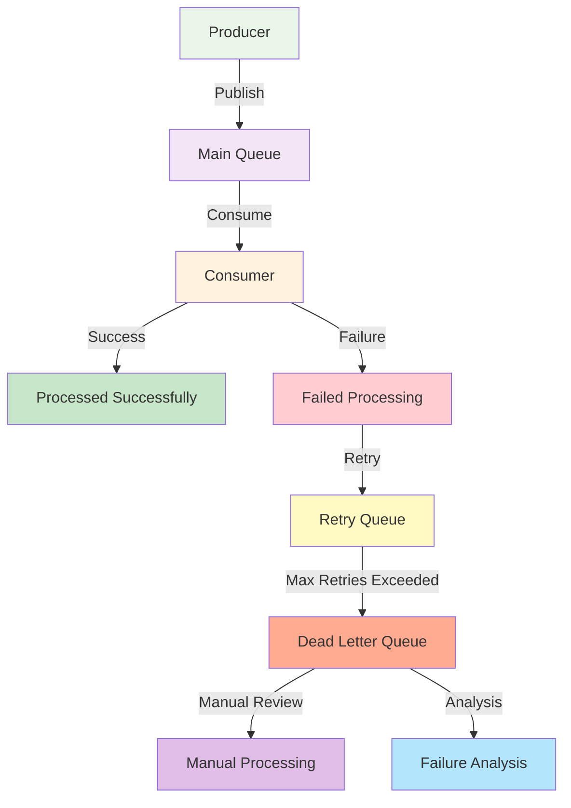
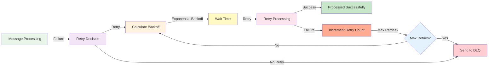
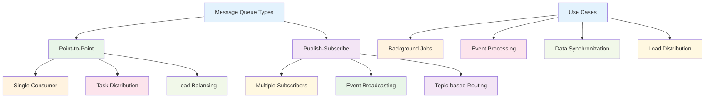

# Message Queues

:::tip 💡 Khái niệm cơ bản
Message Queues giống như "hộp thư" giữa các services - gửi message và quên đi, service khác sẽ xử lý khi có thời gian.
:::

## Message Queues là gì?

**Lý thuyết cơ bản:**
Message Queues là một pattern cho asynchronous communication giữa các services. Thay vì gọi trực tiếp nhau, services gửi messages vào queue và services khác consume messages từ queue. Đây là pattern có độ coupling thấp và high scalability.

**Đặc điểm kỹ thuật:**
- **Asynchronous Communication**: Services không gọi trực tiếp nhau
- **Message Persistence**: Messages được lưu trữ trong queue
- **Decoupled Architecture**: Services không biết nhau trực tiếp
- **Reliable Delivery**: Messages được đảm bảo delivery
- **Load Balancing**: Tự động distribute load giữa consumers
- **Fault Tolerance**: Handle failures và retries

**Cách hoạt động:**
1. **Producer**: Service gửi message vào queue
2. **Queue Storage**: Message được lưu trữ trong queue
3. **Consumer**: Service khác consume message từ queue
4. **Processing**: Consumer xử lý message
5. **Acknowledgment**: Consumer xác nhận đã xử lý xong

**Biến đổi trong quá trình xử lý:**
- **Message State**: Created → Queued → Processing → Completed/Failed
- **Queue State**: Empty → Has Messages → Processing → Empty
- **Service State**: Idle → Producing → Idle → Consuming → Idle

**Điểm mạnh (Strengths):**
- **Asynchronous Processing**: Không block producers
- **High Scalability**: Có thể scale producers và consumers độc lập
- **Decoupling**: Services không biết nhau trực tiếp
- **Reliability**: Messages được đảm bảo delivery
- **Load Balancing**: Tự động distribute load
- **Fault Tolerance**: Handle failures và retries
- **Message Persistence**: Messages được lưu trữ
- **Batch Processing**: Có thể process messages theo batch

**Điểm yếu (Weaknesses):**
- **Complexity**: Phức tạp hơn synchronous communication
- **Message Ordering**: Khó đảm bảo thứ tự messages
- **Debugging**: Khó debug và trace message flow
- **Latency**: Có latency do queuing
- **Resource Usage**: Cần storage cho messages
- **Monitoring**: Khó monitor và observe
- **Testing**: Complex testing scenarios
- **Message Duplication**: Có thể có duplicate messages

## Khi nào nên dùng và khi nào không nên dùng Message Queues

### **Khi nào NÊN dùng Message Queues:**

**1. Asynchronous Processing:**
- **Background Jobs**: Email sending, file processing, report generation
- **Event Processing**: User actions, system events, notifications
- **Data Synchronization**: Sync data giữa services
- **Batch Operations**: Process large datasets

**2. High Scalability Requirements:**
- **High-throughput Systems**: Handle large number of requests
- **Peak Load Handling**: Handle traffic spikes
- **Resource Optimization**: Optimize resource usage
- **Horizontal Scaling**: Scale services independently

**3. Decoupling Requirements:**
- **Microservices Architecture**: Loose coupling giữa services
- **Event-driven Systems**: Event-driven architecture
- **Integration Scenarios**: Integrate với external systems
- **Legacy System Integration**: Integrate với old systems

**4. Reliability Requirements:**
- **Critical Operations**: Operations không thể fail
- **Retry Logic**: Cần retry failed operations
- **Dead Letter Queues**: Handle failed messages
- **Message Persistence**: Messages cần được lưu trữ

### **Khi nào KHÔNG NÊN dùng Message Queues:**

**1. Real-time Requirements:**
- **Immediate Response**: Cần response ngay lập tức
- **User Interactions**: User cần feedback ngay
- **Real-time Applications**: Chat apps, live streaming
- **Synchronous Operations**: Operations cần synchronous

**2. Simple CRUD Operations:**
- **Basic APIs**: Simple CRUD operations
- **Direct Communication**: Services cần gọi trực tiếp
- **Simple Workflows**: Basic business processes
- **Low Complexity**: Không cần async processing

**3. Data Consistency Requirements:**
- **ACID Transactions**: Cần ACID compliance
- **Immediate Consistency**: Cần consistency ngay lập tức
- **Data Integrity**: Critical data integrity requirements
- **Synchronous Validation**: Cần validate ngay lập tức

**4. Performance Critical:**
- **Low Latency**: Cần latency thấp
- **High Frequency**: High frequency operations
- **Real-time Analytics**: Real-time data processing
- **Critical Path**: Operations trong critical path

## Cách áp dụng Message Queues hiệu quả

### **1. Chiến lược áp dụng (Adoption Strategy):**

**Phase 1: Assessment & Planning**
- **Use Case Analysis**: Xác định use cases phù hợp
- **Message Design**: Thiết kế message structure
- **Queue Architecture**: Thiết kế queue architecture
- **Technology Selection**: Chọn message queue technology

**Phase 2: Infrastructure Setup**
- **Queue Setup**: Setup message queue infrastructure
- **Producer Implementation**: Implement message producers
- **Consumer Implementation**: Implement message consumers
- **Monitoring Setup**: Setup monitoring và alerting

**Phase 3: Testing & Deployment**
- **Unit Testing**: Test producers và consumers
- **Integration Testing**: Test end-to-end scenarios
- **Performance Testing**: Load testing và optimization
- **Gradual Rollout**: Deploy từng bước

### **2. Best Practices khi áp dụng:**

**Message Design:**
- **Structured Messages**: Sử dụng structured message format
- **Message Versioning**: Implement message versioning
- **Schema Validation**: Validate message schema
- **Error Handling**: Proper error handling trong messages

**Queue Management:**
- **Queue Naming**: Consistent queue naming convention
- **Queue Configuration**: Proper queue configuration
- **Dead Letter Queues**: Implement dead letter queues
- **Message TTL**: Set appropriate message TTL

**Producer & Consumer:**
- **Idempotency**: Ensure idempotent operations
- **Error Handling**: Proper error handling và retries
- **Monitoring**: Monitor producers và consumers
- **Health Checks**: Implement health checks

### **3. Common Pitfalls và cách tránh:**

**Design Issues:**
- **❌ Message Size**: Messages quá lớn
- **❌ Complex Messages**: Messages quá phức tạp
- **❌ No Versioning**: Không có message versioning
- **❌ Poor Error Handling**: Error handling không đầy đủ

**Performance Issues:**
- **❌ No Monitoring**: Không monitor queue performance
- **❌ Poor Scaling**: Không scale consumers properly
- **❌ No Batching**: Không sử dụng batch processing
- **❌ Ignore Latency**: Không quan tâm đến latency

**✅ Cách tránh:**
- **Design First**: Thiết kế message structure trước
- **Monitor Everything**: Monitor tất cả aspects
- **Test Thoroughly**: Test đầy đủ các scenarios
- **Plan for Scale**: Plan scaling từ đầu

## Kiến trúc Message Queues

### **1. Basic Architecture - Lý thuyết và Thực hành**

**Lý thuyết về Basic Architecture:**
Message Queue architecture bao gồm producers, queues, và consumers. Producers gửi messages vào queues, consumers lấy messages từ queues để xử lý. Architecture này đảm bảo loose coupling và high scalability.

**Đặc điểm kỹ thuật:**
- **Producer-Service**: Services tạo và gửi messages
- **Queue Storage**: Persistent storage cho messages
- **Consumer-Service**: Services consume và xử lý messages
- **Message Broker**: Central message routing và management

**Cách hoạt động:**
1. **Message Creation**: Producer tạo message
2. **Message Publishing**: Producer publish message vào queue
3. **Queue Storage**: Message được lưu trữ trong queue
4. **Message Consumption**: Consumer consume message từ queue
5. **Message Processing**: Consumer xử lý message
6. **Acknowledgment**: Consumer xác nhận đã xử lý xong

**Biến đổi trong quá trình xử lý:**
- **Message State**: Created → Published → Queued → Consumed → Processed → Acknowledged
- **Queue State**: Empty → Has Messages → Processing → Empty
- **Service State**: Idle → Producing → Idle → Consuming → Processing → Idle

**Ưu điểm:**
- **Loose Coupling**: Producers và consumers không biết nhau
- **High Scalability**: Scale producers và consumers độc lập
- **Reliability**: Messages được đảm bảo delivery
- **Fault Tolerance**: Handle failures và retries

**Nhược điểm:**
- **Complexity**: Architecture phức tạp hơn
- **Latency**: Có latency do queuing
- **Resource Usage**: Cần storage cho messages
- **Debugging**: Khó debug message flow

### **2. **Basic Architecture**

### **2. Message Flow - Lý thuyết và Quy trình**

**Lý thuyết về Message Flow:**
Message flow mô tả cách messages di chuyển từ producers đến consumers thông qua queues. Flow này đảm bảo reliable delivery và proper processing.

**Đặc điểm kỹ thuật:**
- **Unidirectional Flow**: Messages flow từ producers đến consumers
- **Queue Buffering**: Queues buffer messages giữa producers và consumers
- **Load Distribution**: Distribute load giữa multiple consumers
- **Failure Handling**: Handle failures và retries

**Cách hoạt động:**
1. **Producer Side**: Producer tạo và publish message
2. **Queue Side**: Queue nhận và lưu trữ message
3. **Consumer Side**: Consumer consume và xử lý message
4. **Acknowledgment**: Consumer xác nhận processing

**Biến đổi trong quá trình xử lý:**
- **Flow State**: Initiated → Published → Buffered → Consumed → Processed → Completed
- **Queue State**: Receiving → Storing → Distributing → Empty
- **Processing State**: Pending → Active → Completed → Failed

**Ưu điểm:**
- **Reliable Delivery**: Messages được đảm bảo delivery
- **Load Distribution**: Distribute load giữa consumers
- **Failure Recovery**: Recover từ failures
- **Scalability**: Scale processing capacity

**Nhược điểm:**
- **Flow Complexity**: Message flow phức tạp
- **State Management**: Cần quản lý message state
- **Error Propagation**: Errors có thể propagate
- **Monitoring Complexity**: Khó monitor flow

### **3. **Message Flow**

## Message Queue Types

### **1. Point-to-Point - Lý thuyết và Thực hành**

**Lý thuyết về Point-to-Point:**
Point-to-Point pattern là khi một message được gửi đến một queue và chỉ một consumer xử lý message đó. Đây là pattern đơn giản nhất và phù hợp cho task distribution.

**Đặc điểm kỹ thuật:**
- **Single Consumer**: Mỗi message chỉ có một consumer
- **Task Distribution**: Distribute tasks giữa consumers
- **Load Balancing**: Tự động load balance
- **FIFO Ordering**: Messages được xử lý theo thứ tự

**Cách hoạt động:**
1. **Message Publishing**: Producer publish message vào queue
2. **Queue Storage**: Message được lưu trữ trong queue
3. **Consumer Selection**: Queue chọn consumer available
4. **Message Delivery**: Message được gửi đến consumer
5. **Message Processing**: Consumer xử lý message
6. **Acknowledgment**: Consumer xác nhận đã xử lý xong

**Biến đổi trong quá trình xử lý:**
- **Message State**: Published → Queued → Assigned → Delivered → Processing → Completed
- **Consumer State**: Available → Busy → Processing → Available
- **Queue State**: Has Messages → Assigning → Processing → Empty

**Ưu điểm:**
- **Simple**: Pattern đơn giản và dễ hiểu
- **Load Balancing**: Tự động load balance
- **Reliability**: Messages được đảm bảo delivery
- **Scalability**: Dễ scale consumers

**Nhược điểm:**
- **Single Consumer**: Không có redundancy
- **Failure Impact**: Consumer failure ảnh hưởng processing
- **Scalability Limits**: Có giới hạn scaling

### **4. **Point-to-Point Pattern**

### **2. Publish-Subscribe - Lý thuyết và Thực hành**

**Lý thuyết về Publish-Subscribe:**
Publish-Subscribe pattern là khi một message được gửi đến một topic và tất cả subscribers nhận message đó. Đây là pattern phù hợp cho broadcasting và event distribution.

**Đặc điểm kỹ thuật:**
- **Multiple Subscribers**: Một message có thể có nhiều subscribers
- **Topic-based**: Messages được gửi đến topics
- **Broadcasting**: Broadcast messages đến tất cả subscribers
- **Event Distribution**: Distribute events đến interested parties

**Cách hoạt động:**
1. **Message Publishing**: Producer publish message đến topic
2. **Topic Distribution**: Topic distribute message đến tất cả subscribers
3. **Subscriber Reception**: Subscribers nhận message
4. **Message Processing**: Subscribers xử lý message
5. **Acknowledgment**: Subscribers xác nhận đã xử lý xong

**Biến đổi trong quá trình xử lý:**
- **Message State**: Published → Distributed → Received → Processing → Completed
- **Topic State**: Receiving → Distributing → Empty
- **Subscriber State**: Idle → Receiving → Processing → Idle

**Ưu điểm:**
- **Broadcasting**: Broadcast messages đến nhiều subscribers
- **Event Distribution**: Distribute events effectively
- **Loose Coupling**: Producers không biết subscribers
- **Scalability**: Dễ scale subscribers

**Nhược điểm:**
- **Message Duplication**: Messages được gửi đến tất cả subscribers
- **Resource Usage**: Tốn resources cho multiple processing
- **Complexity**: Pattern phức tạp hơn point-to-point

### **5. **Publish-Subscribe Pattern**

## NestJS Implementation

**Lý thuyết về Message Queues trong NestJS:**
NestJS cung cấp built-in support cho message queues thông qua `@nestjs/microservices` package. Nó hỗ trợ nhiều message queue technologies như RabbitMQ, Apache Kafka, Redis, và Amazon SQS.

**Đặc điểm kỹ thuật:**
- **Transport Support**: Hỗ trợ nhiều transport protocols
- **Decorator-based**: Sử dụng decorators để define patterns
- **Pattern Support**: Hỗ trợ point-to-point và publish-subscribe
- **Error Handling**: Built-in error handling và retries

**Cách hoạt động:**
1. **Transport Configuration**: Cấu hình message queue transport
2. **Pattern Definition**: Định nghĩa message patterns với decorators
3. **Message Handling**: Handle incoming và outgoing messages
4. **Error Management**: Manage errors và retries

**Biến đổi trong quá trình xử lý:**
- **Service State**: Unconfigured → Configured → Active → Handling Messages
- **Message State**: Received → Processing → Completed/Failed
- **Transport State**: Disconnected → Connected → Active → Idle

**Ưu điểm:**
- **Native Integration**: Tích hợp tốt với NestJS ecosystem
- **Multiple Transports**: Hỗ trợ nhiều message queue technologies
- **Pattern Support**: Hỗ trợ đầy đủ message patterns
- **Error Handling**: Built-in error handling

**Nhược điểm:**
- **Learning Curve**: Cần hiểu message queue concepts
- **Transport Dependency**: Phụ thuộc vào transport technology
- **Complexity**: Message queue patterns phức tạp

### **1. RabbitMQ Implementation - Lý thuyết và Thực hành**

**Lý thuyết về RabbitMQ:**
RabbitMQ là một message broker phổ biến hỗ trợ AMQP protocol. Nó cung cấp reliable message delivery, routing, và queuing capabilities.

**Đặc điểm kỹ thuật:**
- **AMQP Protocol**: Advanced Message Queuing Protocol
- **Exchange Types**: Direct, Fanout, Topic, Headers exchanges
- **Queue Management**: Flexible queue management
- **Message Routing**: Advanced message routing capabilities

**Cách hoạt động:**
1. **Producer Publishing**: Producer publish message đến exchange
2. **Exchange Routing**: Exchange route message đến queues
3. **Queue Storage**: Queues lưu trữ messages
4. **Consumer Consumption**: Consumers consume messages từ queues

**Biến đổi trong quá trình xử lý:**
- **Message State**: Published → Routed → Queued → Consumed → Processed
- **Exchange State**: Receiving → Routing → Idle
- **Queue State**: Empty → Receiving → Storing → Distributing → Empty

**Ưu điểm:**
- **Reliability**: Reliable message delivery
- **Flexibility**: Flexible routing và queuing
- **Performance**: High performance message processing
- **Management**: Good management tools

**Nhược điểm:**
- **Complexity**: Complex configuration
- **Resource Usage**: Tốn resources
- **Learning Curve**: Cần hiểu AMQP concepts

### **2. Apache Kafka Implementation - Lý thuyết và Thực hành**

**Lý thuyết về Apache Kafka:**
Apache Kafka là một distributed streaming platform được thiết kế cho high-throughput, fault-tolerant, real-time data processing. Nó sử dụng topic-based partitioning và replication.

**Đặc điểm kỹ thuật:**
- **Topic-based**: Messages được organize theo topics
- **Partitioning**: Topics được chia thành partitions
- **Replication**: Partitions được replicate cho fault tolerance
- **Streaming**: Hỗ trợ real-time streaming

**Cách hoạt động:**
1. **Producer Publishing**: Producer publish message đến topic
2. **Partition Assignment**: Message được assign đến partition
3. **Replication**: Partition được replicate
4. **Consumer Consumption**: Consumers consume từ partitions

**Biến đổi trong quá trình xử lý:**
- **Message State**: Published → Partitioned → Replicated → Stored → Consumed
- **Topic State**: Receiving → Partitioning → Replicating → Storing → Distributing
- **Partition State**: Active → Replicating → Stable → Consuming

**Ưu điểm:**
- **High Throughput**: Xử lý high throughput
- **Fault Tolerance**: High fault tolerance
- **Scalability**: Highly scalable
- **Real-time**: Real-time processing capabilities

**Nhược điểm:**
- **Complexity**: Complex architecture
- **Resource Usage**: High resource usage
- **Learning Curve**: Steep learning curve

## Message Queue Patterns

### **1. Dead Letter Queue - Lý thuyết và Thực hành**

**Lý thuyết về Dead Letter Queue:**
Dead Letter Queue (DLQ) là một pattern để handle messages không thể được xử lý. Messages failed được gửi đến DLQ để xử lý sau hoặc để analyze failures.

**Đặc điểm kỹ thuật:**
- **Failure Handling**: Handle failed messages
- **Retry Logic**: Implement retry logic
- **Failure Analysis**: Analyze failure patterns
- **Recovery**: Recover từ failures

**Cách hoạt động:**
1. **Message Processing**: Consumer xử lý message
2. **Failure Detection**: Detect processing failure
3. **DLQ Routing**: Route failed message đến DLQ
4. **Failure Analysis**: Analyze failure reason
5. **Recovery Action**: Take recovery action

**Biến đổi trong quá trình xử lý:**
- **Message State**: Processing → Failed → Routed to DLQ → Analyzed → Recovered
- **Queue State**: Normal → Failed → DLQ → Recovery
- **Processing State**: Active → Failed → Queued → Analyzing → Recovering

**Ưu điểm:**
- **Failure Handling**: Proper failure handling
- **Recovery**: Recover từ failures
- **Analysis**: Analyze failure patterns
- **Reliability**: Improve system reliability

**Nhược điểm:**
- **Complexity**: Add complexity to system
- **Resource Usage**: Additional resources needed
- **Monitoring**: Need additional monitoring

### **6. **Dead Letter Queue Pattern**

### **2. Retry Pattern - Lý thuyết và Chiến lược**

**Lý thuyết về Retry Pattern:**
Retry Pattern là một strategy để handle temporary failures bằng cách retry failed operations. Pattern này sử dụng exponential backoff để avoid overwhelming systems.

**Đặc điểm kỹ thuật:**
- **Exponential Backoff**: Tăng thời gian chờ giữa retries
- **Max Retries**: Giới hạn số lần retry
- **Failure Classification**: Classify failures (temporary vs permanent)
- **Retry Policies**: Different retry policies cho different failures

**Cách hoạt động:**
1. **Failure Detection**: Detect operation failure
2. **Failure Classification**: Classify failure type
3. **Retry Decision**: Decide whether to retry
4. **Backoff Calculation**: Calculate retry delay
5. **Retry Execution**: Execute retry operation

**Biến đổi trong quá trình xử lý:**
- **Operation State**: Failed → Classified → Retry Decision → Backoff → Retry
- **Retry Count**: 0 → 1 → 2 → Max Retries
- **Delay State**: Immediate → Short → Medium → Long → Max Delay

**Ưu điểm:**
- **Failure Recovery**: Recover từ temporary failures
- **System Stability**: Improve system stability
- **User Experience**: Better user experience
- **Reliability**: Improve system reliability

**Nhược điểm:**
- **Complexity**: Add complexity to system
- **Resource Usage**: Additional resources needed
- **Latency**: Increase overall latency

### **7. **Retry Pattern**

## Best Practices

### **1. Message Design - Lý thuyết và Nguyên tắc**

**Nguyên tắc cơ bản:**
- **Structured Messages**: Sử dụng structured message format
- **Message Versioning**: Implement message versioning
- **Schema Validation**: Validate message schema
- **Error Handling**: Proper error handling trong messages

**Quy tắc lựa chọn:**
1. **Message Size**: Giữ messages nhỏ gọn
2. **Message Structure**: Sử dụng consistent structure
3. **Versioning Strategy**: Plan versioning strategy
4. **Error Information**: Include error information

**Trade-offs cần cân nhắc:**
- **Size vs Information**: Balance giữa size và information
- **Structure vs Flexibility**: Balance giữa structure và flexibility
- **Versioning vs Simplicity**: Balance giữa versioning và simplicity

### **2. Queue Management - Lý thuyết và Chiến lược**

**Nguyên lý quản lý Queue:**
- **Queue Configuration**: Proper queue configuration
- **Dead Letter Queues**: Implement dead letter queues
- **Message TTL**: Set appropriate message TTL
- **Queue Monitoring**: Monitor queue performance

**Chiến lược quản lý:**
- **Queue Naming**: Consistent naming convention
- **Queue Sizing**: Proper queue sizing
- **Queue Cleanup**: Regular queue cleanup
- **Performance Tuning**: Tune queue performance

**Best Practices:**
- **Monitor Queues**: Monitor queue performance
- **Configure Properly**: Configure queues properly
- **Handle Failures**: Handle failures gracefully
- **Scale Appropriately**: Scale queues appropriately

### **3. Error Handling - Lý thuyết và Chiến lược**

**Nguyên lý xử lý lỗi:**
- **Failure Classification**: Classify failures properly
- **Retry Logic**: Implement retry logic
- **Dead Letter Queues**: Use dead letter queues
- **Error Logging**: Log errors properly

**Chiến lược xử lý lỗi:**
- **Temporary Failures**: Retry temporary failures
- **Permanent Failures**: Route to dead letter queue
- **System Failures**: Handle system failures
- **Recovery Actions**: Take recovery actions

**Best Practices:**
- **Classify Failures**: Classify failures properly
- **Implement Retries**: Implement retry logic
- **Use DLQs**: Use dead letter queues
- **Monitor Errors**: Monitor error patterns

## So sánh với các Protocol khác

### **1. Message Queues vs REST:**

**Communication Pattern:**
- **Message Queues**: Asynchronous, fire-and-forget
- **REST**: Synchronous, request-response
- **Kết quả**: MQ cho async, REST cho sync

**Use Cases:**
- **Message Queues**: Background jobs, event processing, decoupling
- **REST**: API calls, web applications, real-time communication
- **Kết quả**: Khác nhau, không thay thế được nhau

**Performance:**
- **Message Queues**: High throughput, async processing
- **REST**: Lower latency, immediate response
- **Kết quả**: MQ cho throughput, REST cho latency

### **2. Message Queues vs gRPC:**

**Communication Pattern:**
- **Message Queues**: Asynchronous, decoupled
- **gRPC**: Synchronous, coupled
- **Kết quả**: MQ cho async, gRPC cho sync

**Type Safety:**
- **Message Queues**: No built-in type safety
- **gRPC**: Strong typing, generated code
- **Kết quả**: gRPC tốt hơn cho type safety

**Performance:**
- **Message Queues**: High throughput, async
- **gRPC**: High performance, sync
- **Kết quả**: gRPC tốt hơn cho performance

### **3. Message Queues vs Event-Driven:**

**Communication Pattern:**
- **Message Queues**: Point-to-point, publish-subscribe
- **Event-Driven**: Event publishing, event subscription
- **Kết quả**: Tương tự nhau, MQ là implementation của Event-Driven

**Use Cases:**
- **Message Queues**: Task distribution, load balancing
- **Event-Driven**: Event processing, reactive systems
- **Kết quả**: Tương tự nhau, khác implementation

### **8. **Message Queue Comparison**

---

:::tip 💡 Lời khuyên tổng kết - Lý thuyết và Thực hành

**Nguyên tắc cơ bản:**
- **Protocol Selection**: Message Queues phù hợp cho async processing và decoupling
- **Performance vs Complexity**: MQ có high throughput nhưng complexity cao
- **Coupling vs Scalability**: MQ loose coupling, high scalability

**Quy tắc thực hành:**
1. **Message Queues**: Cho async processing, background jobs, decoupling
2. **REST**: Cho sync communication, real-time APIs
3. **gRPC**: Cho high-performance, service-to-service communication

**Lý do tại sao:**
- **Message Queues**: Asynchronous, decoupled, high throughput
- **REST**: Simple, universal, human readable
- **gRPC**: High performance, strong typing, streaming

**Cách xử lý biến đổi:**
- **State Management**: MQ async state, REST stateless, gRPC stateful
- **Error Handling**: MQ retry logic, REST status codes, gRPC error codes
- **Performance Optimization**: MQ batching, REST caching, gRPC connection pooling
:::

**Bài tiếp theo:** [WebSockets](/docs/microservices/communication/websockets)
