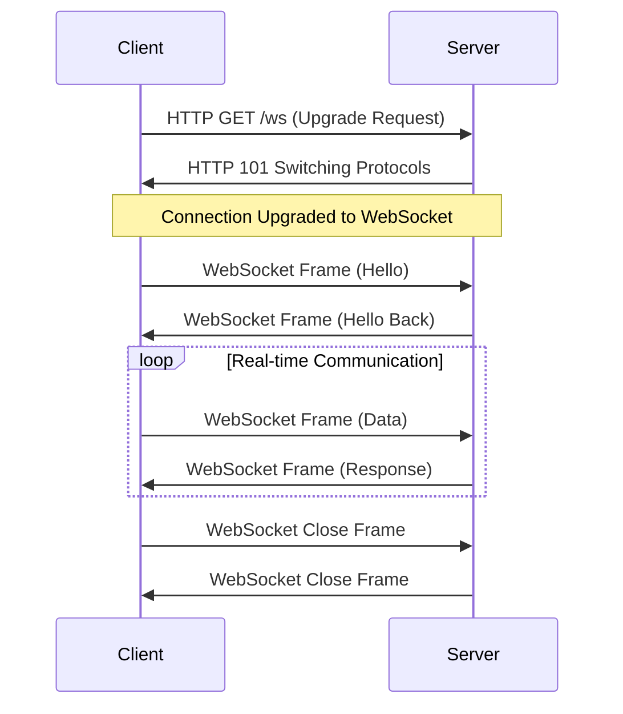
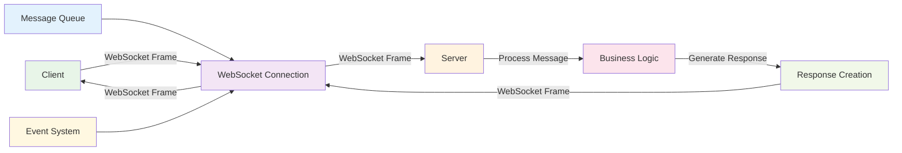
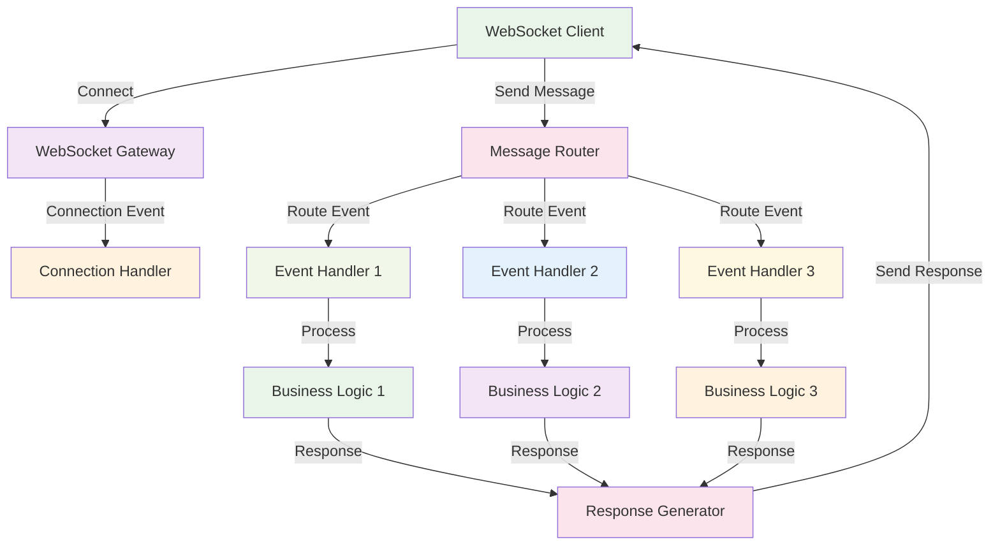
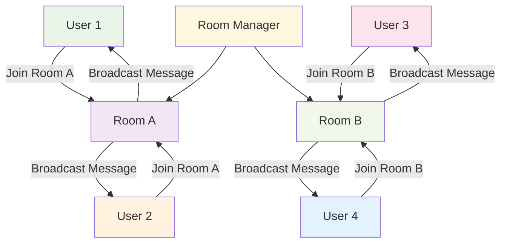
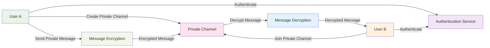
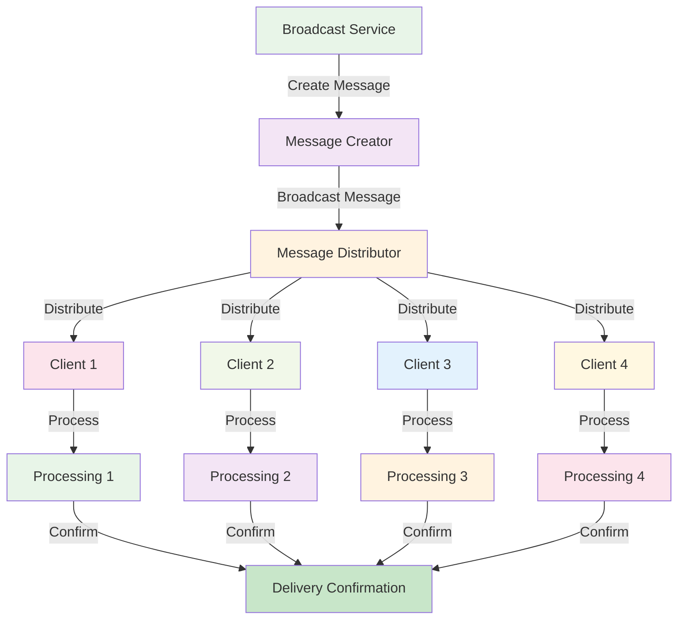

# WebSockets

:::tip 💡 Khái niệm cơ bản
WebSockets giống như "điện thoại" giữa client và server - kết nối liên tục, có thể giao tiếp hai chiều real-time.
:::

## WebSockets là gì?

**Lý thuyết cơ bản:**
WebSockets là một protocol cho real-time, bidirectional communication giữa client và server. Nó thiết lập một persistent connection cho phép data flow hai chiều mà không cần HTTP request/response cycle.

**Đặc điểm kỹ thuật:**
- **Persistent Connection**: Kết nối liên tục giữa client và server
- **Bidirectional**: Giao tiếp hai chiều real-time
- **Low Latency**: Latency thấp do không cần HTTP overhead
- **Full-duplex**: Có thể gửi và nhận đồng thời
- **Protocol Upgrade**: Upgrade từ HTTP connection
- **Real-time**: Real-time data transmission

**Cách hoạt động:**
1. **Handshake**: Client gửi HTTP upgrade request
2. **Connection Upgrade**: Server upgrade connection thành WebSocket
3. **Persistent Connection**: Thiết lập persistent connection
4. **Data Exchange**: Giao tiếp hai chiều real-time
5. **Connection Management**: Quản lý connection lifecycle

**Biến đổi trong quá trình xử lý:**
- **Connection State**: Disconnected → Handshaking → Connected → Active → Idle → Disconnected
- **Data State**: No Data → Sending → Receiving → Processing → Responding
- **Protocol State**: HTTP → Upgrading → WebSocket → Active → Closing

**Điểm mạnh (Strengths):**
- **Real-time Communication**: Giao tiếp real-time hai chiều
- **Low Latency**: Latency thấp hơn HTTP
- **Persistent Connection**: Không cần reconnect mỗi request
- **Bidirectional**: Có thể gửi và nhận đồng thời
- **Efficient**: Ít overhead hơn HTTP
- **Browser Support**: Hỗ trợ tốt trong browsers
- **Standard Protocol**: Web standard protocol
- **Event-driven**: Event-driven communication

**Điểm yếu (Weaknesses):**
- **Connection Management**: Phức tạp quản lý connections
- **Stateful**: Stateful connections khó scale
- **Firewall Issues**: Có thể bị firewall block
- **Proxy Problems**: Reverse proxies có thể gây vấn đề
- **Memory Usage**: Tốn memory cho persistent connections
- **Load Balancing**: Khó implement load balancing
- **Error Handling**: Complex error handling
- **Testing Complexity**: Khó test WebSocket connections

## Khi nào nên dùng và khi nào không nên dùng WebSockets

### **Khi nào NÊN dùng WebSockets:**

**1. Real-time Applications:**
- **Chat Applications**: Real-time messaging, group chat
- **Live Streaming**: Video streaming, audio streaming
- **Gaming**: Real-time multiplayer games
- **Live Dashboards**: Real-time monitoring, analytics

**2. Bidirectional Communication:**
- **Collaborative Tools**: Real-time collaboration
- **Live Updates**: Real-time data updates
- **Notifications**: Push notifications, alerts
- **Interactive Features**: Real-time user interactions

**3. Low Latency Requirements:**
- **Financial Trading**: Real-time trading data
- **IoT Applications**: Device communication, sensor data
- **Real-time Analytics**: Live data processing
- **Performance Critical**: Applications cần performance cao

**4. Persistent Connections:**
- **Long-running Sessions**: User sessions dài
- **Continuous Data Flow**: Continuous data streaming
- **Connection Reuse**: Reuse connections
- **Stateful Applications**: Applications cần maintain state

### **Khi nào KHÔNG NÊN dùng WebSockets:**

**1. Simple Request-Response:**
- **CRUD Operations**: Basic CRUD operations
- **REST APIs**: Simple API calls
- **One-time Requests**: One-time data requests
- **Stateless Operations**: Stateless operations

**2. High Scalability Requirements:**
- **Massive Scale**: Systems cần scale rất lớn
- **Stateless Architecture**: Stateless microservices
- **Load Balancing**: Cần load balancing đơn giản
- **Horizontal Scaling**: Horizontal scaling requirements

**3. Firewall Restrictions:**
- **Corporate Networks**: Corporate firewall restrictions
- **Proxy Environments**: Reverse proxy environments
- **Security Policies**: Strict security policies
- **Network Limitations**: Network infrastructure limitations

**4. Resource Constraints:**
- **Memory Limitations**: Limited memory resources
- **Connection Limits**: Limited connection capacity
- **Server Resources**: Limited server resources
- **Cost Constraints**: High resource cost requirements

## Cách áp dụng WebSockets hiệu quả

### **1. Chiến lược áp dụng (Adoption Strategy):**

**Phase 1: Assessment & Planning**
- **Use Case Analysis**: Xác định use cases phù hợp
- **Connection Requirements**: Analyze connection requirements
- **Scalability Planning**: Plan for scalability
- **Infrastructure Review**: Review infrastructure capabilities

**Phase 2: Implementation**
- **WebSocket Server**: Implement WebSocket server
- **Client Implementation**: Implement WebSocket client
- **Connection Management**: Implement connection management
- **Error Handling**: Implement error handling

**Phase 3: Testing & Deployment**
- **Connection Testing**: Test WebSocket connections
- **Load Testing**: Test connection capacity
- **Error Scenarios**: Test error scenarios
- **Production Deployment**: Deploy to production

### **2. Best Practices khi áp dụng:**

**Connection Management:**
- **Connection Pooling**: Implement connection pooling
- **Heartbeat Mechanism**: Implement heartbeat mechanism
- **Connection Limits**: Set appropriate connection limits
- **Resource Cleanup**: Proper resource cleanup

**Error Handling:**
- **Reconnection Logic**: Implement reconnection logic
- **Error Classification**: Classify different error types
- **Fallback Mechanisms**: Implement fallback mechanisms
- **Monitoring**: Monitor connection health

**Performance Optimization:**
- **Message Batching**: Batch messages when possible
- **Compression**: Use message compression
- **Connection Reuse**: Reuse connections
- **Load Distribution**: Distribute load properly

### **3. Common Pitfalls và cách tránh:**

**Connection Issues:**
- **❌ No Connection Limits**: Set appropriate connection limits
- **❌ No Heartbeat**: Implement heartbeat mechanism
- **❌ No Reconnection**: Implement reconnection logic
- **❌ No Error Handling**: Implement proper error handling

**Scalability Issues:**
- **❌ No Load Balancing**: Plan for load balancing
- **❌ No Connection Pooling**: Implement connection pooling
- **❌ No Resource Management**: Manage resources properly
- **❌ No Monitoring**: Monitor connection health

**✅ Cách tránh:**
- **Plan for Scale**: Plan scaling từ đầu
- **Implement Monitoring**: Monitor tất cả aspects
- **Test Thoroughly**: Test đầy đủ các scenarios
- **Handle Errors**: Handle errors gracefully

## Kiến trúc WebSockets

### **1. Connection Flow - Lý thuyết và Quy trình**

**Lý thuyết về Connection Flow:**
WebSocket connection flow bắt đầu với HTTP handshake, sau đó upgrade thành WebSocket connection. Connection này persistent và cho phép bidirectional communication.

**Đặc điểm kỹ thuật:**
- **HTTP Handshake**: Upgrade request từ HTTP
- **Protocol Upgrade**: Upgrade từ HTTP sang WebSocket
- **Persistent Connection**: Maintain connection
- **Bidirectional Communication**: Two-way communication

**Cách hoạt động:**
1. **HTTP Request**: Client gửi HTTP upgrade request
2. **Server Response**: Server respond với upgrade headers
3. **Connection Upgrade**: Connection được upgrade
4. **WebSocket Protocol**: Sử dụng WebSocket protocol
5. **Data Exchange**: Giao tiếp hai chiều

**Biến đổi trong quá trình xử lý:**
- **Protocol State**: HTTP → Upgrading → WebSocket → Active
- **Connection State**: Disconnected → Handshaking → Connected → Active
- **Data State**: No Data → Handshake → Connected → Exchanging

**Ưu điểm:**
- **Standard Protocol**: Sử dụng standard protocol
- **Efficient**: Ít overhead hơn HTTP
- **Real-time**: Real-time communication
- **Bidirectional**: Two-way communication

**Nhược điểm:**
- **Complex Setup**: Setup phức tạp
- **Stateful**: Stateful connections
- **Resource Usage**: Tốn resources

### **2. **Connection Flow**

### **3. Message Flow - Lý thuyết và Thực hành**

**Lý thuyết về Message Flow:**
WebSocket message flow cho phép real-time, bidirectional data exchange. Messages được gửi và nhận qua persistent connection mà không cần HTTP request/response cycle.

**Đặc điểm kỹ thuật:**
- **Real-time**: Immediate message delivery
- **Bidirectional**: Send và receive đồng thời
- **Framed**: Messages được frame theo WebSocket spec
- **Efficient**: Ít overhead hơn HTTP

**Cách hoạt động:**
1. **Message Creation**: Create message content
2. **Message Framing**: Frame message theo WebSocket spec
3. **Message Transmission**: Transmit qua connection
4. **Message Reception**: Receive và parse message
5. **Message Processing**: Process message content

**Biến đổi trong quá trình xử lý:**
- **Message State**: Created → Framed → Transmitted → Received → Parsed → Processed
- **Connection State**: Idle → Sending → Receiving → Processing → Idle
- **Data State**: Raw → Formatted → Transmitted → Received → Processed

**Ưu điểm:**
- **Real-time**: Real-time message delivery
- **Efficient**: Efficient message transmission
- **Bidirectional**: Two-way message flow
- **Low Latency**: Low latency communication

**Nhược điểm:**
- **Complexity**: Message handling phức tạp
- **State Management**: Cần quản lý message state
- **Error Handling**: Complex error handling

### **4. **Message Flow**

## WebSocket Implementation trong NestJS

**Lý thuyết về WebSockets trong NestJS:**
NestJS cung cấp built-in support cho WebSockets thông qua `@nestjs/websockets` package. Nó sử dụng Socket.io hoặc native WebSockets để implement real-time communication.

**Đặc điểm kỹ thuật:**
- **Gateway Support**: WebSocket gateways
- **Event Handling**: Event-based message handling
- **Room Management**: Room-based communication
- **Authentication**: WebSocket authentication
- **Guards**: WebSocket guards
- **Interceptors**: WebSocket interceptors

**Cách hoạt động:**
1. **Gateway Definition**: Định nghĩa WebSocket gateway
2. **Event Handlers**: Implement event handlers
3. **Connection Management**: Manage WebSocket connections
4. **Message Routing**: Route messages đến handlers

**Biến đổi trong quá trình xử lý:**
- **Gateway State**: Unregistered → Registered → Active → Handling Connections
- **Connection State**: Disconnected → Connecting → Connected → Active
- **Event State**: Received → Routed → Handled → Responded

**Ưu điểm:**
- **Native Integration**: Tích hợp tốt với NestJS
- **Event-based**: Event-based architecture
- **Room Support**: Room-based communication
- **Authentication**: Built-in authentication

**Nhược điểm:**
- **Learning Curve**: Cần hiểu WebSocket concepts
- **Complexity**: WebSocket complexity
- **State Management**: Cần quản lý connection state

### **1. WebSocket Gateway - Lý thuyết và Thực hành**

**Lý thuyết về WebSocket Gateway:**
WebSocket Gateway trong NestJS xử lý WebSocket connections và messages. Nó sử dụng decorators để define event handlers và manage connections.

**Đặc điểm kỹ thuật:**
- **Gateway Decorator**: Sử dụng `@WebSocketGateway()`
- **Event Handlers**: Sử dụng `@SubscribeMessage()`
- **Connection Events**: Handle connection events
- **Message Handling**: Handle incoming messages

**Cách hoạt động:**
1. **Gateway Registration**: Register gateway với NestJS
2. **Connection Handling**: Handle WebSocket connections
3. **Event Routing**: Route events đến handlers
4. **Message Processing**: Process incoming messages

**Biến đổi trong quá trình xử lý:**
- **Gateway State**: Unregistered → Registered → Active → Handling
- **Connection State**: Disconnected → Connected → Active → Processing
- **Event State**: Received → Routed → Handled → Responded

**Ưu điểm:**
- **Clean Architecture**: Separation of concerns
- **Event-based**: Event-based message handling
- **Type Safety**: TypeScript support
- **Easy Testing**: Dễ dàng test

**Nhược điểm:**
- **Complexity**: WebSocket complexity
- **State Management**: Connection state management
- **Error Handling**: Complex error handling

### **2. **WebSocket Gateway Architecture**

## WebSocket Patterns

### **1. Room-based Communication - Lý thuyết và Thực hành**

**Lý thuyết về Room-based Communication:**
Room-based communication cho phép group users vào rooms và send messages đến specific rooms. Pattern này phù hợp cho chat applications, multiplayer games, và collaborative tools.

**Đặc điểm kỹ thuật:**
- **Room Management**: Create và manage rooms
- **User Joining**: Users join và leave rooms
- **Room Broadcasting**: Send messages đến room members
- **Room Isolation**: Messages chỉ đến room members

**Cách hoạt động:**
1. **Room Creation**: Create room với unique ID
2. **User Joining**: Users join room
3. **Message Broadcasting**: Send messages đến room
4. **Room Management**: Manage room lifecycle

**Biến đổi trong quá trình xử lý:**
- **Room State**: Created → Active → Inactive → Deleted
- **User State**: Not Joined → Joined → Active → Left
- **Message State**: Created → Broadcasted → Received → Processed

**Ưu điểm:**
- **Group Communication**: Effective group communication
- **Message Isolation**: Messages chỉ đến intended recipients
- **Scalability**: Scale rooms independently
- **User Management**: Easy user management

**Nhược điểm:**
- **Complexity**: Room management complexity
- **Resource Usage**: Tốn resources cho rooms
- **State Management**: Cần quản lý room state

### **3. **Room-based Communication**

### **2. Private Messaging - Lý thuyết và Thực hành**

**Lý thuyết về Private Messaging:**
Private messaging cho phép users gửi messages riêng tư cho nhau. Pattern này sử dụng direct connections hoặc private channels để đảm bảo privacy.

**Đặc điểm kỹ thuật:**
- **Direct Connection**: Direct connection giữa users
- **Private Channels**: Private channels cho messaging
- **Authentication**: User authentication
- **Message Encryption**: Message encryption cho privacy

**Cách hoạt động:**
1. **User Authentication**: Authenticate users
2. **Private Channel**: Create private channel
3. **Message Sending**: Send private message
4. **Message Delivery**: Deliver message đến recipient

**Biến đổi trong quá trình xử lý:**
- **Channel State**: Created → Active → Inactive → Closed
- **Message State**: Created → Encrypted → Transmitted → Decrypted → Delivered
- **User State**: Unauthenticated → Authenticated → Connected → Messaging

**Ưu điểm:**
- **Privacy**: Ensure message privacy
- **Direct Communication**: Direct user communication
- **Security**: Secure messaging
- **User Control**: User control over messages

**Nhược điểm:**
- **Complexity**: Security complexity
- **Resource Usage**: Tốn resources cho private channels
- **Scalability**: Khó scale private messaging

### **4. **Private Messaging**

### **3. Broadcasting - Lý thuyết và Thực hành**

**Lý thuyết về Broadcasting:**
Broadcasting pattern gửi messages đến tất cả connected clients. Pattern này phù hợp cho notifications, announcements, và system-wide updates.

**Đặc điểm kỹ thuật:**
- **Global Broadcasting**: Send messages đến tất cả clients
- **Selective Broadcasting**: Broadcast đến specific groups
- **Efficient Delivery**: Efficient message delivery
- **Load Distribution**: Distribute load properly

**Cách hoạt động:**
1. **Message Creation**: Create broadcast message
2. **Client Discovery**: Discover connected clients
3. **Message Distribution**: Distribute message đến clients
4. **Delivery Confirmation**: Confirm message delivery

**Biến đổi trong quá trình xử lý:**
- **Message State**: Created → Distributed → Delivered → Confirmed
- **Client State**: Connected → Receiving → Processing → Responding
- **Broadcast State**: Initiated → Distributing → Completed

**Ưu điểm:**
- **Global Reach**: Reach tất cả clients
- **Efficient**: Efficient message distribution
- **Real-time**: Real-time updates
- **Scalability**: Scale broadcasting

**Nhược điểm:**
- **Resource Usage**: Tốn resources cho broadcasting
- **Message Duplication**: Messages đến tất cả clients
- **Load Impact**: Có thể impact system load

### **5. **Broadcasting Pattern**

## Best Practices

### **1. Connection Management - Lý thuyết và Nguyên tắc**

**Nguyên tắc cơ bản:**
- **Connection Limits**: Set appropriate connection limits
- **Heartbeat Mechanism**: Implement heartbeat mechanism
- **Resource Cleanup**: Proper resource cleanup
- **Connection Pooling**: Use connection pooling

**Quy tắc lựa chọn:**
1. **Connection Capacity**: Plan connection capacity
2. **Resource Management**: Manage resources properly
3. **Health Monitoring**: Monitor connection health
4. **Cleanup Strategy**: Plan cleanup strategy

**Trade-offs cần cân nhắc:**
- **Capacity vs Resources**: Balance capacity và resources
- **Performance vs Reliability**: Balance performance và reliability
- **Complexity vs Functionality**: Balance complexity và functionality

### **2. Error Handling - Lý thuyết và Chiến lược**

**Nguyên lý xử lý lỗi:**
- **Error Classification**: Classify different error types
- **Reconnection Logic**: Implement reconnection logic
- **Fallback Mechanisms**: Implement fallback mechanisms
- **Error Monitoring**: Monitor error patterns

**Chiến lược xử lý lỗi:**
- **Connection Errors**: Handle connection errors
- **Message Errors**: Handle message errors
- **System Errors**: Handle system errors
- **Recovery Actions**: Take recovery actions

**Best Practices:**
- **Classify Errors**: Classify errors properly
- **Implement Recovery**: Implement recovery mechanisms
- **Monitor Errors**: Monitor error patterns
- **Handle Gracefully**: Handle errors gracefully

### **3. Performance Optimization - Lý thuyết và Chiến lược**

**Nguyên lý tối ưu performance:**
- **Message Batching**: Batch messages when possible
- **Connection Reuse**: Reuse connections
- **Load Distribution**: Distribute load properly
- **Resource Optimization**: Optimize resource usage

**Chiến lược tối ưu:**
- **Batching Strategy**: Plan batching strategy
- **Connection Strategy**: Plan connection strategy
- **Load Strategy**: Plan load distribution
- **Resource Strategy**: Plan resource optimization

**Best Practices:**
- **Batch Messages**: Batch messages when possible
- **Reuse Connections**: Reuse connections
- **Distribute Load**: Distribute load properly
- **Optimize Resources**: Optimize resource usage

## So sánh với các Protocol khác

### **1. WebSockets vs REST:**

**Communication Pattern:**
- **WebSockets**: Persistent connection, bidirectional
- **REST**: Request-response, stateless
- **Kết quả**: WebSockets cho real-time, REST cho simple APIs

**Performance:**
- **WebSockets**: Low latency, high throughput
- **REST**: Higher latency, lower overhead
- **Kết quả**: WebSockets tốt hơn cho real-time

**Use Cases:**
- **WebSockets**: Real-time apps, chat, gaming
- **REST**: CRUD operations, simple APIs
- **Kết quả**: Khác nhau, không thay thế được nhau

### **2. WebSockets vs gRPC:**

**Communication Pattern:**
- **WebSockets**: Browser-based, bidirectional
- **gRPC**: Server-to-server, high performance
- **Kết quả**: WebSockets cho browsers, gRPC cho servers

**Performance:**
- **WebSockets**: Good browser performance
- **gRPC**: High server performance
- **Kết quả**: gRPC tốt hơn cho server communication

**Browser Support:**
- **WebSockets**: Full browser support
- **gRPC**: Limited browser support
- **Kết quả**: WebSockets tốt hơn cho browser apps

### **3. WebSockets vs Message Queues:**

**Communication Pattern:**
- **WebSockets**: Real-time, immediate
- **Message Queues**: Asynchronous, queued
- **Kết quả**: WebSockets cho real-time, MQ cho async

**Use Cases:**
- **WebSockets**: User interactions, real-time updates
- **Message Queues**: Background jobs, event processing
- **Kết quả**: Khác nhau, không thay thế được nhau

---

:::tip 💡 Lời khuyên tổng kết - Lý thuyết và Thực hành

**Nguyên tắc cơ bản:**
- **Protocol Selection**: WebSockets phù hợp cho real-time, bidirectional communication
- **Performance vs Complexity**: WebSockets có performance cao nhưng complexity cao
- **Real-time vs Stateless**: WebSockets real-time, REST stateless

**Quy tắc thực hành:**
1. **WebSockets**: Cho real-time apps, chat, gaming, live updates
2. **REST**: Cho simple APIs, CRUD operations
3. **gRPC**: Cho high-performance server communication

**Lý do tại sao:**
- **WebSockets**: Real-time, bidirectional, low latency
- **REST**: Simple, universal, stateless
- **gRPC**: High performance, strong typing, streaming

**Cách xử lý biến đổi:**
- **State Management**: WebSockets stateful, REST stateless, gRPC stateful
- **Error Handling**: WebSockets reconnection, REST status codes, gRPC error codes
- **Performance Optimization**: WebSockets connection reuse, REST caching, gRPC connection pooling
:::

**Bài tiếp theo:** [Event-Driven Communication](/docs/microservices/communication/event-driven)
