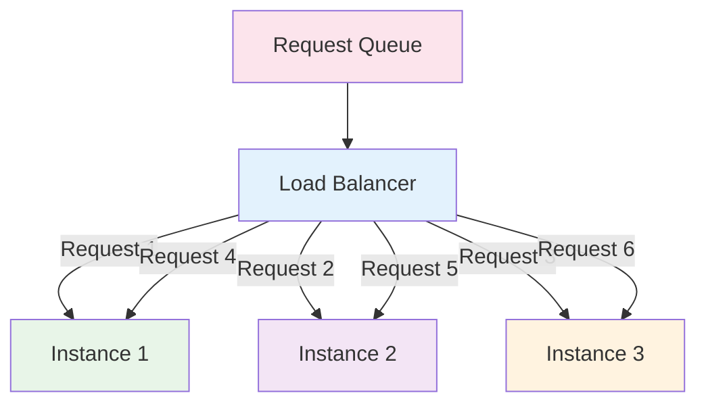
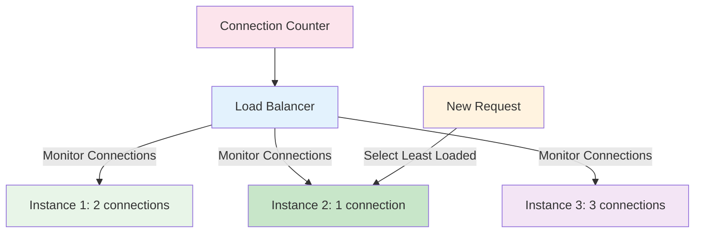
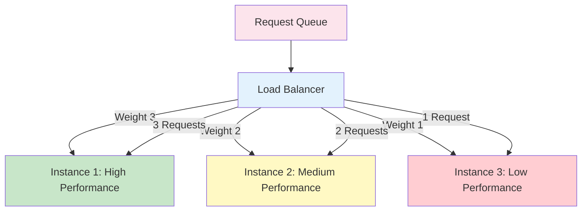
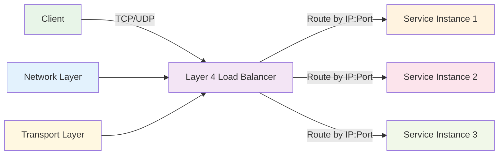
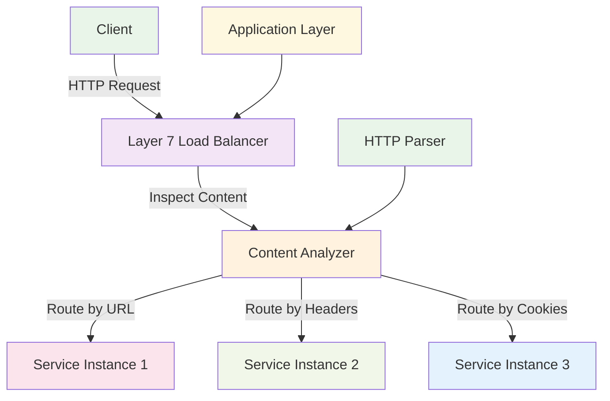
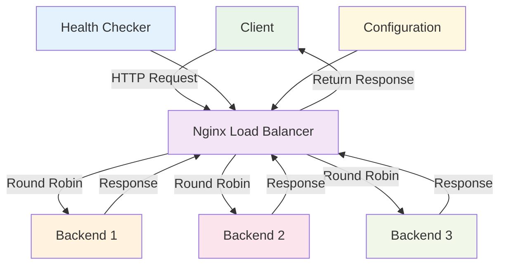
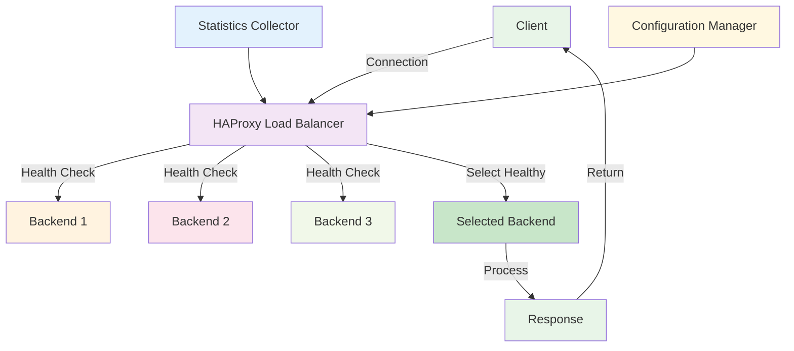

# Load Balancing

:::tip 💡 Khái niệm cơ bản
Load Balancing giống như "người điều phối giao thông" - phân phối requests đến các service instances để đảm bảo hiệu suất cao và không bị quá tải.
:::

## Load Balancing là gì?

**Lý thuyết cơ bản:**
Load Balancing là một pattern phân phối incoming requests đến multiple service instances để đảm bảo hiệu suất cao, availability, và scalability. Nó giúp distribute workload evenly và handle failures gracefully.

**Đặc điểm kỹ thuật:**
- **Request Distribution**: Phân phối requests đến multiple instances
- **Health Checking**: Kiểm tra sức khỏe service instances
- **Failover**: Tự động chuyển requests khi instance fail
- **Scalability**: Hỗ trợ horizontal scaling
- **Performance Optimization**: Tối ưu performance
- **Traffic Management**: Quản lý traffic flow

**Cách hoạt động:**
1. **Request Reception**: Load balancer nhận incoming request
2. **Instance Selection**: Load balancer chọn service instance
3. **Request Forwarding**: Forward request đến selected instance
4. **Response Handling**: Handle response từ service instance
5. **Health Monitoring**: Monitor instance health

**Biến đổi trong quá trình xử lý:**
- **Request State**: Received → Routing → Forwarded → Processing → Completed
- **Instance State**: Available → Selected → Busy → Available
- **Load Balancer State**: Idle → Routing → Monitoring → Idle

**Điểm mạnh (Strengths):**
- **High Availability**: Đảm bảo high availability
- **Scalability**: Dễ dàng scale horizontally
- **Performance**: Cải thiện performance
- **Fault Tolerance**: Handle failures gracefully
- **Traffic Management**: Quản lý traffic flow
- **Health Monitoring**: Monitor service health
- **Load Distribution**: Distribute load evenly
- **Session Management**: Manage user sessions

**Điểm yếu (Weaknesses):**
- **Single Point of Failure**: Load balancer có thể fail
- **Complexity**: Implementation complexity
- **Configuration Overhead**: Configuration overhead
- **Performance Overhead**: Load balancing overhead
- **Session Sticky**: Session sticky complexity
- **Health Check Overhead**: Health check overhead
- **Network Latency**: Additional network latency
- **Resource Usage**: Tốn resources

## Khi nào nên dùng và khi nào không nên dùng Load Balancing

### **Khi nào NÊN dùng Load Balancing:**

**1. High Availability Requirements:**
- **Mission Critical**: Mission critical applications
- **High Uptime**: Cần high uptime
- **Fault Tolerance**: Cần fault tolerance
- **Disaster Recovery**: Disaster recovery requirements

**2. Scalability Requirements:**
- **High Traffic**: High traffic applications
- **Horizontal Scaling**: Cần horizontal scaling
- **Peak Load Handling**: Handle peak loads
- **Resource Optimization**: Optimize resource usage

**3. Performance Requirements:**
- **Low Latency**: Cần low latency
- **High Throughput**: High throughput requirements
- **Response Time**: Cần response time nhanh
- **User Experience**: Better user experience

**4. Multiple Service Instances:**
- **Microservices**: Microservices architecture
- **Multiple Instances**: Multiple service instances
- **Distributed Systems**: Distributed systems
- **Cloud Native**: Cloud-native applications

### **Khi nào KHÔNG NÊN dùng Load Balancing:**

**1. Simple Applications:**
- **Single Instance**: Chỉ có single instance
- **Low Traffic**: Low traffic applications
- **Simple Architecture**: Simple architecture
- **Development Environment**: Development environments

**2. Resource Constraints:**
- **Limited Resources**: Limited infrastructure resources
- **Cost Constraints**: High cost requirements
- **Complexity Avoidance**: Avoid complexity
- **Simple Requirements**: Simple requirements

**3. Performance Critical:**
- **Ultra-low Latency**: Ultra-low latency requirements
- **Direct Connection**: Cần direct connection
- **Network Optimization**: Network optimization requirements
- **Resource Efficiency**: Resource efficiency requirements

**4. Legacy Systems:**
- **Old Systems**: Legacy systems
- **No Containerization**: No containerization
- **Static Infrastructure**: Static infrastructure
- **Limited Scalability**: Limited scalability requirements

## Cách áp dụng Load Balancing hiệu quả

### **1. Chiến lược áp dụng (Adoption Strategy):**

**Phase 1: Assessment & Planning**
- **Traffic Analysis**: Analyze traffic patterns
- **Performance Requirements**: Identify performance requirements
- **Infrastructure Planning**: Plan infrastructure
- **Technology Selection**: Choose load balancing technology

**Phase 2: Implementation**
- **Load Balancer Setup**: Setup load balancer
- **Health Checking**: Implement health checking
- **Load Distribution**: Implement load distribution
- **Failover Logic**: Implement failover logic

**Phase 3: Testing & Deployment**
- **Load Testing**: Test load balancing performance
- **Failover Testing**: Test failover scenarios
- **Performance Testing**: Test performance improvements
- **Production Deployment**: Deploy to production

### **2. Best Practices khi áp dụng:**

**Health Checking:**
- **Regular Health Checks**: Regular health checks
- **Health Check Configuration**: Configure health checks properly
- **Failure Detection**: Detect failures quickly
- **Recovery Actions**: Take recovery actions

**Load Distribution:**
- **Algorithm Selection**: Choose appropriate algorithm
- **Session Management**: Manage user sessions
- **Sticky Sessions**: Implement sticky sessions when needed
- **Load Monitoring**: Monitor load distribution

**Performance Optimization:**
- **Connection Pooling**: Implement connection pooling
- **Caching**: Implement caching strategies
- **Compression**: Enable compression
- **SSL Termination**: Implement SSL termination

### **3. Common Pitfalls và cách tránh:**

**Configuration Issues:**
- **❌ Poor Health Checks**: Configure health checks properly
- **❌ No Failover**: Implement failover logic
- **❌ Poor Algorithm**: Choose appropriate algorithm
- **❌ No Monitoring**: Implement monitoring

**Performance Issues:**
- **❌ No Connection Pooling**: Implement connection pooling
- **❌ No Caching**: Implement caching
- **❌ No Compression**: Enable compression
- **❌ No SSL Optimization**: Optimize SSL

**✅ Cách tránh:**
- **Plan for Scale**: Plan scaling từ đầu
- **Implement Monitoring**: Implement monitoring
- **Test Failures**: Test failure scenarios
- **Optimize Performance**: Optimize performance

## Load Balancing Algorithms

### **1. Round Robin - Lý thuyết và Thực hành**

**Lý thuyết về Round Robin:**
Round Robin là algorithm đơn giản nhất, phân phối requests theo thứ tự tuần tự đến các service instances. Mỗi instance nhận request theo thứ tự.

**Đặc điểm kỹ thuật:**
- **Sequential Distribution**: Phân phối theo thứ tự
- **Equal Distribution**: Distribute requests equally
- **Simple Implementation**: Dễ implement
- **Predictable Pattern**: Pattern có thể dự đoán

**Cách hoạt động:**
1. **Request Reception**: Load balancer nhận request
2. **Instance Selection**: Chọn instance theo thứ tự
3. **Request Forwarding**: Forward request đến selected instance
4. **Next Instance**: Chuyển đến instance tiếp theo

**Biến đổi trong quá trình xử lý:**
- **Instance State**: Available → Selected → Busy → Available
- **Selection State**: Instance 1 → Instance 2 → Instance 3 → Instance 1
- **Request State**: Received → Routing → Forwarded → Completed

**Ưu điểm:**
- **Simple**: Algorithm đơn giản
- **Equal Distribution**: Distribute requests equally
- **Predictable**: Predictable distribution pattern
- **Easy Implementation**: Dễ implement

**Nhược điểm:**
- **No Load Consideration**: Không xem xét load
- **No Performance Consideration**: Không xem xét performance
- **Uneven Distribution**: Có thể distribute unevenly
- **No Health Consideration**: Không xem xét health

### **2. **Round Robin Algorithm**

### **3. Least Connections - Lý thuyết và Thực hành**

**Lý thuyết về Least Connections:**
Least Connections algorithm chọn service instance có ít active connections nhất. Algorithm này đảm bảo distribute load dựa trên current workload.

**Đặc điểm kỹ thuật:**
- **Connection Counting**: Đếm active connections
- **Load-based Selection**: Selection dựa trên load
- **Dynamic Distribution**: Dynamic load distribution
- **Performance Consideration**: Xem xét performance

**Cách hoạt động:**
1. **Connection Monitoring**: Monitor active connections
2. **Instance Selection**: Chọn instance với ít connections nhất
3. **Request Forwarding**: Forward request đến selected instance
4. **Connection Update**: Update connection count

**Biến đổi trong quá trình xử lý:**
- **Connection State**: 0 → 1 → 2 → 3 → 2 → 1 → 0
- **Instance State**: Idle → Busy → Busier → Busiest → Busier → Busy → Idle
- **Selection State**: Least Loaded → Current Load → Next Selection

**Ưu điểm:**
- **Load Aware**: Aware of current load
- **Performance Optimized**: Optimize performance
- **Dynamic Distribution**: Dynamic distribution
- **Fair Distribution**: Fair distribution

**Nhược điểm:**
- **Complexity**: Higher complexity
- **State Management**: Cần quản lý state
- **Performance Overhead**: Performance overhead
- **Connection Tracking**: Track connections

### **4. **Least Connections Algorithm**

### **5. Weighted Round Robin - Lý thuyết và Thực hành**

**Lý thuyết về Weighted Round Robin:**
Weighted Round Robin là extension của Round Robin, cho phép assign weights cho các service instances. Instances với weight cao hơn nhận nhiều requests hơn.

**Đặc điểm kỹ thuật:**
- **Weight Assignment**: Assign weights cho instances
- **Proportional Distribution**: Distribute proportionally
- **Performance Consideration**: Xem xét performance
- **Configurable**: Configurable distribution

**Cách hoạt động:**
1. **Weight Configuration**: Configure weights cho instances
2. **Request Distribution**: Distribute requests theo weights
3. **Proportional Routing**: Route requests proportionally
4. **Weight Management**: Manage instance weights

**Biến đổi trong quá trình xử lý:**
- **Weight State**: Configured → Applied → Monitored → Adjusted
- **Distribution State**: Proportional → Balanced → Optimized
- **Instance State**: Weighted → Selected → Processing → Available

**Ưu điểm:**
- **Performance Aware**: Aware of performance differences
- **Configurable**: Configurable distribution
- **Proportional**: Proportional distribution
- **Flexible**: Flexible configuration

**Nhược điểm:**
- **Configuration Complexity**: Configuration complexity
- **Weight Management**: Cần quản lý weights
- **Performance Monitoring**: Monitor performance
- **Dynamic Adjustment**: Dynamic weight adjustment

### **6. **Weighted Round Robin Algorithm**

## Load Balancing Types

### **1. Layer 4 Load Balancing - Lý thuyết và Thực hành**

**Lý thuyết về Layer 4 Load Balancing:**
Layer 4 Load Balancing hoạt động ở Transport layer (TCP/UDP). Nó route traffic dựa trên IP addresses và ports, không inspect application data.

**Đặc điểm kỹ thuật:**
- **Transport Layer**: Hoạt động ở Layer 4
- **IP-based Routing**: Route dựa trên IP addresses
- **Port-based Routing**: Route dựa trên ports
- **Fast Performance**: Fast performance
- **Low Overhead**: Low overhead

**Cách hoạt động:**
1. **Packet Reception**: Nhận network packets
2. **Header Inspection**: Inspect packet headers
3. **Routing Decision**: Make routing decision
4. **Packet Forwarding**: Forward packets

**Biến đổi trong quá trình xử lý:**
- **Packet State**: Received → Inspected → Routed → Forwarded
- **Routing State**: Idle → Routing → Forwarding → Idle
- **Network State**: Connected → Routing → Connected

**Ưu điểm:**
- **Fast Performance**: Fast performance
- **Low Overhead**: Low overhead
- **Simple**: Simple implementation
- **Efficient**: Efficient routing

**Nhược điểm:**
- **No Application Awareness**: Không aware of application
- **Limited Functionality**: Limited functionality
- **No Content-based Routing**: No content-based routing
- **Basic Load Balancing**: Basic load balancing

### **7. **Layer 4 Load Balancing**

### **2. Layer 7 Load Balancing - Lý thuyết và Thực hành**

**Lý thuyết về Layer 7 Load Balancing:**
Layer 7 Load Balancing hoạt động ở Application layer (HTTP/HTTPS). Nó inspect application data và make routing decisions dựa trên content.

**Đặc điểm kỹ thuật:**
- **Application Layer**: Hoạt động ở Layer 7
- **Content Inspection**: Inspect application content
- **HTTP-based Routing**: Route dựa trên HTTP data
- **Advanced Features**: Advanced features
- **Content-aware**: Content-aware routing

**Cách hoạt động:**
1. **Request Reception**: Nhận HTTP requests
2. **Content Inspection**: Inspect request content
3. **Routing Decision**: Make routing decision
4. **Request Forwarding**: Forward requests

**Biến đổi trong quá trình xử lý:**
- **Request State**: Received → Inspected → Routed → Forwarded
- **Content State**: Raw → Parsed → Analyzed → Routed
- **Routing State**: Idle → Analyzing → Routing → Forwarding

**Ưu điểm:**
- **Content Aware**: Aware of content
- **Advanced Features**: Advanced features
- **HTTP Optimization**: HTTP optimization
- **Flexible Routing**: Flexible routing

**Nhược điểm:**
- **Higher Overhead**: Higher overhead
- **Complexity**: Higher complexity
- **Performance Impact**: Performance impact
- **Resource Usage**: Higher resource usage

### **8. **Layer 7 Load Balancing**

## Load Balancing Technologies

### **1. Nginx - Lý thuyết và Thực hành**

**Lý thuyết về Nginx:**
Nginx là một web server và reverse proxy với load balancing capabilities. Nó hỗ trợ multiple load balancing algorithms và health checking.

**Đặc điểm kỹ thuật:**
- **Web Server**: Web server functionality
- **Reverse Proxy**: Reverse proxy capabilities
- **Load Balancing**: Load balancing features
- **Health Checking**: Health checking support
- **SSL Termination**: SSL termination
- **Caching**: Caching capabilities

**Cách hoạt động:**
1. **Request Reception**: Nhận HTTP requests
2. **Load Balancing**: Apply load balancing algorithm
3. **Health Checking**: Check backend health
4. **Request Forwarding**: Forward requests
5. **Response Handling**: Handle responses

**Biến đổi trong quá trình xử lý:**
- **Request State**: Received → Balanced → Forwarded → Processed → Returned
- **Backend State**: Healthy → Selected → Processing → Available
- **Load Balancer State**: Idle → Balancing → Forwarding → Monitoring

**Ưu điểm:**
- **High Performance**: High performance
- **Feature Rich**: Rich feature set
- **Easy Configuration**: Easy configuration
- **Good Documentation**: Good documentation
- **Community Support**: Strong community support
- **Free**: Free and open source

**Nhược điểm:**
- **Configuration Complexity**: Configuration complexity
- **Learning Curve**: Learning curve
- **Dynamic Configuration**: Limited dynamic configuration
- **Service Discovery**: Limited service discovery

### **9. **Nginx Load Balancing**

### **2. HAProxy - Lý thuyết và Thực hành**

**Lý thuyết về HAProxy:**
HAProxy là một high-performance load balancer và proxy server. Nó được thiết kế cho high availability và performance.

**Đặc điểm kỹ thuật:**
- **High Performance**: High performance design
- **TCP/HTTP Support**: TCP và HTTP support
- **Health Checking**: Advanced health checking
- **Statistics**: Detailed statistics
- **Configuration**: Flexible configuration
- **Monitoring**: Built-in monitoring

**Cách hoạt động:**
1. **Connection Reception**: Nhận connections
2. **Load Balancing**: Apply load balancing
3. **Health Monitoring**: Monitor backend health
4. **Connection Forwarding**: Forward connections
5. **Statistics Collection**: Collect statistics

**Biến đổi trong quá trình xử lý:**
- **Connection State**: Established → Balanced → Forwarded → Active → Closed
- **Backend State**: Healthy → Selected → Active → Available
- **Statistics State**: Collecting → Processing → Storing → Reporting

**Ưu điểm:**
- **High Performance**: Very high performance
- **Advanced Features**: Advanced features
- **Good Statistics**: Good statistics
- **Flexible Configuration**: Flexible configuration
- **Professional Support**: Professional support
- **Enterprise Ready**: Enterprise ready

**Nhược điểm:**
- **Complexity**: High complexity
- **Configuration**: Complex configuration
- **Learning Curve**: Steep learning curve
- **Resource Usage**: Higher resource usage

### **10. **HAProxy Load Balancing**

## Best Practices

### **1. Health Checking - Lý thuyết và Nguyên tắc**

**Nguyên tắc cơ bản:**
- **Regular Checks**: Regular health checks
- **Quick Detection**: Quick failure detection
- **Recovery Actions**: Take recovery actions
- **Monitoring**: Continuous monitoring

**Quy tắc lựa chọn:**
1. **Check Frequency**: Choose appropriate frequency
2. **Check Type**: Choose check type
3. **Timeout Configuration**: Configure timeouts
4. **Recovery Strategy**: Plan recovery strategy

**Trade-offs cần cân nhắc:**
- **Frequency vs Overhead**: Balance frequency và overhead
- **Detection Speed vs Resource Usage**: Balance speed và resources
- **Check Type vs Accuracy**: Balance type và accuracy

### **2. Load Distribution - Lý thuyết và Chiến lược**

**Nguyên lý Load Distribution:**
- **Algorithm Selection**: Choose appropriate algorithm
- **Session Management**: Manage user sessions
- **Sticky Sessions**: Implement sticky sessions
- **Load Monitoring**: Monitor load distribution

**Chiến lược Load Distribution:**
- **Distribution Strategy**: Choose distribution strategy
- **Session Strategy**: Choose session strategy
- **Monitoring Strategy**: Choose monitoring strategy
- **Optimization Strategy**: Choose optimization strategy

**Best Practices:**
- **Choose Algorithm**: Choose appropriate algorithm
- **Manage Sessions**: Manage user sessions
- **Monitor Load**: Monitor load distribution
- **Optimize Performance**: Optimize performance

### **3. Performance Optimization - Lý thuyết và Chiến lược**

**Nguyên lý tối ưu Performance:**
- **Connection Pooling**: Implement connection pooling
- **Caching**: Implement caching strategies
- **Compression**: Enable compression
- **SSL Optimization**: Optimize SSL

**Chiến lược tối ưu Performance:**
- **Pooling Strategy**: Choose pooling strategy
- **Caching Strategy**: Choose caching strategy
- **Compression Strategy**: Choose compression strategy
- **SSL Strategy**: Choose SSL strategy

**Best Practices:**
- **Implement Pooling**: Implement connection pooling
- **Implement Caching**: Implement caching
- **Enable Compression**: Enable compression
- **Optimize SSL**: Optimize SSL

## So sánh với các Technology khác

### **1. Nginx vs HAProxy:**

**Performance:**
- **Nginx**: High performance, good for web traffic
- **HAProxy**: Very high performance, good for TCP traffic
- **Kết quả**: HAProxy tốt hơn cho performance

**Features:**
- **Nginx**: Web server + load balancer
- **HAProxy**: Dedicated load balancer
- **Kết quả**: HAProxy tốt hơn cho load balancing

**Use Cases:**
- **Nginx**: Web applications, reverse proxy
- **HAProxy**: High-performance load balancing
- **Kết quả**: Khác nhau, không thay thế được nhau

### **2. Layer 4 vs Layer 7:**

**Performance:**
- **Layer 4**: Fast performance, low overhead
- **Layer 7**: Higher overhead, more features
- **Kết quả**: Layer 4 tốt hơn cho performance

**Features:**
- **Layer 4**: Basic load balancing
- **Layer 7**: Advanced features, content-aware
- **Kết quả**: Layer 7 tốt hơn cho features

**Use Cases:**
- **Layer 4**: Simple load balancing, TCP/UDP
- **Layer 7**: HTTP load balancing, content-based routing
- **Kết quả**: Khác nhau, không thay thế được nhau

---

:::tip 💡 Lời khuyên tổng kết - Lý thuyết và Thực hành

**Nguyên tắc cơ bản:**
- **Technology Selection**: Load Balancing phù hợp cho high availability và scalability
- **Performance vs Features**: Layer 4 fast, Layer 7 feature-rich
- **Algorithm Selection**: Choose algorithm based on requirements

**Quy tắc thực hành:**
1. **Load Balancing**: Cho high availability, scalability, performance
2. **Health Checking**: Cho fault tolerance, reliability
3. **Performance Optimization**: Cho optimal performance

**Lý do tại sao:**
- **Load Balancing**: High availability, scalability, performance
- **Health Checking**: Fault tolerance, reliability, monitoring
- **Performance Optimization**: Optimal performance, resource usage

**Cách xử lý biến đổi:**
- **Request State**: Received → Balanced → Forwarded → Completed
- **Instance State**: Available → Selected → Busy → Available
- **Health State**: Healthy → Unhealthy → Failed → Recovered
:::

**Bài tiếp theo:** [Microservices Patterns](/docs/microservices/microservices-patterns)
