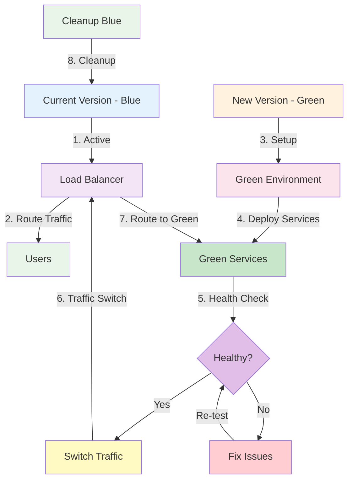
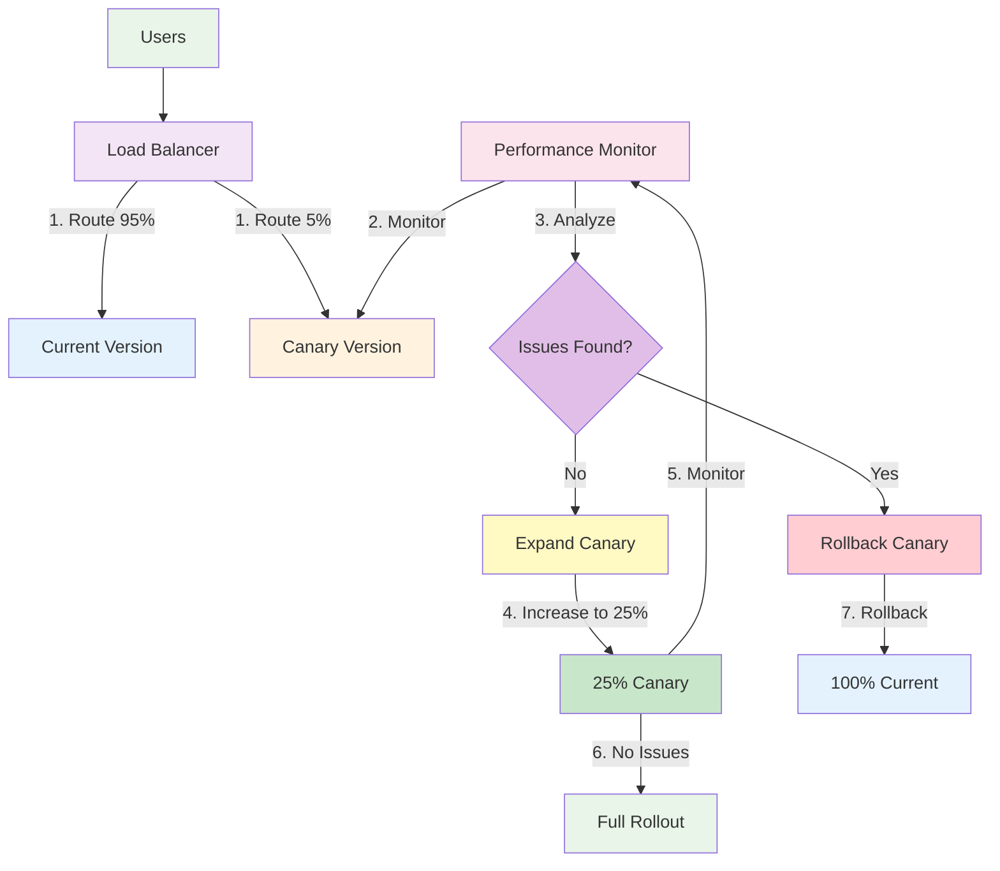
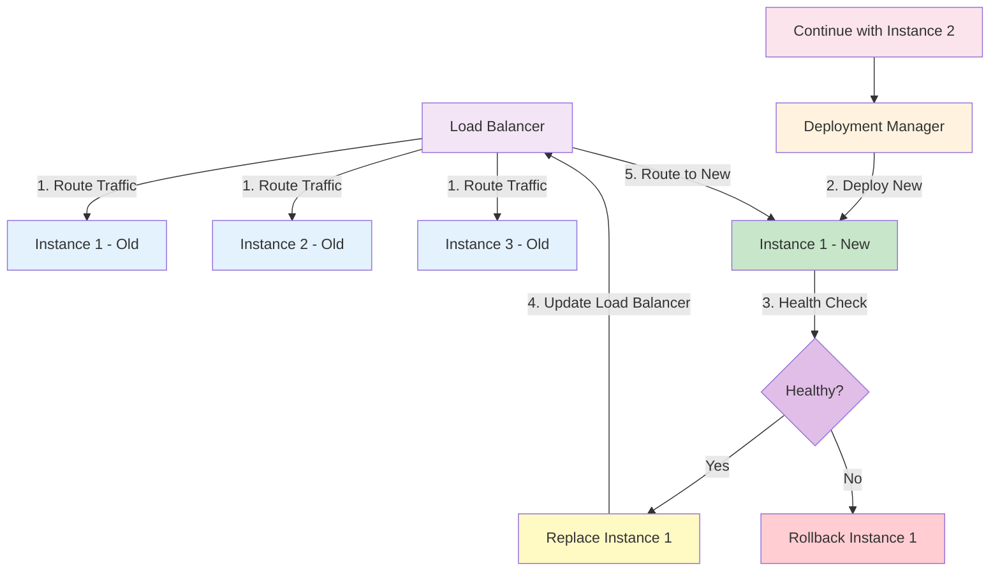
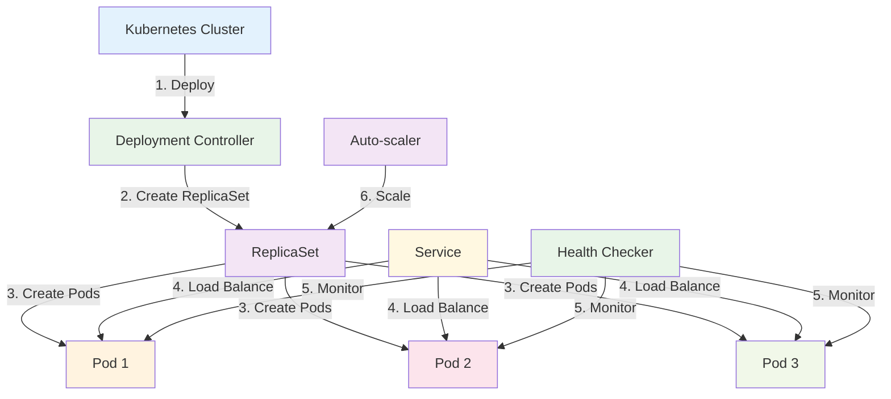
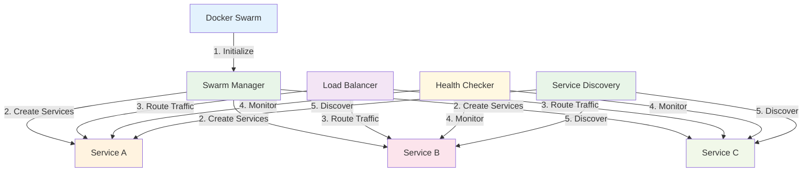

# Microservices Deployment

:::tip 💡 Khái niệm cơ bản
Microservices Deployment giống như "quy trình triển khai thông minh" - đảm bảo các services được deploy một cách an toàn, nhanh chóng và có thể rollback khi cần thiết.
:::

## Microservices Deployment là gì?

**Lý thuyết cơ bản:**
Microservices Deployment là quá trình triển khai các microservices lên production environment. Nó bao gồm các strategies, tools, và practices để deploy services một cách safe, reliable, và scalable.

**Đặc điểm kỹ thuật:**
- **Containerization**: Deploy services trong containers
- **Orchestration**: Orchestrate container deployment
- **Service Discovery**: Automatic service discovery
- **Load Balancing**: Automatic load balancing
- **Health Checking**: Health monitoring và checking
- **Rollback Capability**: Ability to rollback deployments

**Cách hoạt động:**
1. **Build Process**: Build service artifacts
2. **Container Creation**: Create containers
3. **Deployment Planning**: Plan deployment strategy
4. **Service Deployment**: Deploy services
5. **Health Validation**: Validate service health
6. **Traffic Routing**: Route traffic to new services

**Biến đổi trong quá trình xử lý:**
- **Deployment State**: Planned → Building → Deploying → Validating → Active → Monitoring
- **Service State**: Stopped → Starting → Running → Healthy → Active
- **Traffic State**: Old Service → Blue-Green → New Service → Validated → Full Traffic

**Điểm mạnh (Strengths):**
- **Independent Deployment**: Deploy services independently
- **Rollback Capability**: Quick rollback capability
- **Zero Downtime**: Zero downtime deployments
- **Scalability**: Easy scaling up/down
- **Environment Consistency**: Consistent environments
- **Automation**: High automation potential
- **Monitoring**: Built-in monitoring
- **Version Management**: Version management capabilities

**Điểm yếu (Weaknesses):**
- **Complexity**: High deployment complexity
- **Resource Requirements**: High resource requirements
- **Learning Curve**: Steep learning curve
- **Configuration Management**: Complex configuration management
- **Network Complexity**: Network complexity
- **Debugging Difficulty**: Difficult to debug
- **Cost**: Higher infrastructure costs
- **Operational Overhead**: High operational overhead

## Khi nào nên dùng và khi nào không nên dùng Microservices Deployment

### **Khi nào NÊN dùng Microservices Deployment:**

**1. Production Systems:**
- **Live Applications**: Production applications
- **Business Critical**: Business critical systems
- **High Availability**: High availability requirements
- **Scalability Needs**: Scalability requirements

**2. Complex Architectures:**
- **Multiple Services**: Multiple microservices
- **Service Dependencies**: Complex service dependencies
- **Distributed Systems**: Distributed systems
- **Event-driven Systems**: Event-driven architectures

**3. DevOps Requirements:**
- **Continuous Deployment**: Continuous deployment needs
- **Automated Deployment**: Automated deployment requirements
- **Infrastructure as Code**: Infrastructure as code practices
- **Monitoring Needs**: Comprehensive monitoring needs

**4. Business Requirements:**
- **Business Agility**: Business agility requirements
- **Technology Diversity**: Technology diversity needs
- **Team Autonomy**: Team autonomy requirements
- **Independent Scaling**: Independent scaling needs

### **Khi nào KHÔNG NÊN dùng Microservices Deployment:**

**1. Simple Applications:**
- **Single Service**: Single service applications
- **Simple Requirements**: Simple requirements
- **Prototype Development**: Prototype development
- **Learning Projects**: Learning projects

**2. Resource Constraints:**
- **Limited Infrastructure**: Limited infrastructure resources
- **Limited Expertise**: Limited deployment expertise
- **Limited Budget**: Limited budget
- **Limited Time**: Limited time for setup

**3. Early Development:**
- **Proof of Concept**: Proof of concept phase
- **MVP Development**: MVP development
- **Experimental Features**: Experimental features
- **Research Projects**: Research projects

**4. Legacy Systems:**
- **Old Systems**: Legacy systems
- **No Containerization**: No containerization
- **Static Infrastructure**: Static infrastructure
- **Limited Scalability**: Limited scalability requirements

## Cách áp dụng Microservices Deployment hiệu quả

### **1. Chiến lược áp dụng (Adoption Strategy):**

**Phase 1: Assessment & Planning**
- **Current State Analysis**: Analyze current deployment state
- **Infrastructure Assessment**: Assess infrastructure capabilities
- **Tool Selection**: Select deployment tools
- **Strategy Planning**: Plan deployment strategy

**Phase 2: Infrastructure Setup**
- **Container Platform**: Setup container platform
- **Orchestration Tools**: Configure orchestration tools
- **CI/CD Pipeline**: Setup CI/CD pipeline
- **Monitoring Tools**: Setup monitoring tools

**Phase 3: Implementation & Deployment**
- **Service Containerization**: Containerize services
- **Deployment Automation**: Automate deployments
- **Testing & Validation**: Test deployment process
- **Production Deployment**: Deploy to production

### **2. Best Practices khi áp dụng:**

**Deployment Strategy:**
- **Blue-Green Deployment**: Implement blue-green deployment
- **Canary Deployment**: Implement canary deployment
- **Rolling Updates**: Implement rolling updates
- **Rollback Strategy**: Plan rollback strategy

**Infrastructure Management:**
- **Infrastructure as Code**: Use infrastructure as code
- **Configuration Management**: Manage configurations properly
- **Environment Consistency**: Ensure environment consistency
- **Resource Optimization**: Optimize resource usage

**Monitoring & Observability:**
- **Health Monitoring**: Monitor service health
- **Performance Monitoring**: Monitor performance
- **Logging**: Implement comprehensive logging
- **Alerting**: Setup proper alerting

### **3. Common Pitfalls và cách tránh:**

**Strategy Issues:**
- **❌ No Rollback Plan**: Plan rollback strategy
- **❌ No Testing**: Test deployment process
- **❌ No Monitoring**: Implement monitoring
- **❌ No Automation**: Automate deployment process

**Infrastructure Issues:**
- **❌ Poor Configuration**: Manage configurations properly
- **❌ No Scaling**: Plan for scaling
- **❌ No Security**: Implement security measures
- **❌ No Backup**: Plan backup strategy

**✅ Cách tránh:**
- **Plan Everything**: Plan deployment strategy thoroughly
- **Test Everything**: Test deployment process
- **Monitor Everything**: Monitor deployment process
- **Automate Everything**: Automate repetitive tasks

## Deployment Strategies

### **1. Blue-Green Deployment - Lý thuyết và Thực hành**

**Lý thuyết về Blue-Green Deployment:**
Blue-Green Deployment là strategy deploy new version (Green) song song với current version (Blue). Khi Green version ready, traffic được switch từ Blue sang Green.

**Đặc điểm kỹ thuật:**
- **Parallel Deployment**: Deploy new version in parallel
- **Zero Downtime**: Zero downtime deployment
- **Quick Rollback**: Quick rollback capability
- **Traffic Switching**: Instant traffic switching
- **Environment Isolation**: Isolated environments
- **Resource Duplication**: Duplicate resources temporarily

**Cách hoạt động:**
1. **Green Environment Setup**: Setup new environment (Green)
2. **Service Deployment**: Deploy new services to Green
3. **Health Validation**: Validate Green environment health
4. **Traffic Switch**: Switch traffic from Blue to Green
5. **Blue Environment Cleanup**: Clean up old Blue environment

**Biến đổi trong quá trình xử lý:**
- **Environment State**: Blue Active → Green Setup → Green Validated → Traffic Switch → Green Active
- **Traffic State**: 100% Blue → 0% Blue, 100% Green
- **Resource State**: Blue Resources → Blue + Green Resources → Green Resources

**Ưu điểm:**
- **Zero Downtime**: Zero downtime deployment
- **Quick Rollback**: Quick rollback capability
- **Risk Mitigation**: Low risk deployment
- **Testing Capability**: Test new version before switch
- **User Experience**: No user interruption
- **Business Continuity**: Business continuity

**Nhược điểm:**
- **Resource Duplication**: Temporary resource duplication
- **Cost**: Higher deployment costs
- **Complexity**: Higher complexity
- **Database Migration**: Database migration challenges
- **State Management**: State management complexity
- **Testing Overhead**: Testing overhead

### **2. **Blue-Green Deployment Flow**

### **3. Canary Deployment - Lý thuyết và Thực hành**

**Lý thuyết về Canary Deployment:**
Canary Deployment deploy new version to small subset of users trước khi deploy to entire user base. Nó cho phép gradual rollout và early issue detection.

**Đặc điểm kỹ thuật:**
- **Gradual Rollout**: Gradual rollout to users
- **Risk Mitigation**: Risk mitigation through gradual rollout
- **User Segmentation**: Segment users for deployment
- **Performance Monitoring**: Monitor performance impact
- **Rollback Capability**: Quick rollback capability
- **A/B Testing**: A/B testing capabilities

**Cách hoạt động:**
1. **Canary Setup**: Setup canary environment
2. **Small User Group**: Deploy to small user group
3. **Performance Monitoring**: Monitor performance và issues
4. **Gradual Expansion**: Gradually expand user base
5. **Full Rollout**: Rollout to all users

**Biến đổi trong quá trình xử lý:**
- **User State**: 0% New Version → 5% New Version → 25% New Version → 100% New Version
- **Risk State**: High Risk → Medium Risk → Low Risk → No Risk
- **Performance State**: Unknown → Measured → Validated → Confirmed

**Ưu điểm:**
- **Risk Mitigation**: Low risk deployment
- **Early Detection**: Early issue detection
- **Performance Validation**: Performance validation
- **User Experience**: Better user experience
- **Rollback Capability**: Quick rollback capability
- **A/B Testing**: A/B testing capabilities

**Nhược điểm:**
- **Complexity**: Higher complexity
- **User Segmentation**: User segmentation complexity
- **Monitoring Overhead**: Monitoring overhead
- **Configuration Complexity**: Configuration complexity
- **Testing Requirements**: Higher testing requirements
- **Resource Requirements**: Higher resource requirements

### **4. **Canary Deployment Flow**

### **5. Rolling Updates - Lý thuyết và Thực hành**

**Lý thuyết về Rolling Updates:**
Rolling Updates deploy new version gradually by replacing old instances với new instances. Nó đảm bảo continuous service availability trong quá trình deployment.

**Đặc điểm kỹ thuật:**
- **Gradual Replacement**: Gradually replace instances
- **Continuous Availability**: Continuous service availability
- **Resource Efficiency**: Efficient resource usage
- **Rollback Capability**: Rollback capability
- **Health Monitoring**: Health monitoring
- **Load Balancing**: Automatic load balancing

**Cách hoạt động:**
1. **Instance Preparation**: Prepare new instances
2. **Gradual Replacement**: Replace instances gradually
3. **Health Validation**: Validate new instances
4. **Traffic Routing**: Route traffic to new instances
5. **Old Instance Cleanup**: Clean up old instances

**Biến đổi trong quá trình xử lý:**
- **Instance State**: Old Instances → Mixed Instances → New Instances
- **Availability State**: 100% Available → 100% Available → 100% Available
- **Resource State**: Old Resources → Mixed Resources → New Resources

**Ưu điểm:**
- **Continuous Availability**: Continuous service availability
- **Resource Efficiency**: Efficient resource usage
- **Gradual Rollout**: Gradual rollout capability
- **Rollback Capability**: Rollback capability
- **Load Balancing**: Automatic load balancing
- **Health Monitoring**: Health monitoring

**Nhược điểm:**
- **Complexity**: Higher complexity
- **State Management**: State management complexity
- **Configuration Complexity**: Configuration complexity
- **Testing Requirements**: Higher testing requirements
- **Monitoring Overhead**: Monitoring overhead
- **Rollback Complexity**: Rollback complexity

### **6. **Rolling Updates Flow**

## Deployment Tools

### **1. Kubernetes - Lý thuyết và Thực hành**

**Lý thuyết về Kubernetes:**
Kubernetes là một container orchestration platform tự động hóa deployment, scaling, và management của containerized applications. Nó cung cấp comprehensive solution cho microservices deployment.

**Đặc điểm kỹ thuật:**
- **Container Orchestration**: Container orchestration capabilities
- **Auto-scaling**: Automatic scaling capabilities
- **Service Discovery**: Built-in service discovery
- **Load Balancing**: Built-in load balancing
- **Health Monitoring**: Health monitoring capabilities
- **Rolling Updates**: Rolling update capabilities

**Cách hoạt động:**
1. **Pod Creation**: Create pods for services
2. **Service Deployment**: Deploy services to pods
3. **Health Monitoring**: Monitor pod health
4. **Auto-scaling**: Scale pods automatically
5. **Load Balancing**: Balance load between pods

**Biến đổi trong quá trình xử lý:**
- **Pod State**: Creating → Running → Healthy → Scaling → Terminating
- **Service State**: Deploying → Running → Scaling → Updating → Terminating
- **Cluster State**: Idle → Deploying → Running → Scaling → Optimizing

**Ưu điểm:**
- **Comprehensive Solution**: Comprehensive orchestration solution
- **Auto-scaling**: Automatic scaling capabilities
- **Service Discovery**: Built-in service discovery
- **Load Balancing**: Built-in load balancing
- **Health Monitoring**: Health monitoring capabilities
- **Community Support**: Strong community support

**Nhược điểm:**
- **Complexity**: High complexity
- **Learning Curve**: Steep learning curve
- **Resource Requirements**: High resource requirements
- **Configuration Complexity**: Configuration complexity
- **Operational Overhead**: High operational overhead
- **Debugging Difficulty**: Difficult to debug

### **7. **Kubernetes Deployment Flow**

### **2. Docker Swarm - Lý thuyết và Thực hành**

**Lý thuyết về Docker Swarm:**
Docker Swarm là một container orchestration tool được tích hợp với Docker. Nó cung cấp clustering và orchestration capabilities cho Docker containers.

**Đặc điểm kỹ thuật:**
- **Docker Integration**: Native Docker integration
- **Simple Setup**: Simple setup và configuration
- **Service Management**: Service management capabilities
- **Load Balancing**: Built-in load balancing
- **Health Checking**: Health checking capabilities
- **Rolling Updates**: Rolling update capabilities

**Cách hoạt động:**
1. **Swarm Initialization**: Initialize swarm cluster
2. **Service Definition**: Define services
3. **Service Deployment**: Deploy services to swarm
4. **Load Balancing**: Balance load between services
5. **Health Monitoring**: Monitor service health

**Biến đổi trong quá trình xử lý:**
- **Swarm State**: Initializing → Running → Scaling → Updating → Optimizing
- **Service State**: Deploying → Running → Scaling → Updating → Terminating
- **Node State**: Joining → Active → Running → Scaling → Leaving

**Ưu điểm:**
- **Docker Integration**: Native Docker integration
- **Simple Setup**: Simple setup và configuration
- **Easy Learning**: Easy to learn
- **Lightweight**: Lightweight solution
- **Docker Native**: Docker native features
- **Good Documentation**: Good documentation

**Nhược điểm:**
- **Limited Features**: Limited feature set
- **Scalability**: Limited scalability
- **Advanced Features**: Limited advanced features
- **Community Size**: Smaller community
- **Enterprise Features**: Limited enterprise features
- **Tool Ecosystem**: Limited tool ecosystem

### **8. **Docker Swarm Deployment Flow**

## Best Practices

### **1. Deployment Strategy - Lý thuyết và Nguyên tắc**

**Nguyên tắc cơ bản:**
- **Zero Downtime**: Aim for zero downtime
- **Rollback Capability**: Ensure rollback capability
- **Health Monitoring**: Monitor service health
- **Automation**: Automate deployment process

**Quy tắc lựa chọn:**
1. **Strategy Selection**: Choose appropriate deployment strategy
2. **Risk Assessment**: Assess deployment risks
3. **Resource Planning**: Plan resource requirements
4. **Testing Strategy**: Plan testing strategy

**Trade-offs cần cân nhắc:**
- **Risk vs Speed**: Balance risk và speed
- **Cost vs Reliability**: Balance cost và reliability
- **Complexity vs Features**: Balance complexity và features

### **2. Infrastructure Management - Lý thuyết và Chiến lược**

**Nguyên lý Infrastructure Management:**
- **Infrastructure as Code**: Use infrastructure as code
- **Configuration Management**: Manage configurations properly
- **Environment Consistency**: Ensure environment consistency
- **Resource Optimization**: Optimize resource usage

**Chiến lược Infrastructure Management:**
- **IaC Strategy**: Choose infrastructure as code strategy
- **Configuration Strategy**: Choose configuration strategy
- **Environment Strategy**: Choose environment strategy
- **Resource Strategy**: Choose resource strategy

**Best Practices:**
- **Use IaC**: Use infrastructure as code
- **Manage Configurations**: Manage configurations properly
- **Ensure Consistency**: Ensure environment consistency
- **Optimize Resources**: Optimize resource usage

### **3. Monitoring & Observability - Lý thuyết và Chiến lược**

**Nguyên lý Monitoring & Observability:**
- **Health Monitoring**: Monitor service health
- **Performance Monitoring**: Monitor performance
- **Logging**: Implement comprehensive logging
- **Alerting**: Setup proper alerting

**Chiến lược Monitoring & Observability:**
- **Monitoring Strategy**: Choose monitoring strategy
- **Logging Strategy**: Choose logging strategy
- **Alerting Strategy**: Choose alerting strategy
- **Observability Strategy**: Choose observability strategy

**Best Practices:**
- **Monitor Health**: Monitor service health
- **Monitor Performance**: Monitor performance
- **Implement Logging**: Implement comprehensive logging
- **Setup Alerting**: Setup proper alerting

## So sánh với các Deployment Approach khác

### **1. Kubernetes vs Docker Swarm:**

**Features:**
- **Kubernetes**: Rich feature set, enterprise-ready
- **Docker Swarm**: Simple features, Docker-native
- **Kết quả**: Kubernetes feature-rich, Swarm simple

**Complexity:**
- **Kubernetes**: High complexity, steep learning curve
- **Docker Swarm**: Low complexity, easy to learn
- **Kết quả**: Kubernetes complex, Swarm simple

**Use Cases:**
- **Kubernetes**: Enterprise, large-scale, complex requirements
- **Docker Swarm**: Small-scale, simple requirements, Docker-native
- **Kết quả**: Kubernetes enterprise, Swarm simple

### **2. Blue-Green vs Canary Deployment:**

**Risk Management:**
- **Blue-Green**: Low risk, instant switch
- **Canary**: Very low risk, gradual rollout
- **Kết quả**: Canary lower risk than Blue-Green

**Resource Usage:**
- **Blue-Green**: Higher resource usage
- **Canary**: Lower resource usage
- **Kết quả**: Canary more resource efficient

**User Experience:**
- **Blue-Green**: Instant switch, no gradual rollout
- **Canary**: Gradual rollout, better user experience
- **Kết quả**: Canary better user experience

---

:::tip 💡 Lời khuyên tổng kết - Lý thuyết và Thực hành

**Nguyên tắc cơ bản:**
- **Deployment Strategy**: Choose appropriate deployment strategy
- **Zero Downtime**: Aim for zero downtime deployments
- **Automation**: Automate deployment process

**Quy tắc thực hành:**
1. **Strategy Planning**: Plan deployment strategy, assess risks, choose tools
2. **Infrastructure Setup**: Setup infrastructure, manage configurations, ensure consistency
3. **Deployment Execution**: Execute deployments, monitor health, handle issues

**Lý do tại sao:**
- **Strategy Planning**: Risk mitigation, resource planning, tool selection
- **Infrastructure Setup**: Environment consistency, configuration management, resource optimization
- **Deployment Execution**: Safe deployment, health monitoring, issue resolution

**Cách xử lý biến đổi:**
- **Deployment State**: Planned → Setup → Deploying → Validating → Active → Monitoring
- **Service State**: Stopped → Starting → Running → Healthy → Active
- **Infrastructure State**: Setup → Configured → Running → Optimized → Scaled
:::

**Bài tiếp theo:** [Overview](/docs/overview/modules)
