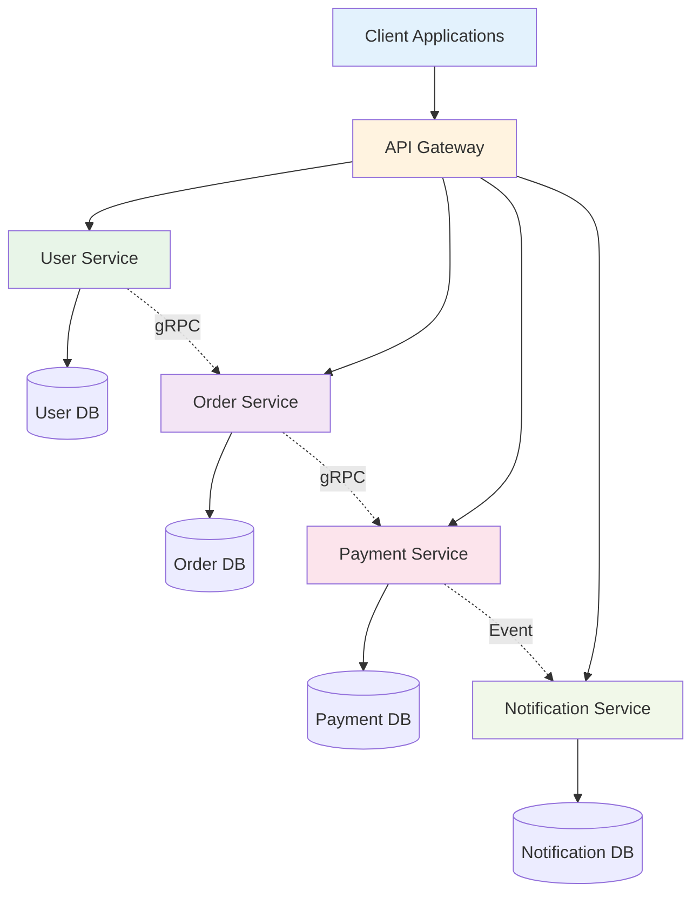
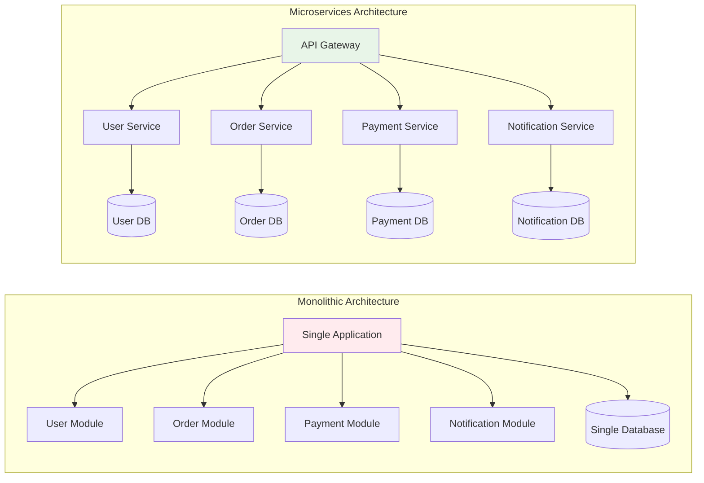
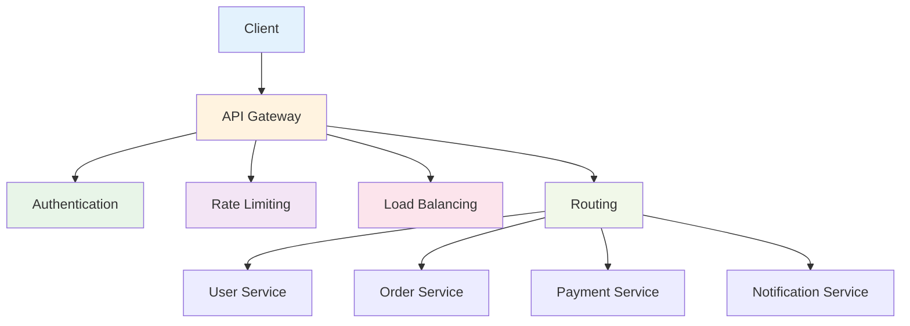
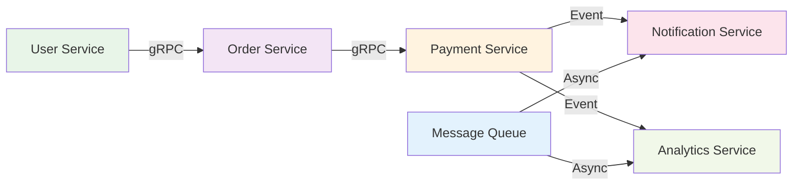
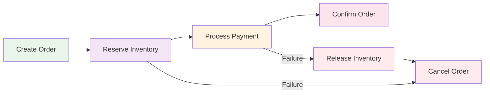
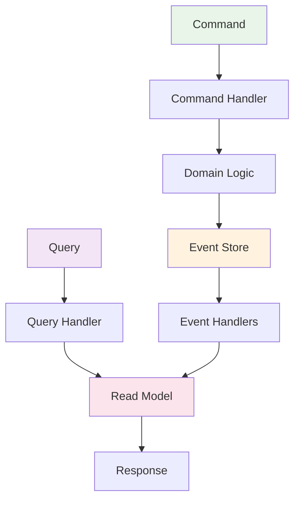
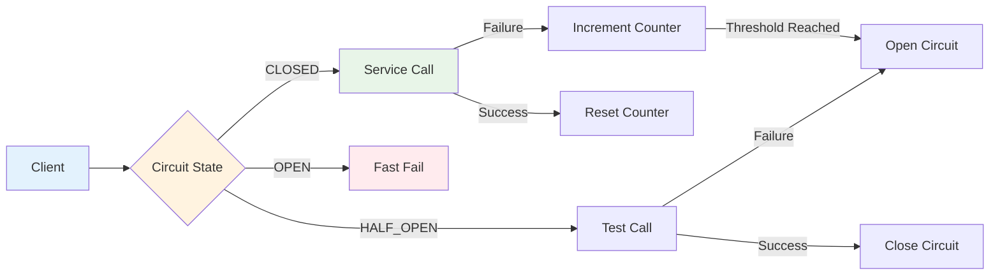

# Microservices Overview

Microservices là một kiến trúc phần mềm trong đó ứng dụng được chia thành các services nhỏ, độc lập, mỗi service thực hiện một chức năng nghiệp vụ cụ thể.



:::tip 💡 Khái niệm cơ bản
Microservices giống như "các cửa hàng nhỏ" - mỗi cửa hàng chuyên về một mặt hàng, có thể hoạt động độc lập và dễ dàng mở rộng.
:::

## Microservices là gì?

Microservices trong NestJS:
- **Service Decomposition** - Chia nhỏ ứng dụng thành các services
- **Service Independence** - Mỗi service độc lập về database, deployment
- **Technology Diversity** - Mỗi service có thể dùng công nghệ khác nhau
- **Scalability** - Có thể scale từng service riêng biệt
- **Fault Isolation** - Lỗi ở một service không ảnh hưởng service khác

## So sánh Monolith vs Microservices



### Bảng so sánh chi tiết

| Tiêu chí | Monolith | Microservices |
|----------|----------|---------------|
| **Development** | Dễ phát triển ban đầu | Phức tạp hơn, cần team coordination |
| **Deployment** | Deploy toàn bộ ứng dụng | Deploy từng service riêng biệt |
| **Scaling** | Scale toàn bộ ứng dụng | Scale từng service theo nhu cầu |
| **Technology** | Một công nghệ duy nhất | Đa dạng công nghệ cho từng service |
| **Database** | Một database duy nhất | Database riêng cho từng service |
| **Fault Tolerance** | Lỗi ảnh hưởng toàn bộ | Lỗi chỉ ảnh hưởng service cụ thể |
| **Team Size** | Team lớn, khó quản lý | Team nhỏ, dễ quản lý |
| **Testing** | Testing toàn bộ ứng dụng | Testing từng service riêng biệt |

## Kiến trúc Microservices

### 1. API Gateway Pattern



**Vai trò của API Gateway:**
- **Single Entry Point** - Điểm vào duy nhất cho tất cả clients
- **Authentication & Authorization** - Xác thực và phân quyền
- **Rate Limiting** - Giới hạn số lượng request
- **Load Balancing** - Phân phối tải
- **Routing** - Định tuyến request đến service phù hợp
- **Monitoring** - Theo dõi và log tất cả requests

### 2. Service Communication



**Các loại communication:**

#### **Synchronous Communication**
- **gRPC** - Google Remote Procedure Call
- **HTTP/REST** - RESTful API calls
- **Direct calls** - Service-to-service calls

#### **Asynchronous Communication**
- **Message Queues** - RabbitMQ, Apache Kafka
- **Event-driven** - Publish/Subscribe pattern
- **Event Sourcing** - Lưu trữ events

## Microservices trong NestJS

### 1. Cài đặt cơ bản

```bash
npm install @nestjs/microservices
```

### 2. Cấu hình Microservice

```typescript title="Microservice Configuration"
// main.ts
import { NestFactory } from '@nestjs/core';
import { Transport } from '@nestjs/microservices';
import { AppModule } from './app.module';

async function bootstrap() {
  const app = await NestFactory.createMicroservice(AppModule, {
    transport: Transport.TCP,
    options: {
      host: 'localhost',
      port: 3001,
    },
  });
  
  await app.listen();
  console.log('Microservice is listening on port 3001');
}
bootstrap();
```

### 3. Service Definition

```typescript title="User Service Definition"
// user.service.ts
import { Injectable } from '@nestjs/common';
import { MessagePattern, Payload } from '@nestjs/microservices';

@Injectable()
export class UserService {
  @MessagePattern({ cmd: 'find_user' })
  findOne(@Payload() data: { id: string }) {
    return this.userRepository.findOne(data.id);
  }

  @MessagePattern({ cmd: 'create_user' })
  create(@Payload() data: CreateUserDto) {
    return this.userRepository.create(data);
  }

  @MessagePattern({ cmd: 'update_user' })
  update(@Payload() data: { id: string; updateData: UpdateUserDto }) {
    return this.userRepository.update(data.id, data.updateData);
  }

  @MessagePattern({ cmd: 'delete_user' })
  remove(@Payload() data: { id: string }) {
    return this.userRepository.remove(data.id);
  }
}
```

### 4. Client Service

```typescript title="Client Service"
// order.service.ts
import { Injectable } from '@nestjs/common';
import { ClientProxy, ClientProxyFactory, Transport } from '@nestjs/microservices';

@Injectable()
export class OrderService {
  private client: ClientProxy;

  constructor() {
    this.client = ClientProxyFactory.create({
      transport: Transport.TCP,
      options: {
        host: 'localhost',
        port: 3001,
      },
    });
  }

  async createOrder(createOrderDto: CreateOrderDto) {
    // Validate user exists
    const user = await this.client.send({ cmd: 'find_user' }, { id: createOrderDto.userId }).toPromise();
    
    if (!user) {
      throw new NotFoundException('User not found');
    }

    // Create order
    const order = await this.orderRepository.create(createOrderDto);
    
    // Notify user service about new order
    this.client.emit('order_created', { userId: createOrderDto.userId, orderId: order.id });
    
    return order;
  }
}
```

## Microservices Patterns

### 1. Saga Pattern



**Saga Pattern** - Quản lý distributed transactions:
- **Choreography** - Services tự phối hợp
- **Orchestration** - Central coordinator điều khiển
- **Compensation** - Rollback khi có lỗi

### 2. CQRS Pattern



**CQRS Pattern** - Command Query Responsibility Segregation:
- **Commands** - Thay đổi state (Create, Update, Delete)
- **Queries** - Đọc data (Read operations)
- **Event Sourcing** - Lưu trữ events thay vì state

### 3. Circuit Breaker Pattern



**Circuit Breaker Pattern** - Bảo vệ service khỏi failures:
- **CLOSED** - Service hoạt động bình thường
- **OPEN** - Service bị block, trả về error ngay lập tức
- **HALF_OPEN** - Test service có hoạt động không

## Best Practices

### 1. Service Design
```typescript title="Service Design Best Practice"
// ✅ Tốt - Service có trách nhiệm rõ ràng
@Injectable()
export class UserService {
  // Chỉ xử lý user-related operations
  async findOne(id: string): Promise<User> { /* ... */ }
  async create(data: CreateUserDto): Promise<User> { /* ... */ }
  async update(id: string, data: UpdateUserDto): Promise<User> { /* ... */ }
  async remove(id: string): Promise<void> { /* ... */ }
}

// ❌ Không tốt - Service làm quá nhiều việc
@Injectable()
export class UserService {
  async findOne(id: string): Promise<User> { /* ... */ }
  async createOrder(data: CreateOrderDto): Promise<Order> { /* ... */ } // Không nên
  async processPayment(data: PaymentDto): Promise<Payment> { /* ... */ } // Không nên
}
```

### 2. Communication Strategy
```typescript title="Communication Strategy Best Practice"
// ✅ Tốt - Sử dụng đúng loại communication
// Synchronous cho operations cần response ngay
const user = await this.userClient.send({ cmd: 'find_user' }, { id }).toPromise();

// Asynchronous cho operations không cần response ngay
this.notificationClient.emit('user_created', { userId: user.id });

// ❌ Không tốt - Sử dụng sai loại communication
// Synchronous cho operations không cần response ngay
await this.notificationClient.send({ cmd: 'send_email' }, { userId }).toPromise();
```

### 3. Error Handling
```typescript title="Error Handling Best Practice"
// ✅ Tốt - Xử lý lỗi một cách graceful
async createOrder(data: CreateOrderDto) {
  try {
    const user = await this.userClient.send({ cmd: 'find_user' }, { id: data.userId }).toPromise();
    
    if (!user) {
      throw new BadRequestException('User not found');
    }
    
    return await this.orderRepository.create(data);
  } catch (error) {
    if (error instanceof BadRequestException) {
      throw error;
    }
    
    // Log và retry cho transient errors
    this.logger.error('Failed to create order', error);
    throw new InternalServerErrorException('Failed to create order');
  }
}
```

## Challenges và Solutions

### 1. **Distributed Data Management**
- **Challenge**: Data consistency across services
- **Solution**: Saga pattern, Event sourcing, CQRS

### 2. **Service Discovery**
- **Challenge**: Services cần tìm nhau
- **Solution**: Service registry (Eureka, Consul), DNS

### 3. **Network Latency**
- **Challenge**: Communication overhead
- **Solution**: Async communication, Caching, CDN

### 4. **Testing Complexity**
- **Challenge**: Testing distributed system
- **Solution**: Contract testing, Integration testing, Chaos engineering

---

:::tip 💡 Lời khuyên tổng kết
- Bắt đầu với services đơn giản, không over-engineer
- Sử dụng đúng loại communication cho từng use case
- Implement proper error handling và retry logic
- Monitor và log tất cả service interactions
- Test từng service riêng biệt và integration testing
- Sử dụng patterns phù hợp (Saga, CQRS, Circuit Breaker)
:::

**Bài tiếp theo:** [Communication Protocols](/docs/microservices/communication-protocols)
