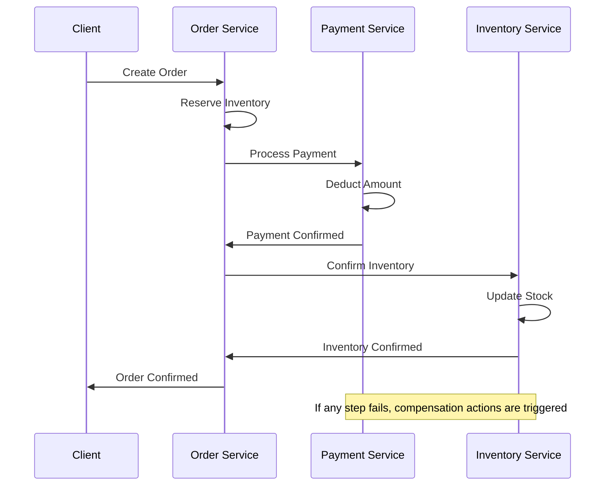
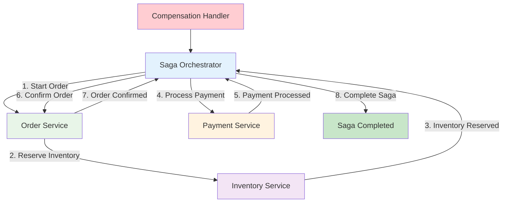
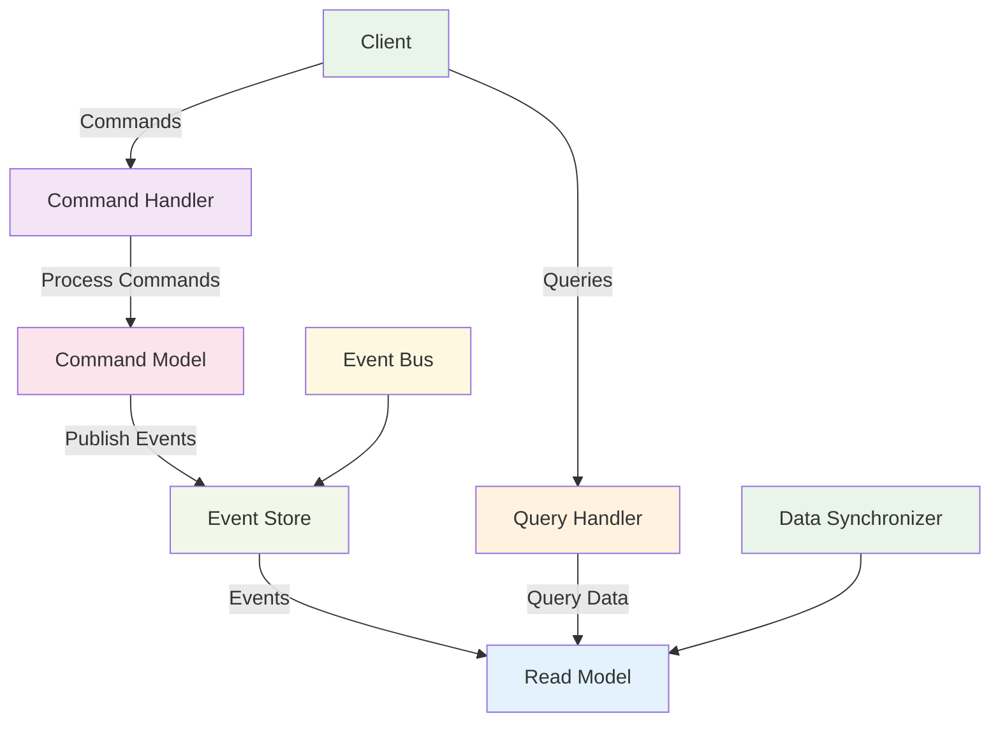
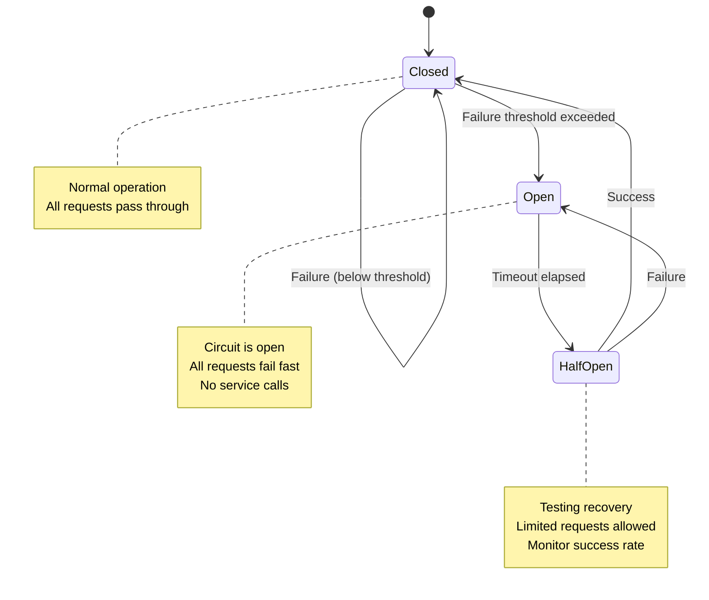
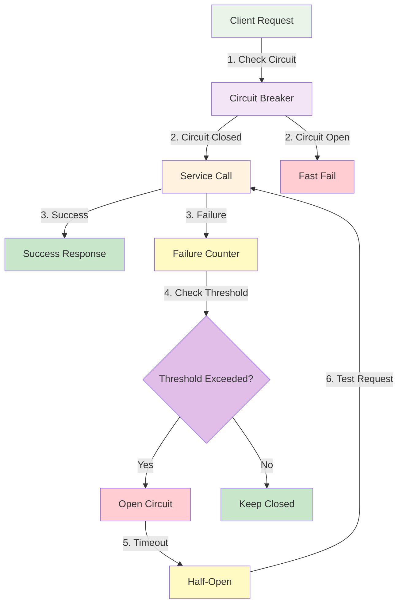
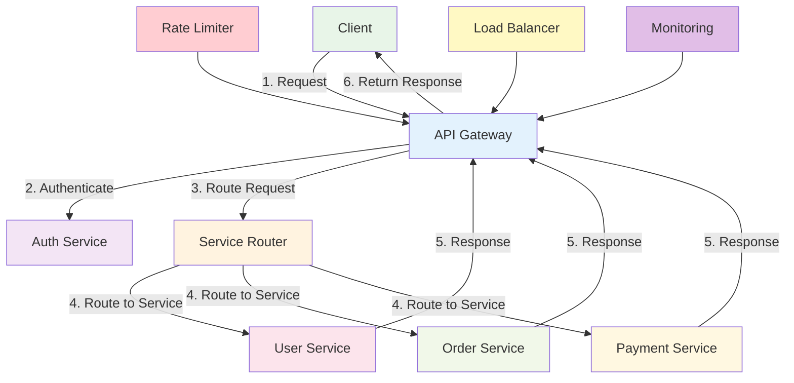
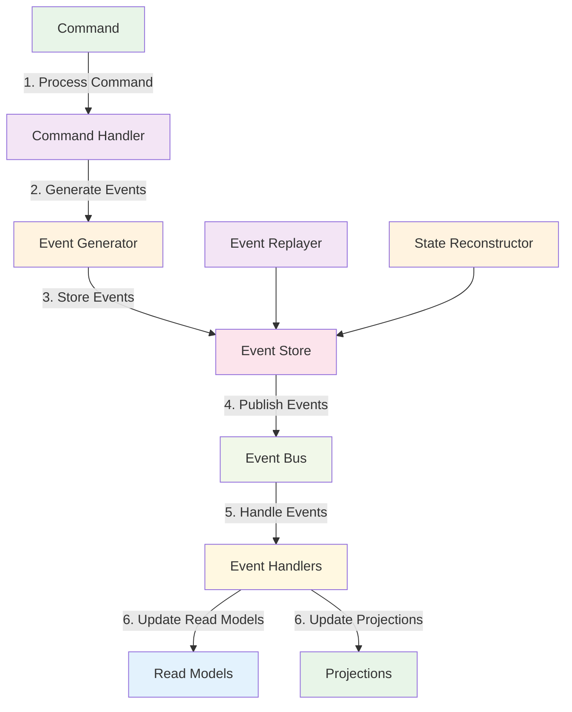

# Microservices Patterns

:::tip 💡 Khái niệm cơ bản
Microservices Patterns giống như "bộ công cụ thiết kế" - cung cấp các giải pháp đã được kiểm chứng để giải quyết các vấn đề phổ biến trong kiến trúc microservices.
:::

## Microservices Patterns là gì?

**Lý thuyết cơ bản:**
Microservices Patterns là các architectural patterns và design patterns được thiết kế để giải quyết các thách thức cụ thể trong microservices architecture. Chúng cung cấp các giải pháp đã được kiểm chứng cho các vấn đề như data consistency, service communication, và fault tolerance.

**Đặc điểm kỹ thuật:**
- **Architectural Patterns**: Patterns cho kiến trúc tổng thể
- **Design Patterns**: Patterns cho thiết kế services
- **Integration Patterns**: Patterns cho service integration
- **Data Patterns**: Patterns cho data management
- **Fault Tolerance**: Patterns cho fault tolerance
- **Scalability Patterns**: Patterns cho scalability

**Cách hoạt động:**
1. **Problem Identification**: Xác định vấn đề cần giải quyết
2. **Pattern Selection**: Chọn pattern phù hợp
3. **Implementation**: Implement pattern
4. **Validation**: Validate pattern effectiveness
5. **Optimization**: Optimize pattern implementation

**Biến đổi trong quá trình xử lý:**
- **Problem State**: Identified → Analyzed → Pattern Selected → Implemented → Validated
- **System State**: Unstable → Pattern Applied → Stable → Optimized
- **Architecture State**: Problematic → Pattern Implemented → Improved → Refined

**Điểm mạnh (Strengths):**
- **Proven Solutions**: Giải pháp đã được kiểm chứng
- **Best Practices**: Cung cấp best practices
- **Problem Solving**: Giải quyết vấn đề cụ thể
- **Scalability**: Hỗ trợ scalability
- **Maintainability**: Cải thiện maintainability
- **Flexibility**: Cung cấp flexibility
- **Reusability**: Patterns có thể reuse
- **Documentation**: Well-documented solutions

**Điểm yếu (Weaknesses):**
- **Complexity**: Tăng complexity
- **Learning Curve**: Steep learning curve
- **Over-engineering**: Có thể over-engineer
- **Performance Overhead**: Performance overhead
- **Maintenance Overhead**: Maintenance overhead
- **Debugging Difficulty**: Khó debug
- **Testing Complexity**: Testing complexity
- **Resource Usage**: Tốn resources

## Khi nào nên dùng và khi nào không nên dùng Microservices Patterns

### **Khi nào NÊN dùng Microservices Patterns:**

**1. Complex Systems:**
- **Large Scale**: Large-scale systems
- **Multiple Services**: Multiple services
- **Complex Requirements**: Complex business requirements
- **Distributed Architecture**: Distributed architecture

**2. Scalability Requirements:**
- **High Traffic**: High traffic applications
- **Growth Expectations**: Expected growth
- **Performance Requirements**: Performance requirements
- **Resource Optimization**: Resource optimization

**3. Business Requirements:**
- **Business Agility**: Business agility requirements
- **Technology Diversity**: Technology diversity needs
- **Independent Deployment**: Independent deployment needs
- **Team Autonomy**: Team autonomy requirements

**4. Technical Challenges:**
- **Data Consistency**: Data consistency challenges
- **Service Communication**: Service communication challenges
- **Fault Tolerance**: Fault tolerance requirements
- **Monitoring Needs**: Monitoring requirements

### **Khi nào KHÔNG NÊN dùng Microservices Patterns:**

**1. Simple Applications:**
- **Small Scale**: Small-scale applications
- **Simple Requirements**: Simple requirements
- **Single Team**: Single team development
- **Monolithic Sufficient**: Monolithic architecture sufficient

**2. Resource Constraints:**
- **Limited Resources**: Limited development resources
- **Budget Constraints**: Budget constraints
- **Time Constraints**: Time constraints
- **Expertise Limitations**: Limited expertise

**3. Performance Critical:**
- **Ultra-low Latency**: Ultra-low latency requirements
- **High Throughput**: High throughput requirements
- **Resource Efficiency**: Resource efficiency requirements
- **Network Optimization**: Network optimization requirements

**4. Legacy Systems:**
- **Old Systems**: Legacy systems
- **No Containerization**: No containerization
- **Static Infrastructure**: Static infrastructure
- **Limited Scalability**: Limited scalability requirements

## Cách áp dụng Microservices Patterns hiệu quả

### **1. Chiến lược áp dụng (Adoption Strategy):**

**Phase 1: Assessment & Analysis**
- **Problem Analysis**: Analyze existing problems
- **Pattern Research**: Research applicable patterns
- **Feasibility Study**: Study pattern feasibility
- **Impact Analysis**: Analyze pattern impact

**Phase 2: Pattern Selection & Design**
- **Pattern Selection**: Select appropriate patterns
- **Architecture Design**: Design architecture
- **Implementation Plan**: Plan implementation
- **Testing Strategy**: Plan testing strategy

**Phase 3: Implementation & Validation**
- **Pattern Implementation**: Implement selected patterns
- **Testing & Validation**: Test và validate patterns
- **Performance Testing**: Test performance impact
- **Production Deployment**: Deploy to production

### **2. Best Practices khi áp dụng:**

**Pattern Selection:**
- **Problem Match**: Match patterns với problems
- **Complexity Consideration**: Consider complexity
- **Team Expertise**: Consider team expertise
- **Resource Availability**: Consider resource availability

**Implementation:**
- **Incremental Implementation**: Implement incrementally
- **Testing**: Test thoroughly
- **Documentation**: Document implementation
- **Monitoring**: Monitor pattern effectiveness

**Optimization:**
- **Performance Monitoring**: Monitor performance
- **Pattern Refinement**: Refine patterns
- **Continuous Improvement**: Continuous improvement
- **Feedback Integration**: Integrate feedback

### **3. Common Pitfalls và cách tránh:**

**Selection Issues:**
- **❌ Wrong Pattern**: Choose appropriate patterns
- **❌ Over-engineering**: Avoid over-engineering
- **❌ Pattern Mismatch**: Match patterns với problems
- **❌ Complexity Overload**: Manage complexity

**Implementation Issues:**
- **❌ Poor Testing**: Test thoroughly
- **❌ No Monitoring**: Implement monitoring
- **❌ Poor Documentation**: Document properly
- **❌ No Validation**: Validate patterns

**✅ Cách tránh:**
- **Start Simple**: Start with simple patterns
- **Test Everything**: Test thoroughly
- **Monitor Performance**: Monitor performance
- **Document Everything**: Document everything

## Core Microservices Patterns

### **1. Saga Pattern - Lý thuyết và Thực hành**

**Lý thuyết về Saga Pattern:**
Saga Pattern là một pattern để quản lý distributed transactions trong microservices. Nó chia một transaction lớn thành một chuỗi các local transactions nhỏ hơn.

**Đặc điểm kỹ thuật:**
- **Distributed Transactions**: Quản lý distributed transactions
- **Local Transactions**: Chia thành local transactions
- **Compensation Actions**: Compensation actions cho failures
- **Event-driven**: Event-driven coordination
- **Choreography**: Choreography-based coordination
- **Orchestration**: Orchestration-based coordination

**Cách hoạt động:**
1. **Transaction Initiation**: Bắt đầu distributed transaction
2. **Local Transaction Execution**: Execute local transactions
3. **Event Publishing**: Publish events sau mỗi step
4. **Compensation Handling**: Handle compensation nếu cần
5. **Transaction Completion**: Hoàn thành transaction

**Biến đổi trong quá trình xử lý:**
- **Transaction State**: Started → Step 1 → Step 2 → Step 3 → Completed
- **Event State**: Published → Processed → Acknowledged → Completed
- **Compensation State**: None → Triggered → Executed → Completed

**Ưu điểm:**
- **Data Consistency**: Đảm bảo data consistency
- **Fault Tolerance**: Handle failures gracefully
- **Scalability**: Scalable transaction management
- **Loose Coupling**: Loose coupling between services
- **Event-driven**: Event-driven architecture
- **Flexibility**: Flexible transaction management

**Nhược điểm:**
- **Complexity**: High complexity
- **Debugging Difficulty**: Difficult to debug
- **Testing Complexity**: Complex testing
- **Event Management**: Event management complexity
- **Compensation Logic**: Compensation logic complexity
- **Performance Overhead**: Performance overhead

### **2. **Saga Pattern - Choreography**

### **3. **Saga Pattern - Orchestration**

### **4. CQRS Pattern - Lý thuyết và Thực hành**

**Lý thuyết về CQRS Pattern:**
CQRS (Command Query Responsibility Segregation) là pattern tách biệt read và write operations. Nó sử dụng separate models cho commands và queries.

**Đặc điểm kỹ thuật:**
- **Command Model**: Separate model cho write operations
- **Query Model**: Separate model cho read operations
- **Event Sourcing**: Event sourcing integration
- **Read Optimization**: Optimize read performance
- **Write Optimization**: Optimize write performance
- **Data Consistency**: Eventual consistency

**Cách hoạt động:**
1. **Command Reception**: Nhận commands
2. **Command Processing**: Process commands
3. **Event Publishing**: Publish events
4. **Query Handling**: Handle queries separately
5. **Data Synchronization**: Synchronize data

**Biến đổi trong quá trình xử lý:**
- **Command State**: Received → Validated → Processed → Events Published
- **Query State**: Received → Processed → Data Retrieved → Response Returned
- **Data State**: Write Model → Events → Read Model → Synchronized

**Ưu điểm:**
- **Performance Optimization**: Optimize read/write performance
- **Scalability**: Scale read/write independently
- **Flexibility**: Flexible data modeling
- **Event Sourcing**: Event sourcing integration
- **Read Optimization**: Optimize read operations
- **Write Optimization**: Optimize write operations

**Nhược điểm:**
- **Complexity**: High complexity
- **Data Consistency**: Eventual consistency
- **Event Management**: Event management complexity
- **Testing Complexity**: Complex testing
- **Debugging Difficulty**: Difficult to debug
- **Learning Curve**: Steep learning curve

### **5. **CQRS Pattern Architecture**

### **6. Circuit Breaker Pattern - Lý thuyết và Thực hành**

**Lý thuyết về Circuit Breaker Pattern:**
Circuit Breaker Pattern là pattern để handle failures gracefully. Nó monitor failures và "open" circuit khi failure rate vượt quá threshold.

**Đặc điểm kỹ thuật:**
- **Failure Monitoring**: Monitor service failures
- **Circuit States**: Open, Half-Open, Closed states
- **Failure Threshold**: Configurable failure threshold
- **Timeout Handling**: Handle timeouts
- **Fallback Mechanisms**: Fallback mechanisms
- **Recovery Logic**: Recovery logic

**Cách hoạt động:**
1. **Request Reception**: Nhận request
2. **Circuit Check**: Check circuit state
3. **Request Processing**: Process request nếu circuit closed
4. **Failure Handling**: Handle failures
5. **Circuit State Management**: Manage circuit state

**Biến đổi trong quá trình xử lý:**
- **Circuit State**: Closed → Open → Half-Open → Closed
- **Request State**: Received → Processed → Success/Failure
- **Failure State**: None → Detected → Threshold Reached → Circuit Opened

**Ưu điểm:**
- **Fault Tolerance**: Handle failures gracefully
- **System Stability**: Maintain system stability
- **Performance Protection**: Protect system performance
- **Failure Isolation**: Isolate failures
- **Recovery Mechanisms**: Automatic recovery
- **Monitoring**: Built-in monitoring

**Nhược điểm:**
- **Complexity**: Implementation complexity
- **Configuration**: Configuration complexity
- **Monitoring Overhead**: Monitoring overhead
- **False Positives**: False positive failures
- **Recovery Time**: Recovery time requirements
- **Testing Complexity**: Complex testing

### **7. **Circuit Breaker Pattern States**

### **8. **Circuit Breaker Implementation**

## Integration Patterns

### **1. API Gateway Pattern - Lý thuyết và Thực hành**

**Lý thuyết về API Gateway Pattern:**
API Gateway Pattern là pattern cung cấp single entry point cho tất cả client requests. Nó handle cross-cutting concerns như authentication, routing, và load balancing.

**Đặc điểm kỹ thuật:**
- **Single Entry Point**: Single entry point cho clients
- **Request Routing**: Route requests đến services
- **Cross-cutting Concerns**: Handle cross-cutting concerns
- **Load Balancing**: Load balancing capabilities
- **Authentication**: Authentication và authorization
- **Rate Limiting**: Rate limiting và throttling

**Cách hoạt động:**
1. **Request Reception**: Nhận client request
2. **Authentication**: Authenticate request
3. **Request Routing**: Route request đến service
4. **Response Aggregation**: Aggregate responses
5. **Response Return**: Return response to client

**Biến đổi trong quá trình xử lý:**
- **Request State**: Received → Authenticated → Routed → Processed → Returned
- **Authentication State**: Unauthenticated → Authenticated → Authorized
- **Routing State**: Received → Analyzed → Routed → Forwarded

**Ưu điểm:**
- **Single Entry Point**: Single entry point
- **Centralized Control**: Centralized control
- **Cross-cutting Concerns**: Handle cross-cutting concerns
- **Client Simplification**: Simplify client code
- **Security**: Centralized security
- **Monitoring**: Centralized monitoring

**Nhược điểm:**
- **Single Point of Failure**: Single point of failure
- **Complexity**: Gateway complexity
- **Performance Overhead**: Performance overhead
- **Scaling Challenges**: Scaling challenges
- **Maintenance Overhead**: Maintenance overhead
- **Technology Coupling**: Technology coupling

### **9. **API Gateway Pattern**

### **2. Event Sourcing Pattern - Lý thuyết và Thực hành**

**Lý thuyết về Event Sourcing Pattern:**
Event Sourcing Pattern lưu trữ tất cả changes như events thay vì chỉ lưu current state. Nó cho phép reconstruct state từ events và provide audit trail.

**Đặc điểm kỹ thuật:**
- **Event Storage**: Store all changes as events
- **State Reconstruction**: Reconstruct state from events
- **Audit Trail**: Complete audit trail
- **Event Replay**: Event replay capabilities
- **Temporal Queries**: Temporal query capabilities
- **CQRS Integration**: CQRS integration

**Cách hoạt động:**
1. **Command Reception**: Nhận command
2. **Event Generation**: Generate events
3. **Event Storage**: Store events
4. **State Update**: Update state
5. **Event Publishing**: Publish events

**Biến đổi trong quá trình xử lý:**
- **Event State**: Generated → Stored → Published → Processed
- **State State**: Current → Updated → New Current
- **Command State**: Received → Processed → Events Generated

**Ưu điểm:**
- **Complete Audit Trail**: Complete audit trail
- **State Reconstruction**: Reconstruct state from events
- **Temporal Queries**: Temporal query capabilities
- **Event Replay**: Event replay capabilities
- **CQRS Integration**: Natural CQRS integration
- **Data Consistency**: Eventual consistency

**Nhược điểm:**
- **Complexity**: High complexity
- **Event Management**: Event management complexity
- **Storage Requirements**: High storage requirements
- **Query Complexity**: Complex queries
- **Learning Curve**: Steep learning curve
- **Debugging Difficulty**: Difficult to debug

### **10. **Event Sourcing Pattern**

## Best Practices

### **1. Pattern Selection - Lý thuyết và Nguyên tắc**

**Nguyên tắc cơ bản:**
- **Problem Match**: Match patterns với problems
- **Complexity Consideration**: Consider implementation complexity
- **Team Expertise**: Consider team expertise
- **Resource Availability**: Consider resource availability

**Quy tắc lựa chọn:**
1. **Problem Analysis**: Analyze problem thoroughly
2. **Pattern Research**: Research applicable patterns
3. **Feasibility Study**: Study pattern feasibility
4. **Impact Analysis**: Analyze pattern impact

**Trade-offs cần cân nhắc:**
- **Complexity vs Benefits**: Balance complexity và benefits
- **Performance vs Features**: Balance performance và features
- **Maintenance vs Functionality**: Balance maintenance và functionality

### **2. Pattern Implementation - Lý thuyết và Chiến lược**

**Nguyên lý Implementation:**
- **Incremental Implementation**: Implement incrementally
- **Thorough Testing**: Test thoroughly
- **Proper Documentation**: Document properly
- **Performance Monitoring**: Monitor performance

**Chiến lược Implementation:**
- **Implementation Strategy**: Choose implementation strategy
- **Testing Strategy**: Choose testing strategy
- **Monitoring Strategy**: Choose monitoring strategy
- **Optimization Strategy**: Choose optimization strategy

**Best Practices:**
- **Start Simple**: Start with simple patterns
- **Test Everything**: Test thoroughly
- **Monitor Performance**: Monitor performance
- **Document Everything**: Document everything

### **3. Pattern Optimization - Lý thuyết và Chiến lược**

**Nguyên lý tối ưu Patterns:**
- **Performance Monitoring**: Monitor pattern performance
- **Pattern Refinement**: Refine patterns continuously
- **Feedback Integration**: Integrate feedback
- **Continuous Improvement**: Continuous improvement

**Chiến lược tối ưu Patterns:**
- **Monitoring Strategy**: Choose monitoring strategy
- **Refinement Strategy**: Choose refinement strategy
- **Feedback Strategy**: Choose feedback strategy
- **Improvement Strategy**: Choose improvement strategy

**Best Practices:**
- **Monitor Performance**: Monitor pattern performance
- **Refine Patterns**: Refine patterns continuously
- **Integrate Feedback**: Integrate feedback
- **Continuous Improvement**: Continuous improvement

## So sánh với các Pattern khác

### **1. Saga vs CQRS:**

**Purpose:**
- **Saga**: Manage distributed transactions
- **CQRS**: Separate read/write operations
- **Kết quả**: Khác nhau, complement nhau

**Complexity:**
- **Saga**: High complexity, transaction management
- **CQRS**: High complexity, data modeling
- **Kết quả**: Cả hai đều complex

**Use Cases:**
- **Saga**: Distributed transactions, business workflows
- **CQRS**: Read/write optimization, event sourcing
- **Kết quả**: Khác nhau, không thay thế được nhau

### **2. Circuit Breaker vs Retry Pattern:**

**Failure Handling:**
- **Circuit Breaker**: Fail fast, protect system
- **Retry Pattern**: Retry failed operations
- **Kết quả**: Khác nhau, có thể kết hợp

**System Protection:**
- **Circuit Breaker**: Protect system from failures
- **Retry Pattern**: Attempt recovery from failures
- **Kết quả**: Circuit Breaker + Retry = Complete failure handling

**Implementation:**
- **Circuit Breaker**: Monitor failures, open circuit
- **Retry Pattern**: Retry operations, exponential backoff
- **Kết quả**: Có thể implement riêng hoặc kết hợp

---

:::tip 💡 Lời khuyên tổng kết - Lý thuyết và Thực hành

**Nguyên tắc cơ bản:**
- **Pattern Selection**: Chọn patterns phù hợp với problems
- **Complexity Management**: Quản lý complexity khi implement patterns
- **Incremental Implementation**: Implement patterns incrementally

**Quy tắc thực hành:**
1. **Pattern Selection**: Analyze problems, research patterns, choose appropriately
2. **Implementation**: Implement incrementally, test thoroughly, monitor performance
3. **Optimization**: Monitor performance, refine patterns, continuous improvement

**Lý do tại sao:**
- **Pattern Selection**: Proven solutions, best practices, problem solving
- **Implementation**: Incremental approach, thorough testing, performance monitoring
- **Optimization**: Performance improvement, pattern refinement, continuous learning

**Cách xử lý biến đổi:**
- **Pattern State**: Selected → Implemented → Tested → Validated → Optimized
- **System State**: Problematic → Pattern Applied → Improved → Refined
- **Performance State**: Baseline → Pattern Impact → Measured → Optimized
:::

**Bài tiếp theo:** [Microservices Testing](/docs/microservices/microservices-testing)
