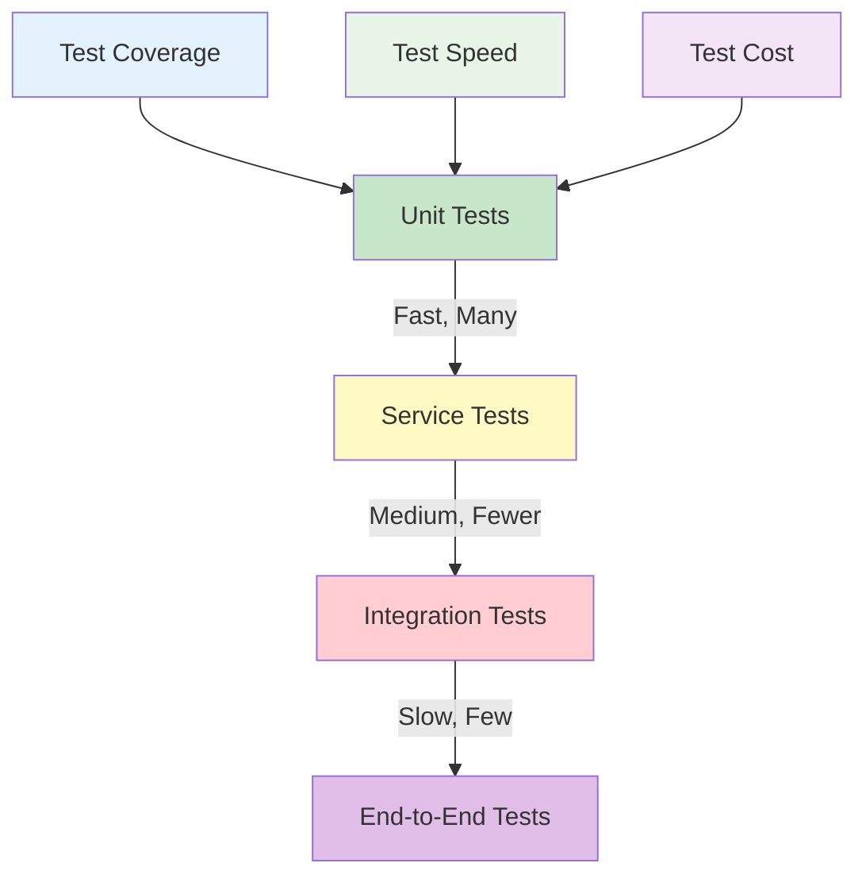
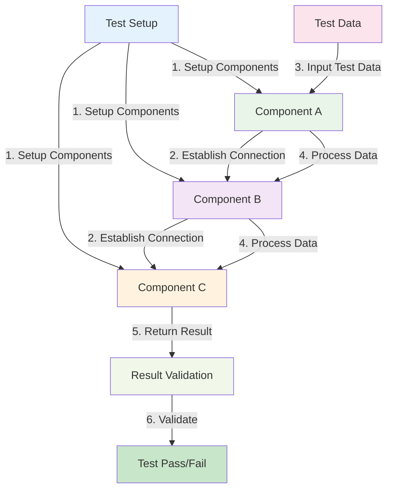
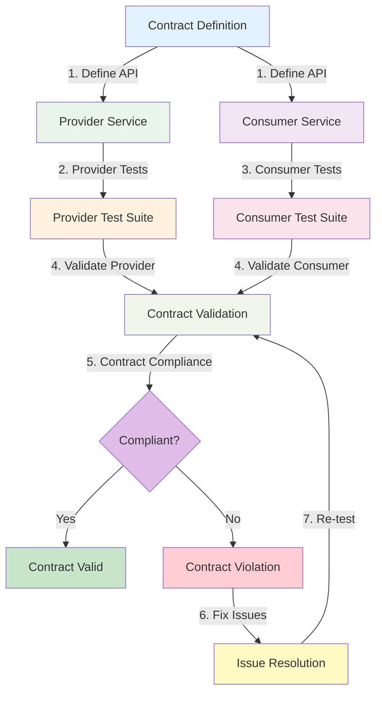
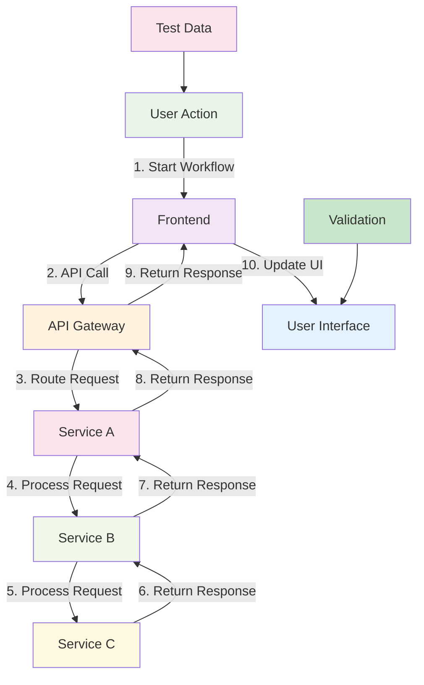
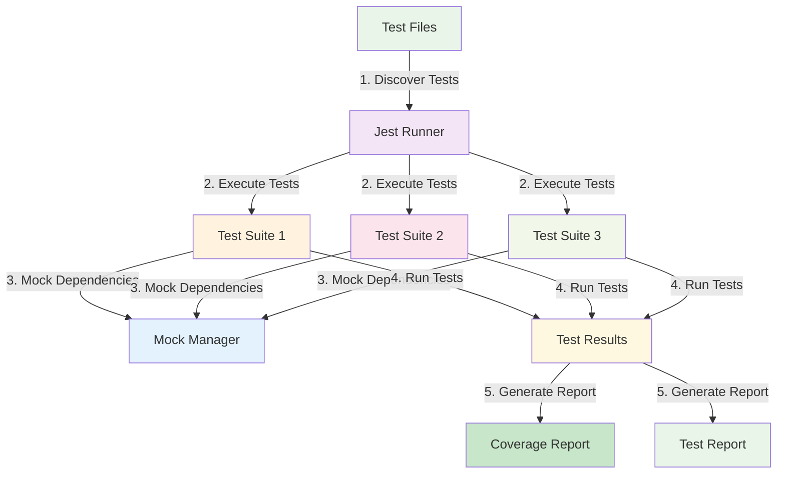
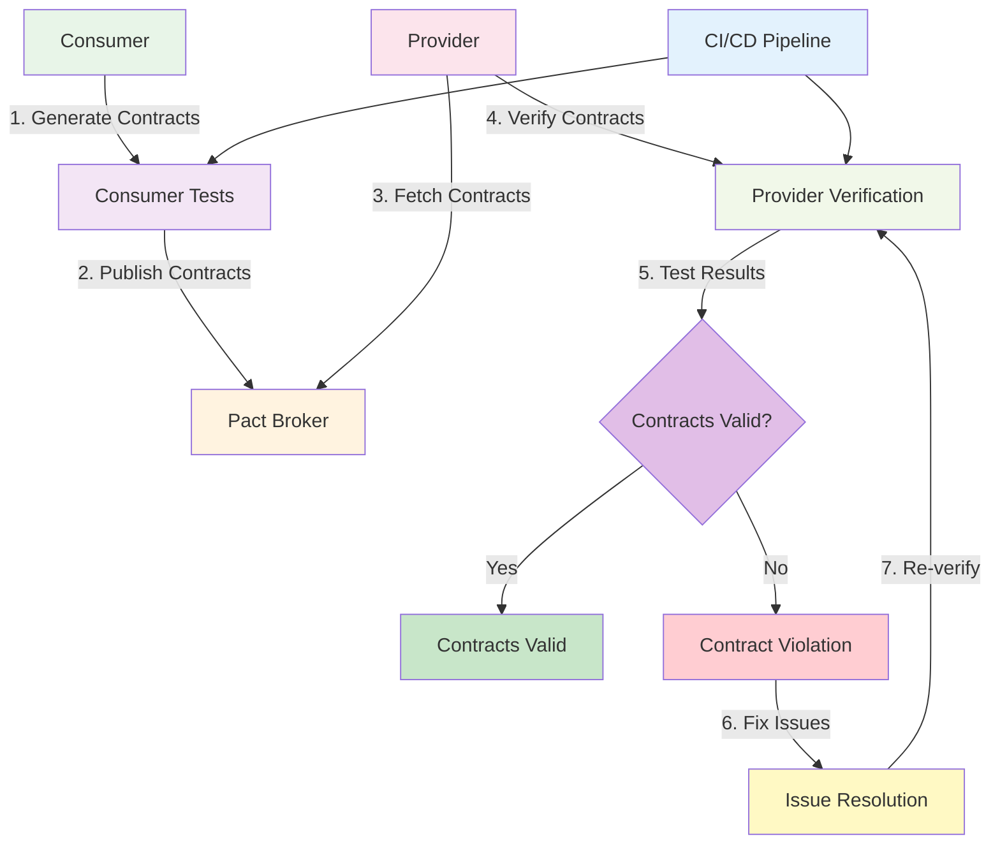

# Microservices Testing

:::tip 💡 Khái niệm cơ bản
Microservices Testing giống như "bộ kiểm tra chất lượng" - đảm bảo từng service hoạt động đúng và các services kết nối với nhau một cách hoàn hảo.
:::

## Microservices Testing là gì?

**Lý thuyết cơ bản:**
Microservices Testing là quá trình kiểm tra và validate từng service riêng lẻ và toàn bộ hệ thống microservices để đảm bảo chúng hoạt động đúng như thiết kế. Nó bao gồm nhiều loại testing khác nhau để cover tất cả aspects của distributed system.

**Đặc điểm kỹ thuật:**
- **Unit Testing**: Test individual service components
- **Integration Testing**: Test service interactions
- **Contract Testing**: Test service contracts
- **End-to-End Testing**: Test complete workflows
- **Performance Testing**: Test performance characteristics
- **Chaos Testing**: Test failure scenarios

**Cách hoạt động:**
1. **Test Planning**: Lập kế hoạch testing strategy
2. **Test Environment Setup**: Setup test environment
3. **Test Execution**: Execute various test types
4. **Result Analysis**: Analyze test results
5. **Issue Resolution**: Resolve identified issues
6. **Test Validation**: Validate fixes

**Biến đổi trong quá trình xử lý:**
- **Test State**: Planned → Setup → Executed → Analyzed → Resolved → Validated
- **Service State**: Untested → Unit Tested → Integration Tested → E2E Tested → Production Ready
- **Quality State**: Unknown → Issues Identified → Issues Fixed → Quality Validated

**Điểm mạnh (Strengths):**
- **Quality Assurance**: Đảm bảo chất lượng services
- **Early Bug Detection**: Phát hiện bugs sớm
- **Confidence Building**: Xây dựng confidence trong system
- **Regression Prevention**: Ngăn chặn regression
- **Documentation**: Serve as living documentation
- **Team Collaboration**: Cải thiện team collaboration
- **Risk Mitigation**: Giảm thiểu risks
- **Performance Validation**: Validate performance characteristics

**Điểm yếu (Weaknesses):**
- **Complexity**: High testing complexity
- **Time Investment**: Significant time investment
- **Resource Requirements**: High resource requirements
- **Environment Setup**: Complex environment setup
- **Test Maintenance**: High test maintenance overhead
- **False Positives**: False positive test results
- **Coverage Challenges**: Difficult to achieve full coverage
- **Integration Complexity**: Complex integration testing

## Khi nào nên dùng và khi nào không nên dùng Microservices Testing

### **Khi nào NÊN dùng Microservices Testing:**

**1. Production Systems:**
- **Live Applications**: Production applications
- **Business Critical**: Business critical systems
- **User-facing Services**: User-facing services
- **Revenue Generating**: Revenue generating systems

**2. Complex Architectures:**
- **Multiple Services**: Multiple microservices
- **Service Dependencies**: Complex service dependencies
- **Distributed Systems**: Distributed systems
- **Event-driven Systems**: Event-driven architectures

**3. Quality Requirements:**
- **High Quality**: High quality requirements
- **Reliability**: Reliability requirements
- **Performance**: Performance requirements
- **Security**: Security requirements

**4. Team Development:**
- **Multiple Teams**: Multiple development teams
- **Continuous Deployment**: Continuous deployment
- **Agile Development**: Agile development
- **DevOps Practices**: DevOps practices

### **Khi nào KHÔNG NÊN dùng Microservices Testing:**

**1. Simple Applications:**
- **Single Service**: Single service applications
- **Simple Requirements**: Simple requirements
- **Prototype Development**: Prototype development
- **Learning Projects**: Learning projects

**2. Resource Constraints:**
- **Limited Time**: Limited development time
- **Limited Budget**: Limited budget
- **Limited Expertise**: Limited testing expertise
- **Limited Infrastructure**: Limited infrastructure

**3. Early Development:**
- **Proof of Concept**: Proof of concept phase
- **MVP Development**: MVP development
- **Experimental Features**: Experimental features
- **Research Projects**: Research projects

**4. Legacy Systems:**
- **Old Systems**: Legacy systems
- **No Containerization**: No containerization
- **Static Infrastructure**: Static infrastructure
- **Limited Scalability**: Limited scalability requirements

## Cách áp dụng Microservices Testing hiệu quả

### **1. Chiến lược áp dụng (Adoption Strategy):**

**Phase 1: Assessment & Planning**
- **Current State Analysis**: Analyze current testing state
- **Testing Requirements**: Identify testing requirements
- **Tool Selection**: Select testing tools
- **Strategy Planning**: Plan testing strategy

**Phase 2: Infrastructure Setup**
- **Test Environment**: Setup test environment
- **Testing Tools**: Configure testing tools
- **CI/CD Integration**: Integrate with CI/CD
- **Monitoring Setup**: Setup monitoring

**Phase 3: Implementation & Execution**
- **Test Implementation**: Implement tests
- **Test Execution**: Execute tests
- **Result Analysis**: Analyze results
- **Continuous Improvement**: Continuous improvement

### **2. Best Practices khi áp dụng:**

**Test Strategy:**
- **Test Pyramid**: Follow testing pyramid
- **Automation First**: Automate tests first
- **Continuous Testing**: Implement continuous testing
- **Risk-based Testing**: Focus on high-risk areas

**Test Implementation:**
- **Clear Test Cases**: Write clear test cases
- **Maintainable Tests**: Write maintainable tests
- **Test Data Management**: Manage test data
- **Environment Isolation**: Isolate test environments

**Test Execution:**
- **Regular Execution**: Execute tests regularly
- **Result Tracking**: Track test results
- **Issue Management**: Manage issues effectively
- **Performance Monitoring**: Monitor test performance

### **3. Common Pitfalls và cách tránh:**

**Strategy Issues:**
- **❌ No Strategy**: Develop comprehensive strategy
- **❌ Over-testing**: Focus on high-value tests
- **❌ Under-testing**: Ensure adequate coverage
- **❌ No Automation**: Automate repetitive tests

**Implementation Issues:**
- **❌ Poor Test Quality**: Write high-quality tests
- **❌ No Maintenance**: Maintain tests regularly
- **❌ Environment Issues**: Fix environment problems
- **❌ Data Problems**: Manage test data properly

**✅ Cách tránh:**
- **Start Small**: Start with small testing scope
- **Automate Everything**: Automate repetitive tasks
- **Monitor Quality**: Monitor test quality
- **Continuous Improvement**: Continuously improve

## Testing Types

### **1. Unit Testing - Lý thuyết và Thực hành**

**Lý thuyết về Unit Testing:**
Unit Testing là testing individual components hoặc functions trong isolation. Nó test smallest testable parts của code để đảm bảo chúng hoạt động đúng như expected.

**Đặc điểm kỹ thuật:**
- **Component Isolation**: Test components in isolation
- **Fast Execution**: Fast test execution
- **High Coverage**: High code coverage
- **Mocking**: Use mocks và stubs
- **Automated**: Fully automated
- **Repeatable**: Repeatable test execution

**Cách hoạt động:**
1. **Test Setup**: Setup test environment
2. **Component Isolation**: Isolate component under test
3. **Test Execution**: Execute test cases
4. **Result Validation**: Validate test results
5. **Cleanup**: Clean up test environment

**Biến đổi trong quá trình xử lý:**
- **Test State**: Setup → Execution → Validation → Cleanup
- **Component State**: Isolated → Tested → Validated → Cleaned
- **Coverage State**: Unknown → Measured → Improved → Optimized

**Ưu điểm:**
- **Fast Execution**: Very fast execution
- **High Coverage**: High code coverage
- **Early Bug Detection**: Early bug detection
- **Refactoring Safety**: Safe refactoring
- **Documentation**: Serve as documentation
- **Confidence Building**: Build development confidence

**Nhược điểm:**
- **Limited Scope**: Limited scope testing
- **Integration Issues**: Don't catch integration issues
- **Environment Dependencies**: Environment dependencies
- **Mock Complexity**: Mock complexity
- **Maintenance Overhead**: Maintenance overhead
- **False Confidence**: False confidence

### **2. **Unit Testing Pyramid**

### **3. Integration Testing - Lý thuyết và Thực hành**

**Lý thuyết về Integration Testing:**
Integration Testing test interactions giữa different components hoặc services. Nó verify rằng các components hoạt động đúng khi kết nối với nhau.

**Đặc điểm kỹ thuật:**
- **Component Interaction**: Test component interactions
- **Service Communication**: Test service communication
- **API Testing**: Test API contracts
- **Data Flow**: Test data flow between components
- **Error Handling**: Test error handling scenarios
- **Performance Testing**: Test integration performance

**Cách hoạt động:**
1. **Component Setup**: Setup multiple components
2. **Connection Establishment**: Establish connections
3. **Interaction Testing**: Test component interactions
4. **Data Validation**: Validate data flow
5. **Error Scenario Testing**: Test error scenarios

**Biến đổi trong quá trình xử lý:**
- **Integration State**: Setup → Connected → Interacting → Validated → Cleaned
- **Data State**: Input → Processed → Transformed → Output → Validated
- **Error State**: None → Triggered → Handled → Resolved → Validated

**Ưu điểm:**
- **Real Interactions**: Test real interactions
- **API Validation**: Validate API contracts
- **Data Flow Testing**: Test data flow
- **Error Handling**: Test error handling
- **Performance Insights**: Performance insights
- **Integration Issues**: Catch integration issues

**Nhược điểm:**
- **Slower Execution**: Slower than unit tests
- **Complex Setup**: Complex setup requirements
- **Environment Dependencies**: Environment dependencies
- **Resource Requirements**: Higher resource requirements
- **Debugging Difficulty**: Difficult to debug
- **Maintenance Overhead**: Higher maintenance overhead

### **4. **Integration Testing Flow**

### **5. Contract Testing - Lý thuyết và Thực hành**

**Lý thuyết về Contract Testing:**
Contract Testing verify rằng services tuân thủ contracts đã định nghĩa. Nó đảm bảo rằng service providers và consumers tương thích với nhau.

**Đặc điểm kỹ thuật:**
- **API Contracts**: Define API contracts
- **Provider Testing**: Test service providers
- **Consumer Testing**: Test service consumers
- **Contract Validation**: Validate contract compliance
- **Version Management**: Manage contract versions
- **Breaking Changes**: Detect breaking changes

**Cách hoạt động:**
1. **Contract Definition**: Define service contracts
2. **Provider Testing**: Test service providers
3. **Consumer Testing**: Test service consumers
4. **Contract Validation**: Validate contract compliance
5. **Version Management**: Manage contract versions

**Biến đổi trong quá trình xử lý:**
- **Contract State**: Defined → Validated → Published → Consumed → Updated
- **Version State**: Current → New → Validated → Published → Deprecated
- **Compliance State**: Unknown → Tested → Compliant → Non-compliant → Fixed

**Ưu điểm:**
- **API Compatibility**: Ensure API compatibility
- **Breaking Changes**: Detect breaking changes early
- **Version Management**: Manage versions effectively
- **Consumer Confidence**: Build consumer confidence
- **Provider Validation**: Validate provider compliance
- **Contract Documentation**: Living contract documentation

**Nhược điểm:**
- **Contract Management**: Contract management complexity
- **Version Coordination**: Version coordination challenges
- **Breaking Changes**: Breaking change handling
- **Testing Overhead**: Additional testing overhead
- **Tool Requirements**: Specialized tool requirements
- **Team Coordination**: Team coordination requirements

### **6. **Contract Testing Architecture**

### **7. End-to-End Testing - Lý thuyết và Thực hành**

**Lý thuyết về End-to-End Testing:**
End-to-End Testing test complete workflows từ start đến finish. Nó simulate real user scenarios và verify rằng toàn bộ system hoạt động đúng.

**Đặc điểm kỹ thuật:**
- **Complete Workflows**: Test complete workflows
- **User Scenarios**: Simulate user scenarios
- **System Integration**: Test system integration
- **Real Data**: Use real data scenarios
- **Performance Testing**: Test end-to-end performance
- **User Experience**: Validate user experience

**Cách hoạt động:**
1. **Scenario Setup**: Setup test scenarios
2. **Workflow Execution**: Execute complete workflows
3. **Data Validation**: Validate data throughout workflow
4. **Performance Measurement**: Measure performance
5. **Result Validation**: Validate final results

**Biến đổi trong quá trình xử lý:**
- **Workflow State**: Started → Step 1 → Step 2 → Step 3 → Completed
- **Data State**: Input → Processed → Transformed → Validated → Output
- **Performance State**: Baseline → Measured → Analyzed → Optimized

**Ưu điểm:**
- **Real Scenarios**: Test real scenarios
- **System Validation**: Validate entire system
- **User Experience**: Validate user experience
- **Integration Testing**: Test all integrations
- **Performance Validation**: Validate performance
- **Confidence Building**: Build confidence in system

**Nhược điểm:**
- **Slow Execution**: Very slow execution
- **Complex Setup**: Complex setup requirements
- **Environment Dependencies**: Heavy environment dependencies
- **Resource Requirements**: High resource requirements
- **Debugging Difficulty**: Very difficult to debug
- **Maintenance Overhead**: High maintenance overhead

### **8. **End-to-End Testing Flow**

## Testing Tools

### **1. Jest - Lý thuyết và Thực hành**

**Lý thuyết về Jest:**
Jest là một JavaScript testing framework được phát triển bởi Facebook. Nó cung cấp comprehensive testing solution với built-in mocking, assertion, và test runner.

**Đặc điểm kỹ thuật:**
- **Test Runner**: Built-in test runner
- **Mocking**: Built-in mocking capabilities
- **Assertions**: Rich assertion library
- **Coverage**: Code coverage reporting
- **Watch Mode**: Watch mode for development
- **Parallel Execution**: Parallel test execution

**Cách hoạt động:**
1. **Test Discovery**: Discover test files
2. **Test Execution**: Execute tests in parallel
3. **Mocking**: Handle mocks và stubs
4. **Assertions**: Validate test results
5. **Coverage Analysis**: Analyze code coverage

**Biến đổi trong quá trình xử lý:**
- **Test State**: Discovered → Executed → Mocked → Asserted → Reported
- **Coverage State**: Unknown → Measured → Analyzed → Reported
- **Performance State**: Baseline → Measured → Optimized

**Ưu điểm:**
- **Easy Setup**: Easy setup và configuration
- **Rich Features**: Rich feature set
- **Good Documentation**: Good documentation
- **Community Support**: Strong community support
- **Facebook Backed**: Facebook backed
- **Active Development**: Active development

**Nhược điểm:**
- **JavaScript Only**: JavaScript only
- **Learning Curve**: Learning curve for complex features
- **Configuration**: Configuration complexity
- **Performance**: Performance với large test suites
- **Debugging**: Debugging complexity
- **Tool Integration**: Tool integration challenges

### **9. **Jest Testing Flow**

### **2. Pact - Lý thuyết và Thực hành**

**Lý thuyết về Pact:**
Pact là một contract testing tool cho microservices. Nó verify rằng service providers và consumers tương thích với nhau thông qua contract testing.

**Đặc điểm kỹ thuật:**
- **Contract Testing**: Contract testing capabilities
- **Provider Testing**: Test service providers
- **Consumer Testing**: Test service consumers
- **Contract Validation**: Validate contract compliance
- **Version Management**: Manage contract versions
- **CI/CD Integration**: CI/CD integration

**Cách hoạt động:**
1. **Consumer Tests**: Consumer generates contracts
2. **Contract Publishing**: Publish contracts to broker
3. **Provider Verification**: Provider verifies contracts
4. **Contract Validation**: Validate contract compliance
5. **Version Management**: Manage contract versions

**Biến đổi trong quá trình xử lý:**
- **Contract State**: Generated → Published → Verified → Validated → Managed
- **Version State**: Current → New → Published → Verified → Deprecated
- **Compliance State**: Unknown → Tested → Compliant → Non-compliant → Fixed

**Ưu điểm:**
- **Contract Testing**: Specialized contract testing
- **Provider Verification**: Provider verification
- **Consumer Testing**: Consumer testing
- **Version Management**: Version management
- **CI/CD Integration**: CI/CD integration
- **Breaking Changes**: Detect breaking changes

**Nhược điểm:**
- **Learning Curve**: Steep learning curve
- **Complexity**: High complexity
- **Tool Requirements**: Specialized tool requirements
- **Team Coordination**: Team coordination requirements
- **Maintenance Overhead**: Maintenance overhead
- **Resource Requirements**: Resource requirements

### **10. **Pact Contract Testing**

## Best Practices

### **1. Test Strategy - Lý thuyết và Nguyên tắc**

**Nguyên tắc cơ bản:**
- **Test Pyramid**: Follow testing pyramid
- **Automation First**: Automate tests first
- **Continuous Testing**: Implement continuous testing
- **Risk-based Testing**: Focus on high-risk areas

**Quy tắc lựa chọn:**
1. **Test Type Selection**: Choose appropriate test types
2. **Coverage Strategy**: Plan coverage strategy
3. **Automation Strategy**: Plan automation strategy
4. **Risk Assessment**: Assess testing risks

**Trade-offs cần cân nhắc:**
- **Speed vs Coverage**: Balance speed và coverage
- **Automation vs Manual**: Balance automation và manual testing
- **Unit vs Integration**: Balance unit và integration testing

### **2. Test Implementation - Lý thuyết và Chiến lược**

**Nguyên lý Implementation:**
- **Clear Test Cases**: Write clear test cases
- **Maintainable Tests**: Write maintainable tests
- **Test Data Management**: Manage test data
- **Environment Isolation**: Isolate test environments

**Chiến lược Implementation:**
- **Implementation Strategy**: Choose implementation strategy
- **Test Data Strategy**: Choose test data strategy
- **Environment Strategy**: Choose environment strategy
- **Maintenance Strategy**: Choose maintenance strategy

**Best Practices:**
- **Write Clear Tests**: Write clear, readable tests
- **Maintain Tests**: Maintain tests regularly
- **Manage Data**: Manage test data effectively
- **Isolate Environments**: Isolate test environments

### **3. Test Execution - Lý thuyết và Chiến lược**

**Nguyên lý Test Execution:**
- **Regular Execution**: Execute tests regularly
- **Result Tracking**: Track test results
- **Issue Management**: Manage issues effectively
- **Performance Monitoring**: Monitor test performance

**Chiến lược Test Execution:**
- **Execution Strategy**: Choose execution strategy
- **Monitoring Strategy**: Choose monitoring strategy
- **Issue Management Strategy**: Choose issue management strategy
- **Performance Strategy**: Choose performance strategy

**Best Practices:**
- **Execute Regularly**: Execute tests regularly
- **Track Results**: Track test results effectively
- **Manage Issues**: Manage issues efficiently
- **Monitor Performance**: Monitor test performance

## So sánh với các Testing Approach khác

### **1. Unit Testing vs Integration Testing:**

**Scope:**
- **Unit Testing**: Individual components
- **Integration Testing**: Component interactions
- **Kết quả**: Khác nhau, complement nhau

**Speed:**
- **Unit Testing**: Very fast
- **Integration Testing**: Slower
- **Kết quả**: Unit tests faster, integration tests slower

**Coverage:**
- **Unit Testing**: High code coverage
- **Integration Testing**: Lower coverage, higher integration coverage
- **Kết quả**: Different types of coverage

### **2. Contract Testing vs End-to-End Testing:**

**Purpose:**
- **Contract Testing**: Verify service contracts
- **End-to-End Testing**: Test complete workflows
- **Kết quả**: Khác nhau, complement nhau

**Scope:**
- **Contract Testing**: Service contracts
- **End-to-End Testing**: Complete system
- **Kết quả**: Contract testing focused, E2E comprehensive

**Performance:**
- **Contract Testing**: Fast execution
- **End-to-End Testing**: Slow execution
- **Kết quả**: Contract testing fast, E2E slow

---

:::tip 💡 Lời khuyên tổng kết - Lý thuyết và Thực hành

**Nguyên tắc cơ bản:**
- **Testing Strategy**: Develop comprehensive testing strategy
- **Test Pyramid**: Follow testing pyramid approach
- **Automation First**: Automate repetitive testing tasks

**Quy tắc thực hành:**
1. **Test Planning**: Plan testing strategy, select tools, setup infrastructure
2. **Test Implementation**: Implement tests, manage data, maintain quality
3. **Test Execution**: Execute regularly, monitor results, manage issues

**Lý do tại sao:**
- **Test Planning**: Quality assurance, risk mitigation, confidence building
- **Test Implementation**: Bug detection, regression prevention, documentation
- **Test Execution**: Continuous validation, issue detection, quality maintenance

**Cách xử lý biến đổi:**
- **Test State**: Planned → Implemented → Executed → Validated → Improved
- **Quality State**: Unknown → Tested → Issues Found → Issues Fixed → Quality Validated
- **Coverage State**: Baseline → Measured → Improved → Optimized → Maintained
:::

**Bài tiếp theo:** [Microservices Deployment](/docs/microservices/microservices-deployment)
