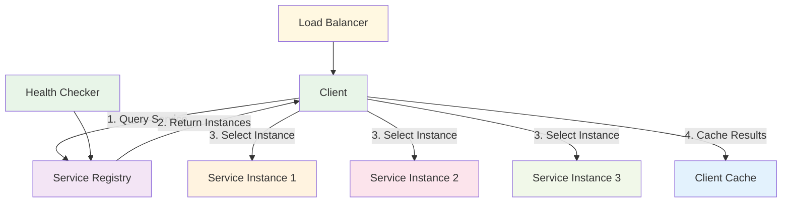
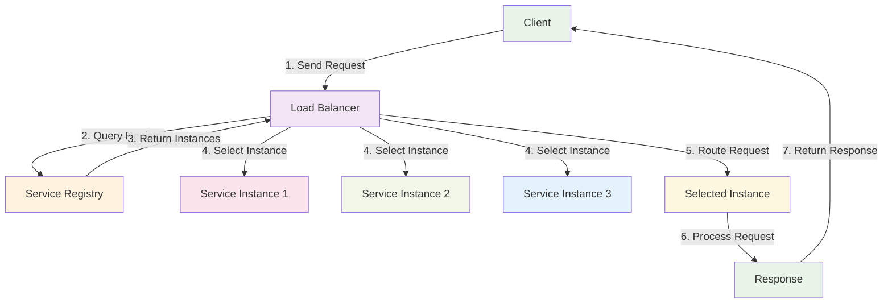
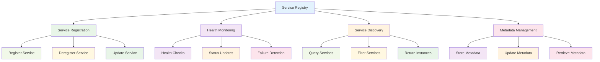
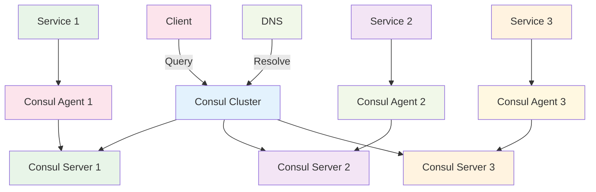
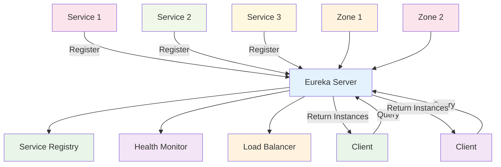

# Service Discovery

:::tip 💡 Khái niệm cơ bản
Service Discovery giống như "danh bạ điện thoại" cho microservices - giúp services tìm thấy nhau và biết địa chỉ để giao tiếp.
:::

## Service Discovery là gì?

**Lý thuyết cơ bản:**
Service Discovery là một pattern cho phép services tự động tìm thấy và kết nối với nhau trong distributed system. Nó giải quyết vấn đề services cần biết địa chỉ của services khác để giao tiếp.

**Đặc điểm kỹ thuật:**
- **Service Registration**: Services đăng ký với discovery service
- **Service Lookup**: Services tìm kiếm services khác
- **Health Checking**: Kiểm tra sức khỏe services
- **Load Balancing**: Phân phối tải giữa service instances
- **Dynamic Discovery**: Tự động discovery services mới
- **Service Metadata**: Lưu trữ metadata về services

**Cách hoạt động:**
1. **Service Startup**: Service khởi động và đăng ký
2. **Registration**: Service đăng ký với discovery service
3. **Health Monitoring**: Discovery service monitor health
4. **Service Lookup**: Client tìm kiếm service
5. **Connection**: Client kết nối với service

**Biến đổi trong quá trình xử lý:**
- **Service State**: Starting → Registering → Registered → Active → Unhealthy → Deregistered
- **Discovery State**: Idle → Discovering → Found → Connected → Monitoring
- **Registry State**: Empty → Registering → Populated → Updating → Cleanup

**Điểm mạnh (Strengths):**
- **Dynamic Discovery**: Tự động tìm thấy services mới
- **Load Balancing**: Tự động load balance requests
- **Health Monitoring**: Monitor service health
- **Scalability**: Dễ dàng scale services
- **Fault Tolerance**: Handle service failures
- **Service Isolation**: Services không cần biết địa chỉ nhau
- **Configuration Management**: Centralized configuration
- **Service Mesh Integration**: Tích hợp với service mesh

**Điểm yếu (Weaknesses):**
- **Single Point of Failure**: Discovery service có thể fail
- **Complexity**: Implementation complexity
- **Performance Overhead**: Discovery overhead
- **Network Dependency**: Phụ thuộc vào network
- **Service Dependencies**: Services phụ thuộc vào discovery
- **Configuration Complexity**: Complex configuration
- **Debugging Difficulty**: Khó debug discovery issues
- **Security Concerns**: Security vulnerabilities

## Khi nào nên dùng và khi nào không nên dùng Service Discovery

### **Khi nào NÊN dùng Service Discovery:**

**1. Microservices Architecture:**
- **Large Scale**: Systems có nhiều services
- **Dynamic Services**: Services thường xuyên thay đổi
- **Service Scaling**: Services cần scale independently
- **Service Communication**: Services cần giao tiếp với nhau

**2. Dynamic Environments:**
- **Cloud Native**: Cloud-native applications
- **Container Orchestration**: Kubernetes, Docker Swarm
- **Auto-scaling**: Auto-scaling environments
- **Dynamic IPs**: Services với dynamic IP addresses

**3. High Availability Requirements:**
- **Fault Tolerance**: Cần fault tolerance
- **Load Balancing**: Cần load balancing
- **Health Monitoring**: Cần monitor service health
- **Service Recovery**: Cần recover từ failures

**4. Service Mesh:**
- **Service Mesh**: Implement service mesh
- **Traffic Management**: Advanced traffic management
- **Security**: Service-to-service security
- **Observability**: Service observability

### **Khi nào KHÔNG NÊN dùng Service Discovery:**

**1. Simple Applications:**
- **Monolithic**: Monolithic applications
- **Few Services**: Chỉ có vài services
- **Static Configuration**: Static service configuration
- **Simple Architecture**: Simple architecture

**2. Performance Critical:**
- **Low Latency**: Cần latency thấp
- **High Throughput**: High throughput requirements
- **Resource Constraints**: Limited resources
- **Network Limitations**: Network limitations

**3. Security Requirements:**
- **High Security**: High security requirements
- **Network Isolation**: Network isolation requirements
- **Compliance**: Strict compliance requirements
- **Audit Requirements**: Audit requirements

**4. Legacy Systems:**
- **Old Systems**: Legacy systems
- **No Containerization**: No containerization
- **Static Infrastructure**: Static infrastructure
- **Limited Resources**: Limited infrastructure resources

## Cách áp dụng Service Discovery hiệu quả

### **1. Chiến lược áp dụng (Adoption Strategy):**

**Phase 1: Assessment & Planning**
- **Service Analysis**: Analyze existing services
- **Discovery Requirements**: Identify discovery requirements
- **Technology Selection**: Choose discovery technology
- **Infrastructure Planning**: Plan infrastructure

**Phase 2: Implementation**
- **Discovery Service**: Implement discovery service
- **Service Registration**: Implement service registration
- **Service Lookup**: Implement service lookup
- **Health Checking**: Implement health checking

**Phase 3: Testing & Deployment**
- **Integration Testing**: Test service integration
- **Load Testing**: Test discovery performance
- **Failure Testing**: Test failure scenarios
- **Production Deployment**: Deploy to production

### **2. Best Practices khi áp dụng:**

**Service Registration:**
- **Automatic Registration**: Automatic service registration
- **Health Checks**: Implement health checks
- **Metadata Management**: Manage service metadata
- **Deregistration**: Proper service deregistration

**Service Lookup:**
- **Caching**: Implement service caching
- **Load Balancing**: Implement load balancing
- **Failover**: Implement failover logic
- **Retry Logic**: Implement retry logic

**Monitoring & Observability:**
- **Health Monitoring**: Monitor service health
- **Performance Monitoring**: Monitor discovery performance
- **Error Tracking**: Track discovery errors
- **Metrics Collection**: Collect discovery metrics

### **3. Common Pitfalls và cách tránh:**

**Architecture Issues:**
- **❌ Single Point of Failure**: Implement redundancy
- **❌ No Health Checks**: Implement health checks
- **❌ No Load Balancing**: Implement load balancing
- **❌ No Failover**: Implement failover logic

**Performance Issues:**
- **❌ No Caching**: Implement service caching
- **❌ No Performance Monitoring**: Monitor performance
- **❌ No Optimization**: Optimize discovery
- **❌ No Scaling**: Plan for scaling

**✅ Cách tránh:**
- **Plan for Scale**: Plan scaling từ đầu
- **Implement Redundancy**: Implement redundancy
- **Monitor Everything**: Monitor tất cả aspects
- **Test Failures**: Test failure scenarios

## Service Discovery Patterns

### **1. Client-Side Discovery - Lý thuyết và Thực hành**

**Lý thuyết về Client-Side Discovery:**
Client-Side Discovery là pattern nơi client chịu trách nhiệm tìm kiếm service instances. Client query discovery service để lấy danh sách service instances và chọn instance phù hợp.

**Đặc điểm kỹ thuật:**
- **Client Responsibility**: Client chịu trách nhiệm discovery
- **Service Registry**: Central service registry
- **Load Balancing**: Client-side load balancing
- **Caching**: Client-side caching

**Cách hoạt động:**
1. **Service Lookup**: Client query discovery service
2. **Instance Selection**: Client chọn service instance
3. **Connection**: Client kết nối với selected instance
4. **Caching**: Client cache service information

**Biến đổi trong quá trình xử lý:**
- **Client State**: Idle → Discovering → Found → Connected → Cached
- **Service State**: Unknown → Discovered → Selected → Connected
- **Registry State**: Idle → Querying → Responding → Idle

**Ưu điểm:**
- **Client Control**: Client có control over instance selection
- **Load Balancing**: Client-side load balancing
- **Caching**: Client-side caching
- **Flexibility**: Flexible instance selection

**Nhược điểm:**
- **Client Complexity**: Client complexity
- **Coupling**: Client coupled với discovery service
- **Caching Issues**: Caching complexity
- **Load Balancing**: Client-side load balancing complexity

### **2. **Client-Side Discovery**

### **3. Server-Side Discovery - Lý thuyết và Thực hành**

**Lý thuyết về Server-Side Discovery:**
Server-Side Discovery là pattern nơi load balancer hoặc router chịu trách nhiệm discovery. Client gửi request đến load balancer, load balancer tìm kiếm service instance và route request.

**Đặc điểm kỹ thuật:**
- **Load Balancer**: Load balancer chịu trách nhiệm discovery
- **Service Registry**: Load balancer query service registry
- **Request Routing**: Load balancer route requests
- **Health Checking**: Load balancer monitor health

**Cách hoạt động:**
1. **Request Reception**: Load balancer nhận request
2. **Service Discovery**: Load balancer tìm kiếm service
3. **Instance Selection**: Load balancer chọn instance
4. **Request Routing**: Load balancer route request

**Biến đổi trong quá trình xử lý:**
- **Request State**: Received → Discovering → Found → Routing → Completed
- **Load Balancer State**: Idle → Discovering → Routing → Idle
- **Service State**: Unknown → Discovered → Selected → Processing

**Ưu điểm:**
- **Client Simplicity**: Client đơn giản
- **Centralized Control**: Centralized discovery control
- **Load Balancing**: Centralized load balancing
- **Health Monitoring**: Centralized health monitoring

**Nhược điểm:**
- **Load Balancer Dependency**: Phụ thuộc vào load balancer
- **Single Point of Failure**: Load balancer là single point of failure
- **Complexity**: Load balancer complexity
- **Scaling Issues**: Load balancer scaling issues

### **4. **Server-Side Discovery**

### **5. Service Registry - Lý thuyết và Thực hành**

**Lý thuyết về Service Registry:**
Service Registry là central database lưu trữ thông tin về services. Nó quản lý service registration, health monitoring, và service discovery.

**Đặc điểm kỹ thuật:**
- **Service Registration**: Register và deregister services
- **Health Monitoring**: Monitor service health
- **Service Metadata**: Store service metadata
- **Service Discovery**: Provide service discovery

**Cách hoạt động:**
1. **Service Registration**: Services register với registry
2. **Health Monitoring**: Registry monitor service health
3. **Service Discovery**: Clients query registry
4. **Registry Management**: Manage registry data

**Biến đổi trong quá trình xử lý:**
- **Registry State**: Empty → Populating → Populated → Updating → Cleanup
- **Service State**: Unregistered → Registering → Registered → Active → Unhealthy → Deregistered
- **Data State**: No Data → Collecting → Stored → Updated → Cleaned

**Ưu điểm:**
- **Centralized Management**: Centralized service management
- **Health Monitoring**: Centralized health monitoring
- **Service Discovery**: Centralized service discovery
- **Metadata Management**: Centralized metadata management

**Nhược điểm:**
- **Single Point of Failure**: Single point of failure
- **Scalability Issues**: Scalability issues
- **Complexity**: Registry complexity
- **Network Dependency**: Network dependency

### **6. **Service Registry Architecture**

## Service Discovery Technologies

### **1. Consul - Lý thuyết và Thực hành**

**Lý thuyết về Consul:**
Consul là một service discovery và configuration tool được phát triển bởi HashiCorp. Nó cung cấp service discovery, health checking, và key-value storage.

**Đặc điểm kỹ thuật:**
- **Service Discovery**: Automatic service discovery
- **Health Checking**: Built-in health checking
- **Key-Value Storage**: Distributed key-value storage
- **Multi-Datacenter**: Multi-datacenter support
- **ACL Support**: Access control list support
- **DNS Interface**: DNS interface cho service discovery

**Cách hoạt động:**
1. **Agent Startup**: Consul agent khởi động
2. **Service Registration**: Services register với agent
3. **Health Checking**: Agent monitor service health
4. **Service Discovery**: Clients query Consul
5. **Configuration Management**: Manage configuration

**Biến đổi trong quá trình xử lý:**
- **Agent State**: Starting → Running → Monitoring → Updating → Stopping
- **Service State**: Unregistered → Registering → Registered → Healthy → Unhealthy → Deregistered
- **Configuration State**: Default → Loading → Loaded → Updating → Synchronized

**Ưu điểm:**
- **Feature Rich**: Rich feature set
- **Health Checking**: Built-in health checking
- **Multi-Datacenter**: Multi-datacenter support
- **ACL Support**: Access control support
- **DNS Interface**: DNS interface
- **Key-Value Storage**: Key-value storage

**Nhược điểm:**
- **Complexity**: High complexity
- **Resource Usage**: High resource usage
- **Learning Curve**: Steep learning curve
- **Operational Overhead**: High operational overhead

### **2. **Consul Architecture**

### **3. Eureka - Lý thuyết và Thực hành**

**Lý thuyết về Eureka:**
Eureka là một service discovery tool được phát triển bởi Netflix. Nó được thiết kế cho AWS cloud và cung cấp REST-based service discovery.

**Đặc điểm kỹ thuật:**
- **REST API**: REST-based service discovery
- **AWS Integration**: AWS cloud integration
- **Self-Preservation**: Self-preservation mode
- **Client-Side Load Balancing**: Client-side load balancing
- **Health Checking**: Health checking support
- **Zone Awareness**: Zone awareness support

**Cách hoạt động:**
1. **Service Registration**: Services register với Eureka
2. **Heartbeat**: Services send heartbeat
3. **Service Discovery**: Clients query Eureka
4. **Load Balancing**: Client-side load balancing
5. **Health Monitoring**: Monitor service health

**Biến đổi trong quá trình xử lý:**
- **Service State**: Starting → Registering → Registered → Heartbeating → Unhealthy → Deregistered
- **Eureka State**: Starting → Running → Monitoring → Updating → Stopping
- **Client State**: Unknown → Discovering → Found → Connected → Monitoring

**Ưu điểm:**
- **AWS Integration**: Good AWS integration
- **Self-Preservation**: Self-preservation mode
- **Client-Side Load Balancing**: Client-side load balancing
- **Zone Awareness**: Zone awareness support
- **Netflix Proven**: Netflix proven technology
- **Spring Integration**: Good Spring integration

**Nhược điểm:**
- **AWS Specific**: AWS specific design
- **Limited Features**: Limited feature set
- **No Multi-Datacenter**: No multi-datacenter support
- **No ACL Support**: No access control support

### **4. **Eureka Architecture**

## Best Practices

### **1. Service Registration - Lý thuyết và Nguyên tắc**

**Nguyên tắc cơ bản:**
- **Automatic Registration**: Automatic service registration
- **Health Checks**: Implement health checks
- **Metadata Management**: Manage service metadata
- **Deregistration**: Proper service deregistration

**Quy tắc lựa chọn:**
1. **Registration Strategy**: Choose registration strategy
2. **Health Check Strategy**: Choose health check strategy
3. **Metadata Strategy**: Choose metadata strategy
4. **Deregistration Strategy**: Choose deregistration strategy

**Trade-offs cần cân nhắc:**
- **Automation vs Control**: Balance automation và control
- **Health Check Frequency**: Balance frequency và overhead
- **Metadata vs Performance**: Balance metadata và performance

### **2. Service Discovery - Lý thuyết và Chiến lược**

**Nguyên lý Service Discovery:**
- **Caching**: Implement service caching
- **Load Balancing**: Implement load balancing
- **Failover**: Implement failover logic
- **Retry Logic**: Implement retry logic

**Chiến lược Service Discovery:**
- **Discovery Strategy**: Choose discovery strategy
- **Caching Strategy**: Choose caching strategy
- **Load Balancing Strategy**: Choose load balancing strategy
- **Failover Strategy**: Choose failover strategy

**Best Practices:**
- **Implement Caching**: Implement service caching
- **Implement Load Balancing**: Implement load balancing
- **Implement Failover**: Implement failover logic
- **Implement Retry Logic**: Implement retry logic

### **3. Health Monitoring - Lý thuyết và Chiến lược**

**Nguyên lý Health Monitoring:**
- **Health Checks**: Implement health checks
- **Status Monitoring**: Monitor service status
- **Failure Detection**: Detect service failures
- **Recovery Actions**: Take recovery actions

**Chiến lược Health Monitoring:**
- **Health Check Strategy**: Choose health check strategy
- **Monitoring Strategy**: Choose monitoring strategy
- **Failure Detection Strategy**: Choose failure detection strategy
- **Recovery Strategy**: Choose recovery strategy

**Best Practices:**
- **Implement Health Checks**: Implement health checks
- **Monitor Status**: Monitor service status
- **Detect Failures**: Detect service failures
- **Take Recovery Actions**: Take recovery actions

## So sánh với các Technology khác

### **1. Consul vs Eureka:**

**Feature Set:**
- **Consul**: Rich feature set, health checking, key-value storage
- **Eureka**: Basic feature set, simple service discovery
- **Kết quả**: Consul feature-rich, Eureka simple

**Cloud Integration:**
- **Consul**: Multi-cloud, multi-datacenter
- **Eureka**: AWS specific, single datacenter
- **Kết quả**: Consul multi-cloud, Eureka AWS specific

**Complexity:**
- **Consul**: High complexity, steep learning curve
- **Eureka**: Low complexity, easy to use
- **Kết quả**: Consul complex, Eureka simple

**Use Cases:**
- **Consul**: Enterprise, multi-cloud, complex requirements
- **Eureka**: Simple, AWS, basic requirements
- **Kết quả**: Consul enterprise, Eureka simple

### **2. Service Discovery vs Load Balancing:**

**Purpose:**
- **Service Discovery**: Find service instances
- **Load Balancing**: Distribute load between instances
- **Kết quả**: Khác nhau, complement nhau

**Functionality:**
- **Service Discovery**: Service location, health monitoring
- **Load Balancing**: Request distribution, health checking
- **Kết quả**: Service Discovery + Load Balancing = Complete solution

**Implementation:**
- **Service Discovery**: Service registry, health monitoring
- **Load Balancing**: Request routing, instance selection
- **Kết quả**: Có thể implement riêng hoặc kết hợp

---

:::tip 💡 Lời khuyên tổng kết - Lý thuyết và Thực hành

**Nguyên tắc cơ bản:**
- **Technology Selection**: Service Discovery phù hợp cho microservices và dynamic environments
- **Complexity vs Functionality**: Service Discovery có nhiều features nhưng complexity cao
- **Scalability vs Reliability**: Service Discovery scalable nhưng cần reliability

**Quy tắc thực hành:**
1. **Service Discovery**: Cho microservices, dynamic environments, cloud-native
2. **Load Balancing**: Cho request distribution, health checking
3. **Service Mesh**: Cho advanced traffic management, security

**Lý do tại sao:**
- **Service Discovery**: Dynamic discovery, health monitoring, scalability
- **Load Balancing**: Request distribution, health checking, performance
- **Service Mesh**: Advanced traffic management, security, observability

**Cách xử lý biến đổi:**
- **Service State**: Unregistered → Registered → Healthy → Unhealthy → Deregistered
- **Discovery State**: Idle → Discovering → Found → Connected → Monitoring
- **Health State**: Unknown → Healthy → Unhealthy → Failed → Recovered
:::

**Bài tiếp theo:** [Load Balancing](/docs/microservices/load-balancing)
