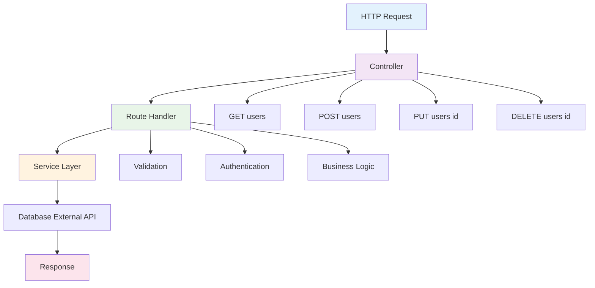
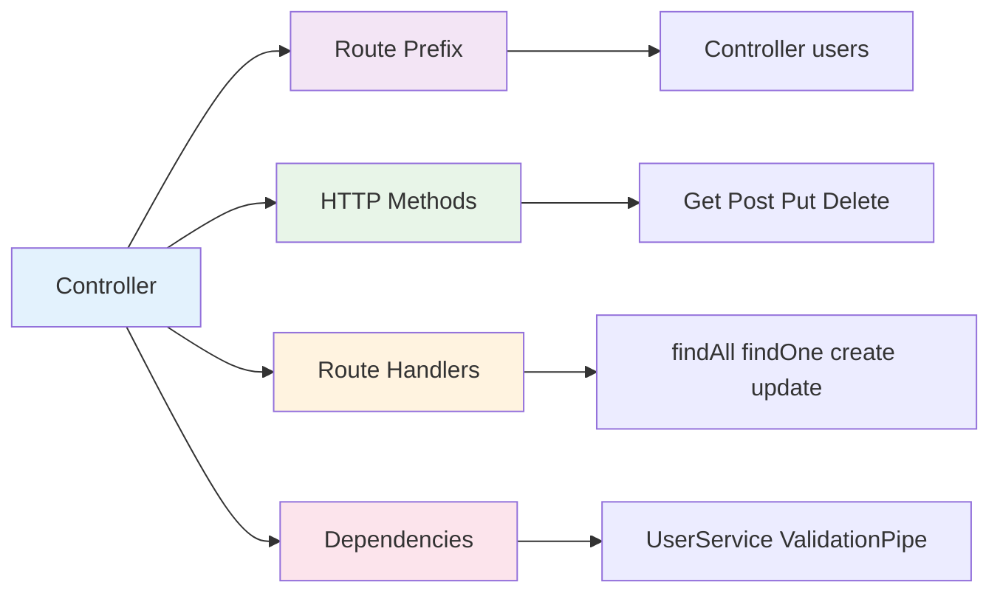

# Controllers

Controllers trong NestJS là các class xử lý HTTP requests và responses. Chúng định nghĩa các routes, HTTP methods, và logic xử lý request từ client.



:::tip 💡 Khái niệm cơ bản
Controllers trong NestJS giống như "cửa ngõ" của ứng dụng, nhận requests từ client và trả về responses. Chúng sử dụng decorators để định nghĩa routes và HTTP methods.
:::

## Controllers là gì?

Controllers trong NestJS:
- **Xử lý HTTP requests** - nhận và xử lý requests từ client
- **Định nghĩa routes** - mapping URLs với logic xử lý
- **Validate input** - kiểm tra và validate dữ liệu đầu vào
- **Return responses** - trả về dữ liệu cho client
- **Orchestrate services** - điều phối các services để xử lý business logic

## Lý thuyết về Controllers

### Nguyên lý hoạt động

Controllers trong NestJS hoạt động dựa trên nguyên lý **Request-Response Pattern**:

1. **Request Reception** - Nhận HTTP request từ client
2. **Route Matching** - Tìm route handler phù hợp
3. **Parameter Extraction** - Trích xuất parameters từ request
4. **Validation** - Validate dữ liệu đầu vào
5. **Service Call** - Gọi service để xử lý business logic
6. **Response Generation** - Tạo và trả về response

:::info 🔧 Request-Response Pattern
Request-Response Pattern là cách NestJS xử lý HTTP requests một cách có cấu trúc, đảm bảo mỗi request được xử lý đúng cách và trả về response phù hợp.
:::

### Controller Metadata

Mỗi controller được định nghĩa bằng decorators:

```typescript title="Controller Metadata Structure"
@Controller('users')
export class UserController {
  // highlight-start
  @Get()           // HTTP GET method
  @Post()          // HTTP POST method
  @Put(':id')      // HTTP PUT method với parameter
  @Delete(':id')   // HTTP DELETE method với parameter
  // highlight-end
}
```

## Tạo Controller cơ bản

```typescript title="Basic Controller Example"
import { Controller, Get, Post, Body, Param } from '@nestjs/common';
import { UserService } from './user.service';
import { CreateUserDto } from './dto/create-user.dto';

@Controller('users')
export class UserController {
  constructor(private readonly userService: UserService) {}

  @Get()
  findAll() {
    return this.userService.findAll();
  }

  @Get(':id')
  findOne(@Param('id') id: string) {
    return this.userService.findOne(id);
  }

  @Post()
  create(@Body() createUserDto: CreateUserDto) {
    return this.userService.create(createUserDto);
  }
}
```

## Cấu trúc Controller

Mỗi controller có các thành phần chính:



```typescript title="Controller Structure Breakdown"
@Controller('users')                    // Route prefix
export class UserController {
  constructor(private userService: UserService) {}  // Dependencies
  
  @Get()                               // HTTP method
  findAll() {                          // Route handler
    return this.userService.findAll();
  }
}
```

### Route Prefix
- Định nghĩa base path cho tất cả routes
- Ví dụ: `@Controller('users')` → `/users`

### HTTP Methods
- Xác định loại HTTP request được xử lý
- GET, POST, PUT, PATCH, DELETE

### Route Handlers
- Methods xử lý logic cho từng route
- Có thể async/await

### Dependencies
- Services, pipes, guards được inject
- Sử dụng constructor injection

## HTTP Methods

### 1. GET - Lấy dữ liệu

**Mục đích:** Lấy dữ liệu từ server, không thay đổi dữ liệu.

**Khi nào sử dụng:**
- Lấy danh sách resources
- Lấy thông tin chi tiết một resource
- Search và filter dữ liệu
- Lấy dữ liệu để hiển thị

```typescript title="GET Method Examples"
@Controller('users')
export class UserController {
  @Get()                    // GET /users
  findAll() {
    return this.userService.findAll();
  }

  @Get(':id')               // GET /users/123
  findOne(@Param('id') id: string) {
    return this.userService.findOne(id);
  }

  @Get('search')            // GET /users/search
  search(@Query('q') query: string) {
    return this.userService.search(query);
  }
}
```

:::info 🔍 GET Method Characteristics
- **Idempotent** - Gọi nhiều lần không thay đổi dữ liệu
- **Safe** - Không có side effects
- **Cacheable** - Có thể cache response
- **Query Parameters** - Sử dụng query string
:::

### 2. POST - Tạo mới

**Mục đích:** Tạo mới resource trên server.

**Khi nào sử dụng:**
- Tạo user mới
- Submit form data
- Upload files
- Tạo order mới

```typescript title="POST Method Examples"
@Controller('users')
export class UserController {
  @Post()                   // POST /users
  create(@Body() createUserDto: CreateUserDto) {
    return this.userService.create(createUserDto);
  }

  @Post('bulk')             // POST /users/bulk
  createMany(@Body() users: CreateUserDto[]) {
    return this.userService.createMany(users);
  }

  @Post('upload')           // POST /users/upload
  @UseInterceptors(FileInterceptor('file'))
  uploadFile(@UploadedFile() file: Express.Multer.File) {
    return this.userService.uploadAvatar(file);
  }
}
```

:::tip 💡 POST Method Best Practices
- **Validation** - Luôn validate input data
- **DTOs** - Sử dụng Data Transfer Objects
- **Error Handling** - Xử lý lỗi một cách graceful
- **Response Codes** - Trả về HTTP status codes phù hợp
:::

### 3. PUT - Cập nhật toàn bộ

**Mục đích:** Cập nhật toàn bộ resource, thay thế hoàn toàn.

**Khi nào sử dụng:**
- Cập nhật toàn bộ user profile
- Thay thế resource hoàn toàn
- Cập nhật settings

```typescript title="PUT Method Examples"
@Controller('users')
export class UserController {
  @Put(':id')               // PUT /users/123
  update(@Param('id') id: string, @Body() updateUserDto: UpdateUserDto) {
    return this.userService.update(id, updateUserDto);
  }

  @Put(':id/password')      // PUT /users/123/password
  updatePassword(
    @Param('id') id: string,
    @Body() passwordDto: UpdatePasswordDto
  ) {
    return this.userService.updatePassword(id, passwordDto);
  }
}
```

:::warning ⚠️ PUT vs PATCH
- **PUT** - Cập nhật toàn bộ resource
- **PATCH** - Cập nhật một phần resource
- Chọn method phù hợp với use case
:::

### 4. PATCH - Cập nhật một phần

**Mục đích:** Cập nhật một phần resource, không thay thế toàn bộ.

**Khi nào sử dụng:**
- Cập nhật một số fields
- Toggle status
- Increment/decrement values

```typescript title="PATCH Method Examples"
@Controller('users')
export class UserController {
  @Patch(':id')             // PATCH /users/123
  updatePartial(
    @Param('id') id: string,
    @Body() partialUpdateDto: PartialUpdateUserDto
  ) {
    return this.userService.updatePartial(id, partialUpdateDto);
  }

  @Patch(':id/status')      // PATCH /users/123/status
  updateStatus(
    @Param('id') id: string,
    @Body('status') status: UserStatus
  ) {
    return this.userService.updateStatus(id, status);
  }
}
```

### 5. DELETE - Xóa dữ liệu

**Mục đích:** Xóa resource khỏi server.

**Khi nào sử dụng:**
- Xóa user
- Xóa file
- Xóa order
- Soft delete (mark as deleted)

```typescript title="DELETE Method Examples"
@Controller('users')
export class UserController {
  @Delete(':id')            // DELETE /users/123
  remove(@Param('id') id: string) {
    return this.userService.remove(id);
  }

  @Delete(':id/soft')       // DELETE /users/123/soft
  softRemove(@Param('id') id: string) {
    return this.userService.softRemove(id);
  }

  @Delete('bulk')           // DELETE /users/bulk
  removeMany(@Body('ids') ids: string[]) {
    return this.userService.removeMany(ids);
  }
}
```

:::warning ⚠️ DELETE Method Considerations
- **Soft Delete** - Cân nhắc soft delete thay vì hard delete
- **Cascade** - Xử lý dependencies và related data
- **Permissions** - Kiểm tra quyền xóa
- **Audit Trail** - Ghi log các thao tác xóa
:::

## Tổng hợp HTTP Methods

### Bảng so sánh các HTTP Methods

| HTTP Method | Mục đích | Khi nào sử dụng | Đặc điểm | Status Codes |
|-------------|----------|------------------|----------|--------------|
| **GET** | Lấy dữ liệu | • Lấy danh sách resources<br/>• Lấy thông tin chi tiết<br/>• Search và filter<br/>• Lấy dữ liệu hiển thị | • Idempotent<br/>• Safe<br/>• Cacheable<br/>• Query parameters | 200, 404, 400 |
| **POST** | Tạo mới | • Tạo user mới<br/>• Submit form data<br/>• Upload files<br/>• Tạo order mới | • Không idempotent<br/>• Có side effects<br/>• Request body<br/>• Validation required | 201, 400, 409 |
| **PUT** | Cập nhật toàn bộ | • Cập nhật toàn bộ profile<br/>• Thay thế resource<br/>• Cập nhật settings | • Idempotent<br/>• Thay thế hoàn toàn<br/>• Request body<br/>• All fields required | 200, 204, 400, 404 |
| **PATCH** | Cập nhật một phần | • Cập nhật một số fields<br/>• Toggle status<br/>• Increment/decrement | • Idempotent<br/>• Partial update<br/>• Request body<br/>• Optional fields | 200, 204, 400, 404 |
| **DELETE** | Xóa dữ liệu | • Xóa user<br/>• Xóa file<br/>• Xóa order<br/>• Soft delete | • Idempotent<br/>• Có side effects<br/>• Path parameters<br/>• Permissions check | 204, 404, 403 |

### Đặc điểm chi tiết

#### **Idempotent Methods**
- **GET, PUT, PATCH, DELETE** - Gọi nhiều lần không thay đổi kết quả
- **POST** - Không idempotent, mỗi lần gọi có thể tạo resource mới

#### **Safe Methods**
- **GET** - Chỉ đọc dữ liệu, không thay đổi server state
- **POST, PUT, PATCH, DELETE** - Có thể thay đổi server state

#### **Cacheable Methods**
- **GET** - Có thể cache response
- **POST, PUT, PATCH, DELETE** - Thường không cache

#### **Request Body**
- **GET, DELETE** - Thường không có request body
- **POST, PUT, PATCH** - Có request body với dữ liệu

#### **Parameters**
- **GET** - Query parameters, path parameters
- **POST, PUT, PATCH** - Request body, path parameters
- **DELETE** - Path parameters, có thể có request body

### Best Practices cho HTTP Methods

:::tip 💡 Lời khuyên sử dụng HTTP Methods
- **Sử dụng đúng mục đích** - Mỗi method có vai trò riêng
- **RESTful conventions** - Tuân thủ chuẩn REST
- **Consistent naming** - Đặt tên routes nhất quán
- **Proper status codes** - Trả về HTTP status codes phù hợp
- **Input validation** - Validate dữ liệu đầu vào
- **Error handling** - Xử lý lỗi một cách graceful
:::

## Route Parameters

### Path Parameters

**Định nghĩa:** Parameters được truyền qua URL path.

**Cách sử dụng:**
- Sử dụng `@Param()` decorator
- Có thể lấy một hoặc nhiều parameters
- Tự động parse và validate

```typescript title="Path Parameters Examples"
@Controller('users')
export class UserController {
  @Get(':id')               // GET /users/123
  findOne(@Param('id') id: string) {
    return this.userService.findOne(id);
  }

  @Get(':id/posts/:postId') // GET /users/123/posts/456
  findUserPost(
    @Param('id') userId: string,
    @Param('postId') postId: string
  ) {
    return this.userService.findUserPost(userId, postId);
  }

  @Get(':id')
  findOne(@Param() params: { id: string }) {
    // Lấy tất cả parameters
    return this.userService.findOne(params.id);
  }
}
```

### Query Parameters

**Định nghĩa:** Parameters được truyền qua query string.

**Cách sử dụng:**
- Sử dụng `@Query()` decorator
- Hỗ trợ pagination, filtering, sorting
- Có thể optional hoặc required

```typescript title="Query Parameters Examples"
@Controller('users')
export class UserController {
  @Get()
  findAll(
    @Query('page') page: number = 1,
    @Query('limit') limit: number = 10,
    @Query('search') search?: string,
    @Query('sort') sort?: string
  ) {
    return this.userService.findAll({ page, limit, search, sort });
  }

  @Get('search')
  search(@Query() query: SearchUserDto) {
    // Sử dụng DTO để validate query parameters
    return this.userService.search(query);
  }
}
```

### Request Body

**Định nghĩa:** Dữ liệu được gửi trong request body.

**Cách sử dụng:**
- Sử dụng `@Body()` decorator
- Thường dùng với POST, PUT, PATCH
- Validate bằng DTOs

```typescript title="Request Body Examples"
@Controller('users')
export class UserController {
  @Post()
  create(@Body() createUserDto: CreateUserDto) {
    return this.userService.create(createUserDto);
  }

  @Post('bulk')
  createMany(@Body('users') users: CreateUserDto[]) {
    // Lấy specific field từ body
    return this.userService.createMany(users);
  }

  @Put(':id')
  update(
    @Param('id') id: string,
    @Body() updateUserDto: UpdateUserDto
  ) {
    return this.userService.update(id, updateUserDto);
  }
}
```

## Route Prefixes và Nested Routes

### Route Prefixes

**Định nghĩa:** Base path cho tất cả routes trong controller.

**Lợi ích:**
- Tổ chức routes theo nhóm logic
- Dễ dàng quản lý và maintain
- Tạo cấu trúc API rõ ràng

```typescript title="Route Prefixes Examples"
@Controller('users')                    // Base: /users
export class UserController {
  @Get()                               // GET /users
  findAll() { return this.userService.findAll(); }

  @Get(':id')                          // GET /users/123
  findOne(@Param('id') id: string) { return this.userService.findOne(id); }

  @Post()                              // POST /users
  create(@Body() dto: CreateUserDto) { return this.userService.create(dto); }
}

@Controller('admin/users')              // Base: /admin/users
export class AdminUserController {
  @Get()                               // GET /admin/users
  findAll() { return this.userService.findAllForAdmin(); }
}
```

### Nested Routes

**Định nghĩa:** Routes lồng nhau để thể hiện mối quan hệ giữa resources.

**Cách sử dụng:**
- Sử dụng multiple `@Controller()` decorators
- Tạo cấu trúc hierarchy rõ ràng
- Dễ dàng quản lý permissions

```typescript title="Nested Routes Examples"
@Controller('users')
export class UserController {
  @Get(':id/posts')                    // GET /users/123/posts
  findUserPosts(@Param('id') userId: string) {
    return this.postService.findByUserId(userId);
  }

  @Get(':id/posts/:postId')            // GET /users/123/posts/456
  findUserPost(
    @Param('id') userId: string,
    @Param('postId') postId: string
  ) {
    return this.postService.findUserPost(userId, postId);
  }

  @Post(':id/posts')                   // POST /users/123/posts
  createUserPost(
    @Param('id') userId: string,
    @Body() createPostDto: CreatePostDto
  ) {
    return this.postService.createForUser(userId, createPostDto);
  }
}
```

## Status Codes và Headers

### HTTP Status Codes

**Định nghĩa:** Mã trạng thái HTTP để thông báo kết quả request.

**Cách sử dụng:**
- Sử dụng `@HttpCode()` decorator
- Hoặc return response object với status
- NestJS tự động set status codes phù hợp

```typescript title="Status Codes Examples"
@Controller('users')
export class UserController {
  @Post()
  @HttpCode(201)                       // Set custom status code
  create(@Body() dto: CreateUserDto) {
    return this.userService.create(dto);
  }

  @Delete(':id')
  @HttpCode(204)                       // No Content
  remove(@Param('id') id: string) {
    this.userService.remove(id);
    // Không return gì, status 204
  }

  @Get(':id')
  findOne(@Param('id') id: string) {
    const user = this.userService.findOne(id);
    if (!user) {
      throw new NotFoundException('User not found'); // 404
    }
    return user; // 200
  }
}
```

### Response Headers

**Định nghĩa:** Headers được gửi kèm response.

**Cách sử dụng:**
- Sử dụng `@Header()` decorator
- Hoặc return response object với headers
- Hữu ích cho caching, CORS, authentication

```typescript title="Response Headers Examples"
@Controller('users')
export class UserController {
  @Get()
  @Header('Cache-Control', 'max-age=300')  // Cache 5 minutes
  findAll() {
    return this.userService.findAll();
  }

  @Get('export')
  @Header('Content-Type', 'text/csv')
  @Header('Content-Disposition', 'attachment; filename="users.csv"')
  exportUsers() {
    return this.userService.exportToCSV();
  }

  @Post('login')
  @Header('Set-Cookie', 'token=abc123; HttpOnly')
  login(@Body() loginDto: LoginDto) {
    return this.authService.login(loginDto);
  }
}
```

## Redirects và Response Objects

### Redirects

**Định nghĩa:** Chuyển hướng client đến URL khác.

**Cách sử dụng:**
- Sử dụng `@Redirect()` decorator
- Hoặc return RedirectResponse object
- Hữu ích cho OAuth, pagination, etc.

```typescript title="Redirect Examples"
@Controller('users')
export class UserController {
  @Get('old/:id')
  @Redirect('/users/:id', 301)         // Permanent redirect
  redirectToNew(@Param('id') id: string) {
    return { url: `/users/${id}` };
  }

  @Get('search')
  search(@Query('q') query: string) {
    if (!query) {
      return new RedirectResponse('/users', 302); // Temporary redirect
    }
    return this.userService.search(query);
  }
}
```

### Response Objects

**Định nghĩa:** Custom response objects với status, headers, data.

**Cách sử dụng:**
- Return Response object
- Customize status, headers, body
- Hữu ích cho complex responses

```typescript title="Response Objects Examples"
@Controller('users')
export class UserController {
  @Get()
  findAll(@Res() res: Response) {
    const users = this.userService.findAll();
    return res
      .status(200)
      .header('X-Total-Count', users.length.toString())
      .json(users);
  }

  @Post()
  create(@Body() dto: CreateUserDto, @Res() res: Response) {
    const user = this.userService.create(dto);
    return res
      .status(201)
      .location(`/users/${user.id}`)
      .json(user);
  }
}
```

## Dependency Injection

### Constructor Injection

**Định nghĩa:** Inject dependencies thông qua constructor.

**Cách hoạt động:**
- NestJS tự động inject dependencies
- Sử dụng TypeScript types để resolve
- Singleton instances được chia sẻ

```typescript title="Constructor Injection Examples"
@Controller('users')
export class UserController {
  constructor(
    private readonly userService: UserService,
    private readonly emailService: EmailService,
    private readonly logger: Logger
  ) {}

  @Post()
  async create(@Body() dto: CreateUserDto) {
    this.logger.log('Creating new user');
    const user = await this.userService.create(dto);
    await this.emailService.sendWelcomeEmail(user.email);
    return user;
  }
}
```

### Property Injection

**Định nghĩa:** Inject dependencies thông qua properties.

**Cách sử dụng:**
- Sử dụng `@Inject()` decorator
- Hữu ích cho optional dependencies
- Dynamic injection

```typescript title="Property Injection Examples"
@Controller('users')
export class UserController {
  @Inject(UserService)
  private readonly userService: UserService;

  @InjectOptional(EmailService)
  private readonly emailService?: EmailService;

  @Inject('CONFIG')
  private readonly config: ConfigService;

  @Post()
  async create(@Body() dto: CreateUserDto) {
    const user = await this.userService.create(dto);
    
    if (this.emailService) {
      await this.emailService.sendWelcomeEmail(user.email);
    }
    
    return user;
  }
}
```

## Request và Response Objects

### Request Object

**Định nghĩa:** Object chứa thông tin về HTTP request.

**Cách sử dụng:**
- Sử dụng `@Req()` decorator
- Truy cập headers, cookies, IP address
- Hữu ích cho logging, analytics

```typescript title="Request Object Examples"
@Controller('users')
export class UserController {
  @Get()
  findAll(@Req() req: Request) {
    this.logger.log(`Request from ${req.ip}`);
    this.logger.log(`User-Agent: ${req.headers['user-agent']}`);
    
    return this.userService.findAll();
  }

  @Post('upload')
  @UseInterceptors(FileInterceptor('file'))
  uploadFile(
    @UploadedFile() file: Express.Multer.File,
    @Req() req: Request
  ) {
    this.logger.log(`File uploaded by ${req.user?.id}`);
    return this.fileService.upload(file);
  }
}
```

### Response Object

**Định nghĩa:** Object để customize HTTP response.

**Cách sử dụng:**
- Sử dụng `@Res()` decorator
- Customize status, headers, body
- Lưu ý: Sử dụng `@Res()` sẽ disable NestJS response handling

```typescript title="Response Object Examples"
@Controller('users')
export class UserController {
  @Get('export')
  exportUsers(@Res() res: Response) {
    const csv = this.userService.exportToCSV();
    
    res.set({
      'Content-Type': 'text/csv',
      'Content-Disposition': 'attachment; filename="users.csv"',
      'Content-Length': Buffer.byteLength(csv)
    });
    
    return res.send(csv);
  }

  @Get('stream')
  streamUsers(@Res() res: Response) {
    const stream = this.userService.createReadStream();
    stream.pipe(res);
  }
}
```

## Async Controllers

### Async/Await Pattern

**Định nghĩa:** Controllers xử lý bất đồng bộ với async/await.

**Lợi ích:**
- Code dễ đọc và maintain
- Proper error handling
- Performance tốt hơn cho I/O operations

```typescript title="Async Controllers Examples"
@Controller('users')
export class UserController {
  @Get()
  async findAll(): Promise<User[]> {
    return await this.userService.findAll();
  }

  @Get(':id')
  async findOne(@Param('id') id: string): Promise<User> {
    const user = await this.userService.findOne(id);
    if (!user) {
      throw new NotFoundException('User not found');
    }
    return user;
  }

  @Post()
  async create(@Body() dto: CreateUserDto): Promise<User> {
    try {
      const user = await this.userService.create(dto);
      await this.emailService.sendWelcomeEmail(user.email);
      return user;
    } catch (error) {
      this.logger.error('Failed to create user', error);
      throw new InternalServerErrorException('Failed to create user');
    }
  }
}
```

### Error Handling

**Định nghĩa:** Xử lý lỗi một cách graceful và consistent.

**Cách sử dụng:**
- Sử dụng built-in exception filters
- Custom exception classes
- Proper HTTP status codes

```typescript title="Error Handling Examples"
@Controller('users')
export class UserController {
  @Get(':id')
  async findOne(@Param('id') id: string): Promise<User> {
    try {
      const user = await this.userService.findOne(id);
      if (!user) {
        throw new NotFoundException(`User with ID ${id} not found`);
      }
      return user;
    } catch (error) {
      if (error instanceof NotFoundException) {
        throw error;
      }
      this.logger.error(`Error finding user ${id}`, error);
      throw new InternalServerErrorException('Internal server error');
    }
  }

  @Post()
  async create(@Body() dto: CreateUserDto): Promise<User> {
    try {
      await this.validationService.validate(dto);
      const user = await this.userService.create(dto);
      return user;
    } catch (error) {
      if (error instanceof ValidationException) {
        throw new BadRequestException(error.message);
      }
      throw new InternalServerErrorException('Failed to create user');
    }
  }
}
```

## Validation và Transformation

### Input Validation

**Định nghĩa:** Kiểm tra và validate dữ liệu đầu vào.

**Cách sử dụng:**
- Sử dụng DTOs với class-validator
- Global validation pipe
- Custom validation decorators

```typescript title="Input Validation Examples"
@Controller('users')
export class UserController {
  @Post()
  async create(@Body() createUserDto: CreateUserDto) {
    // Validation được xử lý tự động bởi ValidationPipe
    return this.userService.create(createUserDto);
  }

  @Put(':id')
  async update(
    @Param('id', ParseIntPipe) id: number,  // Parse và validate ID
    @Body() updateUserDto: UpdateUserDto
  ) {
    return this.userService.update(id, updateUserDto);
  }

  @Get()
  async findAll(
    @Query('page', new DefaultValuePipe(1), ParseIntPipe) page: number,
    @Query('limit', new DefaultValuePipe(10), ParseIntPipe) limit: number
  ) {
    return this.userService.findAll({ page, limit });
  }
}
```

### Data Transformation

**Định nghĩa:** Chuyển đổi dữ liệu trước khi xử lý.

**Cách sử dụng:**
- Sử dụng transformation pipes
- Custom transformation logic
- Data sanitization

```typescript title="Data Transformation Examples"
@Controller('users')
export class UserController {
  @Post()
  async create(
    @Body(new ValidationPipe({ transform: true })) createUserDto: CreateUserDto
  ) {
    // Transform: string -> number, trim strings, etc.
    return this.userService.create(createUserDto);
  }

  @Get('search')
  async search(
    @Query('q', new TrimPipe()) query: string,
    @Query('tags', new ParseArrayPipe({ items: String, separator: ',' })) tags: string[]
  ) {
    return this.userService.search({ query: query.trim(), tags });
  }
}
```

## Documentation và Testing

### API Documentation

**Định nghĩa:** Tự động tạo API documentation với Swagger.

**Cách sử dụng:**
- Sử dụng `@ApiTags()`, `@ApiOperation()`
- `@ApiResponse()`, `@ApiParam()`
- Generate OpenAPI specification

```typescript title="API Documentation Examples"
@ApiTags('users')
@Controller('users')
export class UserController {
  @ApiOperation({ summary: 'Get all users' })
  @ApiResponse({ status: 200, description: 'List of users', type: [User] })
  @ApiResponse({ status: 400, description: 'Bad request' })
  @Get()
  findAll(): Promise<User[]> {
    return this.userService.findAll();
  }

  @ApiOperation({ summary: 'Get user by ID' })
  @ApiParam({ name: 'id', description: 'User ID', type: 'string' })
  @ApiResponse({ status: 200, description: 'User found', type: User })
  @ApiResponse({ status: 404, description: 'User not found' })
  @Get(':id')
  findOne(@Param('id') id: string): Promise<User> {
    return this.userService.findOne(id);
  }
}
```

### Controller Testing

**Định nghĩa:** Test controllers một cách độc lập.

**Cách sử dụng:**
- Unit tests với mocked services
- Integration tests với real database
- E2E tests với HTTP requests

```typescript title="Controller Testing Examples"
describe('UserController', () => {
  let controller: UserController;
  let service: UserService;

  beforeEach(async () => {
    const module = await Test.createTestingModule({
      controllers: [UserController],
      providers: [
        {
          provide: UserService,
          useValue: {
            findAll: jest.fn(),
            findOne: jest.fn(),
            create: jest.fn(),
          },
        },
      ],
    }).compile();

    controller = module.get<UserController>(UserController);
    service = module.get<UserService>(UserService);
  });

  it('should be defined', () => {
    expect(controller).toBeDefined();
  });

  it('should return users', async () => {
    const users = [{ id: '1', name: 'John' }];
    jest.spyOn(service, 'findAll').mockResolvedValue(users);

    const result = await controller.findAll();
    expect(result).toEqual(users);
    expect(service.findAll).toHaveBeenCalled();
  });
});
```

## Best Practices

### 1. Single Responsibility

```typescript title="Single Responsibility Principle"
// ✅ Tốt - Mỗi controller một responsibility
@Controller('users')
export class UserController {
  // Chỉ xử lý user-related operations
}

@Controller('auth')
export class AuthController {
  // Chỉ xử lý authentication
}

// ❌ Không tốt - Controller quá nhiều responsibilities
@Controller('api')
export class ApiController {
  // Xử lý users, auth, orders, payments...
}
```

### 2. Proper Error Handling

```typescript title="Proper Error Handling"
// ✅ Tốt - Xử lý lỗi đúng cách
@Controller('users')
export class UserController {
  @Get(':id')
  async findOne(@Param('id') id: string) {
    try {
      const user = await this.userService.findOne(id);
      if (!user) {
        throw new NotFoundException('User not found');
      }
      return user;
    } catch (error) {
      this.logger.error(`Error finding user ${id}`, error);
      throw error;
    }
  }
}

// ❌ Không tốt - Không xử lý lỗi
@Controller('users')
export class UserController {
  @Get(':id')
  async findOne(@Param('id') id: string) {
    return this.userService.findOne(id); // Có thể throw error
  }
}
```

### 3. Input Validation

```typescript title="Input Validation Best Practices"
// ✅ Tốt - Validate input đầy đủ
@Controller('users')
export class UserController {
  @Post()
  async create(
    @Body(new ValidationPipe({ 
      whitelist: true, 
      forbidNonWhitelisted: true 
    })) dto: CreateUserDto
  ) {
    return this.userService.create(dto);
  }
}

// ❌ Không tốt - Không validate input
@Controller('users')
export class UserController {
  @Post()
  async create(@Body() dto: any) { // any type, không validation
    return this.userService.create(dto);
  }
}
```

### 4. Proper HTTP Methods

```typescript title="HTTP Methods Best Practices"
// ✅ Tốt - Sử dụng HTTP methods đúng
@Controller('users')
export class UserController {
  @Get()           // Lấy dữ liệu
  findAll() { return this.userService.findAll(); }

  @Post()          // Tạo mới
  create(@Body() dto: CreateUserDto) { return this.userService.create(dto); }

  @Put(':id')      // Cập nhật toàn bộ
  update(@Param('id') id: string, @Body() dto: UpdateUserDto) { 
    return this.userService.update(id, dto); 
  }

  @Delete(':id')   // Xóa
  remove(@Param('id') id: string) { return this.userService.remove(id); }
}

// ❌ Không tốt - Sử dụng HTTP methods sai
@Controller('users')
export class UserController {
  @Post('get-users')    // Nên dùng @Get()
  findAll() { return this.userService.findAll(); }

  @Get('create-user')   // Nên dùng @Post()
  create(@Body() dto: CreateUserDto) { return this.userService.create(dto); }
}
```

### 5. Dependency Injection

```typescript title="Dependency Injection Best Practices"
// ✅ Tốt - Constructor injection
@Controller('users')
export class UserController {
  constructor(
    private readonly userService: UserService,
    private readonly logger: Logger
  ) {}
}

// ❌ Không tốt - Manual instantiation
@Controller('users')
export class UserController {
  private userService = new UserService(); // Không sử dụng DI
}
```

---

:::tip 💡 Lời khuyên tổng kết
- Sử dụng HTTP methods đúng mục đích
- Validate input data đầy đủ
- Xử lý lỗi một cách graceful
- Tách biệt business logic ra services
- Sử dụng DTOs cho type safety
- Test controllers một cách comprehensive
- Document API với Swagger
- Follow RESTful conventions
:::

**Bài tiếp theo:** [Services](/docs/overview/services)
