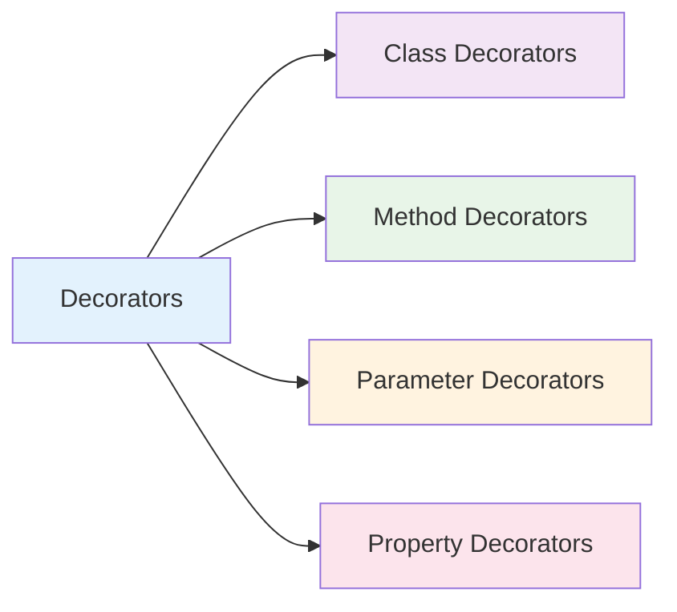

# Decorators

Decorators trong NestJS là các functions đặc biệt được sử dụng để thêm metadata, thay đổi behavior hoặc mở rộng functionality của classes, methods, properties. Chúng là nền tảng của NestJS framework.



:::tip 💡 Khái niệm cơ bản
Decorators giống như "nhãn dán" trên code - chúng cung cấp thông tin cho NestJS biết cách xử lý class, method hoặc parameter.
:::

## Decorators là gì?

Decorators trong NestJS:
- **Metadata** - Cung cấp thông tin cho framework
- **Behavior Modification** - Thay đổi cách hoạt động
- **Dependency Injection** - Hỗ trợ DI system
- **Validation** - Kiểm tra và validate data
- **Routing** - Định nghĩa HTTP routes
- **Security** - Kiểm soát quyền truy cập

## Bảng tổng hợp tất cả Decorators

### Class Decorators

| Decorator | Mục đích | Ví dụ |
|-----------|----------|--------|
| `@Module()` | Định nghĩa module | `@Module({ controllers: [], providers: [] })` |
| `@Controller()` | Định nghĩa controller | `@Controller('users')` |
| `@Injectable()` | Đánh dấu class có thể inject | `@Injectable()` |
| `@Global()` | Đánh dấu module global | `@Global()` |
| `@UseFilters()` | Áp dụng exception filters | `@UseFilters(HttpExceptionFilter)` |
| `@UseGuards()` | Áp dụng guards | `@UseGuards(AuthGuard)` |
| `@UseInterceptors()` | Áp dụng interceptors | `@UseInterceptors(LoggingInterceptor)` |
| `@UsePipes()` | Áp dụng pipes | `@UsePipes(ValidationPipe)` |

### Method Decorators

| Decorator | Mục đích | Ví dụ |
|-----------|----------|--------|
| `@Get()` | HTTP GET method | `@Get('users')` |
| `@Post()` | HTTP POST method | `@Post('users')` |
| `@Put()` | HTTP PUT method | `@Put('users/:id')` |
| `@Patch()` | HTTP PATCH method | `@Patch('users/:id')` |
| `@Delete()` | HTTP DELETE method | `@Delete('users/:id')` |
| `@Options()` | HTTP OPTIONS method | `@Options('users')` |
| `@Head()` | HTTP HEAD method | `@Head('users')` |
| `@All()` | Tất cả HTTP methods | `@All('users')` |
| `@UseFilters()` | Áp dụng exception filters | `@UseFilters(HttpExceptionFilter)` |
| `@UseGuards()` | Áp dụng guards | `@UseGuards(AuthGuard)` |
| `@UseInterceptors()` | Áp dụng interceptors | `@UseInterceptors(LoggingInterceptor)` |
| `@UsePipes()` | Áp dụng pipes | `@UsePipes(ValidationPipe)` |
| `@HttpCode()` | Đặt HTTP status code | `@HttpCode(201)` |
| `@Header()` | Đặt HTTP headers | `@Header('Cache-Control', 'none')` |
| `@Redirect()` | Redirect response | `@Redirect('https://example.com')` |
| `@Render()` | Render view template | `@Render('index')` |

### Parameter Decorators

| Decorator | Mục đích | Ví dụ |
|-----------|----------|--------|
| `@Param()` | Lấy route parameters | `@Param('id') id: string` |
| `@Query()` | Lấy query parameters | `@Query('page') page: number` |
| `@Body()` | Lấy request body | `@Body() createUserDto: CreateUserDto` |
| `@Headers()` | Lấy request headers | `@Headers() headers: any` |
| `@Session()` | Lấy session data | `@Session() session: any` |
| `@Ip()` | Lấy IP address | `@Ip() ip: string` |
| `@HostParam()` | Lấy host parameters | `@HostParam('subdomain') subdomain: string` |
| `@Req()` | Lấy request object | `@Req() req: Request` |
| `@Res()` | Lấy response object | `@Res() res: Response` |
| `@Next()` | Lấy next function | `@Next() next: NextFunction` |

### Property Decorators

| Decorator | Mục đích | Ví dụ |
|-----------|----------|--------|
| `@Inject()` | Inject dependency | `@Inject('CONFIG') config: any` |
| `@Optional()` | Đánh dấu dependency optional | `@Optional() @Inject('LOGGER') logger?: Logger` |
| `@SkipThrottle()` | Bỏ qua throttling | `@SkipThrottle()` |
| `@Throttle()` | Đặt throttling limit | `@Throttle(10, 60)` |

### Lifecycle Decorators

| Decorator | Mục đích | Ví dụ |
|-----------|----------|--------|
| `@OnModuleInit()` | Sau khi module init | `@OnModuleInit()` |
| `@OnModuleDestroy()` | Trước khi module destroy | `@OnModuleDestroy()` |
| `@OnApplicationBootstrap()` | Sau khi app bootstrap | `@OnApplicationBootstrap()` |
| `@OnApplicationShutdown()` | Trước khi app shutdown | `@OnApplicationShutdown()` |

### Validation Decorators

| Decorator | Mục đích | Ví dụ |
|-----------|----------|--------|
| `@IsString()` | Validate string | `@IsString()` |
| `@IsNumber()` | Validate number | `@IsNumber()` |
| `@IsEmail()` | Validate email | `@IsEmail()` |
| `@IsOptional()` | Đánh dấu optional | `@IsOptional()` |
| `@MinLength()` | Độ dài tối thiểu | `@MinLength(3)` |
| `@MaxLength()` | Độ dài tối đa | `@MaxLength(50)` |

## Cách tạo Custom Decorator

### 1. Method Decorator

```typescript title="Custom Method Decorator"
// decorators/roles.decorator.ts
import { SetMetadata } from '@nestjs/common';

export const ROLES_KEY = 'roles';
export const Roles = (...roles: string[]) => SetMetadata(ROLES_KEY, roles);

// Sử dụng
@Controller('users')
export class UserController {
  @Get('admin')
  @Roles('admin')
  adminOnly() {
    return 'Admin only';
  }
}
```

### 2. Parameter Decorator

```typescript title="Custom Parameter Decorator"
// decorators/user.decorator.ts
import { createParamDecorator, ExecutionContext } from '@nestjs/common';

export const CurrentUser = createParamDecorator(
  (data: string, ctx: ExecutionContext) => {
    const request = ctx.switchToHttp().getRequest();
    const user = request.user;

    return data ? user?.[data] : user;
  },
);

// Sử dụng
@Controller('users')
export class UserController {
  @Get('profile')
  getProfile(@CurrentUser() user: User) {
    return user;
  }

  @Get('profile/email')
  getEmail(@CurrentUser('email') email: string) {
    return email;
  }
}
```

### 3. Class Decorator

```typescript title="Custom Class Decorator"
// decorators/api-version.decorator.ts
import { SetMetadata } from '@nestjs/common';

export const API_VERSION_KEY = 'apiVersion';
export const ApiVersion = (version: string) => SetMetadata(API_VERSION_KEY, version);

// Sử dụng
@Controller('users')
@ApiVersion('v1')
export class UserController {
  // Controller methods
}
```

### 4. Property Decorator

```typescript title="Custom Property Decorator"
// decorators/transform.decorator.ts
import { Transform } from 'class-transformer';

export const ToLowerCase = () => Transform(({ value }) => {
  return typeof value === 'string' ? value.toLowerCase() : value;
});

// Sử dụng
export class CreateUserDto {
  @ToLowerCase()
  email: string;
}
```

## Sử dụng Custom Decorators

### 1. Với Guards

```typescript title="Using Custom Decorator with Guard"
// guards/roles.guard.ts
import { Injectable, CanActivate, ExecutionContext } from '@nestjs/common';
import { Reflector } from '@nestjs/core';
import { ROLES_KEY } from '../decorators/roles.decorator';

@Injectable()
export class RolesGuard implements CanActivate {
  constructor(private reflector: Reflector) {}

  canActivate(context: ExecutionContext): boolean {
    const requiredRoles = this.reflector.getAllAndOverride<string[]>(ROLES_KEY, [
      context.getHandler(),
      context.getClass(),
    ]);

    if (!requiredRoles) {
      return true;
    }

    const { user } = context.switchToHttp().getRequest();
    return requiredRoles.some((role) => user.roles?.includes(role));
  }
}
```

### 2. Với Interceptors

```typescript title="Using Custom Decorator with Interceptor"
// interceptors/version.interceptor.ts
import { Injectable, NestInterceptor, ExecutionContext, CallHandler } from '@nestjs/common';
import { Reflector } from '@nestjs/core';
import { Observable } from 'rxjs';
import { map } from 'rxjs/operators';
import { API_VERSION_KEY } from '../decorators/api-version.decorator';

@Injectable()
export class VersionInterceptor implements NestInterceptor {
  constructor(private reflector: Reflector) {}

  intercept(context: ExecutionContext, next: CallHandler): Observable<any> {
    const version = this.reflector.getAllAndOverride<string>(API_VERSION_KEY, [
      context.getHandler(),
      context.getClass(),
    ]);

    return next.handle().pipe(
      map(data => ({
        ...data,
        version: version || 'v1',
        timestamp: new Date().toISOString()
      }))
    );
  }
}
```

### 3. Với Pipes

```typescript title="Using Custom Decorator with Pipe"
// pipes/transform.pipe.ts
import { Injectable, PipeTransform, ArgumentMetadata } from '@nestjs/common';
import { plainToClass } from 'class-transformer';

@Injectable()
export class TransformPipe implements PipeTransform {
  transform(value: any, metadata: ArgumentMetadata) {
    if (metadata.metatype) {
      return plainToClass(metadata.metatype, value);
    }
    return value;
  }
}
```

## Best Practices

### 1. Naming Convention
```typescript title="Naming Convention Best Practice"
// ✅ Tốt - Tên rõ ràng
export const CurrentUser = createParamDecorator(...);
export const Roles = (...roles: string[]) => SetMetadata(...);
export const ApiVersion = (version: string) => SetMetadata(...);

// ❌ Không tốt - Tên không rõ ràng
export const User = createParamDecorator(...);
export const R = (...roles: string[]) => SetMetadata(...);
export const V = (version: string) => SetMetadata(...);
```

### 2. Reusability
```typescript title="Reusability Best Practice"
// ✅ Tốt - Decorator có thể tái sử dụng
export const Roles = (...roles: string[]) => SetMetadata('roles', roles);
export const AdminOnly = () => Roles('admin');
export const UserOnly = () => Roles('user');

// ❌ Không tốt - Decorator cứng nhắc
export const AdminRole = () => SetMetadata('roles', ['admin']);
export const UserRole = () => SetMetadata('roles', ['user']);
```

### 3. Error Handling
```typescript title="Error Handling Best Practice"
// ✅ Tốt - Xử lý lỗi gracefully
export const CurrentUser = createParamDecorator(
  (data: string, ctx: ExecutionContext) => {
    try {
      const request = ctx.switchToHttp().getRequest();
      const user = request.user;

      if (!user) {
        throw new UnauthorizedException('User not found');
      }

      return data ? user?.[data] : user;
    } catch (error) {
      throw new UnauthorizedException('Invalid user data');
    }
  },
);
```

## Testing Custom Decorators

### 1. Testing Parameter Decorator
```typescript title="Testing Custom Parameter Decorator"
describe('CurrentUser Decorator', () => {
  it('should extract user from request', () => {
    const mockUser = { id: 1, name: 'John' };
    const mockRequest = { user: mockUser };
    const mockContext = {
      switchToHttp: () => ({ getRequest: () => mockRequest })
    } as ExecutionContext;

    const result = CurrentUser(undefined, mockContext);
    expect(result).toEqual(mockUser);
  });

  it('should extract specific user property', () => {
    const mockUser = { id: 1, name: 'John' };
    const mockRequest = { user: mockUser };
    const mockContext = {
      switchToHttp: () => ({ getRequest: () => mockRequest })
    } as ExecutionContext;

    const result = CurrentUser('name', mockContext);
    expect(result).toBe('John');
  });
});
```

---

:::tip 💡 Lời khuyên tổng kết
- Sử dụng decorators có sẵn khi có thể
- Tạo custom decorators cho logic nghiệp vụ cụ thể
- Tuân thủ naming convention rõ ràng
- Đảm bảo decorators có thể tái sử dụng
- Test custom decorators một cách comprehensive
- Sử dụng metadata keys nhất quán
:::

**Bài tiếp theo:** [Exception Filters](/docs/overview/exception-filters)
