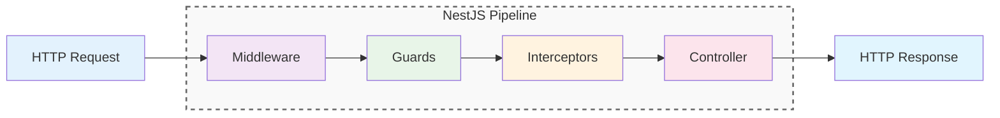
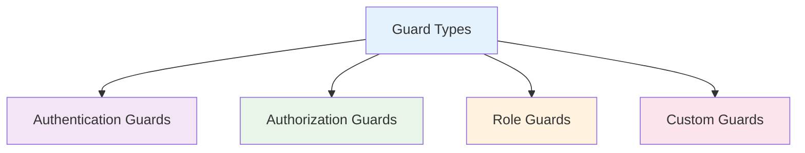
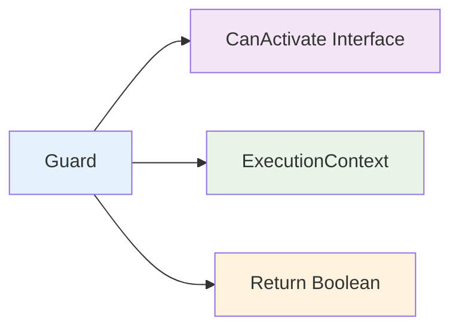
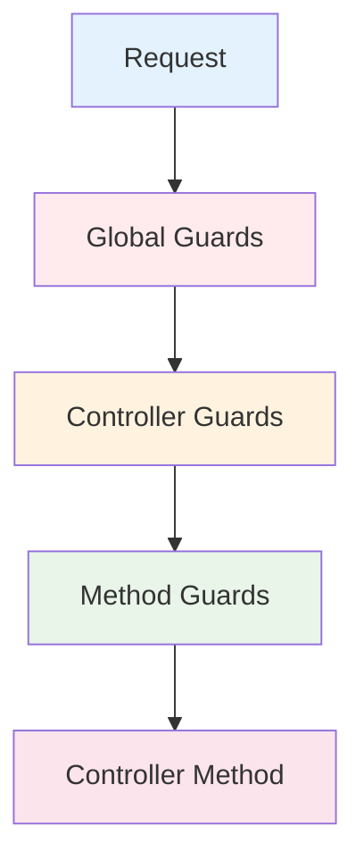
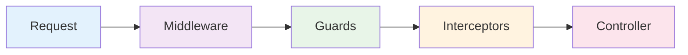

# Guards

Guards trong NestJS là các classes kiểm tra xem request có được phép tiếp tục hay không. Chúng hoạt động như "bảo vệ" kiểm tra authentication, authorization và các điều kiện khác trước khi request đến controller.



:::tip 💡 Khái niệm cơ bản
Guards giống như "bảo vệ cửa" kiểm tra thẻ ID trước khi cho phép vào. Chúng quyết định request có được xử lý hay bị từ chối.
:::

## Guards là gì?

Guards trong NestJS:
- **Authentication** - Kiểm tra người dùng đã đăng nhập chưa
- **Authorization** - Kiểm tra người dùng có quyền truy cập không
- **Request Validation** - Kiểm tra request có hợp lệ không
- **Early Exit** - Có thể dừng request sớm nếu không đủ điều kiện
- **Single Responsibility** - Mỗi guard một nhiệm vụ cụ thể

## Các loại Guards



### 1. Authentication Guards
Kiểm tra người dùng đã đăng nhập chưa

### 2. Authorization Guards
Kiểm tra người dùng có quyền truy cập không

### 3. Role Guards
Kiểm tra vai trò của người dùng

### 4. Custom Guards
Guards tùy chỉnh theo logic nghiệp vụ

## Tạo Guard cơ bản

```typescript title="Basic Guard Example"
import { Injectable, CanActivate, ExecutionContext } from '@nestjs/common';
import { Observable } from 'rxjs';

@Injectable()
export class AuthGuard implements CanActivate {
  canActivate(
    context: ExecutionContext,
  ): boolean | Promise<boolean> | Observable<boolean> {
    const request = context.switchToHttp().getRequest();
    return request.user !== undefined;
  }
}
```

## Cấu trúc Guard



### CanActivate Interface
Interface bắt buộc cho tất cả guards

### ExecutionContext
Context chứa thông tin về request

### Return Boolean
Trả về true/false để quyết định có cho phép không

## Sử dụng Guards

### Controller Level
```typescript title="Controller Level Guard"
@UseGuards(AuthGuard)
@Controller('users')
export class UserController {
  @Get()
  findAll() {
    return this.userService.findAll();
  }
}
```

### Method Level
```typescript title="Method Level Guard"
@Controller('users')
export class UserController {
  @Get('admin')
  @UseGuards(AdminGuard)
  adminOnly() {
    return this.userService.findAdmins();
  }
}
```

### Global Guards
```typescript title="Global Guard Usage"
// main.ts
app.useGlobalGuards(new AuthGuard());
```

## Common Guard Examples

### 1. Authentication Guard
```typescript title="Authentication Guard"
@Injectable()
export class JwtAuthGuard implements CanActivate {
  constructor(private jwtService: JwtService) {}

  canActivate(context: ExecutionContext): boolean {
    const request = context.switchToHttp().getRequest();
    const token = request.headers.authorization?.split(' ')[1];
    
    if (!token) {
      return false;
    }
    
    try {
      const payload = this.jwtService.verify(token);
      request.user = payload;
      return true;
    } catch {
      return false;
    }
  }
}
```

### 2. Role Guard
```typescript title="Role Guard"
@Injectable()
export class RolesGuard implements CanActivate {
  constructor(private reflector: Reflector) {}

  canActivate(context: ExecutionContext): boolean {
    const requiredRoles = this.reflector.getAllAndOverride<string[]>('roles', [
      context.getHandler(),
      context.getClass(),
    ]);
    
    if (!requiredRoles) {
      return true;
    }
    
    const { user } = context.switchToHttp().getRequest();
    return requiredRoles.some((role) => user.roles?.includes(role));
  }
}
```

### 3. Custom Business Guard
```typescript title="Custom Business Guard"
@Injectable()
export class BusinessHoursGuard implements CanActivate {
  canActivate(context: ExecutionContext): boolean {
    const now = new Date();
    const hour = now.getHours();
    
    // Chỉ cho phép truy cập từ 9h sáng đến 6h chiều
    return hour >= 9 && hour < 18;
  }
}
```

## Guard Execution Order



**Thứ tự thực thi:**
1. **Global Guards** - Áp dụng cho toàn bộ ứng dụng
2. **Controller Guards** - Áp dụng cho tất cả methods trong controller
3. **Method Guards** - Áp dụng cho method cụ thể
4. **Controller Method** - Thực thi logic nghiệp vụ

## Guards vs Middleware vs Interceptors



### Middleware
- **Timing**: Trước Guards
- **Purpose**: Request processing, logging, CORS
- **Scope**: Global, module, route level

### Guards
- **Timing**: Sau Middleware, trước Interceptors
- **Purpose**: Authentication, authorization, validation
- **Scope**: Controller, method level

### Interceptors
- **Timing**: Trước và sau Controller
- **Purpose**: Transformation, logging, caching
- **Scope**: Global, controller, method level

## Best Practices

### 1. Single Responsibility
```typescript title="Single Responsibility Best Practice"
// ✅ Tốt - Mỗi guard một nhiệm vụ
@Injectable()
export class AuthGuard implements CanActivate {
  // Chỉ kiểm tra authentication
}

@Injectable()
export class RoleGuard implements CanActivate {
  // Chỉ kiểm tra role
}

// ❌ Không tốt - Guard quá nhiều nhiệm vụ
@Injectable()
export class AuthRoleGuard implements CanActivate {
  // Kiểm tra cả auth và role
}
```

### 2. Performance
```typescript title="Performance Best Practice"
// ✅ Tốt - Cache kết quả nếu có thể
@Injectable()
export class CachedGuard implements CanActivate {
  private cache = new Map<string, boolean>();

  canActivate(context: ExecutionContext): boolean {
    const key = this.getCacheKey(context);
    
    if (this.cache.has(key)) {
      return this.cache.get(key);
    }
    
    const result = this.checkPermission(context);
    this.cache.set(key, result);
    return result;
  }
}
```

### 3. Error Handling
```typescript title="Error Handling Best Practice"
// ✅ Tốt - Xử lý lỗi gracefully
@Injectable()
export class SafeGuard implements CanActivate {
  canActivate(context: ExecutionContext): boolean {
    try {
      return this.checkPermission(context);
    } catch (error) {
      console.error('Guard error:', error);
      return false; // Fail safe
    }
  }
}
```

## Testing Guards

### Unit Testing
```typescript title="Guard Unit Testing"
describe('AuthGuard', () => {
  let guard: AuthGuard;
  let mockExecutionContext: ExecutionContext;

  beforeEach(() => {
    guard = new AuthGuard();
    mockExecutionContext = {
      switchToHttp: () => ({
        getRequest: () => ({ user: { id: 1, name: 'John' } }),
      }),
    } as ExecutionContext;
  });

  it('should allow authenticated user', () => {
    expect(guard.canActivate(mockExecutionContext)).toBe(true);
  });

  it('should deny unauthenticated user', () => {
    mockExecutionContext = {
      switchToHttp: () => ({
        getRequest: () => ({ user: undefined }),
      }),
    } as ExecutionContext;
    
    expect(guard.canActivate(mockExecutionContext)).toBe(false);
  });
});
```

---

:::tip 💡 Lời khuyên tổng kết
- Sử dụng Guards cho authentication và authorization
- Mỗi Guard nên có một nhiệm vụ cụ thể
- Guards nên nhanh và hiệu quả
- Sử dụng Middleware cho request processing
- Sử dụng Interceptors cho transformation
:::

**Bài tiếp theo:** [Interceptors](/docs/overview/interceptors)
