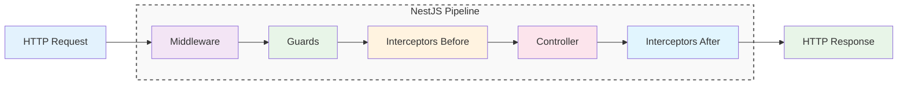
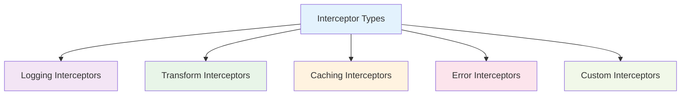
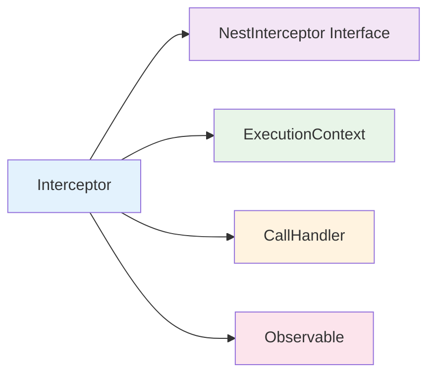
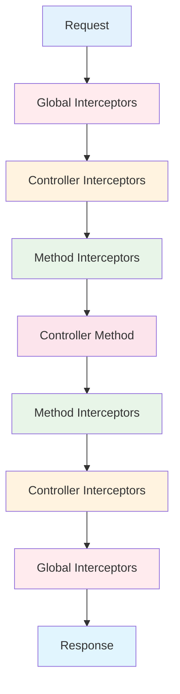
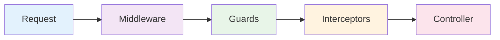

# Interceptors

Interceptors trong NestJS là các classes xử lý request trước và sau khi controller thực thi. Chúng giống như "bộ lọc" có thể transform data, log thông tin, cache response và xử lý errors.



:::tip 💡 Khái niệm cơ bản
Interceptors giống như "bộ lọc hai chiều" - xử lý request trước khi đến controller và xử lý response trước khi trả về client.
:::

## Interceptors là gì?

Interceptors trong NestJS:
- **Request Transformation** - Thay đổi request trước khi đến controller
- **Response Transformation** - Thay đổi response trước khi trả về
- **Logging & Timing** - Ghi log và đo thời gian xử lý
- **Caching** - Cache response để tăng performance
- **Error Handling** - Xử lý lỗi một cách nhất quán

## Các loại Interceptors



### 1. Logging Interceptors
Ghi log request/response và đo thời gian

### 2. Transform Interceptors
Transform data trước và sau khi xử lý

### 3. Caching Interceptors
Cache response để tăng performance

### 4. Error Interceptors
Xử lý lỗi một cách nhất quán

### 5. Custom Interceptors
Interceptors tùy chỉnh theo logic nghiệp vụ

## Tạo Interceptor cơ bản

```typescript title="Basic Interceptor Example"
import { Injectable, NestInterceptor, ExecutionContext, CallHandler } from '@nestjs/common';
import { Observable } from 'rxjs';
import { map } from 'rxjs/operators';

@Injectable()
export class TransformInterceptor implements NestInterceptor {
  intercept(context: ExecutionContext, next: CallHandler): Observable<any> {
    return next.handle().pipe(
      map(data => ({ data, timestamp: new Date().toISOString() }))
    );
  }
}
```

## Cấu trúc Interceptor



### NestInterceptor Interface
Interface bắt buộc cho tất cả interceptors

### ExecutionContext
Context chứa thông tin về request

### CallHandler
Handler để gọi controller method

### Observable
Stream data để xử lý bất đồng bộ

## Sử dụng Interceptors

### Global Interceptors
```typescript title="Global Interceptor Usage"
// main.ts
app.useGlobalInterceptors(new LoggingInterceptor());
```

### Controller Level
```typescript title="Controller Level Interceptor"
@UseInterceptors(TransformInterceptor)
@Controller('users')
export class UserController {
  @Get()
  findAll() {
    return this.userService.findAll();
  }
}
```

### Method Level
```typescript title="Method Level Interceptor"
@Controller('users')
export class UserController {
  @Get()
  @UseInterceptors(CacheInterceptor)
  findAll() {
    return this.userService.findAll();
  }
}
```

## Common Interceptor Examples

### 1. Logging Interceptor
```typescript title="Logging Interceptor"
@Injectable()
export class LoggingInterceptor implements NestInterceptor {
  intercept(context: ExecutionContext, next: CallHandler): Observable<any> {
    const request = context.switchToHttp().getRequest();
    const method = request.method;
    const url = request.url;
    const now = Date.now();

    return next.handle().pipe(
      tap(() => {
        const duration = Date.now() - now;
        console.log(`${method} ${url} - ${duration}ms`);
      })
    );
  }
}
```

### 2. Transform Interceptor
```typescript title="Transform Interceptor"
@Injectable()
export class TransformInterceptor implements NestInterceptor {
  intercept(context: ExecutionContext, next: CallHandler): Observable<any> {
    return next.handle().pipe(
      map(data => {
        if (Array.isArray(data)) {
          return { items: data, count: data.length };
        }
        return { data };
      })
    );
  }
}
```

### 3. Cache Interceptor
```typescript title="Cache Interceptor"
@Injectable()
export class CacheInterceptor implements NestInterceptor {
  private cache = new Map<string, any>();

  intercept(context: ExecutionContext, next: CallHandler): Observable<any> {
    const request = context.switchToHttp().getRequest();
    const key = `${request.method}:${request.url}`;

    if (this.cache.has(key)) {
      return of(this.cache.get(key));
    }

    return next.handle().pipe(
      tap(data => this.cache.set(key, data))
    );
  }
}
```

## Interceptor Execution Order



**Thứ tự thực thi:**
1. **Global Interceptors** (Before)
2. **Controller Interceptors** (Before)
3. **Method Interceptors** (Before)
4. **Controller Method**
5. **Method Interceptors** (After)
6. **Controller Interceptors** (After)
7. **Global Interceptors** (After)

## Interceptors vs Middleware vs Guards



### Middleware
- **Timing**: Trước Guards
- **Purpose**: Request processing, logging, CORS
- **Scope**: Global, module, route level

### Guards
- **Timing**: Sau Middleware, trước Interceptors
- **Purpose**: Authentication, authorization, validation
- **Scope**: Controller, method level

### Interceptors
- **Timing**: Trước và sau Controller
- **Purpose**: Transformation, logging, caching
- **Scope**: Global, controller, method level

## Best Practices

### 1. Single Responsibility
```typescript title="Single Responsibility Best Practice"
// ✅ Tốt - Mỗi interceptor một nhiệm vụ
@Injectable()
export class LoggingInterceptor implements NestInterceptor {
  // Chỉ xử lý logging
}

@Injectable()
export class TransformInterceptor implements NestInterceptor {
  // Chỉ xử lý transformation
}

// ❌ Không tốt - Interceptor quá nhiều nhiệm vụ
@Injectable()
export class LoggingTransformCacheInterceptor implements NestInterceptor {
  // Xử lý logging, transformation, và caching
}
```

### 2. Performance
```typescript title="Performance Best Practice"
// ✅ Tốt - Sử dụng RxJS operators hiệu quả
@Injectable()
export class EfficientInterceptor implements NestInterceptor {
  intercept(context: ExecutionContext, next: CallHandler): Observable<any> {
    return next.handle().pipe(
      map(data => this.transform(data)),
      catchError(error => this.handleError(error))
    );
  }
}
```

### 3. Error Handling
```typescript title="Error Handling Best Practice"
// ✅ Tốt - Xử lý lỗi gracefully
@Injectable()
export class SafeInterceptor implements NestInterceptor {
  intercept(context: ExecutionContext, next: CallHandler): Observable<any> {
    return next.handle().pipe(
      catchError(error => {
        console.error('Interceptor error:', error);
        return throwError(() => error);
      })
    );
  }
}
```

## Testing Interceptors

### Unit Testing
```typescript title="Interceptor Unit Testing"
describe('TransformInterceptor', () => {
  let interceptor: TransformInterceptor;
  let mockExecutionContext: ExecutionContext;
  let mockCallHandler: CallHandler;

  beforeEach(() => {
    interceptor = new TransformInterceptor();
    mockExecutionContext = {} as ExecutionContext;
    mockCallHandler = {
      handle: () => of({ name: 'John', age: 30 })
    };
  });

  it('should transform response data', (done) => {
    interceptor.intercept(mockExecutionContext, mockCallHandler).subscribe({
      next: (result) => {
        expect(result).toEqual({
          data: { name: 'John', age: 30 },
          timestamp: expect.any(String)
        });
        done();
      },
      error: done
    });
  });
});
```

---

:::tip 💡 Lời khuyên tổng kết
- Sử dụng Interceptors cho transformation, logging, caching
- Mỗi Interceptor nên có một nhiệm vụ cụ thể
- Sử dụng RxJS operators hiệu quả
- Sử dụng Middleware cho request processing
- Sử dụng Guards cho authentication/authorization
:::

**Bài tiếp theo:** [Pipes](/docs/overview/pipes)
