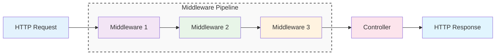
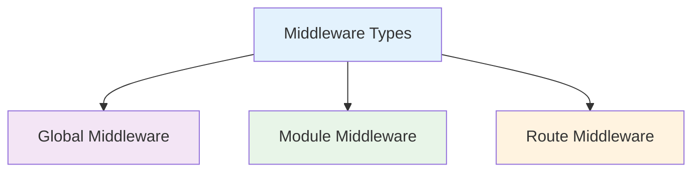
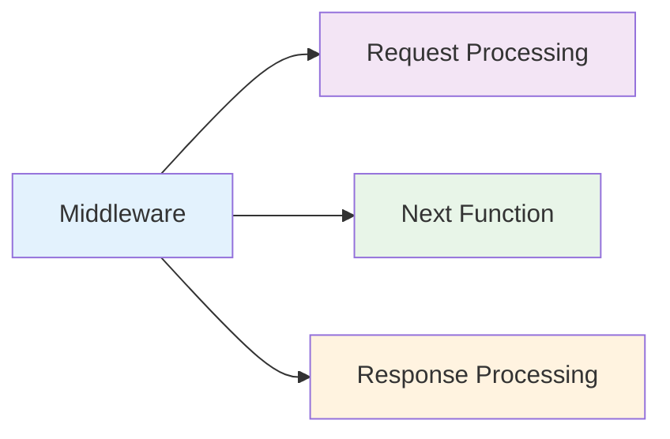
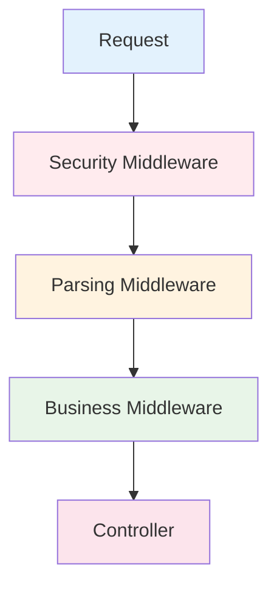
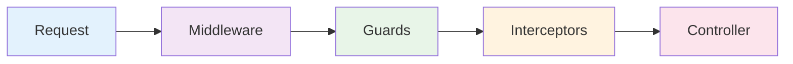

# Middleware

Middleware trong NestJS là các functions được thực thi trước khi request đến controller. Chúng giống như các "bộ lọc" xử lý request theo thứ tự và có thể thay đổi request hoặc response.



:::tip 💡 Khái niệm cơ bản
Middleware giống như một "dây chuyền xử lý" request. Mỗi middleware có thể xử lý request và quyết định có cho phép request tiếp tục hay không.
:::

## Middleware là gì?

Middleware trong NestJS:
- **Request Processing** - Xử lý request trước khi đến controller
- **Order Matters** - Thứ tự thực thi quan trọng
- **Chain Execution** - Thực thi theo chuỗi
- **Early Exit** - Có thể dừng request sớm
- **Global & Local** - Có thể áp dụng toàn cục hoặc cục bộ

## Các loại Middleware



### 1. Global Middleware
Áp dụng cho tất cả requests trong ứng dụng

### 2. Module Middleware  
Áp dụng cho tất cả routes trong một module

### 3. Route Middleware
Áp dụng cho một route cụ thể

## Tạo Middleware cơ bản

```typescript title="Basic Middleware Example"
import { Injectable, NestMiddleware } from '@nestjs/common';
import { Request, Response, NextFunction } from 'express';

@Injectable()
export class LoggerMiddleware implements NestMiddleware {
  use(req: Request, res: Response, next: NextFunction) {
    console.log(`Request to: ${req.method} ${req.url}`);
    next();
  }
}
```

## Cấu trúc Middleware



### Request Processing
Xử lý request trước khi chuyển tiếp

### Next Function
Gọi next() để chuyển sang middleware tiếp theo

### Response Processing
Xử lý response sau khi controller thực thi

## Sử dụng Middleware

### Global Middleware
```typescript title="Global Middleware Usage"
// main.ts
app.use(helmet());           // Security
app.use(cors());            // CORS handling
app.use(compression());     // Compression
app.use(express.json());    // Body parsing
app.use(logger);           // Logging
```

### Module Middleware
```typescript title="Module Middleware Usage"
// user.module.ts
@Module({
  // ... other config
})
export class UserModule implements NestModule {
  configure(consumer: MiddlewareConsumer) {
    consumer
      .apply(LoggerMiddleware)
      .forRoutes('*');
  }
}
```

### Route Middleware
```typescript title="Route Middleware Usage"
// user.module.ts
configure(consumer: MiddlewareConsumer) {
  consumer
    .apply(AuthMiddleware)
    .forRoutes('users');
}
```

## Middleware Order



**Thứ tự quan trọng:**
1. **Security** - Helmet, CORS, Rate limiting
2. **Parsing** - Body parsing, Cookie parsing
3. **Business** - Logging, Authentication, Validation
4. **Controller** - Xử lý business logic

## Common Middleware Examples

### 1. Logging Middleware
```typescript title="Logging Middleware"
@Injectable()
export class LoggingMiddleware implements NestMiddleware {
  use(req: Request, res: Response, next: NextFunction) {
    const start = Date.now();
    
    res.on('finish', () => {
      const duration = Date.now() - start;
      console.log(`${req.method} ${req.url} - ${res.statusCode} - ${duration}ms`);
    });
    
    next();
  }
}
```

### 2. Authentication Middleware
```typescript title="Authentication Middleware"
@Injectable()
export class AuthMiddleware implements NestMiddleware {
  use(req: Request, res: Response, next: NextFunction) {
    const token = req.headers.authorization;
    
    if (!token) {
      return res.status(401).json({ message: 'No token provided' });
    }
    
    // Validate token logic here
    next();
  }
}
```

### 3. Validation Middleware
```typescript title="Validation Middleware"
@Injectable()
export class ValidationMiddleware implements NestMiddleware {
  use(req: Request, res: Response, next: NextFunction) {
    if (req.method === 'POST' && !req.body) {
      return res.status(400).json({ message: 'Request body is required' });
    }
    
    next();
  }
}
```

## Middleware vs Guards vs Interceptors



### Middleware
- **Timing**: Trước Guards
- **Purpose**: Request processing, logging, CORS
- **Scope**: Global, module, route level

### Guards
- **Timing**: Sau Middleware, trước Interceptors
- **Purpose**: Authentication, authorization
- **Scope**: Controller, method level

### Interceptors
- **Timing**: Trước và sau Controller
- **Purpose**: Transformation, logging, caching
- **Scope**: Global, controller, method level

## Best Practices

### 1. Middleware Order
```typescript title="Middleware Order Best Practice"
// ✅ Tốt - Thứ tự logic
app.use(helmet());           // Security first
app.use(cors());            // CORS handling
app.use(compression());     // Compression
app.use(express.json());    // Body parsing
app.use(logger);           // Logging last
```

### 2. Error Handling
```typescript title="Error Handling Best Practice"
// ✅ Tốt - Xử lý lỗi trong middleware
@Injectable()
export class ErrorMiddleware implements NestMiddleware {
  use(req: Request, res: Response, next: NextFunction) {
    try {
      next();
    } catch (error) {
      console.error('Middleware error:', error);
      res.status(500).json({ message: 'Internal server error' });
    }
  }
}
```

### 3. Performance
```typescript title="Performance Best Practice"
// ✅ Tốt - Middleware nhẹ và nhanh
@Injectable()
export class FastMiddleware implements NestMiddleware {
  use(req: Request, res: Response, next: NextFunction) {
    // Chỉ xử lý cần thiết
    if (req.headers['x-skip-logging']) {
      return next();
    }
    
    console.log(`${req.method} ${req.url}`);
    next();
  }
}
```

## Testing Middleware

### Unit Testing
```typescript title="Middleware Unit Testing"
describe('LoggerMiddleware', () => {
  let middleware: LoggerMiddleware;
  let mockRequest: Partial<Request>;
  let mockResponse: Partial<Response>;
  let nextFunction: NextFunction;

  beforeEach(() => {
    middleware = new LoggerMiddleware();
    mockRequest = { method: 'GET', url: '/users' };
    mockResponse = {};
    nextFunction = jest.fn();
  });

  it('should log request and call next', () => {
    const consoleSpy = jest.spyOn(console, 'log');
    
    middleware.use(mockRequest as Request, mockResponse as Response, nextFunction);
    
    expect(consoleSpy).toHaveBeenCalledWith('Request to: GET /users');
    expect(nextFunction).toHaveBeenCalled();
  });
});
```

---

:::tip 💡 Lời khuyên tổng kết
- Sử dụng middleware cho request processing, logging, CORS
- Thứ tự middleware rất quan trọng
- Middleware nên nhẹ và nhanh
- Sử dụng Guards cho authentication/authorization
- Sử dụng Interceptors cho transformation
:::

**Bài tiếp theo:** [Guards](/docs/overview/guards)
