# Modules

Modules là cách NestJS tổ chức ứng dụng thành các phần riêng biệt và có thể tái sử dụng. Chúng đóng vai trò như container chứa các controllers, services và providers liên quan.

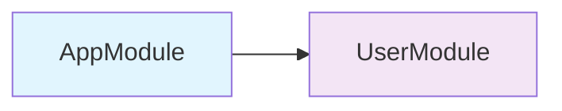

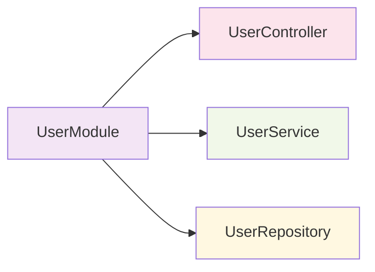

:::tip 💡 Khái niệm cơ bản
Modules trong NestJS giống như các "hộp" chứa các thành phần liên quan. Mỗi hộp có thể chứa controllers, services và có thể chia sẻ với các hộp khác.
:::

## Modules là gì?

Modules trong NestJS:
- **Tổ chức code** - chia nhỏ ứng dụng thành các phần logic
- **Quản lý dependencies** - kiểm soát việc import/export providers
- **Encapsulation** - ẩn implementation details
- **Reusability** - tái sử dụng logic ở nhiều nơi
- **Testing** - dễ dàng test từng module độc lập

## Lý thuyết về Modules

### Nguyên lý hoạt động

Modules trong NestJS hoạt động dựa trên nguyên lý **Dependency Injection Container**:

1. **Registration** - Đăng ký providers trong module
2. **Resolution** - Tự động resolve dependencies
3. **Lifecycle Management** - Quản lý vòng đời của providers
4. **Scoping** - Kiểm soát phạm vi của providers

:::info 🔧 Dependency Injection Container
DI Container là "bộ não" của NestJS, tự động quản lý việc tạo và kết nối các dependencies giữa các thành phần.
:::

### Module Metadata

Mỗi module được định nghĩa bằng metadata:

```typescript title="Module Metadata Structure"
@Module({
  // highlight-start
  imports: [],      // Modules khác cần import
  controllers: [],  // Controllers của module này
  providers: [],    // Services và providers
  exports: [],      // Providers để export cho modules khác
  // highlight-end
})
```

## Tạo Module cơ bản

```typescript title="Basic Module Example"
import { Module } from '@nestjs/common';
import { UserController } from './user.controller';
import { UserService } from './user.service';

@Module({
  // highlight-start
  imports: [],
  controllers: [UserController],
  providers: [UserService],
  exports: [UserService],
  // highlight-end
})
export class UserModule {}
```

## Cấu trúc Module

Mỗi module có 4 phần chính:

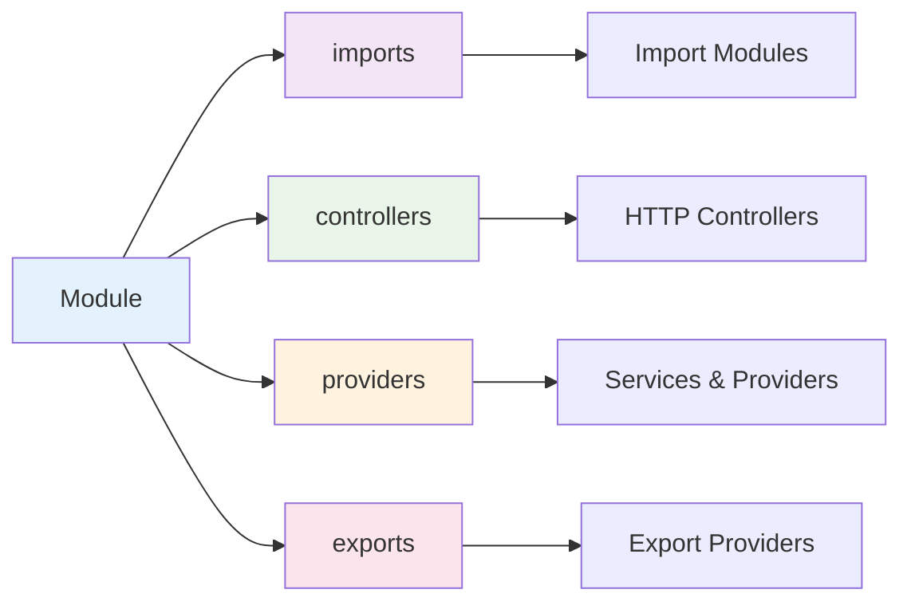

```typescript title="Module Structure Breakdown"
@Module({
  imports: [],      // Import modules khác
  controllers: [],  // Controllers của module
  providers: [],    // Services và providers
  exports: [],      // Export cho modules khác
})
export class ExampleModule {}
```

### Imports
- Import các modules khác
- Sử dụng providers từ modules đã import

### Controllers
- Xử lý HTTP requests
- Định nghĩa routes

### Providers
- Services, repositories, factories
- Logic nghiệp vụ

### Exports
- Chia sẻ providers với modules khác
- Chỉ export những gì cần thiết

## Các loại Modules

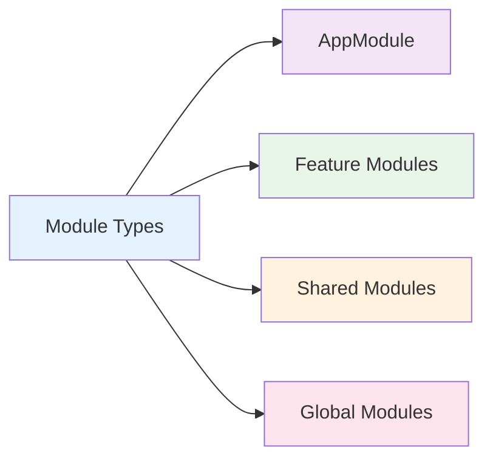

### 1. AppModule (Module gốc)

**Định nghĩa:** AppModule là module chính và duy nhất của ứng dụng NestJS. Đây là điểm khởi đầu của ứng dụng.

**Vai trò:**
- Module chính của ứng dụng
- Import tất cả các modules khác
- Cấu hình global providers
- Điểm entry của ứng dụng

**Khi nào sử dụng:**
- Luôn cần thiết trong mọi ứng dụng NestJS
- Chỉ có một AppModule duy nhất
- Được bootstrap trong main.ts

```typescript title="AppModule Example"
@Module({
  imports: [
    UserModule,
    ProductModule,
    OrderModule,
    AuthModule,
  ],
  controllers: [AppController],
  providers: [AppService],
})
export class AppModule {}
```

:::warning ⚠️ Lưu ý quan trọng
- AppModule không nên chứa business logic
- Chỉ nên import các modules khác
- Có thể có một số global providers cần thiết
:::

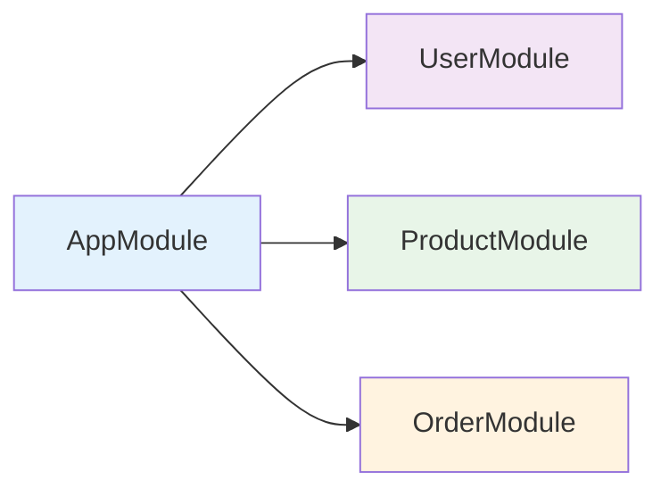

### 2. Feature Modules

**Định nghĩa:** Feature Modules là các module chứa logic cho một tính năng cụ thể của ứng dụng. Mỗi tính năng sẽ có một module riêng.

**Vai trò:**
- Tổ chức code theo tính năng
- Encapsulation logic liên quan
- Dễ dàng maintain và test
- Có thể tái sử dụng

**Khi nào sử dụng:**
- Khi có logic nghiệp vụ phức tạp
- Khi cần tách biệt các tính năng
- Khi muốn code dễ maintain
- Khi cần tái sử dụng logic

```typescript title="Feature Module Example"
@Module({
  controllers: [UserController],
  providers: [UserService, UserRepository],
  exports: [UserService],
})
export class UserModule {}
```

**Ví dụ các Feature Modules:**
- **UserModule** - quản lý người dùng, authentication, authorization
- **ProductModule** - quản lý sản phẩm, categories, inventory
- **OrderModule** - quản lý đơn hàng, payments, shipping
- **AuthModule** - xác thực, JWT, OAuth, permissions

:::tip 🎯 Lợi ích của Feature Modules
- **Separation of Concerns** - tách biệt các mối quan tâm
- **Maintainability** - dễ bảo trì và cập nhật
- **Testability** - dễ test từng tính năng
- **Reusability** - có thể tái sử dụng ở dự án khác
:::

### 3. Shared Modules

**Định nghĩa:** Shared Modules là các module chứa logic chung được sử dụng bởi nhiều modules khác. Chúng export các providers để modules khác có thể sử dụng.

**Vai trò:**
- Chia sẻ logic chung
- Tránh duplicate code
- Cung cấp utilities và helpers
- Tái sử dụng providers

**Khi nào sử dụng:**
- Khi có logic được sử dụng ở nhiều nơi
- Khi muốn tránh duplicate code
- Khi cần utilities chung
- Khi cần database connections, logging, config

```typescript title="Shared Module Example"
@Module({
  providers: [DatabaseService, LoggerService],
  exports: [DatabaseService, LoggerService],
})
export class SharedModule {}
```

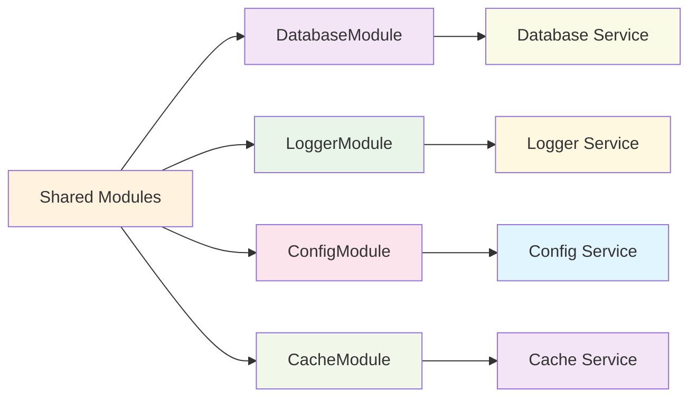

**Ví dụ các Shared Modules:**
- **DatabaseModule** - kết nối database, repositories
- **LoggerModule** - logging, error handling
- **ConfigModule** - configuration, environment variables
- **CacheModule** - caching, Redis connections

:::info 🔄 Lợi ích của Shared Modules
- **DRY Principle** - Don't Repeat Yourself
- **Consistency** - đảm bảo tính nhất quán
- **Maintainability** - dễ maintain khi thay đổi logic chung
- **Performance** - tối ưu performance với shared resources
:::

### 4. Global Modules

**Định nghĩa:** Global Modules là các module có thể được sử dụng ở mọi nơi trong ứng dụng mà không cần import vào từng module.

**Vai trò:**
- Cung cấp utilities toàn cục
- Không cần import ở mọi module
- Tự động có sẵn trong toàn bộ ứng dụng
- Giảm boilerplate code

**Khi nào sử dụng:**
- Khi cần utilities ở mọi nơi
- Khi muốn giảm boilerplate import
- Khi có configuration toàn cục
- Khi có logging, error handling toàn cục

```typescript title="Global Module Example"
@Global()
@Module({
  providers: [ConfigService],
  exports: [ConfigService],
})
export class ConfigModule {}
```

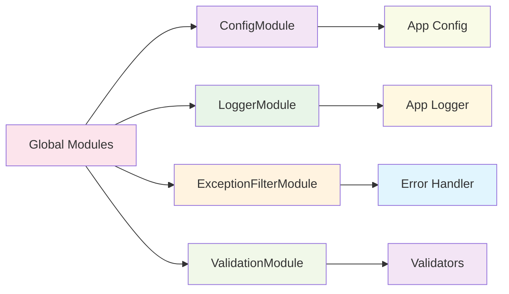

**Ví dụ các Global Modules:**
- **ConfigModule** - configuration toàn cục
- **LoggerModule** - logging toàn cục
- **ExceptionFilterModule** - error handling toàn cục
- **ValidationModule** - validation toàn cục

:::warning ⚠️ Lưu ý quan trọng về Global Modules
- Chỉ sử dụng `@Global()` khi thực sự cần thiết
- Global modules có thể gây khó khăn cho testing
- Có thể gây circular dependencies
- Nên sử dụng có chọn lọc
:::

## Module Configuration

### Dynamic Modules

**Định nghĩa:** Dynamic Modules là các module có thể được cấu hình động khi import. Chúng sử dụng static methods để tạo module với configuration tùy chỉnh.

**Vai trò:**
- Cấu hình module linh hoạt
- Tùy chỉnh providers dựa trên options
- Tạo module với configuration khác nhau
- Reusable modules với configuration

**Khi nào sử dụng:**
- Khi module cần configuration
- Khi muốn module linh hoạt
- Khi cần tùy chỉnh providers
- Khi tạo reusable modules

#### forRoot() Method

**Định nghĩa:** `forRoot()` là static method phổ biến nhất để cấu hình Dynamic Modules. Nó nhận configuration options và trả về DynamicModule.

**Cách hoạt động:**
- Nhận configuration options làm parameter
- Tạo providers dựa trên options
- Trả về DynamicModule với providers đã cấu hình
- Thường được sử dụng ở AppModule level

```typescript title="forRoot() Method Implementation"
@Module({})
export class DatabaseModule {
  // highlight-next-line
  static forRoot(options: DatabaseOptions): DynamicModule {
    return {
      module: DatabaseModule,
      // highlight-start
      providers: [
        {
          provide: 'DATABASE_OPTIONS',
          useValue: options,
        },
        DatabaseService,
      ],
      // highlight-end
      exports: [DatabaseService],
    };
  }
}

```typescript title="forRoot() Usage Example"
// Usage
@Module({
  imports: [
    DatabaseModule.forRoot({
      host: 'localhost',
      port: 5432,
      database: 'myapp',
    }),
  ],
})
export class AppModule {}
```

:::info 🔧 forRoot() Pattern
- **Configuration** - nhận options để cấu hình module
- **Provider Registration** - đăng ký providers dựa trên config
- **Global Setup** - thường được gọi ở AppModule
- **Single Instance** - tạo một instance duy nhất cho toàn bộ app
:::

#### forRootAsync() Method

**Định nghĩa:** `forRootAsync()` là static method để cấu hình Dynamic Modules với async operations. Nó sử dụng factories để tạo providers bất đồng bộ.

**Cách hoạt động:**
- Nhận async factory function
- Sử dụng `useFactory` để tạo providers
- Có thể inject dependencies từ modules khác
- Hỗ trợ async configuration loading

```typescript title="forRootAsync() Method Implementation"
@Module({})
export class ConfigModule {
  // highlight-next-line
  static forRootAsync(options: ConfigModuleAsyncOptions): DynamicModule {
    return {
      module: ConfigModule,
      imports: options.imports || [],
      // highlight-start
      providers: [
        {
          provide: 'CONFIG_OPTIONS',
          useFactory: options.useFactory,
          inject: options.inject || [],
        },
        ConfigService,
      ],
      // highlight-end
      exports: [ConfigService],
    };
  }
}
```

```typescript title="forRootAsync() Usage Example"
// Usage với async factory
@Module({
  imports: [
    ConfigModule.forRootAsync({
      imports: [HttpModule],
      useFactory: async (httpService: HttpService) => {
        const response = await httpService.get('/api/config').toPromise();
        return response.data;
      },
      inject: [HttpService],
    }),
  ],
})
export class AppModule {}
```

:::info 🔄 forRootAsync() Pattern
- **Async Configuration** - load config từ external sources
- **Dependency Injection** - có thể inject services từ modules khác
- **Factory Pattern** - sử dụng factory function để tạo config
- **Flexible Setup** - linh hoạt trong việc setup configuration
:::

#### So sánh forRoot() vs forRootAsync()

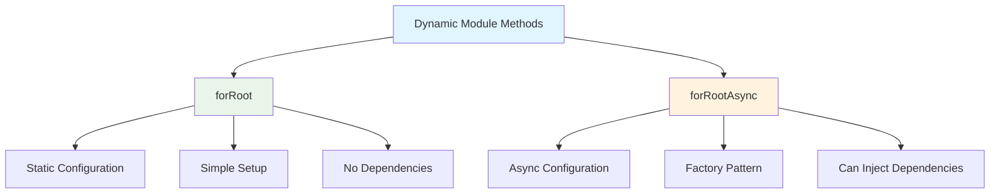

| Aspect | forRoot() | forRootAsync() |
|--------|-----------|----------------|
| **Configuration** | Static options | Async factory |
| **Dependencies** | Không thể inject | Có thể inject từ modules khác |
| **Use Case** | Simple configuration | Complex async setup |
| **Performance** | Synchronous | Asynchronous |
| **Complexity** | Đơn giản | Phức tạp hơn |

:::tip 🎯 Lợi ích của Dynamic Modules
- **Flexibility** - linh hoạt trong cấu hình
- **Reusability** - tái sử dụng với config khác nhau
- **Type Safety** - type-safe configuration
- **Testing** - dễ test với config khác nhau
:::

### Async Modules

**Định nghĩa:** Async Modules là các module có thể được cấu hình bất đồng bộ. Chúng sử dụng factories để tạo providers với async operations.

**Vai trò:**
- Cấu hình module bất đồng bộ
- Load configuration từ external sources
- Initialize providers với async operations
- Dynamic configuration loading

**Khi nào sử dụng:**
- Khi cần load config từ file/database
- Khi cần async initialization
- Khi cần dynamic configuration
- Khi cần environment-specific config

```typescript title="Async Module Example"
@Module({})
export class ConfigModule {
  static forRootAsync(options: ConfigModuleAsyncOptions): DynamicModule {
    return {
      module: ConfigModule,
      imports: options.imports || [],
      providers: [
        {
          provide: 'CONFIG_OPTIONS',
          useFactory: options.useFactory,
          inject: options.inject || [],
        },
        ConfigService,
      ],
      exports: [ConfigService],
    };
  }
}
```

## Module Dependencies

### Circular Dependencies

**Định nghĩa:** Circular Dependencies xảy ra khi hai modules phụ thuộc lẫn nhau. Điều này có thể gây ra lỗi trong quá trình bootstrap.

**Vấn đề:**
- Gây lỗi khi bootstrap
- Khó maintain và debug
- Có thể gây memory leaks
- Khó test

**Giải pháp:**
- Sử dụng `forwardRef()`
- Refactor code để tránh circular dependencies
- Sử dụng events hoặc message passing
- Tách logic chung ra shared module

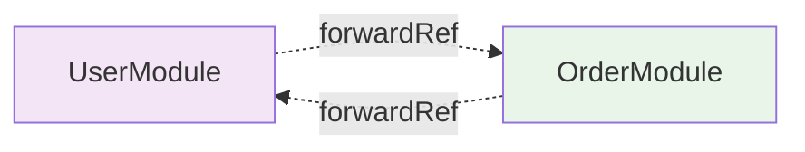

```typescript title="Circular Dependencies with forwardRef()"
// UserModule
@Module({
  // highlight-start
  imports: [forwardRef(() => OrderModule)],
  // highlight-end
  exports: [UserService],
})
export class UserModule {}

// OrderModule
@Module({
  // highlight-start
  imports: [forwardRef(() => UserModule)],
  // highlight-end
  exports: [OrderService],
})
export class OrderModule {}
```

:::warning ⚠️ Circular Dependencies
Circular dependencies là một vấn đề phức tạp. Luôn cố gắng thiết kế kiến trúc để tránh chúng, chỉ sử dụng `forwardRef()` khi thực sự cần thiết.
:::

### Giải pháp cho Circular Dependencies

#### 1. Sử dụng forwardRef()
```typescript title="forwardRef Solution"
// UserModule
@Module({
  imports: [forwardRef(() => OrderModule)],
  exports: [UserService],
})
export class UserModule {}

// OrderModule
@Module({
  imports: [forwardRef(() => UserModule)],
  exports: [OrderService],
})
export class OrderModule {}
```

#### 2. Refactor Architecture
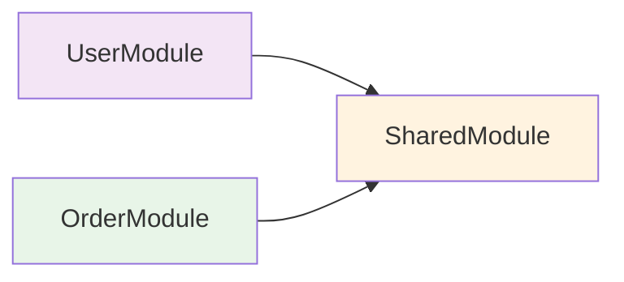

```typescript title="Refactored Architecture"
// SharedModule - giải quyết circular dependency
@Module({
  providers: [UserOrderService, CommonUtils],
  exports: [UserOrderService, CommonUtils],
})
export class SharedModule {}

// UserModule
@Module({
  imports: [SharedModule],
  exports: [UserService],
})
export class UserModule {}

// OrderModule
@Module({
  imports: [SharedModule],
  exports: [OrderService],
})
export class OrderModule {}
```

#### 3. Event-based Communication
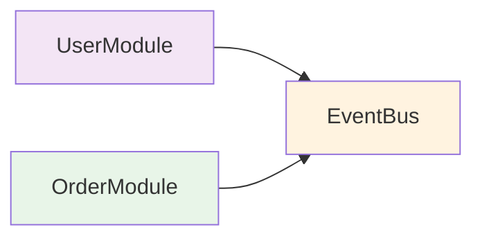

```typescript title="Event-based Solution"
// UserModule
@Module({
  providers: [UserService, UserEvents],
  exports: [UserService],
})
export class UserModule {}

// OrderModule
@Module({
  providers: [OrderService, OrderEvents],
  exports: [OrderService],
})
export class OrderModule {}

// Sử dụng events thay vì direct imports
@Injectable()
export class UserService {
  constructor(private eventBus: EventBus) {}

  createUser(dto: CreateUserDto) {
    // Tạo user
    const user = this.userRepository.create(dto);
    
    // Emit event thay vì gọi trực tiếp OrderService
    this.eventBus.emit('user.created', user);
    
    return user;
  }
}
```

### Conditional Imports

**Định nghĩa:** Conditional Imports cho phép import modules dựa trên điều kiện như environment, configuration, hoặc runtime conditions.

**Vai trò:**
- Import modules theo environment
- Dynamic module loading
- Feature flags
- Environment-specific modules

```typescript title="Conditional Module Imports"
@Module({
  imports: [
    process.env.NODE_ENV === 'production' 
      ? ProductionModule 
      : DevelopmentModule,
  ],
})
export class AppModule {}
```

## Module Scopes

### Default Scope (Singleton)

**Định nghĩa:** Mặc định, tất cả providers trong NestJS đều có scope là singleton. Điều này có nghĩa là chỉ có một instance duy nhất cho toàn bộ ứng dụng.

**Đặc điểm:**
- Một instance duy nhất
- Shared state across requests
- Memory efficient
- Không thread-safe

```typescript title="Singleton Scope (Default)"
@Injectable()
export class UserService {
  // Một instance duy nhất cho toàn bộ ứng dụng
}
```

### Request Scope

**Định nghĩa:** Request Scope tạo ra một instance mới cho mỗi HTTP request. Mỗi request sẽ có instance riêng của provider.

**Đặc điểm:**
- Instance mới cho mỗi request
- Isolated state per request
- Thread-safe
- Memory overhead

**Khi nào sử dụng:**
- Khi cần isolated state per request
- Khi cần request-specific data
- Khi cần thread safety
- Khi cần user-specific context

```typescript title="Request Scope Example"
@Injectable({ 
  // highlight-next-line
  scope: Scope.REQUEST 
})
export class UserService {
  // Một instance mới cho mỗi request
}
```

### Transient Scope

**Định nghĩa:** Transient Scope tạo ra một instance mới mỗi lần provider được inject. Mỗi injection sẽ có instance riêng.

**Đặc điểm:**
- Instance mới mỗi lần inject
- No shared state
- Memory overhead
- Complete isolation

**Khi nào sử dụng:**
- Khi cần complete isolation
- Khi không muốn shared state
- Khi cần fresh instance mỗi lần
- Khi cần temporary objects

```typescript title="Transient Scope Example"
@Injectable({ 
  // highlight-next-line
  scope: Scope.TRANSIENT 
})
export class UserService {
  // Một instance mới mỗi lần inject
}
```

:::info 📊 So sánh các Scopes
| Scope | Instance | Memory | Thread-safe | Use Case |
|-------|----------|--------|-------------|----------|
| Singleton | 1 | Low | No | Shared state |
| Request | Per request | Medium | Yes | Request isolation |
| Transient | Per injection | High | Yes | Complete isolation |
:::

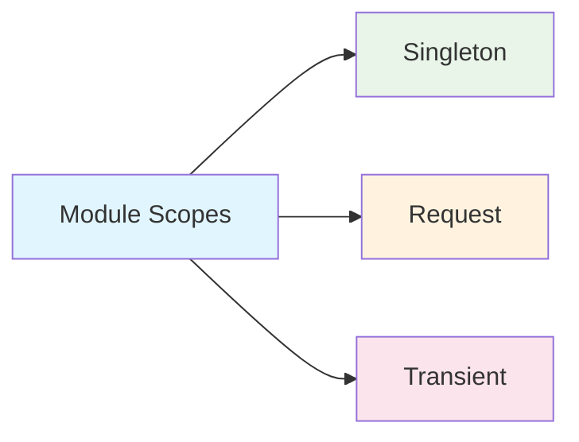

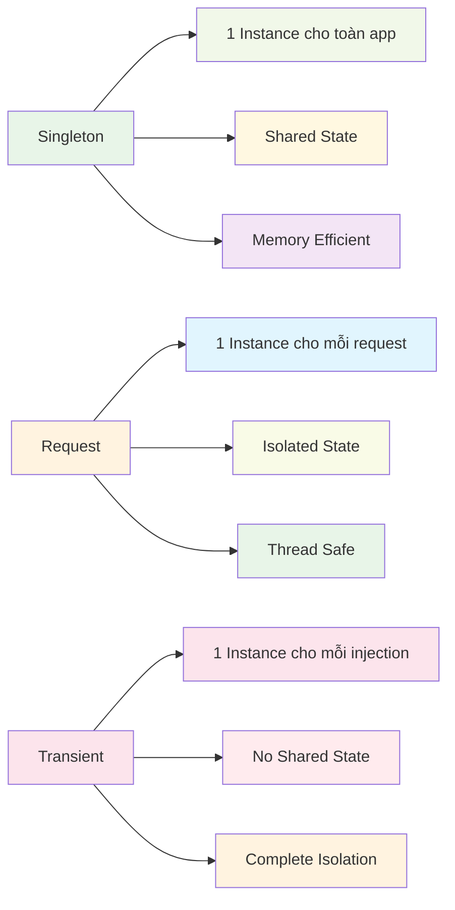

## Module Testing

### Unit Testing

**Mục đích:** Test từng module độc lập để đảm bảo module hoạt động đúng.

**Phương pháp:**
- Test module configuration
- Test providers registration
- Test exports
- Mock dependencies

```typescript title="Module Unit Testing"
describe('UserModule', () => {
  let module: TestingModule;

  beforeEach(async () => {
    // highlight-start
    module = await Test.createTestingModule({
      imports: [UserModule],
    }).compile();
    // highlight-end
  });

  it('should be defined', () => {
    expect(module).toBeDefined();
  });

  it('should have UserService', () => {
    // highlight-next-line
    const userService = module.get<UserService>(UserService);
    expect(userService).toBeDefined();
  });
});
```

### Integration Testing

**Mục đích:** Test module trong context của ứng dụng hoàn chỉnh.

**Phương pháp:**
- Test với real dependencies
- Test HTTP endpoints
- Test database operations
- Test error scenarios

```typescript title="Module Integration Testing"
describe('UserModule Integration', () => {
  let app: INestApplication;

  beforeEach(async () => {
    const moduleFixture = await Test.createTestingModule({
      imports: [UserModule],
    }).compile();

    app = moduleFixture.createNestApplication();
    await app.init();
  });

  afterEach(async () => {
    await app.close();
  });
});
```

## Best Practices

### 1. Tổ chức theo tính năng

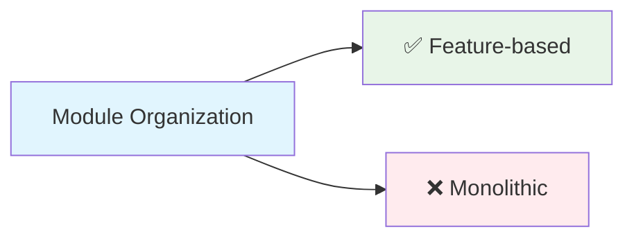

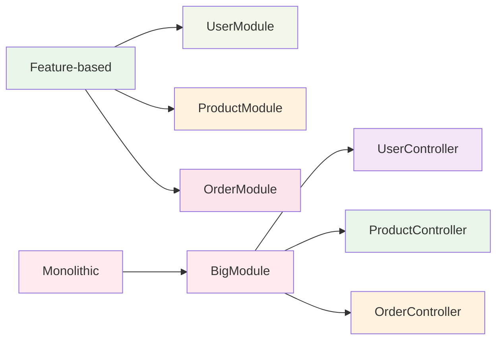

```typescript title="Feature-based Module Organization"
// ✅ Tốt - Mỗi tính năng một module
@Module({
  controllers: [UserController],
  providers: [UserService, UserRepository],
  exports: [UserService],
})
export class UserModule {}

// ❌ Không tốt - Module quá lớn
@Module({
  controllers: [UserController, ProductController, OrderController],
  providers: [UserService, ProductService, OrderService, ...],
})
export class BigModule {}
```

### 2. Import có chọn lọc
```typescript title="Selective Module Imports"
// ✅ Tốt - Chỉ import cần thiết
@Module({
  imports: [UserModule, AuthModule],
  controllers: [OrderController],
  providers: [OrderService],
})
export class OrderModule {}

// ❌ Không tốt - Import tất cả
@Module({
  imports: [UserModule, ProductModule, AuthModule, PaymentModule, ...],
})
export class OrderModule {}
```

### 3. Export hợp lý
```typescript title="Selective Module Exports"
// ✅ Tốt - Chỉ export cần thiết
@Module({
  providers: [UserService, UserRepository, UserHelper],
  exports: [UserService], // Chỉ export UserService
})
export class UserModule {}

// ❌ Không tốt - Export tất cả
@Module({
  providers: [UserService, UserRepository, UserHelper],
  exports: [UserService, UserRepository, UserHelper], // Export tất cả
})
export class UserModule {}
```

### 4. Sử dụng Shared Modules
```typescript title="Shared Module Usage"
// ✅ Tốt - Tái sử dụng logic chung
@Module({
  providers: [LoggerService, DatabaseService],
  exports: [LoggerService, DatabaseService],
})
export class SharedModule {}

// ❌ Không tốt - Duplicate code
@Module({
  providers: [LoggerService, DatabaseService], // Duplicate trong nhiều modules
})
export class UserModule {}
```

### 5. Tránh Circular Dependencies
```typescript title="Circular Dependencies Handling"
// ✅ Tốt - Sử dụng forwardRef khi cần
@Module({
  imports: [forwardRef(() => OrderModule)],
})
export class UserModule {}

// ❌ Không tốt - Circular dependency trực tiếp
@Module({
  imports: [OrderModule], // Sẽ gây lỗi
})
export class UserModule {}
```

---

:::tip 💡 Lời khuyên tổng kết
- Bắt đầu với một module đơn giản
- Tách module khi có nhiều tính năng
- Sử dụng Global modules cho utilities chung
- Tránh circular dependencies
- Test từng module độc lập
- Export chỉ những gì cần thiết
- Sử dụng Shared modules để tránh duplicate code
:::

**Bài tiếp theo:** [Controllers](/docs/overview/controllers)
