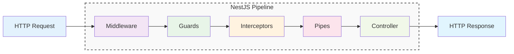
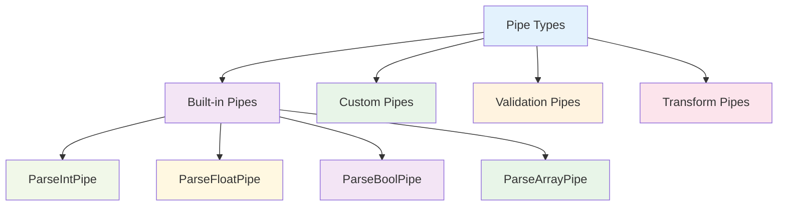
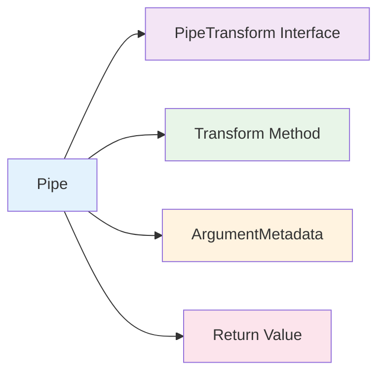
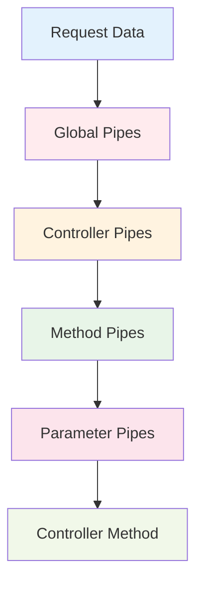
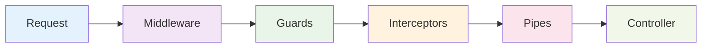

# Pipes

Pipes trong NestJS là các classes xử lý và validate data trước khi đến controller. Chúng giống như "bộ lọc" đảm bảo data đúng format, type và validation rules trước khi xử lý.



:::tip 💡 Khái niệm cơ bản
Pipes giống như "bộ lọc nước" - lọc và làm sạch data trước khi sử dụng. Chúng đảm bảo data an toàn và đúng format.
:::

## Pipes là gì?

Pipes trong NestJS:
- **Data Validation** - Kiểm tra data có đúng format không
- **Data Transformation** - Chuyển đổi data từ format này sang format khác
- **Type Conversion** - Chuyển đổi kiểu dữ liệu
- **Error Handling** - Xử lý lỗi validation một cách nhất quán
- **Security** - Đảm bảo data an toàn trước khi xử lý

## Các loại Pipes



### 1. Built-in Pipes
Pipes có sẵn trong NestJS

### 2. Custom Pipes
Pipes tùy chỉnh theo logic nghiệp vụ

### 3. Validation Pipes
Pipes kiểm tra validation rules

### 4. Transform Pipes
Pipes chuyển đổi data

## Tạo Pipe cơ bản

```typescript title="Basic Pipe Example"
import { Injectable, PipeTransform, ArgumentMetadata } from '@nestjs/common';

@Injectable()
export class ValidationPipe implements PipeTransform {
  transform(value: any, metadata: ArgumentMetadata) {
    // Validate và transform data
    if (!value) {
      throw new BadRequestException('Value is required');
    }
    return value;
  }
}
```

## Cấu trúc Pipe



### PipeTransform Interface
Interface bắt buộc cho tất cả pipes

### Transform Method
Method chính để xử lý data

### ArgumentMetadata
Metadata về argument được truyền vào

### Return Value
Data đã được validate/transform

## Sử dụng Pipes

### Global Pipes
```typescript title="Global Pipe Usage"
// main.ts
app.useGlobalPipes(new ValidationPipe());
```

### Controller Level
```typescript title="Controller Level Pipe"
@UsePipes(ValidationPipe)
@Controller('users')
export class UserController {
  @Post()
  create(@Body() createUserDto: CreateUserDto) {
    return this.userService.create(createUserDto);
  }
}
```

### Method Level
```typescript title="Method Level Pipe"
@Controller('users')
export class UserController {
  @Post()
  @UsePipes(ValidationPipe)
  create(@Body() createUserDto: CreateUserDto) {
    return this.userService.create(createUserDto);
  }
}
```

### Parameter Level
```typescript title="Parameter Level Pipe"
@Controller('users')
export class UserController {
  @Get(':id')
  findOne(@Param('id', ParseIntPipe) id: number) {
    return this.userService.findOne(id);
  }
}
```

## Built-in Pipes

### 1. ParseIntPipe
```typescript title="ParseIntPipe Usage"
@Get(':id')
findOne(@Param('id', ParseIntPipe) id: number) {
  // id sẽ là number, không phải string
  return this.userService.findOne(id);
}
```

### 2. ParseFloatPipe
```typescript title="ParseFloatPipe Usage"
@Get('price/:price')
getPrice(@Param('price', ParseFloatPipe) price: number) {
  // price sẽ là float number
  return this.calculatePrice(price);
}
```

### 3. ParseBoolPipe
```typescript title="ParseBoolPipe Usage"
@Get('status/:active')
getStatus(@Param('active', ParseBoolPipe) active: boolean) {
  // active sẽ là boolean
  return this.getActiveUsers(active);
}
```

### 4. ParseArrayPipe
```typescript title="ParseArrayPipe Usage"
@Get('search')
search(@Query('tags', ParseArrayPipe) tags: string[]) {
  // tags sẽ là array of strings
  return this.searchByTags(tags);
}
```

## Custom Pipes

### 1. Validation Pipe
```typescript title="Custom Validation Pipe"
@Injectable()
export class CustomValidationPipe implements PipeTransform {
  transform(value: any, metadata: ArgumentMetadata) {
    if (typeof value !== 'string') {
      throw new BadRequestException('Value must be a string');
    }
    
    if (value.length < 3) {
      throw new BadRequestException('Value must be at least 3 characters');
    }
    
    return value.trim();
  }
}
```

### 2. Transform Pipe
```typescript title="Custom Transform Pipe"
@Injectable()
export class UppercasePipe implements PipeTransform {
  transform(value: string, metadata: ArgumentMetadata) {
    if (typeof value === 'string') {
      return value.toUpperCase();
    }
    return value;
  }
}
```

### 3. Business Logic Pipe
```typescript title="Business Logic Pipe"
@Injectable()
export class AgeValidationPipe implements PipeTransform {
  transform(value: any, metadata: ArgumentMetadata) {
    const age = parseInt(value);
    
    if (isNaN(age)) {
      throw new BadRequestException('Age must be a number');
    }
    
    if (age < 0 || age > 150) {
      throw new BadRequestException('Age must be between 0 and 150');
    }
    
    return age;
  }
}
```

## Pipe Execution Order



**Thứ tự thực thi:**
1. **Global Pipes** - Áp dụng cho toàn bộ ứng dụng
2. **Controller Pipes** - Áp dụng cho tất cả methods trong controller
3. **Method Pipes** - Áp dụng cho method cụ thể
4. **Parameter Pipes** - Áp dụng cho parameter cụ thể
5. **Controller Method** - Thực thi logic nghiệp vụ

## Pipes vs Middleware vs Guards vs Interceptors



### Middleware
- **Timing**: Trước Guards
- **Purpose**: Request processing, logging, CORS
- **Scope**: Global, module, route level

### Guards
- **Timing**: Sau Middleware, trước Interceptors
- **Purpose**: Authentication, authorization, validation
- **Scope**: Controller, method level

### Interceptors
- **Timing**: Trước và sau Controller
- **Purpose**: Transformation, logging, caching
- **Scope**: Global, controller, method level

### Pipes
- **Timing**: Trước Controller, sau Interceptors
- **Purpose**: Data validation, transformation, type conversion
- **Scope**: Parameter level

## Best Practices

### 1. Single Responsibility
```typescript title="Single Responsibility Best Practice"
// ✅ Tốt - Mỗi pipe một nhiệm vụ
@Injectable()
export class StringValidationPipe implements PipeTransform {
  // Chỉ validate string
}

@Injectable()
export class NumberValidationPipe implements PipeTransform {
  // Chỉ validate number
}

// ❌ Không tốt - Pipe quá nhiều nhiệm vụ
@Injectable()
export class StringNumberValidationPipe implements PipeTransform {
  // Validate cả string và number
}
```

### 2. Error Messages
```typescript title="Error Messages Best Practice"
// ✅ Tốt - Error message rõ ràng
@Injectable()
export class ClearErrorPipe implements PipeTransform {
  transform(value: any, metadata: ArgumentMetadata) {
    if (!value) {
      throw new BadRequestException(
        `Parameter '${metadata.data}' is required`
      );
    }
    return value;
  }
}
```

### 3. Performance
```typescript title="Performance Best Practice"
// ✅ Tốt - Pipe nhanh và hiệu quả
@Injectable()
export class FastPipe implements PipeTransform {
  transform(value: any, metadata: ArgumentMetadata) {
    // Chỉ xử lý cần thiết
    if (typeof value === 'string') {
      return value.trim();
    }
    return value;
  }
}
```

## Testing Pipes

### Unit Testing
```typescript title="Pipe Unit Testing"
describe('CustomValidationPipe', () => {
  let pipe: CustomValidationPipe;

  beforeEach(() => {
    pipe = new CustomValidationPipe();
  });

  it('should validate valid string', () => {
    const result = pipe.transform('valid string', {} as ArgumentMetadata);
    expect(result).toBe('valid string');
  });

  it('should throw error for invalid input', () => {
    expect(() => {
      pipe.transform('ab', {} as ArgumentMetadata);
    }).toThrow(BadRequestException);
  });
});
```

---

:::tip 💡 Lời khuyên tổng kết
- Sử dụng Pipes cho data validation và transformation
- Mỗi Pipe nên có một nhiệm vụ cụ thể
- Sử dụng Built-in Pipes khi có thể
- Sử dụng Middleware cho request processing
- Sử dụng Guards cho authentication/authorization
- Sử dụng Interceptors cho transformation
:::

**Bài tiếp theo:** [Exception Filters](/docs/overview/exception-filters)
