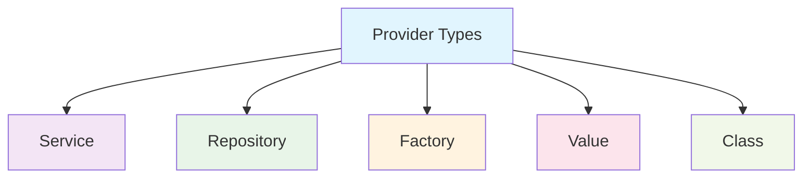
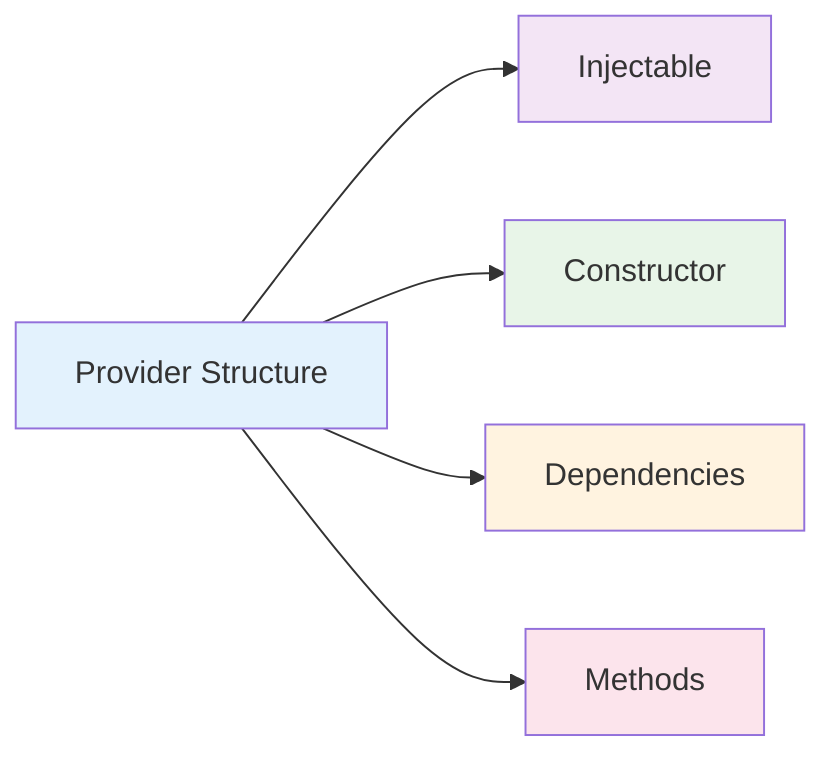
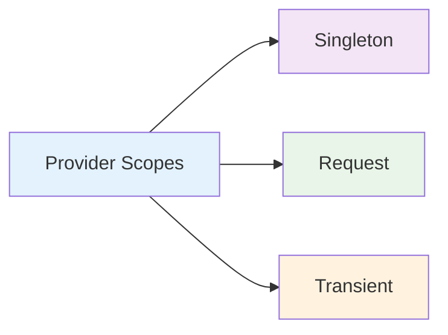
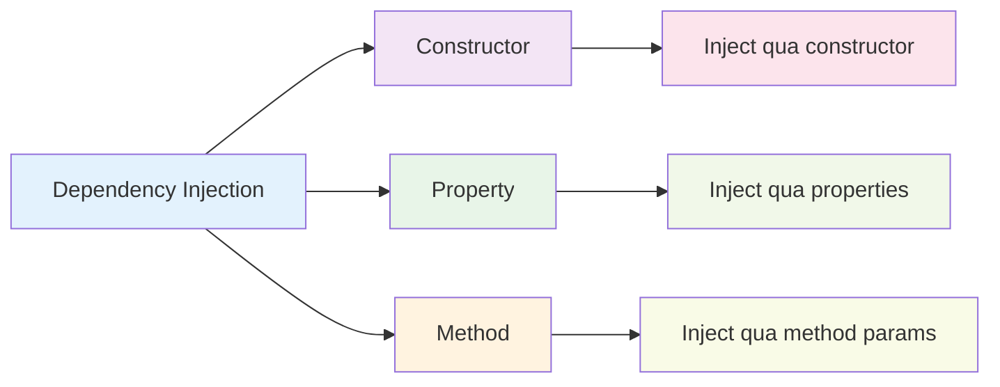
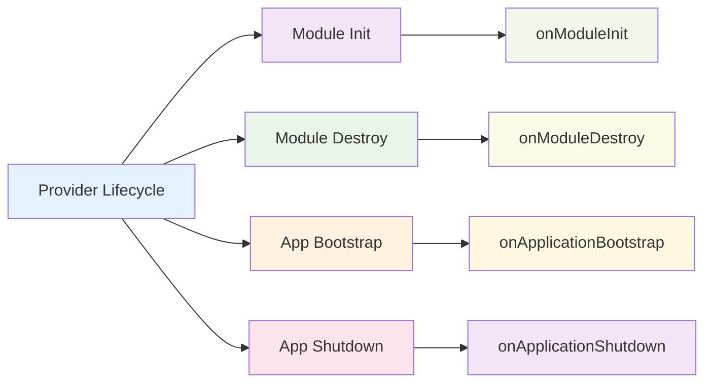
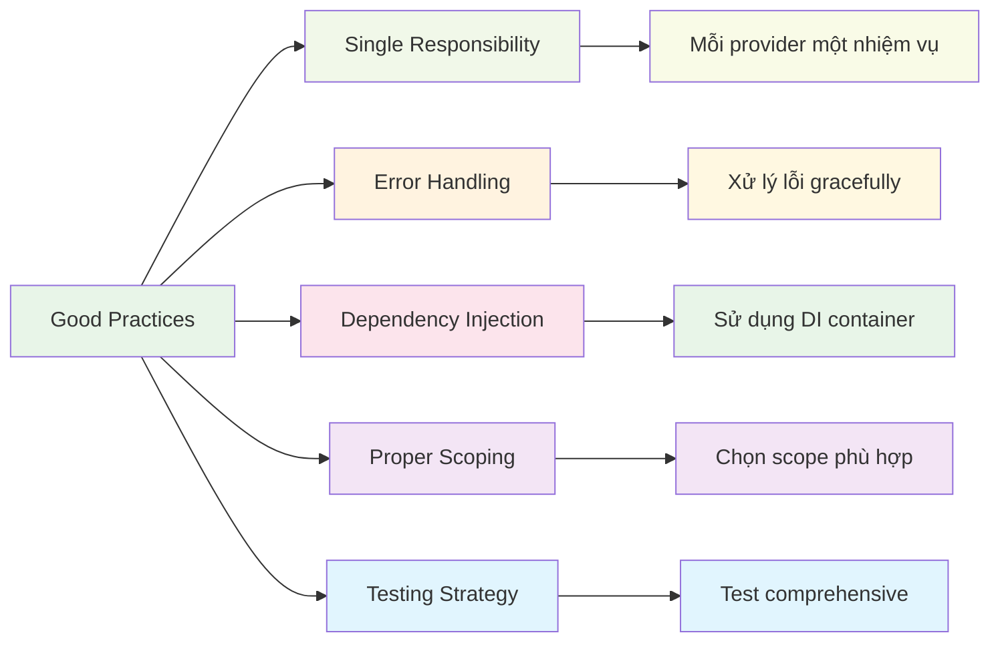
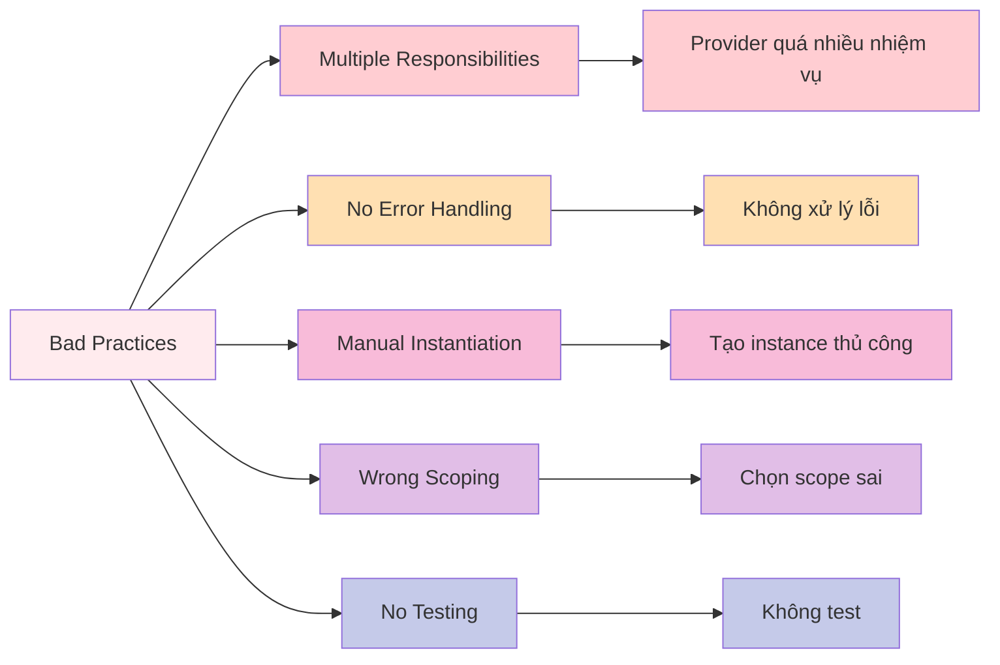

# Providers

Providers trong NestJS là các class, functions, values, hoặc objects được inject vào các components khác. Chúng là nền tảng của Dependency Injection system trong NestJS.



:::tip 💡 Khái niệm cơ bản
Providers trong NestJS giống như các "công cụ" được cung cấp cho các components khác sử dụng. Chúng có thể là services, repositories, factories, hoặc bất kỳ object nào cần thiết.
:::

## Providers là gì?

Providers trong NestJS:
- **Dependency Injection** - Tự động inject vào components cần thiết
- **Service Management** - Quản lý lifecycle của services
- **Reusability** - Có thể sử dụng ở nhiều nơi
- **Testability** - Dễ dàng mock và test
- **Configuration** - Cung cấp configuration và constants

## Lý thuyết về Providers

### Nguyên lý hoạt động

Providers trong NestJS hoạt động dựa trên nguyên lý **Dependency Injection Container**:

1. **Registration** - Đăng ký provider trong module
2. **Resolution** - Tự động resolve dependencies
3. **Instantiation** - Tạo instance của provider
4. **Lifecycle Management** - Quản lý vòng đời
5. **Injection** - Inject vào components cần thiết

:::info 🔧 Dependency Injection Container
DI Container là "bộ não" của NestJS, tự động quản lý việc tạo và kết nối các dependencies giữa các thành phần.
:::

### Provider Metadata

Mỗi provider được định nghĩa bằng decorators:

```typescript title="Provider Metadata Structure"
@Injectable()                    // Injectable decorator
export class UserService {
  // highlight-start
  constructor(
    private userRepository: UserRepository,  // Dependency injection
    private logger: Logger
  ) {}
  // highlight-end
}
```

## Tạo Provider cơ bản

```typescript title="Basic Provider Example"
import { Injectable } from '@nestjs/common';
import { UserRepository } from './user.repository';

@Injectable()
export class UserService {
  constructor(private readonly userRepository: UserRepository) {}

  async findAll(): Promise<User[]> {
    return this.userRepository.findAll();
  }

  async findOne(id: string): Promise<User> {
    return this.userRepository.findOne(id);
  }

  async create(createUserDto: CreateUserDto): Promise<User> {
    return this.userRepository.create(createUserDto);
  }
}
```

## Cấu trúc Provider

Mỗi provider có các thành phần chính:



```typescript title="Provider Structure Breakdown"
@Injectable()                    // Injectable decorator
export class UserService {
  constructor(
    private userRepository: UserRepository,  // Dependencies
    private logger: Logger
  ) {}
  
  async findAll(): Promise<User[]> {        // Methods
    this.logger.log('Finding all users');
    return this.userRepository.findAll();
  }
}
```

### Injectable Decorator
- Đánh dấu class có thể được inject
- Cho phép NestJS quản lý lifecycle
- Tự động resolve dependencies

### Constructor
- Nhận dependencies từ DI container
- Sử dụng private/public modifiers
- TypeScript type annotations

### Dependencies
- Services, repositories, utilities
- Được inject tự động
- Singleton instances

### Methods
- Business logic implementation
- Async/await support
- Error handling

## Các loại Providers

### 1. Service Providers

**Định nghĩa:** Service providers là các class chứa business logic và được inject vào controllers hoặc services khác.

**Vai trò:**
- Chứa business logic
- Xử lý data transformation
- Gọi external APIs
- Orchestrate multiple operations

**Khi nào sử dụng:**
- Khi cần business logic phức tạp
- Khi cần tái sử dụng logic
- Khi cần test business logic
- Khi cần separation of concerns

```typescript title="Service Provider Example"
@Injectable()
export class UserService {
  constructor(
    private readonly userRepository: UserRepository,
    private readonly emailService: EmailService,
    private readonly logger: Logger
  ) {}

  async createUser(createUserDto: CreateUserDto): Promise<User> {
    // Business logic
    const existingUser = await this.userRepository.findByEmail(createUserDto.email);
    if (existingUser) {
      throw new ConflictException('User already exists');
    }

    // Create user
    const user = await this.userRepository.create(createUserDto);
    
    // Send welcome email
    await this.emailService.sendWelcomeEmail(user.email);
    
    // Log action
    this.logger.log(`User created: ${user.id}`);
    
    return user;
  }
}
```

:::info 🔧 Service Provider Benefits
- **Separation of Concerns** - Tách biệt business logic
- **Reusability** - Có thể sử dụng ở nhiều nơi
- **Testability** - Dễ dàng unit test
- **Maintainability** - Code dễ maintain và update
:::

### 2. Repository Providers

**Định nghĩa:** Repository providers là các class xử lý data access layer, tương tác trực tiếp với database.

**Vai trò:**
- Data persistence operations
- Database queries
- Data validation
- Connection management

**Khi nào sử dụng:**
- Khi cần tương tác với database
- Khi cần abstract database logic
- Khi cần data access patterns
- Khi cần test data operations

```typescript title="Repository Provider Example"
@Injectable()
export class UserRepository {
  constructor(
    @InjectRepository(User)
    private readonly userRepository: Repository<User>
  ) {}

  async findAll(): Promise<User[]> {
    return this.userRepository.find();
  }

  async findOne(id: string): Promise<User> {
    return this.userRepository.findOne({ where: { id } });
  }

  async findByEmail(email: string): Promise<User> {
    return this.userRepository.findOne({ where: { email } });
  }

  async create(createUserDto: CreateUserDto): Promise<User> {
    const user = this.userRepository.create(createUserDto);
    return this.userRepository.save(user);
  }

  async update(id: string, updateUserDto: UpdateUserDto): Promise<User> {
    await this.userRepository.update(id, updateUserDto);
    return this.findOne(id);
  }

  async remove(id: string): Promise<void> {
    await this.userRepository.delete(id);
  }
}
```

:::tip 💡 Repository Pattern Benefits
- **Data Access Abstraction** - Ẩn database implementation details
- **Testability** - Dễ mock database operations
- **Database Agnostic** - Có thể thay đổi database
- **Consistent Interface** - Interface nhất quán cho data operations
:::

### 3. Factory Providers

**Định nghĩa:** Factory providers là các functions tạo ra provider instances với configuration động.

**Vai trò:**
- Tạo providers với config
- Dynamic provider creation
- Conditional provider instantiation
- Complex initialization logic

**Khi nào sử dụng:**
- Khi cần configuration động
- Khi cần conditional providers
- Khi cần async initialization
- Khi cần complex setup

```typescript title="Factory Provider Example"
@Injectable()
export class DatabaseService {
  constructor(
    @Inject('DATABASE_CONFIG')
    private readonly config: DatabaseConfig
  ) {}

  async connect(): Promise<void> {
    // Database connection logic
  }
}

// Factory provider
export const databaseProvider = {
  provide: 'DATABASE_CONFIG',
  useFactory: async (configService: ConfigService): Promise<DatabaseConfig> => {
    const config = await configService.getDatabaseConfig();
    return {
      host: config.host,
      port: config.port,
      database: config.database,
      username: config.username,
      password: config.password,
    };
  },
  inject: [ConfigService],
};

// Usage in module
@Module({
  providers: [
    DatabaseService,
    databaseProvider, // Factory provider
  ],
})
export class DatabaseModule {}
```

:::info 🔧 Factory Provider Benefits
- **Dynamic Configuration** - Cấu hình động dựa trên environment
- **Async Initialization** - Khởi tạo bất đồng bộ
- **Conditional Logic** - Logic điều kiện cho provider creation
- **Complex Setup** - Setup phức tạp với multiple dependencies
:::

### 4. Value Providers

**Định nghĩa:** Value providers là các constants, configuration objects, hoặc simple values được inject.

**Vai trò:**
- Configuration constants
- Environment variables
- API keys
- Simple values

**Khi nào sử dụng:**
- Khi cần inject constants
- Khi cần configuration values
- Khi cần environment variables
- Khi cần simple data

```typescript title="Value Provider Examples"
// Simple value provider
export const appConfig = {
  provide: 'APP_CONFIG',
  useValue: {
    name: 'NestJS App',
    version: '1.0.0',
    environment: process.env.NODE_ENV || 'development',
  },
};

// Configuration provider
export const databaseConfig = {
  provide: 'DATABASE_CONFIG',
  useValue: {
    host: process.env.DB_HOST || 'localhost',
    port: parseInt(process.env.DB_PORT) || 5432,
    database: process.env.DB_NAME || 'myapp',
    username: process.env.DB_USER || 'postgres',
    password: process.env.DB_PASSWORD || 'password',
  },
};

// API keys provider
export const apiKeys = {
  provide: 'API_KEYS',
  useValue: {
    stripe: process.env.STRIPE_SECRET_KEY,
    sendgrid: process.env.SENDGRID_API_KEY,
    aws: process.env.AWS_ACCESS_KEY_ID,
  },
};

// Usage in module
@Module({
  providers: [
    appConfig,
    databaseConfig,
    apiKeys,
  ],
})
export class ConfigModule {}
```

:::tip 💡 Value Provider Benefits
- **Simple Injection** - Inject đơn giản constants và values
- **Environment Configuration** - Cấu hình dựa trên environment
- **Centralized Config** - Quản lý configuration tập trung
- **Easy Testing** - Dễ dàng override values trong tests
:::

### 5. Class Providers

**Định nghĩa:** Class providers là các custom classes hoặc third-party classes được inject.

**Vai trò:**
- Custom business logic classes
- Third-party library classes
- Utility classes
- Wrapper classes

**Khi nào sử dụng:**
- Khi cần custom classes
- Khi cần third-party integrations
- Khi cần utility functions
- Khi cần wrapper implementations

```typescript title="Class Provider Examples"
// Custom utility class
@Injectable()
export class StringUtils {
  capitalize(str: string): string {
    return str.charAt(0).toUpperCase() + str.slice(1);
  }

  slugify(str: string): string {
    return str
      .toLowerCase()
      .replace(/[^a-z0-9]+/g, '-')
      .replace(/(^-|-$)/g, '');
  }
}

// Third-party class wrapper
@Injectable()
export class EmailService {
  private transporter: any;

  constructor() {
    this.transporter = nodemailer.createTransporter({
      host: process.env.SMTP_HOST,
      port: process.env.SMTP_PORT,
      secure: true,
      auth: {
        user: process.env.SMTP_USER,
        pass: process.env.SMTP_PASS,
      },
    });
  }

  async sendEmail(to: string, subject: string, content: string): Promise<void> {
    await this.transporter.sendMail({
      from: process.env.SMTP_FROM,
      to,
      subject,
      html: content,
    });
  }
}

// Usage in module
@Module({
  providers: [
    StringUtils,
    EmailService,
  ],
})
export class UtilsModule {}
```

## Provider Registration

### Module Registration

**Định nghĩa:** Đăng ký providers trong module để NestJS có thể inject chúng.

**Cách hoạt động:**
- Providers được khai báo trong `@Module()` decorator
- NestJS tự động quản lý lifecycle
- Dependencies được resolve tự động
- Singleton instances được chia sẻ

```typescript title="Module Registration Example"
@Module({
  imports: [TypeOrmModule.forFeature([User])],
  controllers: [UserController],
  providers: [
    UserService,           // Service provider
    UserRepository,        // Repository provider
    {
      provide: 'APP_CONFIG',  // Value provider
      useValue: {
        name: 'User Module',
        version: '1.0.0',
      },
    },
    {
      provide: 'DATABASE_CONFIG',  // Factory provider
      useFactory: (configService: ConfigService) => {
        return configService.getDatabaseConfig();
      },
      inject: [ConfigService],
    },
  ],
  exports: [UserService, UserRepository], // Export để modules khác sử dụng
})
export class UserModule {}
```

### Global Providers

**Định nghĩa:** Providers có thể được sử dụng ở mọi nơi trong ứng dụng mà không cần import.

**Cách sử dụng:**
- Sử dụng `@Global()` decorator
- Đăng ký ở AppModule level
- Tự động có sẵn trong toàn bộ ứng dụng

```typescript title="Global Provider Example"
@Global()
@Module({
  providers: [
    {
      provide: 'LOGGER',
      useFactory: () => {
        return new Logger('GlobalLogger');
      },
    },
    {
      provide: 'CONFIG',
      useValue: {
        appName: 'NestJS App',
        version: '1.0.0',
      },
    },
  ],
  exports: ['LOGGER', 'CONFIG'],
})
export class GlobalModule {}

// Usage ở bất kỳ đâu
@Injectable()
export class UserService {
  constructor(
    @Inject('LOGGER') private logger: Logger,
    @Inject('CONFIG') private config: any
  ) {}

  logUserCreation(userId: string): void {
    this.logger.log(`User created in ${this.config.appName}: ${userId}`);
  }
}
```

## Provider Scopes



### Default Scope (Singleton)

**Định nghĩa:** Mặc định, tất cả providers đều có scope là singleton. Chỉ có một instance duy nhất cho toàn bộ ứng dụng.

**Đặc điểm:**
- Một instance duy nhất
- Shared state across requests
- Memory efficient
- Không thread-safe

```typescript title="Singleton Scope Example"
@Injectable()
export class UserService {
  private userCount = 0; // Shared state

  createUser(): User {
    this.userCount++; // State được chia sẻ
    return { id: this.userCount.toString(), name: 'User' };
  }

  getUserCount(): number {
    return this.userCount;
  }
}
```

### Request Scope

**Định nghĩa:** Request Scope tạo ra một instance mới cho mỗi HTTP request.

**Đặc điểm:**
- Instance mới cho mỗi request
- Isolated state per request
- Thread-safe
- Memory overhead

**Khi nào sử dụng:**
- Khi cần isolated state per request
- Khi cần request-specific data
- Khi cần thread safety
- Khi cần user-specific context

```typescript title="Request Scope Example"
@Injectable({ scope: Scope.REQUEST })
export class UserService {
  private requestId: string;

  constructor() {
    this.requestId = Math.random().toString(36).substr(2, 9);
  }

  getRequestId(): string {
    return this.requestId; // Unique per request
  }

  createUser(): User {
    return { id: '1', name: 'User', requestId: this.requestId };
  }
}
```

### Transient Scope

**Định nghĩa:** Transient Scope tạo ra một instance mới mỗi lần provider được inject.

**Đặc điểm:**
- Instance mới mỗi lần inject
- No shared state
- Memory overhead
- Complete isolation

**Khi nào sử dụng:**
- Khi cần complete isolation
- Khi không muốn shared state
- Khi cần fresh instance mỗi lần
- Khi cần temporary objects

```typescript title="Transient Scope Example"
@Injectable({ scope: Scope.TRANSIENT })
export class TemporaryService {
  private instanceId: string;

  constructor() {
    this.instanceId = Math.random().toString(36).substr(2, 9);
  }

  getInstanceId(): string {
    return this.instanceId; // Unique per injection
  }
}

// Mỗi lần inject sẽ có instance khác nhau
@Injectable()
export class UserService {
  constructor(
    private tempService1: TemporaryService,
    private tempService2: TemporaryService
  ) {}

  getIds(): { id1: string; id2: string } {
    return {
      id1: this.tempService1.getInstanceId(),
      id2: this.tempService2.getInstanceId(),
    };
  }
}
```

## Dependency Injection



### Constructor Injection

**Định nghĩa:** Inject dependencies thông qua constructor.

**Cách hoạt động:**
- NestJS tự động inject dependencies
- Sử dụng TypeScript types để resolve
- Singleton instances được chia sẻ

```typescript title="Constructor Injection Examples"
@Injectable()
export class UserService {
  constructor(
    private readonly userRepository: UserRepository,
    private readonly emailService: EmailService,
    private readonly logger: Logger,
    @Inject('CONFIG') private readonly config: any
  ) {}

  async createUser(dto: CreateUserDto): Promise<User> {
    this.logger.log('Creating user with config:', this.config);
    
    const user = await this.userRepository.create(dto);
    await this.emailService.sendWelcomeEmail(user.email);
    
    return user;
  }
}
```

### Property Injection

**Định nghĩa:** Inject dependencies thông qua properties.

**Cách sử dụng:**
- Sử dụng `@Inject()` decorator
- Hữu ích cho optional dependencies
- Dynamic injection

```typescript title="Property Injection Examples"
@Injectable()
export class UserService {
  @Inject(UserRepository)
  private readonly userRepository: UserRepository;

  @InjectOptional(EmailService)
  private readonly emailService?: EmailService;

  @Inject('CONFIG')
  private readonly config: any;

  async createUser(dto: CreateUserDto): Promise<User> {
    const user = await this.userRepository.create(dto);
    
    if (this.emailService) {
      await this.emailService.sendWelcomeEmail(user.email);
    }
    
    return user;
  }
}
```

### Method Injection

**Định nghĩa:** Inject dependencies thông qua method parameters.

**Cách sử dụng:**
- Sử dụng `@Inject()` trong method parameters
- Hữu ích cho dynamic injection
- Method-level dependencies

```typescript title="Method Injection Examples"
@Injectable()
export class UserService {
  async createUser(
    dto: CreateUserDto,
    @Inject('REPOSITORY') repository: UserRepository,
    @Inject('LOGGER') logger: Logger
  ): Promise<User> {
    logger.log('Creating user');
    const user = await repository.create(dto);
    logger.log('User created:', user.id);
    return user;
  }
}
```

## Provider Lifecycle



### Lifecycle Hooks

**Định nghĩa:** Các methods được gọi trong các giai đoạn khác nhau của provider lifecycle.

**Các hooks chính:**
- `OnModuleInit` - Sau khi module được khởi tạo
- `OnModuleDestroy` - Trước khi module bị hủy
- `OnApplicationBootstrap` - Sau khi ứng dụng bootstrap
- `OnApplicationShutdown` - Trước khi ứng dụng shutdown

```typescript title="Lifecycle Hooks Example"
@Injectable()
export class UserService implements OnModuleInit, OnModuleDestroy {
  private connection: any;

  async onModuleInit() {
    // Khởi tạo database connection
    this.connection = await this.createDatabaseConnection();
    console.log('Database connected');
  }

  async onModuleDestroy() {
    // Đóng database connection
    if (this.connection) {
      await this.connection.close();
      console.log('Database disconnected');
    }
  }

  private async createDatabaseConnection() {
    // Database connection logic
    return { close: () => Promise.resolve() };
  }
}
```

### Lifecycle Events

**Định nghĩa:** Các events được emit trong quá trình lifecycle.

**Các events chính:**
- `onModuleInit` - Module initialization
- `onModuleDestroy` - Module destruction
- `onApplicationBootstrap` - Application bootstrap
- `onApplicationShutdown` - Application shutdown

```typescript title="Lifecycle Events Example"
@Injectable()
export class LifecycleService {
  constructor(private eventEmitter: EventEmitter2) {}

  async onModuleInit() {
    this.eventEmitter.emit('module.initialized', 'UserModule');
  }

  async onModuleDestroy() {
    this.eventEmitter.emit('module.destroyed', 'UserModule');
  }

  async onApplicationBootstrap() {
    this.eventEmitter.emit('application.bootstrapped');
  }

  async onApplicationShutdown(signal?: string) {
    this.eventEmitter.emit('application.shutdown', signal);
  }
}
```

## Provider Testing

### Unit Testing

**Mục đích:** Test từng provider độc lập để đảm bảo logic hoạt động đúng.

**Phương pháp:**
- Mock dependencies
- Test business logic
- Test error scenarios
- Test edge cases

```typescript title="Provider Unit Testing"
describe('UserService', () => {
  let service: UserService;
  let userRepository: jest.Mocked<UserRepository>;
  let emailService: jest.Mocked<EmailService>;

  beforeEach(async () => {
    const module = await Test.createTestingModule({
      providers: [
        UserService,
        {
          provide: UserRepository,
          useValue: {
            create: jest.fn(),
            findByEmail: jest.fn(),
            findOne: jest.fn(),
          },
        },
        {
          provide: EmailService,
          useValue: {
            sendWelcomeEmail: jest.fn(),
          },
        },
      ],
    }).compile();

    service = module.get<UserService>(UserService);
    userRepository = module.get(UserRepository);
    emailService = module.get(EmailService);
  });

  it('should be defined', () => {
    expect(service).toBeDefined();
  });

  it('should create user successfully', async () => {
    const createUserDto = { name: 'John', email: 'john@example.com' };
    const expectedUser = { id: '1', ...createUserDto };

    userRepository.findByEmail.mockResolvedValue(null);
    userRepository.create.mockResolvedValue(expectedUser);
    emailService.sendWelcomeEmail.mockResolvedValue(undefined);

    const result = await service.createUser(createUserDto);

    expect(result).toEqual(expectedUser);
    expect(userRepository.create).toHaveBeenCalledWith(createUserDto);
    expect(emailService.sendWelcomeEmail).toHaveBeenCalledWith(createUserDto.email);
  });

  it('should throw error if user already exists', async () => {
    const createUserDto = { name: 'John', email: 'john@example.com' };
    const existingUser = { id: '1', ...createUserDto };

    userRepository.findByEmail.mockResolvedValue(existingUser);

    await expect(service.createUser(createUserDto)).rejects.toThrow(
      'User already exists'
    );
  });
});
```

### Integration Testing

**Mục đích:** Test provider trong context của module hoặc ứng dụng hoàn chỉnh.

**Phương pháp:**
- Test với real dependencies
- Test database operations
- Test external service calls
- Test error scenarios

```typescript title="Provider Integration Testing"
describe('UserService Integration', () => {
  let app: INestApplication;
  let userService: UserService;
  let userRepository: UserRepository;

  beforeEach(async () => {
    const moduleFixture = await Test.createTestingModule({
      imports: [
        TypeOrmModule.forRoot({
          type: 'sqlite',
          database: ':memory:',
          entities: [User],
          synchronize: true,
        }),
        UserModule,
      ],
    }).compile();

    app = moduleFixture.createNestApplication();
    await app.init();

    userService = app.get<UserService>(UserService);
    userRepository = app.get<UserRepository>(UserRepository);
  });

  afterEach(async () => {
    await app.close();
  });

  it('should create and retrieve user', async () => {
    const createUserDto = { name: 'John', email: 'john@example.com' };

    const createdUser = await userService.createUser(createUserDto);
    expect(createdUser).toBeDefined();
    expect(createdUser.name).toBe(createUserDto.name);
    expect(createdUser.email).toBe(createUserDto.email);

    const retrievedUser = await userService.findOne(createdUser.id);
    expect(retrievedUser).toEqual(createdUser);
  });
});
```

## Best Practices





### 1. Single Responsibility

```typescript title="Single Responsibility Principle"
// ✅ Tốt - Mỗi provider một responsibility
@Injectable()
export class UserService {
  // Chỉ xử lý user-related business logic
}

@Injectable()
export class EmailService {
  // Chỉ xử lý email operations
}

@Injectable()
export class PaymentService {
  // Chỉ xử lý payment operations
}

// ❌ Không tốt - Provider quá nhiều responsibilities
@Injectable()
export class UserService {
  // Xử lý users, emails, payments, logging, validation...
}
```

### 2. Proper Error Handling

```typescript title="Proper Error Handling"
// ✅ Tốt - Xử lý lỗi đúng cách
@Injectable()
export class UserService {
  async createUser(dto: CreateUserDto): Promise<User> {
    try {
      const existingUser = await this.userRepository.findByEmail(dto.email);
      if (existingUser) {
        throw new ConflictException('User already exists');
      }

      const user = await this.userRepository.create(dto);
      await this.emailService.sendWelcomeEmail(user.email);
      
      return user;
    } catch (error) {
      this.logger.error('Failed to create user', error);
      throw error;
    }
  }
}

// ❌ Không tốt - Không xử lý lỗi
@Injectable()
export class UserService {
  async createUser(dto: CreateUserDto): Promise<User> {
    const user = await this.userRepository.create(dto); // Có thể throw error
    await this.emailService.sendWelcomeEmail(user.email); // Có thể throw error
    return user;
  }
}
```

### 3. Dependency Injection

```typescript title="Dependency Injection Best Practices"
// ✅ Tốt - Constructor injection
@Injectable()
export class UserService {
  constructor(
    private readonly userRepository: UserRepository,
    private readonly emailService: EmailService,
    private readonly logger: Logger
  ) {}
}

// ❌ Không tốt - Manual instantiation
@Injectable()
export class UserService {
  private userRepository = new UserRepository(); // Không sử dụng DI
  private emailService = new EmailService();     // Không sử dụng DI
}
```

### 4. Proper Scoping

```typescript title="Provider Scoping Best Practices"
// ✅ Tốt - Sử dụng scope phù hợp
@Injectable({ scope: Scope.REQUEST })
export class UserContextService {
  // Request-specific data
}

@Injectable()
export class UserService {
  // Singleton service
}

// ❌ Không tốt - Sử dụng scope không phù hợp
@Injectable({ scope: Scope.TRANSIENT })
export class DatabaseService {
  // Database connection nên là singleton
}
```

### 5. Testing Strategy

```typescript title="Testing Strategy Best Practices"
// ✅ Tốt - Test strategy rõ ràng
@Injectable()
export class UserService {
  async createUser(dto: CreateUserDto): Promise<User> {
    // Business logic được test
    const user = await this.userRepository.create(dto);
    await this.emailService.sendWelcomeEmail(user.email);
    return user;
  }
}

// Unit test
describe('UserService', () => {
  it('should create user and send email', async () => {
    // Mock dependencies và test business logic
  });
});

// Integration test
describe('UserService Integration', () => {
  it('should work with real dependencies', async () => {
    // Test với real dependencies
  });
});
```

---

:::tip 💡 Lời khuyên tổng kết
- Sử dụng `@Injectable()` decorator cho tất cả providers
- Tách biệt business logic ra services
- Sử dụng repositories cho data access
- Implement lifecycle hooks khi cần thiết
- Test providers một cách comprehensive
- Sử dụng proper scoping
- Follow dependency injection best practices
- Handle errors gracefully
:::

**Bài tiếp theo:** [Middleware](/docs/overview/middleware)
