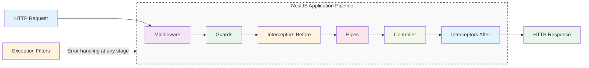
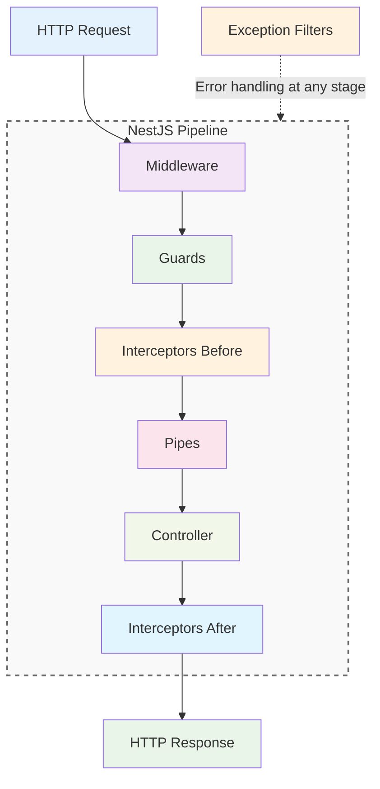

# Request Lifecycle

Request Lifecycle trong NestJS là quá trình xử lý một HTTP request từ khi nhận request đến khi trả về response. Hiểu được lifecycle này giúp bạn biết cách NestJS hoạt động và cách tùy chỉnh behavior.



**Thứ tự xử lý:**
1. **Middleware** - Xử lý request trước
2. **Guards** - Kiểm tra quyền truy cập
3. **Interceptors** - Xử lý trước controller
4. **Pipes** - Validate và transform data
5. **Controller** - Xử lý route và gọi service
6. **Service** - Thực hiện business logic
7. **Response** - Trả về kết quả

:::tip 💡 Khái niệm cơ bản
Request Lifecycle giống như một "dây chuyền sản xuất" xử lý request. Mỗi bước có nhiệm vụ riêng và có thể được tùy chỉnh.
:::

## Request Lifecycle là gì?

Request Lifecycle trong NestJS:
- **Sequential Processing** - Xử lý tuần tự qua các bước
- **Middleware Chain** - Chuỗi middleware xử lý request
- **Security & Validation** - Kiểm tra bảo mật và validate data
- **Business Logic** - Xử lý logic nghiệp vụ
- **Response Generation** - Tạo và trả về response

## Các bước trong Request Lifecycle

### 1. Middleware
Xử lý request trước khi đến controller (CORS, logging, compression)

### 2. Guards  
Kiểm tra quyền truy cập (authentication, authorization)

### 3. Interceptors
Xử lý request/response trước và sau controller (transformation, logging)

### 4. Pipes
Validate và transform data trước khi đến controller

### 5. Controller
Xử lý route và gọi service để thực hiện business logic

### 6. Service
Thực hiện business logic và xử lý data

## Sơ đồ chi tiết Request Lifecycle



**Giải thích chi tiết:**
- **Middleware**: Xử lý request (CORS, logging, compression)
- **Guards**: Kiểm tra authentication/authorization
- **Interceptors Before**: Xử lý trước khi đến controller
- **Pipes**: Validate và transform data
- **Controller**: Xử lý route và gọi service
- **Service**: Thực hiện business logic
- **Interceptors After**: Xử lý response trước khi trả về
- **Exception Filters**: Xử lý lỗi nếu có
- **Response**: Trả về kết quả cuối cùng

## Exception Handling

**Định nghĩa:** Exception Filters xử lý lỗi trong quá trình xử lý request.

**Vai trò:**
- Catch và xử lý exceptions
- Format error responses
- Logging errors
- User-friendly error messages

```typescript title="Exception Filter Example"
@Catch(HttpException)
export class HttpExceptionFilter implements ExceptionFilter {
  catch(exception: HttpException, host: ArgumentsHost) {
    const ctx = host.switchToHttp();
    const response = ctx.getResponse();
    const status = exception.getStatus();

    response.status(status).json({
      statusCode: status,
      message: exception.message,
      timestamp: new Date().toISOString(),
    });
  }
}
```

## Lifecycle Hooks

**Định nghĩa:** Lifecycle hooks cho phép can thiệp vào các giai đoạn khác nhau của request.

**Các hooks chính:**
- `OnModuleInit` - Sau khi module khởi tạo
- `OnModuleDestroy` - Trước khi module hủy
- `OnApplicationBootstrap` - Sau khi app bootstrap
- `OnApplicationShutdown` - Trước khi app shutdown

```typescript title="Lifecycle Hooks Example"
@Injectable()
export class AppService implements OnModuleInit, OnModuleDestroy {
  onModuleInit() {
    console.log('Module initialized');
  }

  onModuleDestroy() {
    console.log('Module destroyed');
  }
}
```

## Best Practices

### 1. Middleware Order
```typescript title="Middleware Order Best Practice"
// ✅ Tốt - Thứ tự logic
app.use(helmet());           // Security first
app.use(cors());            // CORS handling
app.use(compression());     // Compression
app.use(express.json());    // Body parsing
app.use(logger);           // Logging last
```

### 2. Guard Placement
```typescript title="Guard Placement Best Practice"
// ✅ Tốt - Guard ở controller level
@UseGuards(AuthGuard)
@Controller('users')
export class UserController {
  // Tất cả routes đều được bảo vệ
}

// ✅ Tốt - Guard ở method level
@Get('admin')
@UseGuards(AdminGuard)
adminOnly() {
  // Chỉ admin mới access được
}
```

### 3. Interceptor Usage
```typescript title="Interceptor Usage Best Practice"
// ✅ Tốt - Global interceptor
app.useGlobalInterceptors(new LoggingInterceptor());

// ✅ Tốt - Controller interceptor
@UseInterceptors(TransformInterceptor)
@Controller('users')
export class UserController {}
```

---

:::tip 💡 Lời khuyên tổng kết
- Hiểu rõ thứ tự các bước trong Request Lifecycle
- Sử dụng đúng component cho đúng mục đích
- Middleware cho request processing
- Guards cho authentication/authorization
- Interceptors cho transformation
- Pipes cho validation
- Exception filters cho error handling
:::

**Bài tiếp theo:** [Middleware](/docs/overview/middleware)
