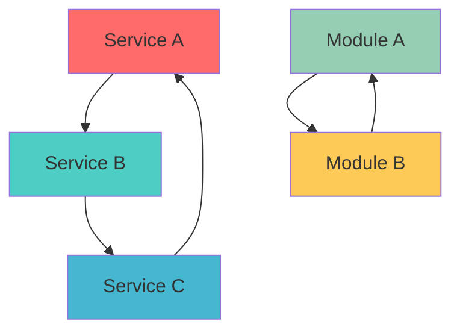
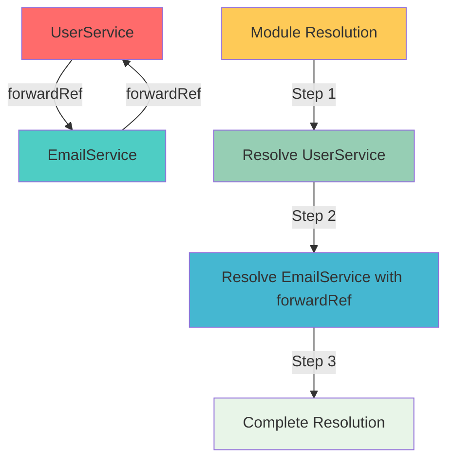
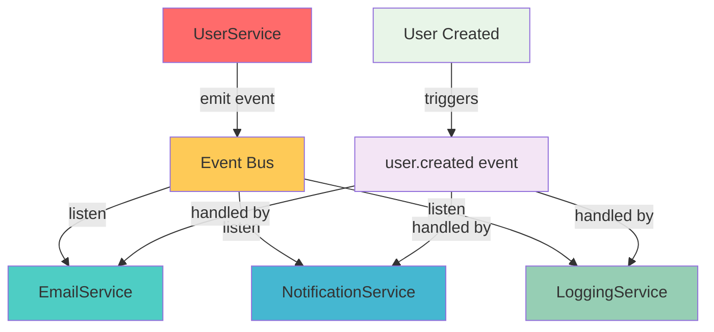
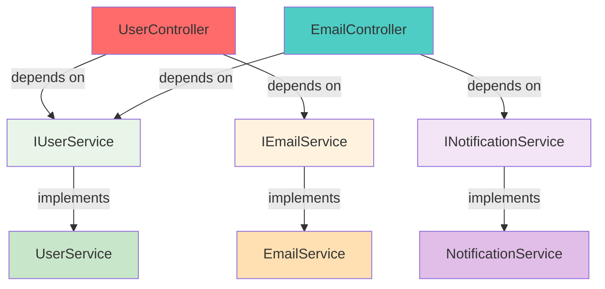
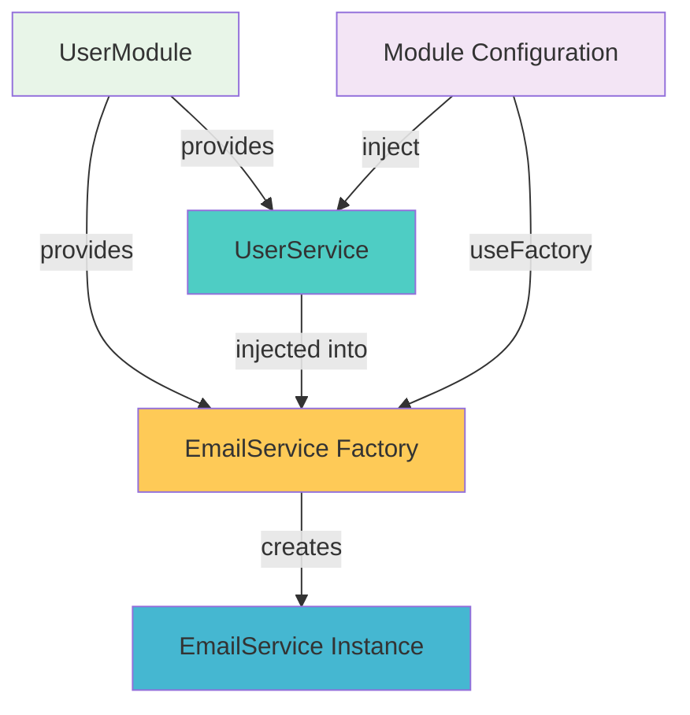
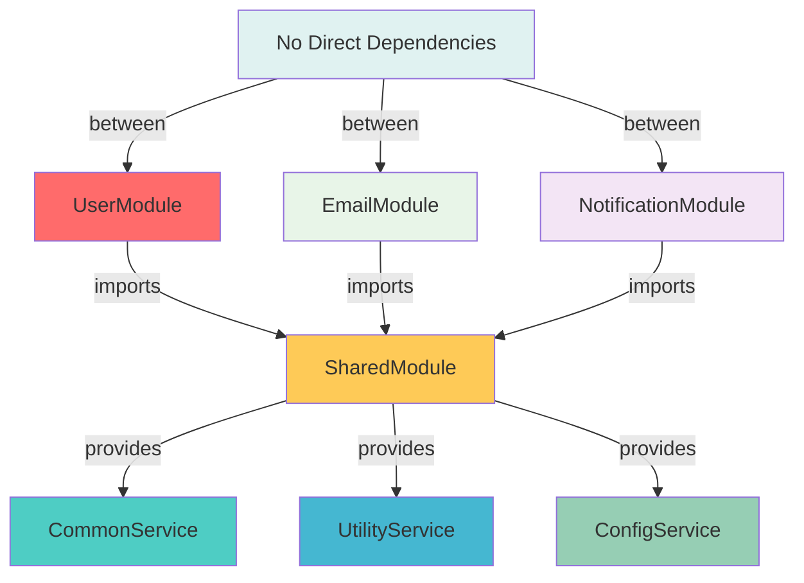
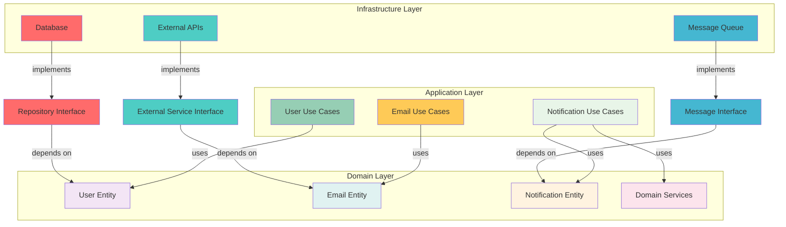
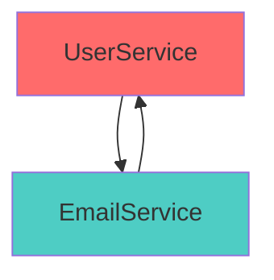
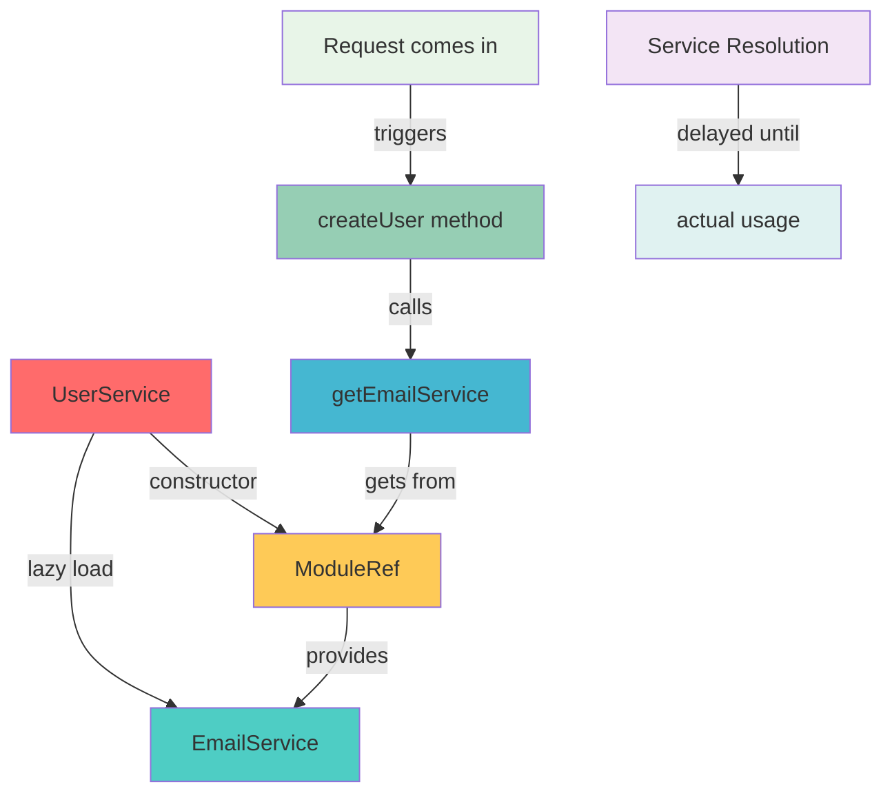
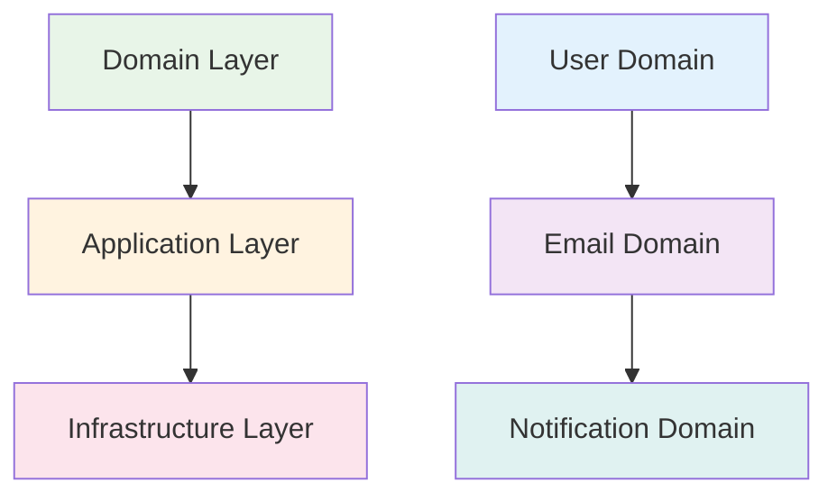

# Circular Dependency trong NestJS

Circular dependency (phụ thuộc vòng tròn) là một vấn đề phổ biến trong NestJS khi hai hoặc nhiều module, service, hoặc provider phụ thuộc lẫn nhau, tạo thành một vòng lặp vô hạn.

## 🎯 Tại sao cần hiểu về Circular Dependency?

Trong quá trình phát triển ứng dụng NestJS, bạn sẽ thường xuyên gặp phải vấn đề circular dependency. Đây không chỉ là một lỗi kỹ thuật đơn giản, mà còn là dấu hiệu của việc thiết kế architecture chưa tối ưu. Hiểu rõ về circular dependency sẽ giúp bạn:

- **Tránh được các lỗi runtime** gây crash ứng dụng
- **Thiết kế architecture tốt hơn** với dependency flow rõ ràng
- **Viết code dễ maintain** và mở rộng
- **Tăng performance** của ứng dụng
- **Giảm thời gian debug** khi gặp vấn đề

## 🔍 Circular Dependency là gì?

Circular dependency xảy ra khi:
- **Service A** cần **Service B** để hoạt động
- **Service B** lại cần **Service A** để hoạt động
- Tạo thành một vòng lặp vô hạn: A → B → A → B → ...

Điều này tương tự như việc:
- **Bạn mượn tiền của người bạn**
- **Người bạn lại mượn tiền của bạn**
- Cả hai đều không thể trả nợ vì đang chờ nhau

## 🚨 Tại sao Circular Dependency nguy hiểm?

Circular dependency gây ra nhiều vấn đề nghiêm trọng:

1. **Lỗi Runtime:** Ứng dụng không thể khởi tạo được
2. **Memory Leaks:** Tạo ra các object không thể giải phóng
3. **Khó Debug:** Khó xác định nguyên nhân gốc rễ
4. **Performance Issues:** Làm chậm quá trình khởi tạo
5. **Code Maintenance:** Khó thay đổi và mở rộng code

## 📊 Biểu đồ Circular Dependency

### Biểu đồ 1: Circular Dependency giữa Services



**Giải thích:**
- **Service A** phụ thuộc vào **Service B**
- **Service B** phụ thuộc vào **Service C**  
- **Service C** lại phụ thuộc vào **Service A**
- Tạo thành vòng lặp vô hạn

:::danger ⚠️ Vấn đề nghiêm trọng
Circular dependency có thể gây ra:
- Lỗi runtime crash
- Memory leaks
- Khởi tạo ứng dụng thất bại
- Khó debug và maintain
:::

## Nguyên nhân gây ra Circular Dependency

### 1. Service Dependencies
```typescript title="Ví dụ Circular Dependency giữa Services"
// user.service.ts
@Injectable()
export class UserService {
  constructor(private emailService: EmailService) {}
  
  async createUser(userData: CreateUserDto) {
    // Tạo user
    const user = await this.userRepository.save(userData);
    
    // Gửi email thông báo
    await this.emailService.sendWelcomeEmail(user.email);
    
    return user;
  }
}

// email.service.ts
@Injectable()
export class EmailService {
  constructor(private userService: UserService) {} // ❌ Circular!
  
  async sendWelcomeEmail(email: string) {
    // Lấy thông tin user để gửi email
    const user = await this.userService.findByEmail(email);
    // Gửi email...
  }
}
```

### 2. Module Dependencies
```typescript title="Ví dụ Circular Dependency giữa Modules"
// user.module.ts
@Module({
  imports: [EmailModule], // Import EmailModule
  providers: [UserService],
  exports: [UserService]
})
export class UserModule {}

// email.module.ts
@Module({
  imports: [UserModule], // ❌ Circular! Import UserModule
  providers: [EmailService],
  exports: [EmailService]
})
export class EmailModule {}
```

## Cách phát hiện Circular Dependency

### 1. Error Messages
```bash
# Lỗi thường gặp
Error: Nest can't resolve dependencies of the UserService (?). 
Please make sure that the argument EmailService at index [0] is available in the UserModule context.

# Hoặc
Error: Circular dependency detected
```

### 2. Debug Mode
```typescript title="Bật Debug Mode"
// main.ts
async function bootstrap() {
  const app = await NestFactory.create(AppModule, {
    logger: ['error', 'warn', 'debug', 'log', 'verbose']
  });
  await app.listen(3000);
}
```

## Giải pháp cho Circular Dependency

Khi gặp phải circular dependency, bạn có nhiều cách để giải quyết. Mỗi giải pháp có ưu điểm và nhược điểm riêng. Hãy cùng tìm hiểu chi tiết từng phương pháp:

### 1. Sử dụng Forward Reference

**Forward Reference** là cách giải quyết nhanh nhất và đơn giản nhất cho circular dependency. Nó cho phép NestJS biết rằng dependency sẽ được resolve sau, không cần phải resolve ngay lập tức.

**Khi nào sử dụng:**
- Khi bạn cần giải quyết nhanh vấn đề
- Khi không thể tái cấu trúc architecture ngay
- Trong các trường hợp đặc biệt cần thiết

**Ưu điểm:**
- Giải quyết nhanh chóng
- Không cần thay đổi logic code
- Dễ implement

**Nhược điểm:**
- Chỉ che giấu vấn đề, không giải quyết gốc rễ
- Có thể gây khó hiểu cho developer khác
- Không tốt cho long-term maintenance

### Biểu đồ 2: Forward Reference Resolution



**Giải thích:**
- **Step 1**: Resolve UserService trước
- **Step 2**: Resolve EmailService với forwardRef (delay resolution)
- **Step 3**: Hoàn thành resolution sau khi cả hai đều sẵn sàng

#### Forward Reference với Services
```typescript title="Giải pháp Forward Reference cho Services"
// user.service.ts
@Injectable()
export class UserService {
  constructor(
    @Inject(forwardRef(() => EmailService))
    private emailService: EmailService
  ) {}
}

// email.service.ts
@Injectable()
export class EmailService {
  constructor(
    @Inject(forwardRef(() => UserService))
    private userService: UserService
  ) {}
}
```

#### Forward Reference với Modules
```typescript title="Giải pháp Forward Reference cho Modules"
// user.module.ts
@Module({
  imports: [forwardRef(() => EmailModule)],
  providers: [UserService],
  exports: [UserService]
})
export class UserModule {}

// email.module.ts
@Module({
  imports: [forwardRef(() => UserModule)],
  providers: [EmailService],
  exports: [EmailService]
})
export class EmailModule {}
```

### 2. Tái cấu trúc Architecture

**Tái cấu trúc Architecture** là giải pháp tốt nhất và bền vững nhất. Thay vì che giấu vấn đề, bạn sẽ thiết kế lại cấu trúc để loại bỏ hoàn toàn circular dependency.

**Khi nào sử dụng:**
- Khi bạn có thời gian để refactor
- Khi muốn code dễ maintain trong tương lai
- Khi làm việc với team lớn
- Khi ứng dụng cần scale

**Ưu điểm:**
- Giải quyết vấn đề từ gốc rễ
- Code dễ hiểu và maintain
- Tăng performance
- Dễ test và debug

**Nhược điểm:**
- Cần thời gian để implement
- Có thể cần thay đổi nhiều code
- Cần hiểu rõ về design patterns

#### Sử dụng Event Pattern

**Event Pattern** là một trong những cách tốt nhất để loại bỏ circular dependency. Thay vì gọi trực tiếp service, bạn sẽ emit events và để các service khác lắng nghe và xử lý.

**Cách hoạt động:**
1. **Service A** thực hiện action và emit event
2. **Service B** lắng nghe event và xử lý
3. Không có dependency trực tiếp giữa A và B

**Ưu điểm:**
- Loại bỏ hoàn toàn circular dependency
- Loose coupling giữa các service
- Dễ mở rộng và thêm service mới
- Có thể handle async operations

### Biểu đồ 3: Event Pattern Architecture



**Giải thích:**
- **UserService** emit event thay vì gọi trực tiếp các service khác
- **Event Bus** làm trung gian, không có dependency trực tiếp
- **Các Service** lắng nghe event và xử lý độc lập
- **Loose coupling** - không biết về nhau
```typescript title="Event Pattern để tránh Circular Dependency"
// user.service.ts
@Injectable()
export class UserService {
  constructor(
    private eventEmitter: EventEmitter2,
    private userRepository: UserRepository
  ) {}
  
  async createUser(userData: CreateUserDto) {
    const user = await this.userRepository.save(userData);
    
    // Emit event thay vì gọi trực tiếp
    this.eventEmitter.emit('user.created', user);
    
    return user;
  }
}

// email.service.ts
@Injectable()
export class EmailService {
  constructor(private eventEmitter: EventEmitter2) {}
  
  @OnEvent('user.created')
  async handleUserCreated(user: User) {
    await this.sendWelcomeEmail(user.email);
  }
}
```

#### Sử dụng Interface Segregation

**Interface Segregation** là pattern giúp tách biệt các interface thành các phần nhỏ hơn, mỗi interface chỉ chứa những method cần thiết. Điều này giúp giảm coupling và tránh circular dependency.

**Cách hoạt động:**
1. Định nghĩa các interface nhỏ, cụ thể
2. Mỗi service chỉ implement những interface cần thiết
3. Sử dụng dependency injection với interface thay vì concrete class

**Ưu điểm:**
- Giảm coupling giữa các service
- Dễ test với mock objects
- Code linh hoạt và dễ mở rộng
- Tuân thủ SOLID principles

**Nhược điểm:**
- Cần tạo nhiều interface
- Có thể phức tạp hơn ban đầu
- Cần hiểu rõ về dependency injection

### Biểu đồ 4: Interface Segregation Pattern



**Giải thích:**
- **Controllers** chỉ phụ thuộc vào **Interfaces**, không phụ thuộc vào **Concrete Classes**
- **Services** implement các **Interfaces** cụ thể
- **Dependency Inversion** - phụ thuộc vào abstraction, không phụ thuộc vào implementation
```typescript title="Interface Segregation Pattern"
// interfaces/user.interface.ts
export interface IUserService {
  findByEmail(email: string): Promise<User>;
  createUser(userData: CreateUserDto): Promise<User>;
}

export interface IEmailService {
  sendWelcomeEmail(email: string): Promise<void>;
}

// user.service.ts
@Injectable()
export class UserService implements IUserService {
  constructor(
    @Inject('EMAIL_SERVICE')
    private emailService: IEmailService
  ) {}
}

// email.service.ts
@Injectable()
export class EmailService implements IEmailService {
  constructor(
    @Inject('USER_SERVICE')
    private userService: IUserService
  ) {}
}
```

### 3. Sử dụng Factory Pattern

**Factory Pattern** cho phép bạn tạo objects một cách linh hoạt, có thể inject dependencies theo thứ tự mong muốn để tránh circular dependency.

**Cách hoạt động:**
1. Sử dụng `useFactory` trong module configuration
2. Factory function nhận dependencies đã được resolve
3. Tạo service mới với dependencies đã có sẵn

**Khi nào sử dụng:**
- Khi cần kiểm soát cách tạo service
- Khi cần inject dependencies theo thứ tự cụ thể
- Khi cần logic phức tạp để khởi tạo service

**Ưu điểm:**
- Kiểm soát hoàn toàn quá trình khởi tạo
- Có thể thêm logic phức tạp
- Linh hoạt trong việc inject dependencies

**Nhược điểm:**
- Code phức tạp hơn
- Khó debug khi có lỗi
- Cần hiểu rõ về dependency injection lifecycle

### Biểu đồ 5: Factory Pattern



**Giải thích:**
- **UserModule** cung cấp cả **UserService** và **EmailService Factory**
- **Factory** nhận **UserService** đã được inject
- **Factory** tạo ra **EmailService Instance** với dependency đã có sẵn
- **Module Configuration** sử dụng `useFactory` để kiểm soát quá trình tạo service
```typescript title="Factory Pattern để tránh Circular Dependency"
// user.module.ts
@Module({
  providers: [
    UserService,
    {
      provide: 'EMAIL_SERVICE',
      useFactory: (userService: UserService) => {
        return new EmailService(userService);
      },
      inject: [UserService]
    }
  ],
  exports: [UserService, 'EMAIL_SERVICE']
})
export class UserModule {}
```

### 4. Sử dụng Shared Module

**Shared Module** là giải pháp tạo ra một module chung chứa các service, provider, hoặc utility mà nhiều module khác cần sử dụng. Điều này giúp tránh circular dependency bằng cách tập trung các dependencies chung vào một nơi.

**Cách hoạt động:**
1. Tạo một module chung (SharedModule/CommonModule)
2. Đặt các service cần thiết vào module này
3. Các module khác import SharedModule thay vì import lẫn nhau
4. Không có dependency trực tiếp giữa các module

**Khi nào sử dụng:**
- Khi nhiều module cần cùng một service
- Khi muốn tái sử dụng code
- Khi cần tránh duplicate code
- Khi muốn quản lý dependencies tập trung

**Ưu điểm:**
- Loại bỏ hoàn toàn circular dependency
- Code dễ maintain và tái sử dụng
- Quản lý dependencies tập trung
- Tuân thủ DRY principle
- Dễ test và debug

**Nhược điểm:**
- Có thể tạo ra module quá lớn
- Cần quản lý cẩn thận để tránh tight coupling
- Có thể gây khó khăn khi refactor

### Biểu đồ 7: Shared Module Pattern



**Giải thích:**
- **SharedModule** cung cấp các service chung cho tất cả modules
- **Các Module** chỉ import SharedModule, không import lẫn nhau
- **Không có Direct Dependencies** giữa các module
- **Centralized dependencies** - quản lý tập trung

```typescript title="Shared Module Pattern"
// shared/shared.module.ts
@Module({
  providers: [
    CommonService,
    UtilityService,
    ConfigService,
    LoggerService,
    CacheService
  ],
  exports: [
    CommonService,
    UtilityService,
    ConfigService,
    LoggerService,
    CacheService
  ]
})
export class SharedModule {}

// user/user.module.ts
@Module({
  imports: [SharedModule], // Import shared module
  providers: [UserService],
  exports: [UserService]
})
export class UserModule {}

// email/email.module.ts
@Module({
  imports: [SharedModule], // Import shared module
  providers: [EmailService],
  exports: [EmailService]
})
export class EmailModule {}
```

### 5. Sử dụng Lazy Loading

**Lazy Loading** là kỹ thuật chỉ load service khi cần thiết, thay vì load ngay khi khởi tạo. Điều này giúp tránh circular dependency bằng cách delay việc resolve dependencies.

### 6. 🚀 Giải pháp Tối ưu: Domain-Driven Design với Clean Architecture

**Domain-Driven Design (DDD) với Clean Architecture** là giải pháp tối ưu nhất để tránh circular dependency. Đây không chỉ là cách giải quyết vấn đề, mà còn là phương pháp thiết kế architecture bền vững và scalable.

**Cách hoạt động:**
1. **Domain Layer** - Chứa business logic và entities
2. **Application Layer** - Chứa use cases và application services
3. **Infrastructure Layer** - Chứa external concerns (database, external APIs)
4. **Dependency Rule**: Chỉ có thể phụ thuộc từ ngoài vào trong

**Khi nào sử dụng:**
- Khi xây dựng ứng dụng enterprise
- Khi cần architecture scalable và maintainable
- Khi làm việc với team lớn
- Khi cần code quality cao
- Khi muốn tránh hoàn toàn circular dependency

**Ưu điểm:**
- **Loại bỏ 100% circular dependency**
- Architecture rõ ràng và dễ hiểu
- Code dễ test, maintain và mở rộng
- Tuân thủ SOLID principles
- Dễ scale và refactor
- Business logic được tách biệt hoàn toàn

**Nhược điểm:**
- Cần thời gian để implement
- Cần hiểu rõ về DDD concepts
- Có thể over-engineer cho project nhỏ
- Cần team có kinh nghiệm

### Biểu đồ 8: DDD + Clean Architecture



**Giải thích:**
- **3 Layer Architecture**: Infrastructure → Application → Domain
- **Dependency Rule**: Chỉ phụ thuộc từ ngoài vào trong
- **Domain Layer**: Không phụ thuộc vào bất kỳ layer nào khác
- **Infrastructure Layer**: Implement các interface từ Application Layer
- **Application Layer**: Orchestrate business logic và use cases

```typescript title="DDD với Clean Architecture"
// Domain Layer - User Entity
export class User {
  constructor(
    private id: string,
    private email: string,
    private name: string
  ) {}
  
  // Business logic methods
  changeEmail(newEmail: string): void {
    if (this.isValidEmail(newEmail)) {
      this.email = newEmail;
    }
  }
  
  private isValidEmail(email: string): boolean {
    return email.includes('@');
  }
}

// Domain Layer - User Repository Interface
export interface IUserRepository {
  findById(id: string): Promise<User>;
  save(user: User): Promise<void>;
}

// Application Layer - User Use Case
@Injectable()
export class CreateUserUseCase {
  constructor(
    private userRepository: IUserRepository,
    private eventBus: IEventBus
  ) {}
  
  async execute(command: CreateUserCommand): Promise<User> {
    const user = new User(
      command.id,
      command.email,
      command.name
    );
    
    await this.userRepository.save(user);
    
    // Emit domain event
    this.eventBus.publish(new UserCreatedEvent(user));
    
    return user;
  }
}

// Infrastructure Layer - User Repository Implementation
@Injectable()
export class UserRepository implements IUserRepository {
  constructor(private dataSource: DataSource) {}
  
  async findById(id: string): Promise<User> {
    const userData = await this.dataSource
      .createQueryBuilder()
      .select('*')
      .from('users', 'u')
      .where('u.id = :id', { id })
      .getOne();
    
    return new User(
      userData.id,
      userData.email,
      userData.name
    );
  }
  
  async save(user: User): Promise<void> {
    // Save to database
  }
}

// Module Configuration
@Module({
  providers: [
    // Application Layer
    CreateUserUseCase,
    // Infrastructure Layer
    { provide: 'IUserRepository', useClass: UserRepository },
    { provide: 'IEventBus', useClass: EventBus }
  ],
  exports: [CreateUserUseCase]
})
export class UserModule {}
```

**🎯 Tại sao đây là giải pháp tối ưu?**

1. **Dependency Direction Rõ ràng**: Chỉ có thể phụ thuộc từ ngoài vào trong
2. **Business Logic Tách biệt**: Domain layer không phụ thuộc vào bất kỳ layer nào khác
3. **Interface Segregation**: Mỗi layer chỉ biết về interface, không biết về implementation
4. **Event-Driven**: Sử dụng domain events để giao tiếp giữa các bounded context
5. **Testability**: Dễ dàng mock và test từng layer riêng biệt

## 🔧 Cách Xử Lý Circular Dependency Step-by-Step

### Bước 1: Phân tích và Xác định Vấn đề

**1.1 Xác định Circular Dependency:**
```bash
# Lỗi thường gặp
Error: Nest can't resolve dependencies of the UserService (?). 
Please make sure that the argument EmailService at index [0] is available in the UserModule context.
```

**1.2 Vẽ Dependency Graph:**


**1.3 Xác định Nguyên nhân:**
- Service A cần Service B để hoạt động
- Service B lại cần Service A để hoạt động
- Tạo thành vòng lặp vô hạn

### Bước 2: Chọn Giải pháp Phù hợp

**2.1 Quick Fix (Tạm thời):**
- Sử dụng **Forward Reference** để giải quyết nhanh
- Chỉ dùng khi cần fix gấp, không có thời gian refactor

**2.2 Long-term Solution (Bền vững):**
- **Event Pattern** - Loại bỏ dependency trực tiếp
- **Shared Module** - Tập trung dependencies chung
- **DDD + Clean Architecture** - Giải pháp tối ưu nhất

### Bước 3: Implement Giải pháp

**3.1 Với Event Pattern:**
```typescript title="Step-by-Step Implementation"
// Bước 1: Tạo Event
export class UserCreatedEvent {
  constructor(public readonly user: User) {}
}

// Bước 2: Sửa UserService
@Injectable()
export class UserService {
  constructor(
    private eventEmitter: EventEmitter2, // Thay vì EmailService
    private userRepository: UserRepository
  ) {}
  
  async createUser(userData: CreateUserDto) {
    const user = await this.userRepository.save(userData);
    
    // Emit event thay vì gọi trực tiếp
    this.eventEmitter.emit('user.created', new UserCreatedEvent(user));
    
    return user;
  }
}

// Bước 3: Sửa EmailService
@Injectable()
export class EmailService {
  // Không còn inject UserService
  
  @OnEvent('user.created')
  async handleUserCreated(event: UserCreatedEvent) {
    await this.sendWelcomeEmail(event.user.email);
  }
}
```

**3.2 Với Shared Module:**
```typescript title="Step-by-Step Implementation"
// Bước 1: Tạo SharedModule
@Module({
  providers: [
    CommonService,
    LoggerService,
    ConfigService
  ],
  exports: [
    CommonService,
    LoggerService,
    ConfigService
  ]
})
export class SharedModule {}

// Bước 2: Sửa UserModule
@Module({
  imports: [SharedModule], // Import shared thay vì EmailModule
  providers: [UserService],
  exports: [UserService]
})
export class UserModule {}

// Bước 3: Sửa EmailModule
@Module({
  imports: [SharedModule], // Import shared thay vì UserModule
  providers: [EmailService],
  exports: [EmailService]
})
export class EmailModule {}
```

### Bước 4: Test và Verify

**4.1 Unit Test:**
```typescript title="Testing Event Pattern"
describe('UserService', () => {
  let service: UserService;
  let eventEmitter: EventEmitter2;

  beforeEach(async () => {
    const module: TestingModule = await Test.createTestingModule({
      providers: [
        UserService,
        {
          provide: EventEmitter2,
          useValue: {
            emit: jest.fn()
          }
        }
      ]
    }).compile();

    service = module.get<UserService>(UserService);
    eventEmitter = module.get<EventEmitter2>(EventEmitter2);
  });

  it('should emit user.created event when creating user', async () => {
    const userData = { email: 'test@example.com', name: 'Test' };
    
    await service.createUser(userData);
    
    expect(eventEmitter.emit).toHaveBeenCalledWith(
      'user.created',
      expect.any(UserCreatedEvent)
    );
  });
});
```

**4.2 Integration Test:**
```typescript title="Integration Testing"
describe('User and Email Integration', () => {
  let app: INestApplication;

  beforeEach(async () => {
    const moduleFixture: TestingModule = await Test.createTestingModule({
      imports: [UserModule, EmailModule, SharedModule]
    }).compile();

    app = moduleFixture.createNestApplication();
    await app.init();
  });

  it('should handle user creation flow without circular dependency', async () => {
    // Test toàn bộ flow
    const userService = app.get(UserService);
    const emailService = app.get(EmailService);
    
    // Verify không có circular dependency
    expect(userService).toBeDefined();
    expect(emailService).toBeDefined();
  });
});
```

### Bước 5: Monitor và Maintain

**5.1 Dependency Graph Monitoring:**
```typescript title="Dependency Monitor"
@Injectable()
export class DependencyMonitorService {
  constructor(private moduleRef: ModuleRef) {}

  generateDependencyReport(): any {
    // Tạo báo cáo dependencies
    return {
      modules: this.getModuleDependencies(),
      services: this.getServiceDependencies(),
      circularDeps: this.detectCircularDependencies()
    };
  }

  private detectCircularDependencies(): string[] {
    // Logic phát hiện circular dependency
    return [];
  }
}
```

**5.2 Health Check:**
```typescript title="Health Check"
@Controller('health')
export class HealthController {
  @Get('dependencies')
  async checkDependencies() {
    // Kiểm tra health của dependencies
    return {
      status: 'healthy',
      circularDependencies: 0,
      totalDependencies: 10
    };
  }
}
```

## 📋 Checklist Xử Lý Circular Dependency

### ✅ **Trước khi Implement:**
- [ ] Xác định rõ circular dependency
- [ ] Vẽ dependency graph
- [ ] Chọn giải pháp phù hợp
- [ ] Backup code hiện tại

### ✅ **Trong quá trình Implement:**
- [ ] Implement từng bước một
- [ ] Test sau mỗi bước
- [ ] Commit code thường xuyên
- [ ] Document thay đổi

### ✅ **Sau khi Implement:**
- [ ] Test toàn bộ functionality
- [ ] Performance test
- [ ] Update documentation
- [ ] Train team members

## 🎯 **Kết quả mong đợi:**

1. **Không còn lỗi circular dependency**
2. **Ứng dụng khởi động thành công**
3. **Code dễ maintain và mở rộng**
4. **Performance được cải thiện**
5. **Team hiểu rõ architecture mới**

**Cách hoạt động:**
1. Service không inject dependency ngay trong constructor
2. Sử dụng `ModuleRef` để lấy service khi cần
3. Service được load "lazy" - chỉ khi thực sự cần dùng

**Khi nào sử dụng:**
- Khi cần tránh circular dependency
- Khi service không cần thiết ngay lập tức
- Khi muốn tối ưu performance
- Khi cần kiểm soát lifecycle của dependencies

**Ưu điểm:**
- Giải quyết circular dependency hiệu quả
- Tối ưu memory usage
- Linh hoạt trong việc quản lý dependencies
- Có thể handle dynamic dependencies

**Nhược điểm:**
- Code phức tạp hơn
- Có thể gây lỗi runtime nếu không handle đúng
- Khó debug khi có vấn đề
- Cần hiểu rõ về ModuleRef và lifecycle

### Biểu đồ 6: Lazy Loading Pattern



**Giải thích:**
- **UserService** chỉ nhận **ModuleRef** trong constructor
- **EmailService** được load "lazy" khi thực sự cần dùng
- **Service Resolution** bị delay cho đến khi **actual usage**
- **ModuleRef** cung cấp service khi cần thiết
```typescript title="Lazy Loading để tránh Circular Dependency"
// user.service.ts
@Injectable()
export class UserService {
  private emailService: EmailService;
  
  constructor(private moduleRef: ModuleRef) {}
  
  private getEmailService(): EmailService {
    if (!this.emailService) {
      this.emailService = this.moduleRef.get(EmailService, { strict: false });
    }
    return this.emailService;
  }
  
  async createUser(userData: CreateUserDto) {
    const user = await this.userRepository.save(userData);
    
    // Lazy load EmailService
    const emailService = this.getEmailService();
    await emailService.sendWelcomeEmail(user.email);
    
    return user;
  }
}
```

## Best Practices để tránh Circular Dependency

### 1. Thiết kế Architecture


### 2. Dependency Direction
```typescript title="Quy tắc Dependency Direction"
// ✅ Tốt - Dependency từ trên xuống dưới
Domain Layer → Application Layer → Infrastructure Layer

// ❌ Không tốt - Dependency ngược chiều
Infrastructure Layer → Application Layer → Domain Layer
```

### 3. Single Responsibility
```typescript title="Single Responsibility Principle"
// ✅ Tốt - Mỗi service có trách nhiệm rõ ràng
@Injectable()
export class UserService {
  // Chỉ xử lý user logic
}

@Injectable()
export class EmailService {
  // Chỉ xử lý email logic
}

@Injectable()
export class NotificationService {
  // Chỉ xử lý notification logic
}
```

## Testing Circular Dependency

### 1. Unit Test
```typescript title="Testing với Circular Dependency"
describe('UserService', () => {
  let service: UserService;
  let emailService: EmailService;

  beforeEach(async () => {
    const module: TestingModule = await Test.createTestingModule({
      providers: [
        UserService,
        {
          provide: EmailService,
          useValue: {
            sendWelcomeEmail: jest.fn()
          }
        }
      ]
    }).compile();

    service = module.get<UserService>(UserService);
    emailService = module.get<EmailService>(EmailService);
  });

  it('should create user and send email', async () => {
    // Test logic
  });
});
```

### 2. Integration Test
```typescript title="Integration Testing với Forward Reference"
describe('User and Email Integration', () => {
  let app: INestApplication;

  beforeEach(async () => {
    const moduleFixture: TestingModule = await Test.createTestingModule({
      imports: [
        forwardRef(() => UserModule),
        forwardRef(() => EmailModule)
      ]
    }).compile();

    app = moduleFixture.createNestApplication();
    await app.init();
  });

  afterEach(async () => {
    await app.close();
  });

  it('should handle user creation flow', async () => {
    // Test integration
  });
});
```

## Monitoring và Debugging

### 1. Dependency Graph
```typescript title="Tạo Dependency Graph"
// dependency-graph.service.ts
@Injectable()
export class DependencyGraphService {
  constructor(private moduleRef: ModuleRef) {}

  generateDependencyGraph(): any {
    const graph = {};
    // Logic để tạo dependency graph
    return graph;
  }
}
```

### 2. Circular Dependency Detector
```typescript title="Custom Circular Dependency Detector"
// circular-dependency.detector.ts
export class CircularDependencyDetector {
  static detect(providers: any[]): string[] {
    const visited = new Set();
    const recursionStack = new Set();
    const circularDeps: string[] = [];

    const dfs = (provider: any, path: string[]) => {
      if (recursionStack.has(provider)) {
        circularDeps.push(path.join(' → '));
        return;
      }

      if (visited.has(provider)) return;

      visited.add(provider);
      recursionStack.add(provider);

      // Kiểm tra dependencies
      // ... logic detection

      recursionStack.delete(provider);
    };

    providers.forEach(provider => dfs(provider, [provider.name]));
    return circularDeps;
  }
}
```

---

:::tip 💡 Lời khuyên tổng kết
- **Luôn ưu tiên tái cấu trúc architecture** thay vì sử dụng forward reference
- **Sử dụng Event Pattern** để giảm coupling giữa các service
- **Thiết kế dependency direction** từ domain → application → infrastructure
- **Test kỹ lưỡng** khi sử dụng forward reference
- **Monitor dependency graph** để phát hiện sớm vấn đề
- **Document rõ ràng** các dependency relationships
:::

:::info 📚 Tài liệu tham khảo
- [NestJS Circular Dependency Documentation](https://docs.nestjs.com/fundamentals/circular-dependency)
- [Dependency Injection Best Practices](https://docs.nestjs.com/fundamentals/dependency-injection)
- [Module Reference](https://docs.nestjs.com/fundamentals/module-ref)
:::

**Bài tiếp theo:** [Memory Leaks trong NestJS](/docs/tips/memory-leaks)
