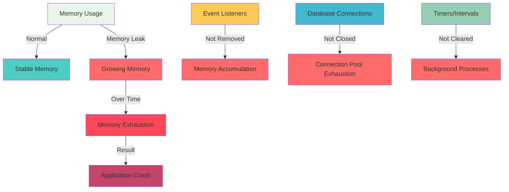

# Memory Leaks trong NestJS

Memory Leaks (rò rỉ bộ nhớ) là một vấn đề nghiêm trọng trong NestJS có thể gây ra ứng dụng chậm, crash hoặc tiêu tốn tài nguyên server. Đây là vấn đề khó phát hiện và debug, đặc biệt trong môi trường production.

## 📊 Biểu đồ Memory Leaks

### Biểu đồ 1: Memory Leak Flow



**Giải thích:**
- **Memory Usage** có thể đi theo 2 hướng: Normal hoặc Memory Leak
- **Normal**: Memory ổn định, không tăng
- **Memory Leak**: Memory tăng dần theo thời gian
- **Memory Exhaustion**: Khi memory hết, ứng dụng crash
- **Các nguyên nhân**: Event listeners, Database connections, Timers không được cleanup

:::danger ⚠️ Vấn đề nghiêm trọng
Memory Leaks có thể gây ra:
- Ứng dụng chậm dần theo thời gian
- Server crash không rõ nguyên nhân
- Tốn kém tài nguyên server
- Khó debug và reproduce
- Ảnh hưởng đến user experience
:::

## 🎯 Tại sao cần hiểu về Memory Leaks?

Memory Leaks trong NestJS là vấn đề "silent killer" - chúng tích tụ dần dần và chỉ biểu hiện khi đã quá muộn. Hiểu rõ về memory leaks sẽ giúp bạn:

- **Phát hiện sớm** vấn đề trước khi quá nghiêm trọng
- **Tối ưu performance** của ứng dụng
- **Tiết kiệm tài nguyên** server
- **Tăng độ ổn định** của hệ thống
- **Giảm thời gian downtime**

## 🔍 Memory Leaks là gì?

Memory Leaks xảy ra khi:
- **Memory được allocate** nhưng không được **release**
- **Resources được tạo** nhưng không được **cleanup**
- **References được giữ** nhưng không còn cần thiết
- **Event listeners** được đăng ký nhưng không được **remove**

## 🚨 Nguyên nhân gây ra Memory Leaks

### 1. Event Listeners không được Remove

```typescript title="Ví dụ Event Listener Memory Leak"
// ❌ Không tốt - Memory Leak
@Injectable()
export class UserService {
  private eventEmitter = new EventEmitter();
  
  async createUser(userData: CreateUserDto) {
    const user = await this.userRepository.save(userData);
    
    // Event listener được đăng ký nhưng không bao giờ remove
    this.eventEmitter.on('user.created', () => {
      this.sendWelcomeEmail(user.email);
    });
    
    return user;
  }
}

// ✅ Tốt - Không có Memory Leak
@Injectable()
export class UserService {
  private eventEmitter = new EventEmitter();
  private listeners: Array<() => void> = [];
  
  async createUser(userData: CreateUserDto) {
    const user = await this.userRepository.save(userData);
    
    // Lưu reference để remove sau
    const listener = () => this.sendWelcomeEmail(user.email);
    this.eventEmitter.on('user.created', listener);
    this.listeners.push(listener);
    
    return user;
  }
  
  // Cleanup method
  cleanup() {
    this.listeners.forEach(listener => {
      this.eventEmitter.off('user.created', listener);
    });
    this.listeners = [];
  }
}
```

### 2. Database Connections không được Close

```typescript title="Ví dụ Database Connection Memory Leak"
// ❌ Không tốt - Connection Leak
@Injectable()
export class UserRepository {
  async findUsers() {
    const connection = await this.dataSource.createQueryRunner();
    
    try {
      const users = await connection.query('SELECT * FROM users');
      return users;
    } catch (error) {
      throw error;
    }
    // ❌ Quên close connection!
  }
}

// ✅ Tốt - Proper Connection Management
@Injectable()
export class UserRepository {
  async findUsers() {
    const connection = await this.dataSource.createQueryRunner();
    
    try {
      const users = await connection.query('SELECT * FROM users');
      return users;
    } catch (error) {
      throw error;
    } finally {
      // ✅ Luôn close connection
      await connection.release();
    }
  }
}
```

## 🛠️ Giải pháp cho Memory Leaks

### 1. Proper Resource Management

```typescript title="Resource Management Pattern"
@Injectable()
export class ResourceManagerService {
  private resources: Array<{ id: string; cleanup: () => void }> = [];
  
  registerResource(id: string, cleanup: () => void) {
    this.resources.push({ id, cleanup });
  }
  
  cleanupResource(id: string) {
    const index = this.resources.findIndex(r => r.id === id);
    if (index !== -1) {
      const resource = this.resources[index];
      resource.cleanup();
      this.resources.splice(index, 1);
    }
  }
  
  cleanupAll() {
    this.resources.forEach(resource => resource.cleanup());
    this.resources = [];
  }
  
  onModuleDestroy() {
    this.cleanupAll();
  }
}
```

### 2. Memory Monitoring

```typescript title="Memory Monitor Service"
@Injectable()
export class MemoryMonitorService {
  private memoryUsage: Array<{ timestamp: number; usage: number }> = [];
  
  @Cron('*/30 * * * * *') // Mỗi 30 giây
  monitorMemory() {
    const usage = process.memoryUsage();
    const timestamp = Date.now();
    
    this.memoryUsage.push({
      timestamp,
      usage: usage.heapUsed
    });
    
    // Giữ 1000 records gần nhất
    if (this.memoryUsage.length > 1000) {
      this.memoryUsage.shift();
    }
    
    // Kiểm tra memory growth
    this.checkMemoryGrowth();
  }
  
  private checkMemoryGrowth() {
    if (this.memoryUsage.length < 10) return;
    
    const recent = this.memoryUsage.slice(-10);
    const first = recent[0].usage;
    const last = recent[recent.length - 1].usage;
    
    // Nếu memory tăng > 10% trong 5 phút
    if (last > first * 1.1) {
      this.logMemoryLeakWarning();
    }
  }
  
  private logMemoryLeakWarning() {
    console.warn('⚠️ Potential Memory Leak Detected!');
    console.warn(`Memory increased from ${this.memoryUsage[0].usage} to ${this.memoryUsage[this.memoryUsage.length - 1].usage}`);
  }
}
```

## 🧪 Testing Memory Leaks

### 1. Memory Leak Test

```typescript title="Memory Leak Test"
describe('Memory Leak Tests', () => {
  let app: INestApplication;
  
  beforeEach(async () => {
    const moduleFixture: TestingModule = await Test.createTestingModule({
      imports: [AppModule]
    }).compile();
    
    app = moduleFixture.createNestApplication();
    await app.init();
  });
  
  afterEach(async () => {
    await app.close();
  });
  
  it('should not leak memory during multiple operations', async () => {
    const initialMemory = process.memoryUsage().heapUsed;
    
    // Thực hiện nhiều operations
    for (let i = 0; i < 1000; i++) {
      await request(app.getHttpServer())
        .post('/users')
        .send({ name: `User ${i}`, email: `user${i}@example.com` });
    }
    
    // Force garbage collection
    if (global.gc) {
      global.gc();
    }
    
    const finalMemory = process.memoryUsage().heapUsed;
    const memoryIncrease = finalMemory - initialMemory;
    
    // Memory increase không được quá 10MB
    expect(memoryIncrease).toBeLessThan(10 * 1024 * 1024);
  });
});
```

---

:::tip 💡 Lời khuyên tổng kết
- **Luôn cleanup resources** sau khi sử dụng
- **Monitor memory usage** thường xuyên
- **Test memory leaks** trong development
- **Sử dụng proper lifecycle hooks** (onModuleDestroy, onApplicationShutdown)
- **Implement resource pooling** cho database connections
- **Avoid circular references** trong services
- **Use event-driven architecture** để giảm coupling
:::

:::info 📚 Tài liệu tham khảo
- [Node.js Memory Management](https://nodejs.org/en/docs/guides/memory-management/)
- [NestJS Lifecycle Events](https://docs.nestjs.com/fundamentals/lifecycle-events)
- [Memory Leak Detection Tools](https://nodejs.org/en/docs/guides/debugging-getting-started/)
:::

**Bài tiếp theo:** [Performance Issues trong NestJS](/docs/tips/performance-issues)
