# Performance Issues trong NestJS

Performance Issues (vấn đề hiệu suất) là một thách thức lớn trong NestJS khi ứng dụng phải xử lý nhiều request đồng thời, database queries phức tạp, hoặc external API calls. Đây là vấn đề ảnh hưởng trực tiếp đến user experience và scalability.

## 📊 Biểu đồ Performance Issues

### Biểu đồ 1: Performance Impact Flow

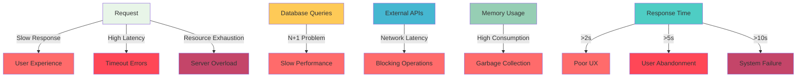

**Giải thích:**
- **Request** có thể dẫn đến nhiều vấn đề performance khác nhau
- **Response Time** ảnh hưởng trực tiếp đến user experience
- **Database Queries** với N+1 problem gây chậm performance
- **External APIs** với network latency gây blocking operations
- **Memory Usage** cao dẫn đến garbage collection overhead

:::danger ⚠️ Vấn đề nghiêm trọng
Performance Issues có thể gây ra:
- Response time chậm (>2s)
- Timeout errors
- Server overload
- Poor user experience
- Loss of users/customers
- High infrastructure costs
:::

## 🎯 Tại sao cần tối ưu Performance?

Performance trong NestJS ảnh hưởng trực tiếp đến:

- **User Experience**: Người dùng không chờ đợi quá lâu
- **Business Metrics**: Conversion rate, user retention
- **Infrastructure Costs**: Server resources, bandwidth
- **Scalability**: Khả năng xử lý nhiều users
- **Competitive Advantage**: So với đối thủ cạnh tranh

## 🔍 Nguyên nhân gây ra Performance Issues

### 1. N+1 Query Problem

```typescript title="Ví dụ N+1 Query Problem"
// ❌ Không tốt - N+1 Queries
@Injectable()
export class UserService {
  async getUsersWithPosts() {
    const users = await this.userRepository.find();
    
    // N+1 problem: 1 query cho users + N queries cho posts
    const usersWithPosts = await Promise.all(
      users.map(async (user) => {
        const posts = await this.postRepository.findByUserId(user.id);
        return { ...user, posts };
      })
    );
    
    return usersWithPosts;
  }
}

// ✅ Tốt - Single Query với JOIN
@Injectable()
export class UserService {
  async getUsersWithPosts() {
    // Single query với JOIN
    const usersWithPosts = await this.userRepository
      .createQueryBuilder('user')
      .leftJoinAndSelect('user.posts', 'post')
      .getMany();
    
    return usersWithPosts;
  }
}
```

### 2. Synchronous Operations

```typescript title="Ví dụ Synchronous Operations"
// ❌ Không tốt - Blocking Operations
@Injectable()
export class FileService {
  async processFile(filePath: string) {
    // Blocking operation
    const content = fs.readFileSync(filePath, 'utf8');
    const processed = this.heavyProcessing(content);
    
    return processed;
  }
  
  private heavyProcessing(content: string) {
    // CPU-intensive operation
    let result = '';
    for (let i = 0; i < 1000000; i++) {
      result += content.charAt(i % content.length);
    }
    return result;
  }
}

// ✅ Tốt - Async Operations
@Injectable()
export class FileService {
  async processFile(filePath: string) {
    // Non-blocking operation
    const content = await fs.promises.readFile(filePath, 'utf8');
    
    // Move heavy processing to background
    const processed = await this.heavyProcessingAsync(content);
    
    return processed;
  }
  
  private async heavyProcessingAsync(content: string) {
    return new Promise((resolve) => {
      // Use worker thread hoặc process.nextTick
      process.nextTick(() => {
        let result = '';
        for (let i = 0; i < 1000000; i++) {
          result += content.charAt(i % content.length);
        }
        resolve(result);
      });
    });
  }
}
```

### 3. Memory Leaks và Garbage Collection

```typescript title="Ví dụ Memory Issues"
// ❌ Không tốt - Memory Accumulation
@Injectable()
export class CacheService {
  private cache = new Map();
  
  set(key: string, value: any) {
    // Không có size limit
    this.cache.set(key, value);
  }
  
  get(key: string) {
    return this.cache.get(key);
  }
}

// ✅ Tốt - Memory Management
@Injectable()
export class CacheService {
  private cache = new Map();
  private maxSize = 1000;
  
  set(key: string, value: any) {
    // Check size limit
    if (this.cache.size >= this.maxSize) {
      // Remove oldest entries
      const firstKey = this.cache.keys().next().value;
      this.cache.delete(firstKey);
    }
    
    this.cache.set(key, value);
  }
  
  get(key: string) {
    return this.cache.get(key);
  }
  
  // Cleanup method
  cleanup() {
    this.cache.clear();
  }
}
```

## 🛠️ Giải pháp cho Performance Issues

### 1. Database Query Optimization

#### Biểu đồ 2: N+1 Query Problem vs Optimized Query

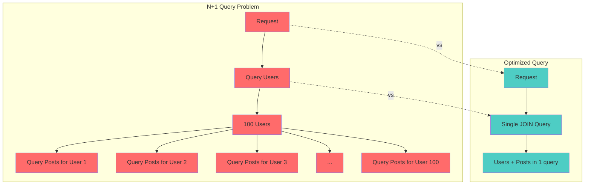

**Giải thích:**
- **N+1 Problem**: 1 query cho users + N queries cho posts (101 queries total)
- **Optimized Query**: Chỉ 1 query với JOIN, lấy tất cả data cần thiết
- **Performance gain**: Giảm từ 101 queries xuống 1 query

#### Biểu đồ 3: Query Optimization Flow

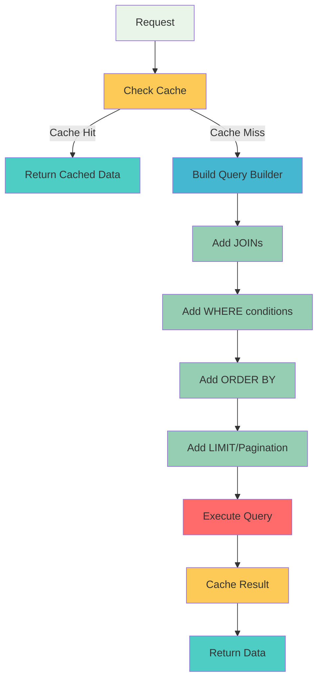

**Giải thích:**
- **Cache First**: Kiểm tra cache trước khi query database
- **Query Builder**: Xây dựng query tối ưu với JOINs và conditions
- **Pagination**: Giới hạn số lượng records trả về
- **Caching**: Lưu kết quả để sử dụng lần sau

```typescript title="Query Optimization Service"
@Injectable()
export class QueryOptimizerService {
  async getUsersWithPostsOptimized() {
    // Sử dụng Query Builder với JOIN
    const queryBuilder = this.userRepository
      .createQueryBuilder('user')
      .leftJoinAndSelect('user.posts', 'post')
      .leftJoinAndSelect('user.profile', 'profile')
      .where('user.isActive = :isActive', { isActive: true })
      .orderBy('user.createdAt', 'DESC')
      .take(20); // Pagination
    
    // Cache query result
    const cacheKey = `users_with_posts_${JSON.stringify(queryBuilder.getQuery())}`;
    const cached = await this.cacheService.get(cacheKey);
    
    if (cached) {
      return cached;
    }
    
    const result = await queryBuilder.getMany();
    
    // Cache for 5 minutes
    await this.cacheService.set(cacheKey, result, 300);
    
    return result;
  }
  
  async getUsersWithPostsBatch(userIds: string[]) {
    // Batch processing
    const batchSize = 100;
    const results = [];
    
    for (let i = 0; i < userIds.length; i += batchSize) {
      const batch = userIds.slice(i, i + batchSize);
      
      const batchResult = await this.userRepository
        .createQueryBuilder('user')
        .leftJoinAndSelect('user.posts', 'post')
        .whereInIds(batch)
        .getMany();
      
      results.push(...batchResult);
    }
    
    return results;
  }
}
```

### 2. Caching Strategy

#### Biểu đồ 4: Multi-Level Caching Architecture

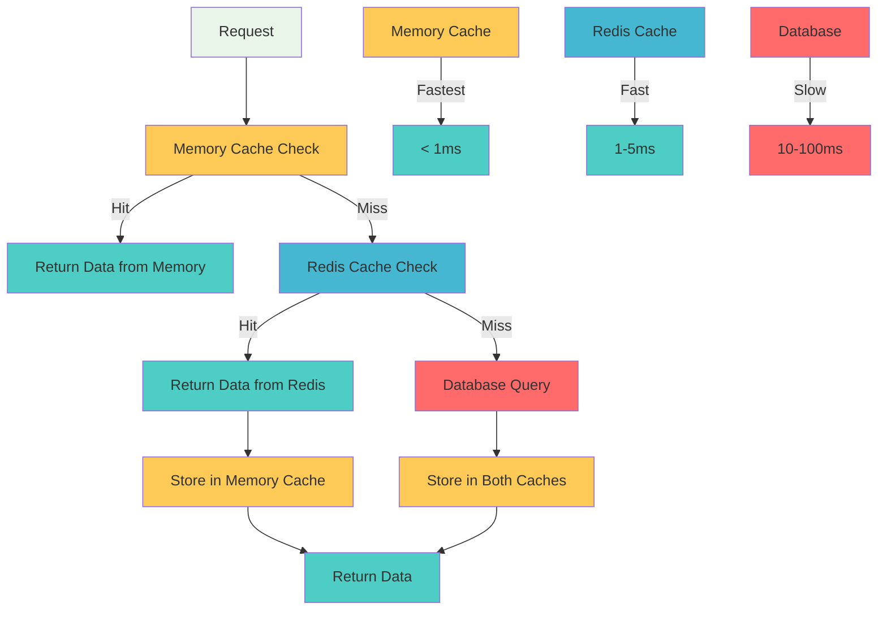

**Giải thích:**
- **Memory Cache**: Level 1 - nhanh nhất (< 1ms), lưu trong process memory
- **Redis Cache**: Level 2 - nhanh (1-5ms), lưu trong Redis server
- **Database**: Level 3 - chậm nhất (10-100ms), source of truth
- **Cache Invalidation**: Xóa cache khi data thay đổi

#### Biểu đồ 5: Cache Hit vs Cache Miss

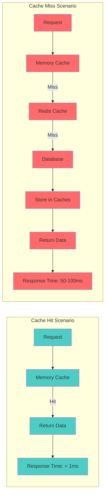

**Giải thích:**
- **Cache Hit**: Data có sẵn trong cache, response time rất nhanh
- **Cache Miss**: Data không có trong cache, phải query database
- **Performance Impact**: Cache hit nhanh hơn cache miss 50-100 lần

```typescript title="Multi-Level Caching Service"
@Injectable()
export class MultiLevelCacheService {
  constructor(
    private redisService: RedisService,
    private memoryCache: Map<string, any>
  ) {}
  
  async get(key: string) {
    // Level 1: Memory Cache (Fastest)
    if (this.memoryCache.has(key)) {
      return this.memoryCache.get(key);
    }
    
    // Level 2: Redis Cache (Fast)
    const redisValue = await this.redisService.get(key);
    if (redisValue) {
      // Store in memory cache
      this.memoryCache.set(key, redisValue);
      return redisValue;
    }
    
    return null;
  }
  
  async set(key: string, value: any, ttl: number = 300) {
    // Set in both caches
    this.memoryCache.set(key, value);
    await this.redisService.set(key, value, ttl);
  }
  
  async invalidate(pattern: string) {
    // Clear memory cache
    for (const key of this.memoryCache.keys()) {
      if (key.includes(pattern)) {
        this.memoryCache.delete(key);
      }
    }
    
    // Clear Redis cache
    await this.redisService.del(pattern);
  }
}
```

### 3. Async Processing với Queue

#### Biểu đồ 6: Queue Processing Architecture

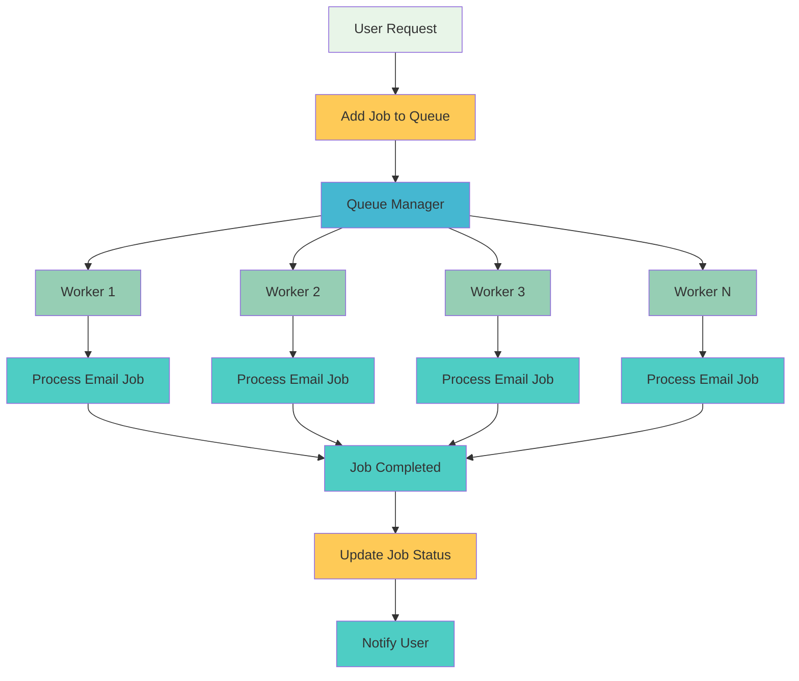

**Giải thích:**
- **Queue Manager**: Quản lý và phân phối jobs cho các workers
- **Multiple Workers**: Xử lý jobs song song, tăng throughput
- **Async Processing**: User không phải chờ đợi job hoàn thành
- **Scalability**: Có thể thêm workers khi cần

#### Biểu đồ 7: Queue Job Lifecycle

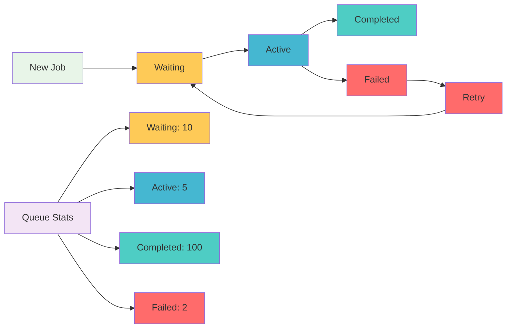

**Giải thích:**
- **Job States**: New → Waiting → Active → Completed/Failed
- **Retry Mechanism**: Failed jobs có thể retry
- **Queue Monitoring**: Theo dõi số lượng jobs ở mỗi trạng thái
- **Performance Metrics**: Đo lường throughput và error rate

```typescript title="Queue Service cho Heavy Operations"
@Injectable()
export class QueueService {
  constructor(
    private bullQueue: Queue,
    private emailService: EmailService
  ) {}
  
  async addEmailJob(emailData: any) {
    // Add to queue thay vì process ngay
    await this.bullQueue.add('send-email', emailData, {
      priority: 1,
      attempts: 3,
      backoff: {
        type: 'exponential',
        delay: 2000
      }
    });
  }
  
  @Processor('send-email')
  async processEmailJob(job: Job) {
    try {
      await this.emailService.sendEmail(job.data);
      job.moveToCompleted();
    } catch (error) {
      job.moveToFailed({ message: error.message });
    }
  }
  
  // Monitor queue performance
  async getQueueStats() {
    const waiting = await this.bullQueue.getWaiting();
    const active = await this.bullQueue.getActive();
    const completed = await this.bullQueue.getCompleted();
    const failed = await this.bullQueue.getFailed();
    
    return {
      waiting: waiting.length,
      active: active.length,
      completed: completed.length,
      failed: failed.length
    };
  }
}
```

### 4. Response Compression

#### Biểu đồ 8: Compression Flow

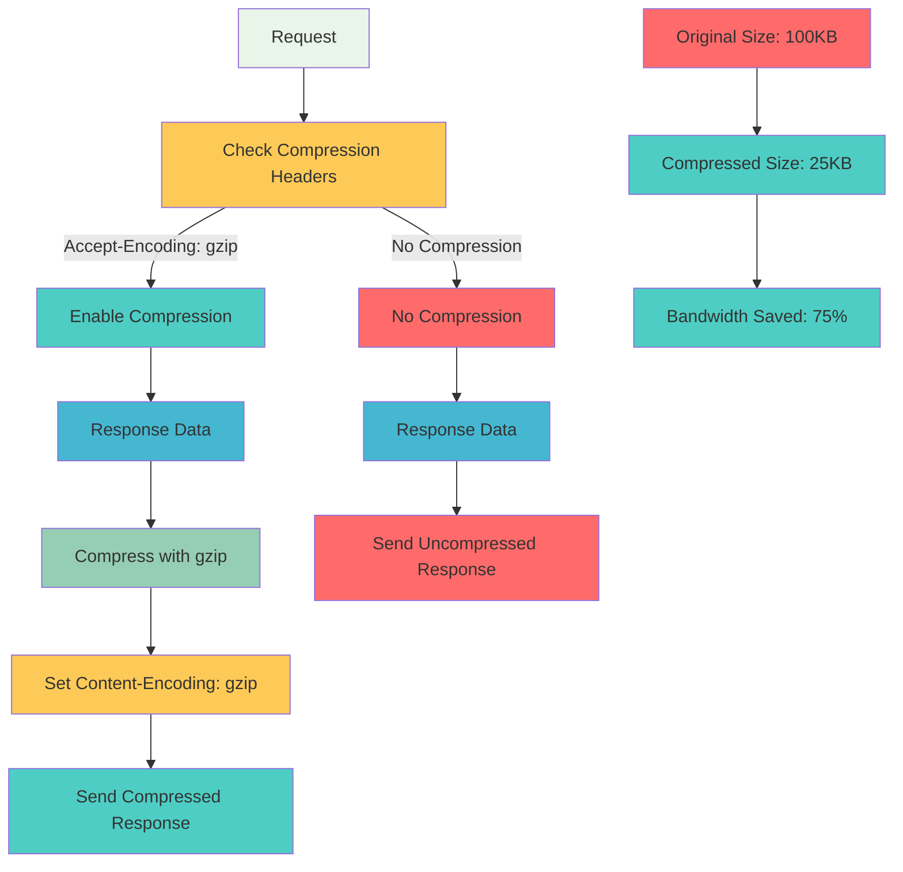

**Giải thích:**
- **Compression Check**: Kiểm tra Accept-Encoding header từ client
- **Gzip Compression**: Nén response data để giảm bandwidth
- **Size Reduction**: Thường giảm 60-80% kích thước response
- **Performance Gain**: Giảm thời gian download và bandwidth usage

#### Biểu đồ 9: Compression Performance Impact

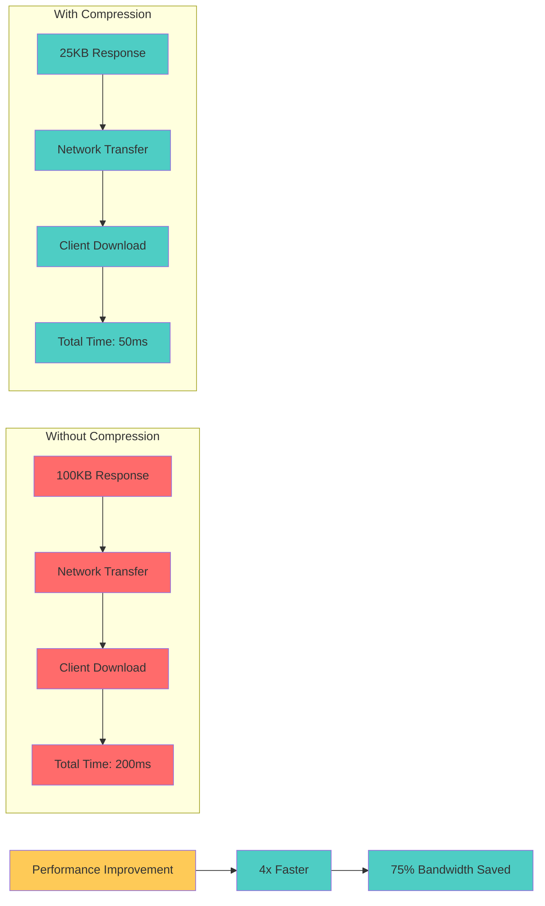

**Giải thích:**
- **Bandwidth Savings**: Giảm 75% bandwidth usage
- **Faster Transfer**: Response time nhanh hơn 4 lần
- **Better UX**: User experience được cải thiện đáng kể
- **Cost Reduction**: Giảm chi phí bandwidth cho server

```typescript title="Compression Middleware"
import { Injectable, NestMiddleware } from '@nestjs/common';
import { Request, Response, NextFunction } from 'express';
import * as compression from 'compression';

@Injectable()
export class CompressionMiddleware implements NestMiddleware {
  private compressionMiddleware = compression({
    filter: (req, res) => {
      // Chỉ compress cho responses > 1KB
      if (req.headers['x-no-compression']) {
        return false;
      }
      return compression.filter(req, res);
    },
    level: 6, // Compression level
    threshold: 1024 // Minimum size to compress
  });
  
  use(req: Request, res: Response, next: NextFunction) {
    this.compressionMiddleware(req, res, next);
  }
}
```

## 📊 Performance Monitoring

#### Biểu đồ 10: Performance Monitoring Architecture

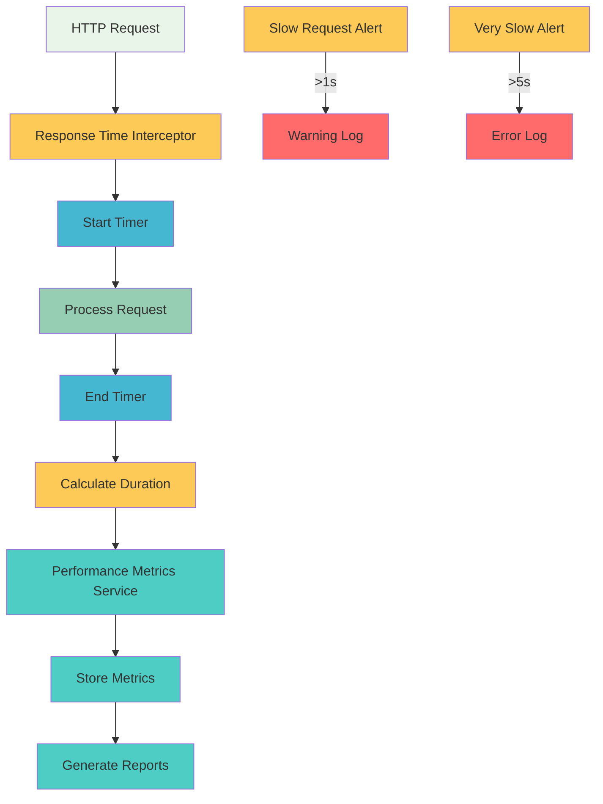

**Giải thích:**
- **Interceptor**: Bắt đầu và kết thúc timer cho mỗi request
- **Metrics Collection**: Thu thập performance data
- **Alerting**: Cảnh báo khi response time quá chậm
- **Reporting**: Tạo báo cáo performance

#### Biểu đồ 11: Response Time Distribution

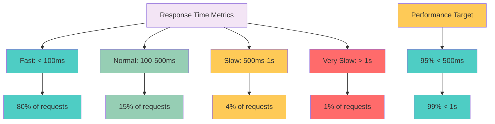

**Giải thích:**
- **Performance Distribution**: Phân bố response time của các requests
- **Performance Targets**: Mục tiêu 95% requests < 500ms
- **Alert Thresholds**: Cảnh báo khi performance vượt ngưỡng
- **Monitoring Focus**: Tập trung vào slow requests

### 1. Response Time Monitoring

```typescript title="Response Time Interceptor"
@Injectable()
export class ResponseTimeInterceptor implements NestInterceptor {
  intercept(context: ExecutionContext, next: CallHandler): Observable<any> {
    const start = Date.now();
    const request = context.switchToHttp().getRequest();
    
    return next.handle().pipe(
      tap(() => {
        const duration = Date.now() - start;
        
        // Log slow requests
        if (duration > 1000) {
          console.warn(`🐌 Slow request: ${request.method} ${request.url} - ${duration}ms`);
        }
        
        // Send metrics to monitoring service
        this.metricsService.recordResponseTime(request.url, duration);
      })
    );
  }
}
```

### 2. Performance Metrics Service

```typescript title="Performance Metrics Service"
@Injectable()
export class PerformanceMetricsService {
  private metrics = new Map<string, Array<number>>();
  
  recordResponseTime(endpoint: string, duration: number) {
    if (!this.metrics.has(endpoint)) {
      this.metrics.set(endpoint, []);
    }
    
    const values = this.metrics.get(endpoint);
    values.push(duration);
    
    // Keep last 1000 values
    if (values.length > 1000) {
      values.shift();
    }
  }
  
  getEndpointStats(endpoint: string) {
    const values = this.metrics.get(endpoint) || [];
    
    if (values.length === 0) {
      return null;
    }
    
    const sorted = values.sort((a, b) => a - b);
    const avg = values.reduce((a, b) => a + b, 0) / values.length;
    const p95 = sorted[Math.floor(values.length * 0.95)];
    const p99 = sorted[Math.floor(values.length * 0.99)];
    
    return {
      count: values.length,
      average: Math.round(avg),
      median: sorted[Math.floor(values.length / 2)],
      p95: p95,
      p99: p99,
      min: sorted[0],
      max: sorted[sorted.length - 1]
    };
  }
  
  getOverallStats() {
    const allValues = Array.from(this.metrics.values()).flat();
    
    if (allValues.length === 0) {
      return null;
    }
    
    const avg = allValues.reduce((a, b) => a + b, 0) / allValues.length;
    const sorted = allValues.sort((a, b) => a - b);
    const p95 = sorted[Math.floor(allValues.length * 0.95)];
    
    return {
      totalRequests: allValues.length,
      averageResponseTime: Math.round(avg),
      p95ResponseTime: p95
    };
  }
}
```

## 🧪 Performance Testing

### 1. Load Testing

```typescript title="Load Test Service"
@Injectable()
export class LoadTestService {
  async runLoadTest(endpoint: string, concurrentUsers: number, duration: number) {
    const startTime = Date.now();
    const results = [];
    
    // Simulate concurrent users
    const userPromises = Array.from({ length: concurrentUsers }, (_, i) =>
      this.simulateUser(endpoint, i, startTime, duration)
    );
    
    await Promise.all(userPromises);
    
    return this.analyzeResults(results);
  }
  
  private async simulateUser(endpoint: string, userId: number, startTime: number, duration: number) {
    const results = [];
    
    while (Date.now() - startTime < duration) {
      const requestStart = Date.now();
      
      try {
        await this.makeRequest(endpoint);
        const responseTime = Date.now() - requestStart;
        
        results.push({
          userId,
          timestamp: Date.now(),
          responseTime,
          success: true
        });
      } catch (error) {
        results.push({
          userId,
          timestamp: Date.now(),
          responseTime: Date.now() - requestStart,
          success: false,
          error: error.message
        });
      }
      
      // Wait between requests
      await new Promise(resolve => setTimeout(resolve, 100));
    }
    
    return results;
  }
  
  private async makeRequest(endpoint: string) {
    // Implement actual HTTP request
    return fetch(endpoint);
  }
  
  private analyzeResults(allResults: any[]) {
    const successful = allResults.filter(r => r.success);
    const failed = allResults.filter(r => !r.success);
    
    const responseTimes = successful.map(r => r.responseTime);
    const avgResponseTime = responseTimes.reduce((a, b) => a + b, 0) / responseTimes.length;
    
    return {
      totalRequests: allResults.length,
      successful: successful.length,
      failed: failed.length,
      successRate: (successful.length / allResults.length) * 100,
      averageResponseTime: Math.round(avgResponseTime),
      minResponseTime: Math.min(...responseTimes),
      maxResponseTime: Math.max(...responseTimes)
    };
  }
}
```

### 2. Performance Benchmark

```typescript title="Performance Benchmark"
describe('Performance Tests', () => {
  let app: INestApplication;
  
  beforeAll(async () => {
    const moduleFixture: TestingModule = await Test.createTestingModule({
      imports: [AppModule]
    }).compile();
    
    app = moduleFixture.createNestApplication();
    await app.init();
  });
  
  afterAll(async () => {
    await app.close();
  });
  
  it('should handle 100 concurrent requests under 2 seconds', async () => {
    const startTime = Date.now();
    const concurrentRequests = 100;
    
    const promises = Array.from({ length: concurrentRequests }, () =>
      request(app.getHttpServer())
        .get('/users')
        .expect(200)
    );
    
    await Promise.all(promises);
    
    const totalTime = Date.now() - startTime;
    
    // Tất cả requests phải hoàn thành trong 2 giây
    expect(totalTime).toBeLessThan(2000);
  });
  
  it('should maintain response time under 500ms for single request', async () => {
    const startTime = Date.now();
    
    await request(app.getHttpServer())
      .get('/users')
      .expect(200);
    
    const responseTime = Date.now() - startTime;
    
    expect(responseTime).toBeLessThan(500);
  });
});
```

---

:::tip 💡 Lời khuyên tổng kết
- **Optimize database queries** - Sử dụng JOIN thay vì N+1 queries
- **Implement caching strategy** - Multi-level caching (Memory + Redis)
- **Use async processing** - Queue cho heavy operations
- **Monitor performance metrics** - Response time, throughput
- **Load test regularly** - Đảm bảo performance dưới tải cao
- **Compress responses** - Giảm bandwidth usage
- **Profile memory usage** - Tránh memory leaks
:::

:::info 📚 Tài liệu tham khảo
- [NestJS Performance Best Practices](https://docs.nestjs.com/techniques/performance)
- [Node.js Performance Optimization](https://nodejs.org/en/docs/guides/performance/)
- [Database Query Optimization](https://typeorm.io/#/query-builder)
:::

**Bài tiếp theo:** [Database Connection Issues trong NestJS](/docs/tips/database-connection-issues)
